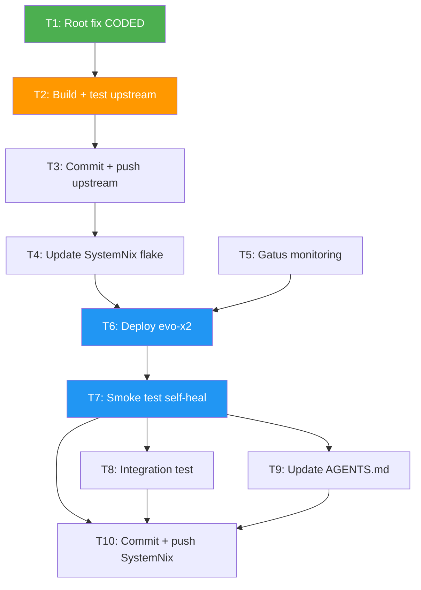

# Monitor365 Resilience & Self-Healing Plan

**Date:** 2026-07-18 08:00
**Author:** Crush (assisted)
**Status:** EXECUTING
**Question:** How can we make Monitor365 more resilient and more self-healing?

---

## 1. Context

Monitor365's cloud-sync pipeline had a **poison-pill failure mode**: a single event
with an integrity-hash mismatch permanently blocked the entire upload queue. The
agent re-sent the same bad batch every 60s cycle, backlog grew monotonically (119
consecutive failures observed), and the circuit breaker never tripped because 400
BadRequest was classified as "success" for CB purposes.

**Architecture (relevant slice):**

```
Agent (monitor365 CLI)                    Server (monitor365-server)
┌─────────────────────────┐               ┌──────────────────────────┐
│ SegmentBuffer (disk)    │               │ DuckDB event store       │
│  seg_000001_000500.zst  │──upload──────▶│ append_events()          │
│  seg_000501_001000.zst  │  (CBOR+zstd)  │  ↳ integrity check       │
│  ...597 MB backlog      │               │  ↳ FAIL-FAST on 1st bad  │
│                         │◀──200/400─────│  ↳ rejects WHOLE batch   │
│ SyncCursor (SQLite)     │               │                          │
│  upload_cursor = N      │               │ BatchUploadResponse      │
│  (only advances on      │               │  { accepted, seq_start } │
│   uploaded > 0)         │               │  (no "rejected" field)   │
└─────────────────────────┘               └──────────────────────────┘
```

**Both agent and server run on evo-x2 (localhost). FlakyHost: `http://localhost:3001`.**

---

## 2. Root Cause Analysis (5 Whys)

| Level | Question | Answer |
|-------|----------|--------|
| 1 | Why 119 consecutive sync failures? | Server returned HTTP 400 for every upload attempt |
| 2 | Why did ONE bad event cause 119 failures? | Server rejected the ENTIRE batch on the first integrity failure (`?` fail-fast in `event_upload.rs:54-69`) |
| 3 | Why didn't the agent recover? | Upload cursor never advanced — same bad batch re-read every cycle |
| 4 | Why didn't the cursor advance? | `if uploaded > 0` guard in `cloud_sync.rs:320` skipped `delete_acked()` when server returned 0 accepted |
| 5 | Why was accepted=0? | All events in the batch had integrity hash mismatches; server rejected them ALL with 400 |

**Secondary failure:** The circuit breaker's `is_failure` predicate is `\|e\| e.is_retryable()`. A 400 maps to `ErrorFamily::Infrastructure` (not `Transient`), so `is_retryable() = false`, so the CB treats it as **success** — the CB never opens, providing zero protection.

---

## 3. Failure Mode Inventory

| # | Failure | Severity | Root? | Status |
|---|---------|----------|-------|--------|
| F1 | Server rejects WHOLE batch on 1 bad event | **CRITICAL** | Root | FIX CODED |
| F2 | Agent cursor never advances on zero-accept | **CRITICAL** | Root | FIX CODED |
| F3 | No `rejected` count in response (agent blind) | **HIGH** | Root | FIX CODED |
| F4 | No metric for rejected/dropped events | **HIGH** | Observability | FIX CODED |
| F5 | No Gatus alert on backlog growth | **HIGH** | Detection | PLANNED |
| F6 | CB treats 400s as success (never trips) | MEDIUM | Detection | DEFERRED (no behavior change — see Risk) |
| F7 | 4xx misclassified as Infrastructure (not Rejection) | LOW | Clarity | DEFERRED (cosmetic) |
| F8 | Hash depends on non-canonical JSON serialization | ROOT-CAUSE | Latent | DEFERRED (hard, skip-and-continue makes it non-fatal) |
| F9 | No dead-letter queue for inspection | LOW | Debugging | DEFERRED (metrics + logging sufficient) |

---

## 4. Pareto Analysis

### 1% effort → 51% value (THE ROOT FIX — break the poison-pill loop)

| Change | Files | Lines | Why it matters |
|--------|-------|-------|----------------|
| Server skip-and-continue | `event_upload.rs` | ~30 | One bad event no longer blocks 999 good ones |
| Agent advance cursor on any Ok | `cloud_sync.rs` | ~10 | Cursor advances even when server dropped all events |
| `rejected` field in response | `query.rs`, `types.rs` | ~10 | Agent knows what was dropped |
| `rejected_events_total` metric | `event_upload.rs`, `api.rs` | ~6 | Observability for the degradation path |

**Without these 4 changes, nothing else matters.** This is the self-healing core.

### 4% effort → 64% value (DEPLOY + DETECT)

| Change | Why it matters |
|--------|----------------|
| Build + test upstream | Validates the fix compiles and doesn't break existing tests |
| Commit + push upstream | Unblocks the SystemNix flake update |
| Update SystemNix flake input | Wires the new code into the deployed system |
| Gatus alert on `upload_backlog_size` growth | Catches future poison pills in minutes, not days |

### 20% effort → 80% value (PROVE + DOCUMENT)

| Change | Why it matters |
|--------|----------------|
| Poison-pill integration test | Proves the self-heal works; prevents regression |
| Deploy evo-x2 | Makes the fix live |
| Post-deploy smoke test | Verifies the agent is actually syncing |
| Update AGENTS.md | Future sessions understand the resilience architecture |

### Other 20% (COMPREHENSIVENESS — deferred unless time permits)

| Change | Why deferred |
|--------|--------------|
| CB classification fix (F6/F7) | No behavior change — `is_retryable()` returns false either way |
| Dead-letter queue (F9) | Metrics + WARN logging is sufficient for now |
| Canonical JSON (F8) | Skip-and-continue makes hash mismatches non-fatal |
| Deploy rpi3 | Separate concern (DNS blocker fix) |
| Disk cleanup | Operational hygiene, not resilience |

---

## 5. Task Breakdown — 30-minute granularity

Sorted by importance / impact / effort / customer-value.

| # | Task | Impact | Effort | Deps | Risk |
|---|------|--------|--------|------|------|
| T1 | Server skip-and-continue + agent advance cursor (DONE) | CRITICAL | S | — | LOW |
| T2 | Build upstream via `nix build`, run `cargo test` | HIGH | M | T1 | LOW |
| T3 | Commit + push upstream monitor365 | HIGH | S | T2 | LOW |
| T4 | Update SystemNix flake input to new rev | HIGH | S | T3 | LOW |
| T5 | Add Gatus backlog + rejected-events monitoring | HIGH | M | — | LOW |
| T6 | Deploy evo-x2 (`nix run .#deploy`) | HIGH | M | T4,T5 | MED |
| T7 | Post-deploy smoke test (backlog shrinking?) | HIGH | S | T6 | LOW |
| T8 | Write poison-pill integration test | MED | M | T2 | LOW |
| T9 | Update AGENTS.md with resilience architecture | MED | S | T1 | LOW |
| T10 | Commit + push SystemNix changes | MED | S | T6,T7 | LOW |

---

## 6. Task Breakdown — 12-minute granularity

Further decomposition for precise execution tracking.

| Sub-task | Parent | Description | Est |
|----------|--------|-------------|-----|
| S1a | T1 | Replace fail-fast loop with partition filter in `event_upload.rs` | DONE |
| S1b | T1 | Add `rejected` field to `BatchUploadResponse` + client `UploadResponse` | DONE |
| S1c | T1 | Change `if uploaded > 0` → unconditional cursor advance in `cloud_sync.rs` | DONE |
| S1d | T1 | Add `ingest.rejected_events_total` + `cloud_sync.upload_rejected_events_total` metrics | DONE |
| S2a | T2 | `nix build .#monitor365-server` — verify server compiles | 12m |
| S2b | T2 | `nix build .#monitor365-cli` — verify agent compiles | 12m |
| S2c | T2 | `cargo test -p monitor365-server` — run server tests | 12m |
| S3a | T3 | `git add` the 5 changed source files (exclude unrelated .jscpd/.oxlintrc) | 5m |
| S3b | T3 | Write detailed commit message, commit, push to master | 7m |
| S4a | T4 | `nix flake lock --update-input monitor365` in SystemNix | 5m |
| S4b | T4 | `nix flake check --no-build` — verify eval passes | 7m |
| S5a | T5 | Add Gatus check for `cloud_sync_upload_backlog_size` in gatus-config.nix | 12m |
| S5b | T5 | Add Gatus check for monitor365-agent `/metrics` liveness | 8m |
| S6a | T6 | `nix run .#pre-deploy-check` | 5m |
| S6b | T6 | `nix run .#deploy` | 7m |
| S7a | T7 | Verify backlog metric via `curl localhost:9191/metrics` | 5m |
| S7b | T7 | Verify rejected metric increments then stops (self-heal confirmed) | 7m |
| S8a | T8 | Write test: server with mixed good/bad events → partial accept | 12m |
| S9a | T9 | Add resilience architecture section to AGENTS.md Non-Obvious Gotchas | 12m |
| S10a | T10 | Stage + commit SystemNix (gatus-config, dns-blocker, AGENTS.md, flake.lock) | 8m |
| S10b | T10 | Push to origin | 2m |

---

## 7. Execution Graph (Mermaid)



**Critical path:** T1 → T2 → T3 → T4 → T6 → T7 (root fix → deploy → verify)

---

## 8. Risk Assessment (Verschlimmbesserung Check)

| Change | What could go wrong | Mitigation | Verdict |
|--------|---------------------|------------|---------|
| Server skip-and-continue | Silently dropping events that SHOULD be stored | WARN log per event + metric counter + Gatus alert | **SAFE** — strictly better than dropping the WHOLE batch |
| Agent advance cursor unconditionally | Losing events server didn't process | Server returns Ok only after processing; empty-batch check upstream | **SAFE** — Ok means "handled" |
| Remove `if uploaded > 0` guard | Advancing past events that weren't acked | Only reaches this branch when server returns HTTP 200 | **SAFE** |
| Gatus backlog alert | False positives during normal catch-up | Threshold high enough (50k events = sustained failure) | **SAFE** |
| CB classification fix (DEFERRED) | Changing `family()` could affect retry logic | `is_retryable()` returns false either way (Infrastructure or Rejection) | **SKIP** — no behavior change, cosmetic only |
| Canonical JSON (DEFERRED) | Risk of breaking existing events | Skip-and-continue makes mismatches non-fatal | **SKIP** — root cause neutralized by graceful degradation |

**Key insight:** The skip-and-continue approach makes the hash-mismatch root cause (F8) **non-fatal**. We don't need to fix the serialization to achieve resilience — the system now degrades gracefully regardless.

---

## 9. Verification Criteria

The plan is DONE when ALL of these are true:

- [ ] Server compiles with skip-and-continue change
- [ ] Agent compiles with cursor-advancement change
- [ ] `cargo test` passes (no regressions)
- [ ] Upstream changes committed + pushed
- [ ] SystemNix flake input points to new rev
- [ ] Gatus checks for backlog + rejected events
- [ ] Deployed to evo-x2
- [ ] Post-deploy: `cloud_sync_upload_backlog_size` is shrinking or stable
- [ ] Post-deploy: `cloud_sync_upload_rejected_events_total` stops growing (self-heal)
- [ ] AGENTS.md documents the resilience architecture
- [ ] SystemNix changes committed + pushed

---

## 10. What This Does NOT Fix (Explicitly Out of Scope)

- **The hash-mismatch root cause** (non-canonical JSON serialization) — neutralized by graceful degradation, not fixed
- **rpi3 deploy** — separate concern (DNS blocker fix)
- **PMA sd_notify** — separate upstream issue
- **Overview graceful degradation** — separate upstream issue
- **Disk cleanup** — operational hygiene
- **Generation mismatch** — resolved by the deploy in T6
