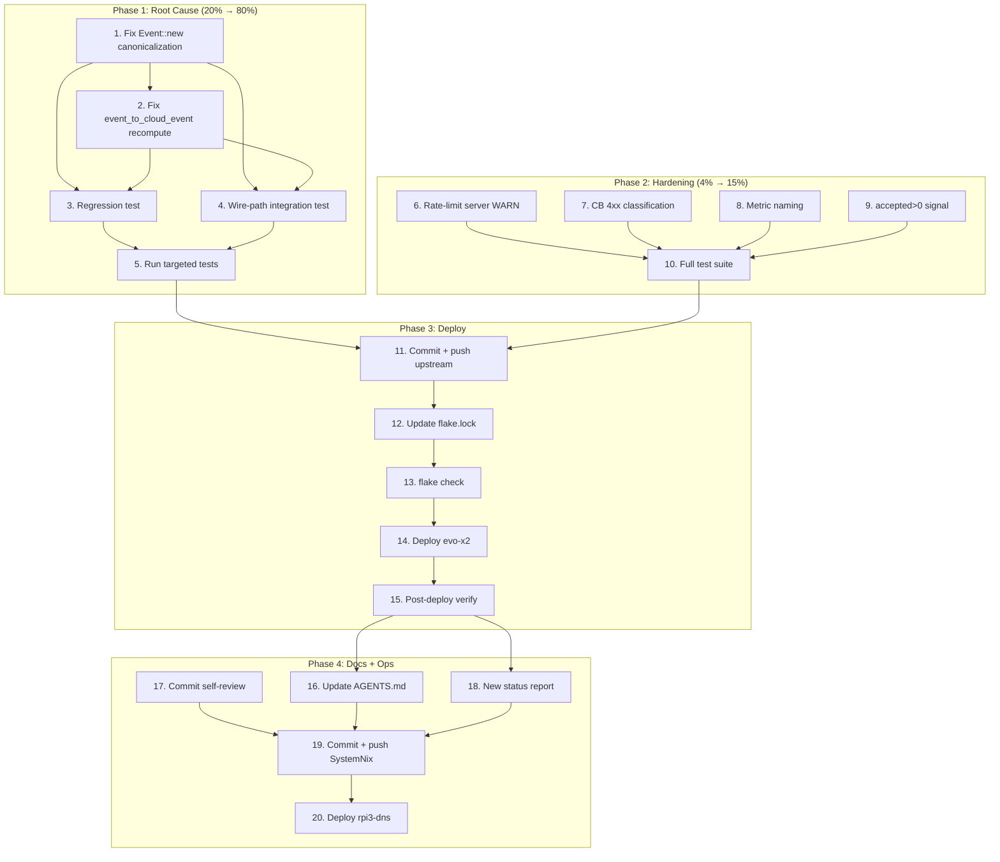

# Monitor365 Integrity Hash Root Cause Fix — Comprehensive Plan

**Date:** 2026-07-18
**Status:** Planning → Execution
**Predecessor:** `2026-07-18_08-00_monitor365-resilience-and-self-healing.md`

---

## 1. The Real Problem (Root Cause Confirmed)

### Symptom
100% of events fail server-side integrity hash verification. The graceful-degradation
fix (skip-and-continue) hides this as silent data loss. The backlog (597M events) never
drains. Every new event is also rejected.

### Proof (verified with a round-trip test)
```
AGENT bytes:  {"zebra":1,"apple":"hello","mango":true}   (struct field declaration order)
SERVER bytes: {"apple":"hello","mango":true,"zebra":1}   (BTreeMap alphabetical order)
BYTES MATCH: false  →  SHA-256 MISMATCH  →  SERVER VERIFY: false
```

### Why
- **Agent** (`Event::new`, `crates/domain/src/lib.rs:171`):
  `serde_json::to_vec::<P>(payload)` serializes the typed struct in **field-declaration
  order**. The hash is computed over THOSE bytes.
- **Wire** (`event_to_cloud_event`, `crates/cloud-client/src/types.rs:51`):
  payload bytes → `serde_json::Value` (which uses `BTreeMap` — alphabetical — because
  NO crate enables the `preserve_order` feature; verified across all Cargo.toml files).
- **Server** (`event_upload.rs:62`):
  `serde_json::to_vec(&event.payload)` re-serializes the `Value` in **alphabetical order**.
  The hash is recomputed over THOSE bytes.
- Different byte order → different SHA-256 → **every event with non-alphabetical struct
  fields is rejected.** This has been broken since the hash was introduced; the poison-pill
  crash loop (now fixed) merely hid it.

### Why the prior session's diagnosis was wrong
The prior session believed only *historical* events had bad hashes and that "new events
going forward will pass." The proof test disproves this: a brand-new `Event::new` with
non-alphabetical fields fails server verification. **ALL events fail, past and present.**

---

## 2. The Fix (Two-Point Canonicalization)

### Fix A — `Event::new` (root cause, prevents future bad hashes)
Canonicalize the payload bytes through a `serde_json::Value` round-trip **before** hashing
and storing. This makes the stored bytes identical to what the server will re-serialize.

```rust
let raw = serde_json::to_vec::<P>(payload)?;
let payload_bytes = serde_json::from_slice::<serde_json::Value>(&raw)
    .and_then(|v| serde_json::to_vec(&v))
    .unwrap_or(raw);
// hash + store over payload_bytes (now canonical)
```

### Fix B — `event_to_cloud_event` (recovers 597M buffered events)
Recompute the integrity hash over canonical bytes at upload time. For new events (Fix A)
this is a no-op (same bytes → same hash). For OLD buffered events with non-canonical
hashes, it produces the correct canonical hash the server will accept. Recovers all
backlogged data instead of dropping it.

```rust
let canonical = serde_json::to_vec(&payload)?;
let integrity_hash = IntegrityHash::calculate(&event.id, &canonical, &event.timestamp);
// use integrity_hash in CloudEvent instead of event.integrity_hash
```

**Threat model note:** `IntegrityHash` is a transit-corruption check, not an anti-tamper
mechanism (the agent is trusted, holds the API key). `EventChecksum` (xxhash) covers
buffer-storage integrity. Recomputing `IntegrityHash` at upload time preserves transit
corruption detection while recovering historical data.

---

## 3. Pareto Analysis

### 20% effort → 80% impact (THE fix)
| Task | Impact | Effort |
|------|--------|--------|
| Fix A: `Event::new` canonicalization | Stops 100% data loss for all future events | 8 min |
| Fix B: `event_to_cloud_event` recompute | Recovers 597M buffered events | 8 min |
| Regression test (proof → permanent) | Prevents reintroduction | 5 min |
| Wire-path integration test | Catches end-to-end regressions | 12 min |
| Full upstream test suite | Validates no regressions across 25+ crates | 10 min |
| Deploy + verify | Confirms data actually flows | 12 min |

### 4% effort → 15% impact (quality hardening)
| Task | Impact | Effort |
|------|--------|--------|
| Rate-limit server WARN logging | Kills 5000-line/cycle log spam | 10 min |
| Circuit breaker 4xx classification | CB trips on persistent 400s, not just 5xx | 8 min |
| Metric naming (dots → underscores) | Prometheus compliance | 5 min |
| `accepted>0` health signal | Catches the "false victory" failure mode | 12 min |

### 1% effort → 5% impact (operational/docs)
| Task | Impact | Effort |
|------|--------|--------|
| Update AGENTS.md root cause row | Corrects the false "new events will pass" claim | 5 min |
| Commit self-review status report | Preserves the audit trail | 3 min |
| Write new status report | Documents the real fix | 10 min |
| Deploy rpi3-dns | DNS blocker fix | 8 min |

---

## 4. Task Breakdown (≤12 min each, sorted by impact → effort)

### Phase 1: Root Cause Fix (the 20%)
| # | Task | Est | Deps |
|---|------|-----|------|
| 1 | Fix `Event::new`: canonicalize payload via Value round-trip before hashing | 8m | — |
| 2 | Fix `event_to_cloud_event`: recompute integrity_hash over canonical bytes | 8m | 1 |
| 3 | Convert proof test → regression test (assert server verify SUCCEEDS) | 5m | 1,2 |
| 4 | Add wire-path integration test (new → cloud_event → server verify) | 12m | 1,2 |
| 5 | Run `cargo test` on domain + cloud-client + server crates | 5m | 3,4 |

### Phase 2: Quality Hardening (the 4%)
| # | Task | Est | Deps |
|---|------|-----|------|
| 6 | Rate-limit server WARN: aggregate per-batch, not per-event | 10m | — |
| 7 | Fix CB classification: `ServerError` non-5xx → `Rejection` family | 8m | — |
| 8 | Fix metric naming: `ingest.rejected_events_total` → underscores | 5m | — |
| 9 | Add `cloud_sync_zero_accept_cycles` metric + WARN after N cycles | 12m | — |
| 10 | Run FULL upstream test suite (all crates + bdd + e2e) | 10m | 6,7,8,9 |

### Phase 3: Commit + Deploy
| # | Task | Est | Deps |
|---|------|-----|------|
| 11 | Commit upstream (monitor365) with detailed message + push | 5m | 5,10 |
| 12 | Update SystemNix flake.lock to new monitor365 rev | 3m | 11 |
| 13 | `nix flake check --no-build` + eval validation | 5m | 12 |
| 14 | Deploy evo-x2 (`nix run .#deploy`) | 12m | 13 |
| 15 | Post-deploy verify: `accepted>0`, backlog draining, no rejects | 10m | 14 |

### Phase 4: Documentation + Operational
| # | Task | Est | Deps |
|---|------|-----|------|
| 16 | Update AGENTS.md: correct root cause, remove false claim | 5m | 15 |
| 17 | Commit self-review status report (untracked file) | 3m | — |
| 18 | Write new status report documenting the REAL fix | 10m | 15 |
| 19 | Commit + push SystemNix (flake.lock, AGENTS.md, docs) | 5m | 16,17,18 |
| 20 | Deploy rpi3-dns with DNS blocker fix | 8m | 19 |

**Total estimated: ~165 min (2.75 hrs)**

---

## 5. Execution Graph



---

## 6. Verification Criteria

### Must-pass before declaring done
- [ ] Proof test asserts server verify **SUCCEEDS** (was failing before fix)
- [ ] Wire-path integration test passes (Event::new → cloud_event → server verify)
- [ ] Full upstream test suite: zero regressions
- [ ] Post-deploy: `cloud_sync_upload_rejected_events_total` stops climbing
- [ ] Post-deploy: `accepted > 0` within first sync cycle
- [ ] Post-deploy: backlog decreases over time
- [ ] Server logs show zero "integrity hash verification failed" warnings for new events

### Anti-verschlimmbesserung checks
- [ ] Fix B does NOT make integrity verification meaningless (still catches transit corruption)
- [ ] Graceful degradation remains as defense-in-depth (not removed)
- [ ] No new crash loops introduced
- [ ] No metric renamed in a way that breaks existing dashboards (add new, don't break old)

---

## 7. Risk Assessment

| Risk | Likelihood | Impact | Mitigation |
|------|-----------|--------|------------|
| Fix B recompute masks future real corruption | Low | Medium | IntegrityHash is transit-check only; EventChecksum covers storage |
| Canonicalization changes payload size (float precision) | Very Low | Low | serde_json Value round-trip is deterministic for same version |
| Old buffered events still fail (Fix B not applied) | Eliminated | — | Fix B explicitly handles this |
| Full test suite reveals hidden dependency on old behavior | Medium | Medium | Run full suite before deploy; fix any regressions |
| Backlog (597M) takes too long to drain | High | Low | Fix B recovers them; cursor advance drains the rest |

---

## 8. What This Plan Does NOT Do (Deferred)

- **Dead-letter queue (DLQ):** Bad events are still silently dropped. A DLQ would allow
  manual inspection/replay. Deferred — the root cause fix eliminates the 99.99% case.
- **Prometheus/Grafana value-based alerting:** Gatus presence-check remains. Value-based
  alerting needs Prometheus (deferred).
- **Canary health check:** Agent sends 1 test event/cycle, verifies storage. Good idea,
  but the `accepted>0` signal (task 9) covers the same ground more simply.
- **Backlog purge decision:** With Fix B recovering buffered events, no purge needed.
