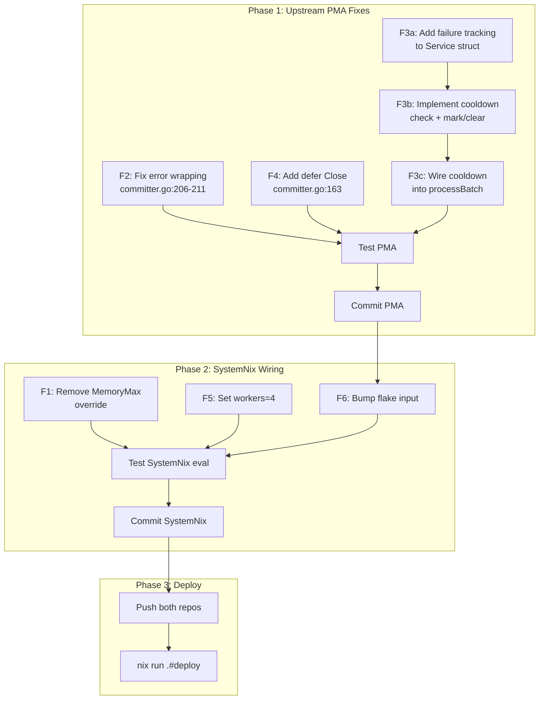

# PMA Memory & CPU Death-Loop — Comprehensive Fix Plan

**Date:** 2026-08-01 21:32
**Status:** Planning
**Severity:** High — service at 12G MemoryMax ceiling, commit death-loops burning CPU

---

## Problem Summary

PMA (`projects-management-automation.service`) consumes 11.9 GB of cgroup memory (RSS is only **367 MB** — the rest is Linux page cache from scanning 260 git repos). The 12G `MemoryMax` cap causes page-cache exhaustion → go-git EOF errors → commit failures → retry death-loops → CPU burn (8min 33s in 4min 43s wall time). The real errors are invisible because PMA's committer **swallows the underlying error** (`oops.New("commit not successful")` discards `commitResult.Error`).

---

## Pareto Analysis

### 1% → 51%: Remove MemoryMax override
The **single root cause** of the cascade. Page-cache exhaustion from the 12G cap produces EOF errors that cause every downstream commit failure. RSS is 367 MB — the cap throttles cache, not process memory.

### 4% → 64%: + Fix error swallowing
Without seeing WHY commits fail, every future investigation is blind. One-line fix in PMA's committer wraps the real error instead of discarding it.

### 20% → 80%: + Add failure cooldown + Close handlers
Stops the death-loop (7+ retries in 90s for go-cqrs-lite) and releases LLM HTTP connections after each commit. Prevents CPU waste and resource accumulation.

### 80% → 100%: + Reduce workers + flake bump
Tuning: fewer concurrent git+LLM operations, update SystemNix flake input to consume the PMA fixes.

---

## Architecture: Where Each Fix Lives

| # | Fix | Repo | File | Risk |
|---|-----|------|------|------|
| F1 | Remove `MemoryMax = 12G` override | SystemNix | `modules/nixos/services/projects-management-automation.nix` | **None** — RSS is 367 MB |
| F2 | Wrap `commitResult.Error` instead of `oops.New` | PMA | `internal/service/committer/committer.go:206-211` | **None** — pure observability improvement |
| F3 | Add per-project failure cooldown | PMA | `internal/service/service.go` (struct + methods) + `service_batch.go` (processBatch) | **Low** — skips batches during cooldown, self-heals |
| F4 | `defer commitHandler.Close()` after creation | PMA | `internal/service/committer/committer.go:163` | **None** — Close() already exists on commit.Commit |
| F5 | Set `PMA_COMMITTER_WORKERS=4` | SystemNix | `modules/nixos/services/projects-management-automation.nix` (environment) | **Low** — reduces parallelism from 8→4 |
| F6 | Bump SystemNix flake input for PMA | SystemNix | `flake.lock` | **None** — consumes upstream fixes |

---

## Execution Graph

---

## Phase 1: Upstream PMA Fixes

### Task Breakdown (30-100 min tasks)

| ID | Task | File | Est | Impact |
|----|------|------|-----|--------|
| 1.1 | Fix error wrapping in committer.Commit | `committer.go:206-211` | 10min | Critical — makes failures visible |
| 1.2 | Add `defer commitHandler.Close()` | `committer.go:163` | 5min | Medium — releases HTTP connections |
| 1.3 | Add failure tracking to Service struct | `service.go:39-54` | 15min | High — enables cooldown |
| 1.4 | Implement cooldown logic (isInCooldown, markFailure, clearFailure) | `service.go` (new methods) | 20min | High — stops death-loop |
| 1.5 | Wire cooldown into processBatch | `service_batch.go:146-226` | 15min | High — applies cooldown |
| 1.6 | Write unit test for cooldown logic | `service_test.go` | 15min | Medium — prevents regression |
| 1.7 | Run full PMA test suite | — | 10min | Critical — verify no breakage |
| 1.8 | Lint PMA | — | 5min | Good practice |
| 1.9 | Commit PMA changes | — | 5min | — |

### Sub-task Breakdown (≤12 min each)

**Task 1.1 — Fix error wrapping (10min → 3 sub-tasks)**

| Sub-ID | Sub-task | Est |
|--------|----------|-----|
| 1.1a | Read `committer.go:200-222` to confirm exact code | 2min |
| 1.1b | Replace `oops.New("commit not successful")` with `oops.Wrapf(commitResult.Error, ...)` + nil guard | 5min |
| 1.1c | Verify the edit matches exactly | 3min |

**Task 1.2 — Add defer Close (5min → 2 sub-tasks)**

| Sub-ID | Sub-task | Est |
|--------|----------|-----|
| 1.2a | Read `committer.go:162-166` to find insertion point | 2min |
| 1.2b | Add `defer commitHandler.Close()` after error check | 3min |

**Task 1.3 — Add failure tracking to Service struct (15min → 3 sub-tasks)**

| Sub-ID | Sub-task | Est |
|--------|----------|-----|
| 1.3a | Read `service.go:17-54` for struct + constants | 3min |
| 1.3b | Add `failures map[string]time.Time` field + `failureMu sync.Mutex` to Service struct | 5min |
| 1.3c | Add cooldown constants (`failureCooldown = 5*time.Minute`) | 4min |

**Task 1.4 — Implement cooldown logic (20min → 5 sub-tasks)**

| Sub-ID | Sub-task | Est |
|--------|----------|-----|
| 1.4a | Read `service.go:100-112` for New() initialization | 2min |
| 1.4b | Initialize `failures` map in `New()` | 3min |
| 1.4c | Write `isInCooldown(projectPath string) bool` method | 4min |
| 1.4d | Write `markFailure(projectPath string)` method | 3min |
| 1.4e | Write `clearFailure(projectPath string)` method | 2min |

**Task 1.5 — Wire cooldown into processBatch (15min → 4 sub-tasks)**

| Sub-ID | Sub-task | Est |
|--------|----------|-----|
| 1.5a | Read `service_batch.go:146-170` for current flow | 3min |
| 1.5b | Add cooldown check at top of processBatch (before batch deletion) | 4min |
| 1.5c | Add `s.markFailure(projectPath)` in commit-failure branch | 3min |
| 1.5d | Add `s.clearFailure(projectPath)` in commit-success branch | 2min |

---

## Phase 2: SystemNix Wiring

### Task Breakdown (30-100 min tasks)

| ID | Task | File | Est | Impact |
|----|------|------|-----|--------|
| 2.1 | Remove `MemoryMax = lib.mkForce "12G"` override | `projects-management-automation.nix:46` | 5min | Critical — stops EOF cascade |
| 2.2 | Add `PMA_COMMITTER_WORKERS = "4"` to environment | `projects-management-automation.nix` | 5min | Medium — reduces IO/CPU spikes |
| 2.3 | Update `flake.lock` for PMA input | `flake.lock` | 10min | Required — consumes upstream fixes |
| 2.4 | Run `nix eval` to verify | — | 5min | Critical — verify no eval breakage |
| 2.5 | Commit SystemNix changes | — | 5min | — |

### Sub-task Breakdown (≤12 min each)

**Task 2.1 — Remove MemoryMax (5min → 2 sub-tasks)**

| Sub-ID | Sub-task | Est |
|--------|----------|-----|
| 2.1a | Read `projects-management-automation.nix:35-47` | 2min |
| 2.1b | Remove the `MemoryMax` line (let upstream 8G default apply, or set to 16G) | 3min |

**Task 2.2 — Set worker count (5min → 2 sub-tasks)**

| Sub-ID | Sub-task | Est |
|--------|----------|-----|
| 2.2a | Find the `environment` attrset in the module | 2min |
| 2.2b | Add `PMA_COMMITTER_WORKERS = "4"` | 3min |

---

## Phase 3: Deploy

| ID | Task | Est |
|----|------|-----|
| 3.1 | Push PMA repo to remote | 5min |
| 3.2 | Push SystemNix repo to remote | 5min |
| 3.3 | Deploy via `nix run .#deploy` | 15min |
| 3.4 | Verify: check memory, CPU, logs | 10min |

---

## Safety Analysis (Verschlimmbesserung Check)

| Fix | What could go wrong | Mitigation |
|-----|---------------------|------------|
| F1: Remove MemoryMax | Real memory leak goes unchecked | RSS is 367 MB; CPUQuota=200% still caps CPU; upstream 8G default remains as guardrail |
| F2: Error wrapping | `oops.Wrapf(nil, ...)` returns nil | Add nil guard: if Error is nil, use `oops.New` with status info |
| F3: Failure cooldown | Legitimate commits delayed after transient failure | 5min cooldown is generous; clears on first success; only applies after commit FAILURE (not skip) |
| F4: defer Close | Close() panics on nil provider | Close() already has nil-safe type assertion (`ok` check) |
| F5: Workers=4 | Slower commit throughput | 4 workers still processes 260 repos fast enough; reduces IO/memory spikes by 50% |

---

## Verification Plan

1. **PMA tests:** `nix develop .#default -c go test ./internal/service/... -count=1`
2. **PMA lint:** `nix develop .#default -c golangci-lint run ./internal/service/...`
3. **SystemNix eval:** `nix eval .#nixosConfigurations.evo-x2.config.systemd.services.projects-management-automation.serviceConfig.MemoryMax`
4. **Post-deploy:** `systemctl status projects-management-automation.service` — verify memory < 4G, no commit errors
5. **Post-deploy logs:** `journalctl -u projects-management-automation -f` — verify error details are now visible, no death-loop
