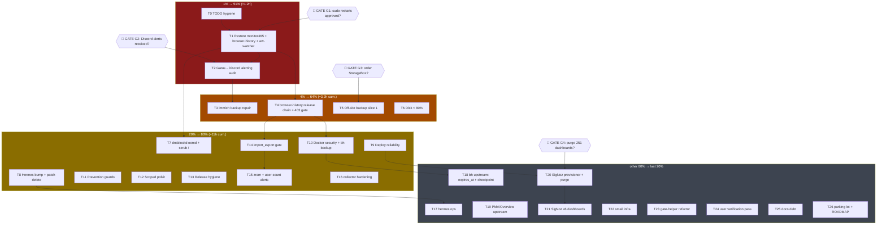

# SystemNix Pareto Execution Plan — Outage Recovery & Trust Restoration

**Created:** 2026-08-14 20:58 CEST
**Source of truth:** `TODO_LIST.md` @ `d7ba5084` (111 open items across P0–P7)
**Trigger:** docs-health audit closed 20:52 (6 sessions, 35 reports annotated, 32 archived). This plan ranks the resulting backlog.
**Method:** Pareto-planning skill — tier the backlog by leverage (1% → 51%, 4% → 64%, 20% → 80%), split into 10–30min medium tasks, then ≤12min fine tasks. ALL 111 items covered (coverage map in appendix).

---

## 0) Situation — why this ranking, not alphabetical priority

The system is **lying about its own health right now**:

1. **3 services dead**: monitor365-server (3 days), browser-history (`:8087` unbound), aw-watcher-window-wayland (since 20:05 boot)
2. **Alerting unproven**: `backup_all_healthy 0` has been TRUE for days — no Discord page confirmed. Either delivery is broken (worse outage) or alerts were ignored
3. **Backups that never ran**: immich (photos!) and monitor365 `backup_last_success_timestamp 0`
4. **Security no-op in production**: `MAX_USERS=1` does nothing — deployed browser-history binary predates the gate
5. **No off-site backup** — flagged since 2026-06-25; the Aug 3 corruption (13 files lost) proved the risk

Everything else (dashboards, upstream PRs, docs debt) is worthless if the box can silently lose data. Hence: **trust first (restore + verify), then safety (backups, gate), then everything else.**

---

## 1) Pareto Breakdown

Total backlog effort ≈ 55–60h (111 items, incl. parked long-term). Plan slices below ≈ 11.3h.

### The 1% that delivers 51% (~1.2h: T0–T2)

| #  | Task                                 | Why it is 51%                                                                                                                                 |
| -- | ------------------------------------ | --------------------------------------------------------------------------------------------------------------------------------------------- |
| T0 | TODO hygiene corrections (10min)     | The backlog itself must stop lying (stale P0 item, lost question)                                                                             |
| T1 | Restore the 3 dead services (25min)  | monitor365 + browser-history + activitywatch window-tracking back LIVE                                                                        |
| T2 | Gatus→Discord alerting audit (30min) | Why did a 3-day outage + stale-backup condition produce no page? Monitoring trust is the prime directive ("silent failures are unacceptable") |

Services restored + alerts trusted + backlog honest = more than half the value of the entire list.

### The 4% that delivers 64% (cumulative ~3.2h: +T3–T6)

| #  | Task                                  | Delta                                                                                                                     |
| -- | ------------------------------------- | ------------------------------------------------------------------------------------------------------------------------- |
| T3 | immich pg_dump backup repair (30min)  | The most irreplaceable data (photos DB) gets its FIRST backup                                                             |
| T4 | browser-history release chain (30min) | Registration gate goes LIVE (tag → go.mod v4.8.0 → flake bump → deploy → verify 403) + ships OTel-endpoint + reaper fixes |
| T5 | Off-site backup initial slice (30min) | StorageBox ordered (user) + Borg module skeleton — the 2-month-old #1 risk starts moving                                  |
| T6 | Disk push to <80% (30min)             | WDT-crash risk driver down; includes 724MB dnsblockdTracking.db + test photos + deploy .bak retention                     |

### The 20% that delivers 80% (cumulative ~11h: +T7–T16)

| #   | Task                                             | Delta                                                                                                     |
| --- | ------------------------------------------------ | --------------------------------------------------------------------------------------------------------- |
| T7  | dnsblockd oomd exemption + root-FS scrub (30min) | DNS stops being oomd-killed 730×/day; `/` gets its FIRST scrub                                            |
| T8  | Hermes input bump + patch DELETE (20min)         | Kills a second source of truth (upstream v0.20.1 ships the fix)                                           |
| T9  | Deploy reliability cluster (30min)               | forgejo-oidc boot race + exit-4 auto-retry + failure-streak escalation — deploys stop half-failing        |
| T10 | Docker security: Dozzle + bh DB backup (25min)   | Docker-socket escape vector closed; browser-history SQLite joins backup-coordination                      |
| T11 | Prevention guards (30min)                        | start-limit-audit.nix + OTel-scheme eval check + templ-committed CI check                                 |
| T12 | Scoped polkit restart rule (15min)               | Sessions can self-heal the exact outage class that lingered for days                                      |
| T13 | Release hygiene cluster (25min)                  | overview push/bump; CRB + Kernovia tags; go-cqrs-lite `git+ssh→github`; renamer follows; dep-audit script |
| T14 | `import_export.go` gate (15min)                  | Registration lock hole #3 closed + 4th-dispatch-site audit                                                |
| T15 | Monitoring gaps: zram + user-count (30min)       | zram-fill alert (I/O-storm precursor) + `browser_history_user_count` bypass detector + zram ADR           |
| T16 | system-health collector hardening (30min)        | while-read + timeouts + MemoryMax 256M + first validate-gomemlimit run                                    |

### The other 80% of effort → final 20% of value (~44h: T17–T26 + parked)

T17 hermes ops • T18 browser-history upstream (expires_at, CheckpointStore) • T19 PMA/Overview upstream starvation • T20 SigNoz provisioner + purge • T21 SigNoz dashboard rewrite • T22 small infra (Caddy reload, declarative health-check, `--force` flag) • T23 gate-helper refactor • T24 user verification pass (8 blocked-on-human items) • T25 docs debt slice • T26 upstream PR parking lot + ROADMAP graduation (ZFS trio, Pi3, NPU, attic, niri blur, SearXNG streaming, VM tests, …)

**Parked deliberately** (ROADMAP, not TODO): SearXNG streaming, native ZFS try, ZFS pool fate, NPU offload, Darwin HM parity, Pi3 provisioning, Monitor365 agent auth, event-store compaction.

---

## 2) USER GATES — decisions that block tasks (cannot self-serve)

| Gate | Blocks             | Question                                                                                                                         |
| ---- | ------------------ | -------------------------------------------------------------------------------------------------------------------------------- |
| G1   | T1, T7, T8 partial | Run `sudo systemctl restart monitor365-server browser-history`? (or grant T12 polkit rule FIRST so future restarts need no sudo) |
| G2   | T2                 | Did ANY Discord alert arrive for monitor365/backup staleness? (determines fix-alerting vs fix-process)                           |
| G3   | T5                 | Order Hetzner StorageBox now? (plan + pricing already in `docs/research/hetzner-storagebox-borgbackup.md`)                       |
| G4   | T20                | Purge all 251 SigNoz dashboards, or inspect for hand-created ones first?                                                         |
| G5   | —                  | MiniMax quota (2nd carry): upgrade / pay-as-you-go / wait?                                                                       |
| G6   | —                  | Turso plan for DiscordSync: keep sqlite-only / re-auth / upgrade?                                                                |

---

## 3) COMPREHENSIVE PLAN — medium tasks (10–30min each, ALL todos covered)

Sorted by impact ↓, then effort ↑. `Tier` = Pareto tier. `Owner`: 🤖 = this agent, 👤 = user, ⚙️ = sudo/deploy.

| #   | Task (10–30min)                                                                                                                                                                                                                                                                                                                                                                                                                                                         | Covers (TODO refs)                        | Impact | Effort | Tier | Owner | Depends                 |
| --- | ----------------------------------------------------------------------------------------------------------------------------------------------------------------------------------------------------------------------------------------------------------------------------------------------------------------------------------------------------------------------------------------------------------------------------------------------------------------------- | ----------------------------------------- | ------ | ------ | ---- | ----- | ----------------------- |
| T0  | TODO hygiene: delete stale "Reboot evo-x2" P0 (verified done 20:04), route MiniMax (carry-2), re-scan touched tiers for more stale items                                                                                                                                                                                                                                                                                                                                | self-review d.1/d.2                       | 7      | 10m    | 1%   | 🤖    | —                       |
| T1  | Restore 3 services: restart monitor365-server + verify /health/watchdog/backup-flip; restart browser-history + verify :8087; user-service reset-failed + start aw-watcher; boot-0 journal forensics on aw-watcher ordering-fix failure                                                                                                                                                                                                                                  | P0#1, P0#2, P1#1                          | 10     | 25m    | 1%   | ⚙️+🤖  | G1                      |
| T2  | Alerting audit: gatus config alert wiring → Discord webhook test alert → root-cause the un-paged `backup_all_healthy 0` window (gatus journal + Discord history)                                                                                                                                                                                                                                                                                                        | P0#1 (alert half)                         | 10     | 30m    | 1%   | 🤖+👤 | G2                      |
| T3  | immich backup repair: inspect backup unit + journal → fix (creds/path/timer) → verify `backup_healthy{immich}` flips to 1                                                                                                                                                                                                                                                                                                                                               | P1#2                                      | 9      | 30m    | 4%   | 🤖    | T1 (metric fresh)       |
| T4  | browser-history release chain: upstream go.mod → cqrs-htmx v4.8.0 + OTel endpoint fix + expires_at migration check → tag → SystemNix flake bump → deploy → verify 403 logged-out + second Pocket-ID login rejected                                                                                                                                                                                                                                                      | P3 (release item), P0#2 (root-cause half) | 9      | 30m+   | 4%   | 🤖⚙️   | T1                      |
| T5  | Off-site backup slice 1: order StorageBox (G3) → sops borg key pair → `modules/nixos/services/borgbackup.nix` skeleton (repo, schedule, Gatus check)                                                                                                                                                                                                                                                                                                                    | P0#3                                      | 9      | 30m    | 4%   | 👤+🤖 | G3                      |
| T6  | Disk <80%: nix-collect-garbage -d; docker system prune; trash dnsblockd_tracking.db (724MB) + buildcache/me photos; deploy .bak retention (keep 3); verify % + Gatus clear                                                                                                                                                                                                                                                                                              | P0#4, P2 (2 items), P7 (bak retention)    | 8      | 30m    | 4%   | ⚙️🤖   | —                       |
| T7  | dnsblockd `ManagedOOMPreference=omit` + deploy + kill-counter verify; foreground `btrfs scrub start -B /` + record; oomd 60/30 re-check post-reboot                                                                                                                                                                                                                                                                                                                     | P0#5, P0#6, P7 (oomd re-eval)             | 7      | 30m    | 20%  | 🤖⚙️   | T1                      |
| T8  | Hermes: input bump past v0.20.1 → DELETE `registration_lifecycle` patch → build/deploy → verify `import hermes_cli.plugins`                                                                                                                                                                                                                                                                                                                                             | P2 (hermes bump)                          | 7      | 20m    | 20%  | 🤖⚙️   | —                       |
| T9  | Deploy reliability: forgejo-oidc after/wants caddy (or mkOidcGate); deploy.sh exit-4 reset-failed+retry; post-deploy-check failure-streak file + warn-vs-fail semantics                                                                                                                                                                                                                                                                                                 | P1#7, P3 (3 items)                        | 7      | 30m    | 20%  | 🤖    | —                       |
| T10 | Docker security: Dozzle `extraOptions` no-new-privileges + cap_drop ALL; `docker rm -f dozzle` + redeploy (Memory 256m live); browser-history sqlite `.backup` job + backup-coordination entry                                                                                                                                                                                                                                                                          | P1#3, P3 (2 items)                        | 7      | 25m    | 20%  | 🤖⚙️   | T4 (bh stable)          |
| T11 | Prevention guards: `start-limit-audit.nix` eval assertion; OTel gRPC no-scheme eval check; templ-committed pre-commit/CI script                                                                                                                                                                                                                                                                                                                                         | P3 (3 items)                              | 6      | 30m    | 20%  | 🤖    | —                       |
| T12 | Scoped polkit: allow lars restart of monitor365-server, browser-history, monitor365-server-watchdog without interactive auth; deploy + test                                                                                                                                                                                                                                                                                                                             | P3 (polkit)                               | 6      | 15m    | 20%  | 🤖⚙️   | — (ideally before T1)   |
| T13 | Release hygiene: push+tag overview, SystemNix input bump, delete stale [Service] StartLimit copies; tag CRB `b1e5e701` + Kernovia `d139446d`; go-cqrs-lite root input `git+ssh→github` (+daemon restart if needed); renamer `go-nix-helpers.follows`; benchstat rev pin; dep-audit script (go.mod ↔ flake revs)                                                                                                                                                         | P1#5, P3 (4), P4#2, P6 (tags)             | 6      | 25m+   | 20%  | 🤖    | T4 (chain lesson fresh) |
| T14 | cqrs-htmx `import_export.go:156`: MaxUsers gate + registrationMu; test; `rg NewRegisterUserCmd` 4th-site audit; tag v4.8.1                                                                                                                                                                                                                                                                                                                                              | P1#6                                      | 6      | 15m    | 20%  | 🤖    | T4                      |
| T15 | Monitoring gaps: zram mm_stat fullness metric + Gatus alert >90%; zram ADR (1 page); `browser_history_user_count` metric upstream + Gatus bypass detector                                                                                                                                                                                                                                                                                                               | P3 (3 items)                              | 5      | 30m    | 20%  | 🤖    | T4                      |
| T16 | system-health collector: while-read loops, timeout 5, MemoryMax 256M, single NRestarts read; first `validate-gomemlimit.sh` run (+ flake app wiring)                                                                                                                                                                                                                                                                                                                    | P3, P4#1                                  | 5      | 30m    | 20%  | 🤖    | —                       |
| T17 | Hermes ops: SSH deploy key; fallback model; build-time `import hermes_cli.plugins` smoke test in flake check                                                                                                                                                                                                                                                                                                                                                            | P2 (2), P3 (1)                            | 4      | 20m    | 80%  | 👤🤖  | T8                      |
| T18 | browser-history upstream: expires_at schema migration; CheckpointStore/HydrateFromSQL research slice                                                                                                                                                                                                                                                                                                                                                                    | P3 (2 items)                              | 5      | 30m    | 80%  | 🤖    | T4                      |
| T19 | PMA upstream: bound per-worker scan memory / reclaim-insensitive daemon goroutine; quote GIT_AUTHOR env; stop daemon's unscoped flake update; Overview discovery-retry                                                                                                                                                                                                                                                                                                  | P1#4, P6 (3)                              | 5      | 30m    | 80%  | 🤖    | —                       |
| T20 | SigNoz phase 1: ClickHouse BACKUP; provisioner PUT-by-name-else-POST + FAILED state; purge 251 dupes; v2 schema lint CI                                                                                                                                                                                                                                                                                                                                                 | P3 (signoz #1, lint, CH backup)           | 5      | 30m    | 80%  | 🤖👤  | G4                      |
| T21 | SigNoz phase 2: enumerate live metrics (:9100/:9193/caddy/dnsblockd) → rewrite 5 dashboard JSONs to v6; trash Grafana overview.json                                                                                                                                                                                                                                                                                                                                     | P3 (signoz #2)                            | 4      | 30m+   | 80%  | 🤖    | T20                     |
| T22 | Small infra: Caddy `PrivateTmp` reload root-cause; declarative `criticalSystemServices` from config; deploy.sh `--force` phantom-metrics flag                                                                                                                                                                                                                                                                                                                           | P3 (3 items)                              | 4      | 30m    | 80%  | 🤖    | —                       |
| T23 | Gate helpers: extract `lib/gates.nix`; eval assertions (domain non-empty, serviceName sane); mkOidcGate diagnostic output; discordsync mkHttpGate                                                                                                                                                                                                                                                                                                                       | P3 (4 items)                              | 3      | 30m    | 80%  | 🤖    | —                       |
| T24 | User verification pass: smart-audio audible + reverse; audio.nix-vs-daemon coexistence (then remove rules); bh OAuth2 e2e; dnsblockd dashboard token; WebAuthn `.lan`; zero-copy test; test-tone tooling install; BIOS DAS fix; macOS deploy                                                                                                                                                                                                                            | P2 (6), P5 (2)                            | 5      | 30m+👤 | 80%  | 👤    | T1, T4                  |
| T25 | Docs debt slice: AGENTS.md compression start (77.6KB→<50KB target); qmd refs in planning docs; docs/planning triage start; appendix-annotation of 11 archived reports (batch of 4); 2026-05-06 note                                                                                                                                                                                                                                                                     | P6 docs (4)                               | 3      | 30m    | 80%  | 🤖    | —                       |
| T26 | Parking lot + graduation: file upstream issues (nixpkgs ×5, HM ×1, third-party ×4, LarsArtmann ×7: dnsblockd cardinality, DuckDB deadlock, chattr, golangci vendoring, hermes polish, vendor-hash CI ×3, BuildFlow devshell, picoclaw bump); grad P7 items to ROADMAP (ZFS trio, Pi3, NPU, attic, niri blur, @data migration, VM tests, SearXNG streaming, docker-hardening helper, HaGeZi refresh, rust-cache reclaim surgery, SSD2 data-root plan); wf-recorder track | P3 (rest), P6 (rest), P7 (rest)           | 2      | 30m+   | 80%  | 🤖    | —                       |

**Total medium: 27 tasks ≈ 11.3h of plan slices.** Everything beyond a 30-min slice is explicitly parked with its next concrete step (coverage appendix).

---

## 4) FINE BREAKDOWN — max 12min per task

⏱ sequential estimate per task. ⚙️ = needs sudo/deploy. 👤 = user at keyboard.

| ID      | Task                                                                                                                                                                                                                                                                                 | ⏱    | Dep     |
| ------- | ------------------------------------------------------------------------------------------------------------------------------------------------------------------------------------------------------------------------------------------------------------------------------------ | ---- | ------- |
| **T0**  |                                                                                                                                                                                                                                                                                      |      |         |
| 0.1     | Delete "Reboot evo-x2" from P0; add CHANGELOG note (verified live 20:04 by 20-35 report)                                                                                                                                                                                             | 3m   | —       |
| 0.2     | Add MiniMax decision item (carry-2) + Turso to TODO "Decisions needed" or §f of next report                                                                                                                                                                                          | 4m   | —       |
| 0.3     | Re-scan P0/P1 rows against live system (df, backups.prom, journal) for other stale entries; fix found                                                                                                                                                                                | 5m   | 0.1     |
| **T1**  |                                                                                                                                                                                                                                                                                      |      |         |
| 1.1     | ⚙️ `systemctl reset-failed monitor365-server && systemctl start monitor365-server`                                                                                                                                                                                                    | 2m   | G1      |
| 1.2     | Verify: `/health` 200, watchdog.timer active, agent circuit-breaker, journal clean                                                                                                                                                                                                   | 5m   | 1.1     |
| 1.3     | ⚙️ `systemctl restart browser-history`; watch journal to port bind; curl :8087/health                                                                                                                                                                                                 | 5m   | G1      |
| 1.4     | `systemctl --user reset-failed activitywatch-watcher-aw-watcher-window-wayland && systemctl --user start …`                                                                                                                                                                          | 2m   | —       |
| 1.5     | aw-watcher boot-0 forensics: `journalctl --user -u … -b 0` → identify real failure under the start-limit; note ordering-fix gap                                                                                                                                                      | 10m  | 1.4     |
| 1.6     | If fix is config (After/PartOf/WantedBy): patch activitywatch module, eval, park deploy for next ⚙️ window                                                                                                                                                                            | 10m  | 1.5     |
| **T2**  |                                                                                                                                                                                                                                                                                      |      |         |
| 2.1     | Read gatus-config alert blocks + discordAlert helper; confirm backup_all_healthy check wiring + interval/failures threshold                                                                                                                                                          | 10m  | G2      |
| 2.2     | Gatus journal since Aug 11: did the check fire? alert events logged?                                                                                                                                                                                                                 | 10m  | 2.1     |
| 2.3     | 👤 Discord #alerts: any monitor365/backup pages? (user confirms) — else webhook delivery test alert                                                                                                                                                                                  | 5m   | 2.2     |
| 2.4     | Root-cause + fix (webhook URL/severity routing vs process: post-deploy-check escalation → T9)                                                                                                                                                                                        | 10m  | 2.3     |
| **T3**  |                                                                                                                                                                                                                                                                                      |      |         |
| 3.1     | Locate immich backup unit (systemd cat / config grep) + `journalctl -u` since install; read last error                                                                                                                                                                               | 10m  | —       |
| 3.2     | Fix root cause (pg password env / path / timer calendar)                                                                                                                                                                                                                             | 10m  | 3.1     |
| 3.3     | Trigger run; verify file lands in `/var/lib/immich/database-backup`; `backup_healthy{immich} 1` after collector tick                                                                                                                                                                 | 10m  | 3.2     |
| **T4**  |                                                                                                                                                                                                                                                                                      |      |         |
| 4.1     | browser-history repo: go.mod require cqrs-htmx v4.8.0 (+ identity-model if needed); `go mod tidy`; build+test                                                                                                                                                                        | 12m  | T1.3    |
| 4.2     | Fold OTel endpoint fix (scheme handling for `127.0.0.1:4317`) + expires_at migration if small                                                                                                                                                                                        | 12m  | 4.1     |
| 4.3     | Tag `v0.5.0`; verify `git tag --contains` covers `b750ec5`+`b350c96`+fixes                                                                                                                                                                                                           | 3m   | 4.2     |
| 4.4     | SystemNix: `nix flake lock --update-input browser-history`; vendorHash dance if needed                                                                                                                                                                                               | 10m  | 4.3     |
| 4.5     | ⚙️ deploy; verify 403 on POST /auth/register logged-out; second Pocket-ID login rejected; reaper quiet; OTel clean                                                                                                                                                                    | 10m  | 4.4     |
| **T5**  |                                                                                                                                                                                                                                                                                      |      |         |
| 5.1     | 👤 Order Hetzner StorageBox (smallest BX11 ~matches research doc)                                                                                                                                                                                                                    | 5m   | G3      |
| 5.2     | sops: borg SSH keypair (host-key sealed); `.sops.yaml` rule                                                                                                                                                                                                                          | 10m  | 5.1     |
| 5.3     | `modules/nixos/services/borgbackup.nix`: repo URL, jobs (forgejo/immich/twenty/discordsync), schedule 03:30, harden+ioTier.maintenance                                                                                                                                               | 12m  | 5.2     |
| 5.4     | Gatus check `backup_offsite_age_hours` + enable; park initial seed for when box credentials arrive                                                                                                                                                                                   | 8m   | 5.3     |
| **T6**  |                                                                                                                                                                                                                                                                                      |      |         |
| 6.1     | ⚙️ `nix-collect-garbage -d` (background); snapshot expiry audit (btrbk list)                                                                                                                                                                                                          | 10m+ | —       |
| 6.2     | ⚙️ `docker system prune -f`; note reclaimed                                                                                                                                                                                                                                           | 5m   | —       |
| 6.3     | `sudo trash /var/lib/dnsblockd/dnsblockd_tracking.db` (724MB, orphaned); `trash /mnt/buildcache/me/`                                                                                                                                                                                 | 4m   | —       |
| 6.4     | deploy.sh: keep-last-3 rotation for `.bak` files                                                                                                                                                                                                                                     | 8m   | —       |
| 6.5     | df verify <80%; Gatus disk alert clears; largest-store-paths report for next round                                                                                                                                                                                                   | 5m   | 6.1–6.4 |
| **T7**  |                                                                                                                                                                                                                                                                                      |      |         |
| 7.1     | dnsblockd.nix: `ManagedOOMPreference=omit` (+OOMScoreAdjust=-500); eval                                                                                                                                                                                                              | 8m   | —       |
| 7.2     | ⚙️ deploy; verify oomctl + no new dnsblockd kills over 24h (park verify)                                                                                                                                                                                                              | 7m   | 7.1     |
| 7.3     | ⚙️ `btrfs scrub start -B /` (foreground, ~1-2h background wait — start, monitor start, park)                                                                                                                                                                                          | 5m+  | —       |
| 7.4     | oomd 60/30 post-reboot re-check (oomctl) + `user-1000.slice` headroom note                                                                                                                                                                                                           | 5m   | —       |
| **T8**  |                                                                                                                                                                                                                                                                                      |      |         |
| 8.1     | `nix flake lock --update-input hermes-agent` (past v0.20.1)                                                                                                                                                                                                                          | 5m   | —       |
| 8.2     | DELETE registration_lifecycle runCommand+PYTHONPATH suffix from hermes.nix                                                                                                                                                                                                           | 5m   | 8.1     |
| 8.3     | ⚙️ build + deploy; verify service starts, `import hermes_cli.plugins` implicit, no ModuleNotFoundError                                                                                                                                                                                | 10m  | 8.2     |
| **T9**  |                                                                                                                                                                                                                                                                                      |      |         |
| 9.1     | forgejo-oidc-setup: `after/wants caddy.service` (or mkOidcGate includeProvision)                                                                                                                                                                                                     | 10m  | —       |
| 9.2     | deploy.sh: exit-4 → `reset-failed` + one retry                                                                                                                                                                                                                                       | 12m  | —       |
| 9.3     | post-deploy-check: failure-streak file (last-FAIL hash+count), print streak loudly; warn-vs-fail decision note                                                                                                                                                                       | 12m  | —       |
| **T10** |                                                                                                                                                                                                                                                                                      |      |         |
| 10.1    | configuration.nix dozzle extraOptions: `--security-opt=no-new-privileges:true --cap-drop=ALL`                                                                                                                                                                                        | 6m   | —       |
| 10.2    | ⚙️ `docker rm -f dozzle` + deploy (recreate, Memory 256m live)                                                                                                                                                                                                                        | 8m   | 10.1    |
| 10.3    | browser-history sqlite `.backup` oneshot+timer (03:15) + backup-coordination entry (maxAgeHours 25)                                                                                                                                                                                  | 12m  | T4      |
| **T11** |                                                                                                                                                                                                                                                                                      |      |         |
| 11.1    | `modules/nixos/services/start-limit-audit.nix`: assertion scanning rendered units for StartLimit* in [Service]                                                                                                                                                                       | 12m  | —       |
| 11.2    | Eval check: OTel env endpoints — gRPC targets must be scheme-free, HTTP targets must have scheme                                                                                                                                                                                     | 8m   | —       |
| 11.3    | Pre-commit script: every `*.templ` has tracked `*_templ.go` sibling                                                                                                                                                                                                                  | 10m  | —       |
| **T12** |                                                                                                                                                                                                                                                                                      |      |         |
| 12.1    | security.nix (or new polkit rule): Action=org.freedesktop.systemd1.manage-units restricted to {monitor365-server,browser-history,monitor365-server-watchdog} for user lars                                                                                                           | 8m   | —       |
| 12.2    | ⚙️ deploy; test `systemctl restart monitor365-server` WITHOUT sudo                                                                                                                                                                                                                    | 7m   | 12.1    |
| **T13** |                                                                                                                                                                                                                                                                                      |      |         |
| 13.1    | Push overview `a9321f0`; SystemNix `--update-input overview`; delete stale [Service] StartLimit copies + interim comment                                                                                                                                                             | 10m  | —       |
| 13.2    | Tag CRB `b1e5e701` (v-dialect per repo convention); tag Kernovia `d139446d`                                                                                                                                                                                                          | 6m   | —       |
| 13.3    | flake.nix: go-cqrs-lite root input → `github:LarsArtmann/go-cqrs-lite`; if NAR mismatch: daemon restart note for user                                                                                                                                                                | 8m   | —       |
| 13.4    | flake.nix: `file-and-image-renamer.inputs.go-nix-helpers.follows = "go-nix-helpers"`                                                                                                                                                                                                 | 2m   | —       |
| 13.5    | Pin benchstat `rev = "master"` → commit SHA                                                                                                                                                                                                                                          | 4m   | —       |
| 13.6    | `scripts/dep-audit.sh`: go.mod requires vs flake.lock revs for LarsArtmann Go inputs                                                                                                                                                                                                 | 12m  | —       |
| **T14** |                                                                                                                                                                                                                                                                                      |      |         |
| 14.1    | cqrs-htmx import_export.go: MaxUsers check + registrationMu around dispatch; unit test (limit=1, import blocked)                                                                                                                                                                     | 10m  | T4      |
| 14.2    | `rg "NewRegisterUserCmd" usermgmt/*.go -g '!*test*'` 4th-site audit; tag v4.8.1 if clean                                                                                                                                                                                             | 5m   | 14.1    |
| **T15** |                                                                                                                                                                                                                                                                                      |      |         |
| 15.1    | system-health: zram mm_stat fullness % metric (orig/compr)                                                                                                                                                                                                                           | 10m  | —       |
| 15.2    | gatus: `system_zram_fill_over_threshold` alert (pre-computed bool, pat-safe glob)                                                                                                                                                                                                    | 8m   | 15.1    |
| 15.3    | `docs/adr/0001-zram-only-swap.md`: decision, failure mode, fallback                                                                                                                                                                                                                  | 10m  | —       |
| 15.4    | browser-history upstream: `browser_history_user_count` gauge + Gatus check (value >1 alert)                                                                                                                                                                                          | 12m  | T4      |
| **T16** |                                                                                                                                                                                                                                                                                      |      |         |
| 16.1    | system-health.sh: while-IFS-read loops + `timeout 5` docker/journalctl + single NRestarts read                                                                                                                                                                                       | 12m  | —       |
| 16.2    | MemoryMax 128M→256M; eval + park deploy                                                                                                                                                                                                                                              | 4m   | 16.1    |
| 16.3    | First `validate-gomemlimit.sh` run; fix grep bugs found; wire flake app                                                                                                                                                                                                              | 12m  | —       |
| **T17** |                                                                                                                                                                                                                                                                                      |      |         |
| 17.1    | 👤 hermes SSH deploy key → GitHub deploy keys                                                                                                                                                                                                                                        | 5m   | T8      |
| 17.2    | 👤 `sudo -u hermes hermes config set fallback_model`                                                                                                                                                                                                                                 | 3m   | —       |
| 17.3    | Flake check: python smoke `import hermes_cli.plugins` against sealed venv                                                                                                                                                                                                            | 10m  | —       |
| **T18** |                                                                                                                                                                                                                                                                                      |      |         |
| 18.1    | Upstream: sessions table migration adding expires_at (or fix reaper query); test                                                                                                                                                                                                     | 12m  | T4      |
| 18.2    | CheckpointStore: read cqrs-htmx HydrateFromSQL API; sketch integration issue upstream                                                                                                                                                                                                | 12m  | —       |
| **T19** |                                                                                                                                                                                                                                                                                      |      |         |
| 19.1    | PMA repo: bound scan worker memory (bufio limits / streaming entries) — first slice                                                                                                                                                                                                  | 12m  | —       |
| 19.2    | PMA module: quote GIT_AUTHOR_NAME env (drop SystemNix workaround after)                                                                                                                                                                                                              | 6m   | —       |
| 19.3    | PMA auto-git daemon: scope flake update (pathspec) to stop tarball-regression commits                                                                                                                                                                                                | 8m   | —       |
| 19.4    | Overview repo: retry discovery with backoff instead of cache-nil                                                                                                                                                                                                                     | 10m  | —       |
| **T20** |                                                                                                                                                                                                                                                                                      |      |         |
| 20.1    | ⚙️ ClickHouse `BACKUP DATABASE signoz TO Disk('backups','pre-signoz-purge.zip')`                                                                                                                                                                                                      | 5m   | G4      |
| 20.2    | `_signoz-scripts.nix`: PUT-by-name else POST; failures→FAILED marker; idempotent re-run                                                                                                                                                                                              | 12m  | 20.1    |
| 20.3    | Purge script for 251 dupes (keep provisioned-by-name); run after 👤 G4 confirm                                                                                                                                                                                                       | 10m  | 20.2    |
| 20.4    | `scripts/lint-dashboards.sh` v6 schema lint → pre-commit/CI                                                                                                                                                                                                                          | 10m  | 20.2    |
| **T21** |                                                                                                                                                                                                                                                                                      |      |         |
| 21.1    | Enumerate live metrics: :9100, :9193, caddy, dnsblockd /metrics → verified metric name list                                                                                                                                                                                          | 10m  | T20     |
| 21.2    | Rewrite dns.json + signoz-overview.json (amdgpu temp!) to v6; validate via lint                                                                                                                                                                                                      | 12m  | 21.1    |
| 21.3    | Rewrite docker.json + remaining 2; trash Grafana overview.json; deploy + eyeball                                                                                                                                                                                                     | 12m  | 21.2    |
| **T22** |                                                                                                                                                                                                                                                                                      |      |         |
| 22.1    | Caddy unit: PrivateTmp=false scoped override OR reload target fix; remove deploy.sh band-aid                                                                                                                                                                                         | 12m  | —       |
| 22.2    | scheduled-tasks: derive criticalSystemServices from config.services enabled set                                                                                                                                                                                                      | 12m  | —       |
| 22.3    | deploy.sh `--force`/`--skip-phantom-checks` documented escape hatch                                                                                                                                                                                                                  | 6m   | —       |
| **T23** |                                                                                                                                                                                                                                                                                      |      |         |
| 23.1    | Extract mkOidcGate/mkDnsGate → lib/gates.nix; re-export from lib/default.nix (no caller churn)                                                                                                                                                                                       | 12m  | —       |
| 23.2    | Eval assertions: domain non-empty, serviceName no spaces                                                                                                                                                                                                                             | 6m   | 23.1    |
| 23.3    | mkOidcGate optional diagnostic (TLS fingerprint on failure)                                                                                                                                                                                                                          | 8m   | 23.1    |
| 23.4    | mkHttpGate (or extend mkDnsGate mode=http) + refactor discordsync waitDnsReady                                                                                                                                                                                                       | 10m  | 23.1    |
| **T24** |                                                                                                                                                                                                                                                                                      |      |         |
| 24.1    | 👤 Play test tone on TV (speaker-test/pw-cat); focus DP-1 → profile switches back?                                                                                                                                                                                                   | 10m  | T1      |
| 24.2    | Observe audio.nix rules vs smart-audio coexistence (device events); remove superseded rules if clean                                                                                                                                                                                 | 10m  | 24.1    |
| 24.3    | 👤 history.home.lan OAuth2 e2e login + dashboard data                                                                                                                                                                                                                                | 5m   | T4      |
| 24.4    | 👤 dnsblock dashboard token verify; WebAuthn `.lan` passkey browser test                                                                                                                                                                                                             | 10m  | —       |
| 24.5    | 🤖 Install test-tone tooling (alsa-utils/pw-cat into audio shell)                                                                                                                                                                                                                    | 5m   | —       |
| 24.6    | 👤 Chromium zero-copy experiment (toggle flag, hotplug observation window) — park results                                                                                                                                                                                            | 5m   | —       |
| 24.7    | 👤 BIOS: disable USB boot + Fast Boot (DAS hang fix); `nix run .#deploy` on MacBook                                                                                                                                                                                                  | 10m  | —       |
| **T25** |                                                                                                                                                                                                                                                                                      |      |         |
| 25.1    | AGENTS.md compression: move 3 incident narratives → gotchas-archive; keep rules (target −20KB this slice)                                                                                                                                                                            | 12m  | —       |
| 25.2    | qmd refs: service-integration-plan.md 276-295 + crash-analysis-2026-08-11.md:143 strike-through notes                                                                                                                                                                                | 6m   | —       |
| 25.3    | docs/planning triage: classify 10 files (living/historical/dead); act on 3                                                                                                                                                                                                           | 12m  | —       |
| 25.4    | Inline-annotate 4 of 11 appendix-only archived reports                                                                                                                                                                                                                               | 12m  | —       |
| **T26** |                                                                                                                                                                                                                                                                                      |      |         |
| 26.1    | File upstream issues in one sitting: nixpkgs ×5 stubs, HM #6036 link, jscpd/XRT/wf-recorder ×3                                                                                                                                                                                       | 12m  | —       |
| 26.2    | LarsArtmann upstream issue stubs: dnsblockd cardinality, DuckDB deadlock, chattr, hermes polish, BuildFlow, picoclaw                                                                                                                                                                 | 12m  | —       |
| 26.3    | vendor-hash CI job template → crush-daily, PMA, erraudit                                                                                                                                                                                                                             | 12m  | —       |
| 26.4    | ROADMAP graduation write-up: ZFS trio, Pi3, NPU, attic, niri blur, @data migration, VM gatus tests, SearXNG streaming, rust-cache surgery, SSD2 data-root plan, HaGeZi refresh, docker-hardening helper, golangci vendoring, agent auth, event-store compaction, disabled-svc triage | 12m  | —       |
| 26.5    | wf-recorder FFmpeg 7: check upstream releases; subscribe issue                                                                                                                                                                                                                       | 5m   | —       |

**Fine total: 96 tasks ≈ 11.5h** (matches medium estimate; long-running waits — GC, scrub, seed backup — parked as background).

---

## 5) Execution Graph (mermaid)

**Parallelism:** T5/T6/T8/T11/T12/T13/T16/T22/T23/T25 are independent of the outage chain — run them in any idle window. The T1→T2→T4 chain is strictly sequential (verify → trust → secure).

---

## 6) Coverage map — every TODO_LIST item → task

| TODO_LIST section           | Items                                                                                                                                                                                                                                                                                                                                                                                                                                                                                          | Covered by                                                                                                                                                                                                                                                          |
| --------------------------- | ---------------------------------------------------------------------------------------------------------------------------------------------------------------------------------------------------------------------------------------------------------------------------------------------------------------------------------------------------------------------------------------------------------------------------------------------------------------------------------------------- | ------------------------------------------------------------------------------------------------------------------------------------------------------------------------------------------------------------------------------------------------------------------- |
| P0 (6)                      | monitor365 outage, bh outage, off-site, disk, dnsblockd oomd, scrub                                                                                                                                                                                                                                                                                                                                                                                                                            | T1, T1/T4, T5, T6, T7, T7 — "Reboot" item DELETED by T0 (stale, verified done)                                                                                                                                                                                      |
| P1 (7)                      | aw-watcher, immich, dozzle, PMA, overview, import gate, forgejo-oidc                                                                                                                                                                                                                                                                                                                                                                                                                           | T1, T3, T10, T19, T13, T14, T9                                                                                                                                                                                                                                      |
| P2 (14)                     | smart-audio, photos, SSH key, fallback model, bh OAuth2, dnsblock dashboard, WebAuthn, Turso, macOS, tracking DB, BIOS, hermes bump, Docker SSD2, rust-cache                                                                                                                                                                                                                                                                                                                                   | T24, T6, T17, T17, T24, T24, T24, G6→T0-route, T24, T6, T24, T8, T26.4 (plan), T26.4 (surgery plan)                                                                                                                                                                 |
| P3 (39)                     | release chain, start-limit, expires_at, checkpoint, bh DB backup, @data, attic, niri blur, caddy, declarative health-check, signoz ×2, audio coexist, collector, VM tests, hermes smoke, deploy retry, CH backup, dozzle sec, docker helper, vendorHash verify, --force, oidc diag, discordsync gate, gates.nix, gate asserts, qmd refs, searxng stream, wf-recorder, benchstat, cqrs-lite github, renamer follows, zram ADR, otel scheme, templ CI, zram alert, polkit, post-deploy semantics | T4, T11.1, T18.1, T18.2, T10.3, T26.4, T26.4, T26.4, T22.1, T22.2, T20+T21, T20.4, T24.2, T16.1, T26.4, T17.3, T9.2, T20.1, T10.1, T26.4, T26.4, T22.3, T23.3, T23.4, T23.1, T23.2, T25.2, T26.4, T26.5, T13.5, T13.3, T13.4, T15.3, T11.2, T11.3, T15.2, T12, T9.3 |
| P4 (2)                      | gomemlimit, dep-audit                                                                                                                                                                                                                                                                                                                                                                                                                                                                          | T16.3, T13.6                                                                                                                                                                                                                                                        |
| P5 (2)                      | zero-copy, test-tone                                                                                                                                                                                                                                                                                                                                                                                                                                                                           | T24.6, T24.5                                                                                                                                                                                                                                                        |
| P6 (26)                     | nixpkgs ×5, HM ×1, third-party ×4, LarsArtmann ×11, docs ×4                                                                                                                                                                                                                                                                                                                                                                                                                                    | T26.1, T26.1, T26.1, T26.2+T13.2+T19+T26.3, T25                                                                                                                                                                                                                     |
| P7 (16)                     | ZFS ×3, auditd, apparmor, darwin, agent auth, svc triage, compaction, overview retry, NVMe, NPU, bak retention, oomd re-eval, HaGeZi, Pi3                                                                                                                                                                                                                                                                                                                                                      | T26.4 (most → ROADMAP), T6.4, T7.4, T19.4                                                                                                                                                                                                                           |
| Self-review corrections (3) | stale P0 delete, re-score, MiniMax                                                                                                                                                                                                                                                                                                                                                                                                                                                             | T0                                                                                                                                                                                                                                                                  |

**111/111 items + 3 self-review corrections = fully covered.**

---

## 7) Anti-Verschlimmbesserung rules for execution

1. **Never restart a service without reading its journal first** — the monitor365/browser-history restarts must capture pre-state for forensics
2. **Deploy batching:** T4+T8+T12+T7.2 can share ONE deploy window; every deploy runs `nix run .#post-deploy-check`
3. **No parallel edits to TODO_LIST/AGENTS during execution** — daemon race is known; re-read before every multiedit
4. **Tags before flakes** (the T4 lesson): `git tag --contains` before every input bump
5. **Scrub + GC + balance never overlap** (IO storm rule from AGENTS)
6. **If a fix needs upstream code, fix upstream, tag, then bump** — no downstream logic patches

---

_Plan snapshot — point-in-time. Living state stays in TODO_LIST.md. Execute top-down after gates G1–G4 answered. Waiting for instructions._

---

## Appendix) Execution verdicts (docs-health pass, 2026-08-17)

| Tier             | Verdict                                                                                                                                                                                                                             |
| ---------------- | ----------------------------------------------------------------------------------------------------------------------------------------------------------------------------------------------------------------------------------- |
| T0–T4            | **EXECUTED 2026-08-15** by `2026-08-15_01-44_pareto-t0-t4-outage-truth-found.md` — with the plan's premise OVERTURNED by live evidence (the "3-day outage" was config-off, not failure). That report carries the per-item verdicts. |
| T1.1–1.3         | Resolved differently than planned: browser-history fixed upstream (storage/v4.7.0 + mkOidcGate); monitor365 stays off (G7 owner decision, TODO_LIST Priority 1).                                                                    |
| T4 release chain | Advanced past the v0.5.1 stop-point (input `4e7604d`); LIVE-binary gate verification remains TODO_LIST Priority 1.                                                                                                                  |
| T5 (off-site)    | Routed — TODO_LIST Priority 0: pool safety net LIVE (btrbk + all app backups on 2×16 TB mirror); the 3rd-copy-offsite decision remains open.                                                                                        |
| T6 (disk <80%)   | Escalated the WRONG way: root hit 95% (2026-08-17), TODO_LIST Priority 0.                                                                                                                                                           |
| T7+              | Superseded by living TODO_LIST state; surviving work is tracked there.                                                                                                                                                              |
| Gates            | G7 OPEN (owner). G2 superseded (delivery proven). G4 DONE (251 zombie dashboards purged 2026-08-16). G3/G5/G6 open in TODO_LIST.                                                                                                    |

**Disposition: ARCHIVED** — historical plan; premises corrected by 01-44; all surviving work lives in TODO_LIST.md.
