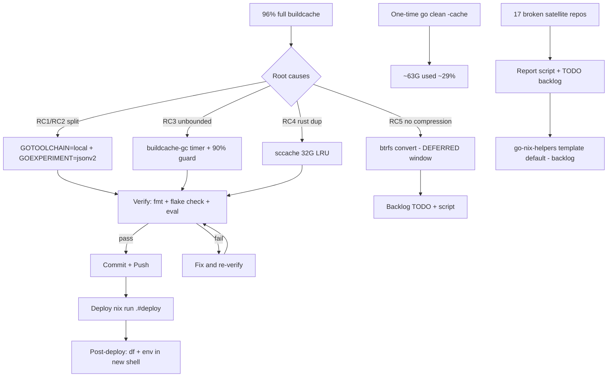

# SMART-BUILDCACHE-OVERHAUL — Execution Plan

**Created:** 2026-08-15 21:23 (evo-x2, session: btop-disk-investigation)
**Status:** EXECUTING
**Trigger:** `/mnt/buildcache` hit **96% (198G/220G) one day after deployment**. Investigation found the cache growing 2-3x faster than necessary.

---

## 1. Root Causes (verified, not assumed)

| # | Cause | Evidence | Effect |
|---|-------|----------|--------|
| RC1 | **Toolchain split** — go-codec's `go.mod` demands `go 1.26.6`, nixpkgs pins 1.26.5, `GOTOOLCHAIN=auto` (default) silently downloads go1.26.6 (240 MiB in `go-mod/golang.org/toolchain@…1.26.6`) and re-execs it | 15,415 of today's cache entries compiled with go1.26.6 vs 45,467 with go1.26.5 | Every package compiled by that context is a duplicate under a different cache key |
| RC2 | **GOEXPERIMENT split** — `use_go_env` direnv sniffer sets `jsonv2` only for repos that mention it; 75 of 162 repos compile flag-less, 70 with the flag, 17 broken (import v2 but set the flag nowhere) | 40,203 entries `X:…,jsonv2,…` vs 20,611 without | Two full dependency trees per toolchain |
| RC3 | **No size cap anywhere** — Go's native trim (daily, 5-day-unused, verified in `cache.go`) is defeated by 5 concurrent gopls instances refreshing mtimes via `markUsed`; npm/pnpm/rust-targets have no bounds at all | `trim.txt` baseline 1.7G vs 135G cache; 83.5G "older" entries never evicted | Unbounded growth; disk wedges at 100%, builds fail |
| RC4 | **Rust duplication by construction** — cargo compiles deps into each project's private `target/`; 35G is largely the same dependency `.rlib`s stored per-project | `rust/monitor365` alone 32G copied 08-14 | Linear growth with project count |
| RC5 | **No compression** — ext4 on the cache SSD; Go objects/DWARF + rust debuginfo compress ~2-2.5x | — | Every byte on disk is a full byte |

**Why gopls makes it worse:** each gopls instance cold-analyzing a repo recompiles every dependency (with ITS toolchain + experiment state) and touches existing entries (mtime refresh → trim never evicts). 5 instances × 2 cache-key variants = the observed ~50 GiB/day.

---

## 2. Pareto Breakdown

### The 1% that delivers 51%
**Two session-variable lines + one command.**
- `GOTOOLCHAIN = "local"` — the running (nix-pinned) binary is the ONLY toolchain; newer `go.mod` demands fail loudly instead of silently forking the cache (kills RC1 permanently)
- `GOEXPERIMENT = "jsonv2"` machine-global — one cache-key flag-set for all 162 repos (kills RC2's split; the experiment only gates the `encoding/json/v2` package availability — v1 output byte-identical, proven: 70 repos already compile deps under the flag)
- One-time `go clean -cache` — 198G → ~63G immediately (the disk is full TODAY)

### The 4% that delivers 64%
**`services.buildcache.gc` — weekly maintenance-tier timer (hard bound, kills RC3):**
- `npm cache verify`, `pnpm store prune`
- stale rust `target/` dirs (>14d) removed — safe once sccache makes them cheap to rebuild
- guard: if usage ≥ 90% → `go clean -cache` (nuclear but bounded; the disk can never wedge)

### The 20% that delivers 80%
**sccache for Rust (kills RC4):** `RUSTC_WRAPPER=sccache`, `SCCACHE_DIR=/mnt/buildcache/sccache`, `SCCACHE_CACHE_SIZE=32G`. Content-addressed single store: project B's serde is a cache HIT (rustc never runs), each unique compilation exists once by construction (nothing to dedup), hard LRU cap that cargo lacks. Nix builds unaffected (sandboxed, no env).

### The other 20% to reach 100% (portability + polish — mostly deferred backlog)
- **Satellite GOEXPERIMENT sweep** — 15 flake repos + 2 no-flake repos import `encoding/json/v2` but set the flag nowhere (their devShells are broken for contributors WITHOUT this machine's global env). Fix per-repo for portability. NOT batch-edited this session (heterogeneous flake structures + mass-push churn = verschlimmbesser risk); backlog with generated report script.
- **go-nix-helpers template default** — future repos self-carry the flag.
- **btrfs+zstd conversion runbook** — ~2x effective capacity + checksums convert the SandForce silent-corruption class into loud EIO → cache miss → rebuild (ext4 `data=writeback` serves corrupt objects today; Go's hash check catches go-build, cargo doesn't). Requires a maintenance window (unmount with live gopls/builds quiesced); script prepared, NOT executed.
- **go-codec 1.26.6 alignment** — repo has a DIRTY tree (`.go-version` mid-upgrade by user; not session's change to touch). With `GOTOOLCHAIN=local` that repo will fail loudly until its floor relaxes to 1.26.5 or nixpkgs bumps to 1.26.6 — which is the DESIRED signal.
- Docs: AGENTS.md gotchas, CHANGELOG, TODO_LIST, this plan.

---

## 3. Task Plan — Level 1 (10-30 min each)

| ID | Task | Impact | Effort | Risk |
|----|------|--------|--------|------|
| T1 | One-time reclaim: `go clean -cache` (no builds running, verified) | CRITICAL (frees 135G now) | 5min | LOW (cache by definition) |
| T2 | home.nix: `GOTOOLCHAIN=local`, `GOEXPERIMENT=jsonv2` + rationale comments | CRITICAL (stops split) | 15min | LOW |
| T3 | home.nix: sccache wiring (package + `RUSTC_WRAPPER`, `SCCACHE_DIR`, `SCCACHE_CACHE_SIZE=32G`) | HIGH (rust dedup-by-construction) | 15min | MED (wrapper affects all cargo) |
| T4 | buildcache.nix: `services.buildcache.gc` service+timer (npm/pnpm/stale-rust/90% guard), sccache dir in init | HIGH (hard bound) | 30min | LOW |
| T5 | Verify: `nix fmt` + `nix flake check --no-build` + eval toplevel | GATE | 10min | — |
| T6 | `scripts/report-goexperiment-gaps.sh` (generates exact satellite fix list) | MED (enables backlog) | 12min | LOW |
| T7 | `scripts/buildcache-btrfs-convert.sh` runbook script (NOT executed) | MED (deferred 2x win) | 20min | LOW (docs only) |
| T8 | Docs: AGENTS.md + CHANGELOG + TODO_LIST updates | MED (memory) | 20min | LOW |
| T9 | Commit + push SystemNix | GATE | 10min | — |
| T10 | Deploy (`nix run .#deploy`) + post-deploy spot-check | GATE | 15min | MED (needs sudo) |

## 4. Task Plan — Level 2 (≤12 min each)

| ID | Subtask | Parent |
|----|---------|--------|
| S1 | Check no builds running → `go clean -cache` → `df` verify ≥100G freed | T1 |
| S2 | Insert GOTOOLCHAIN + GOEXPERIMENT into home.nix sessionVariables with comments | T2 |
| S3 | Add sccache to home.nix packages | T3 |
| S4 | Add RUSTC_WRAPPER/SCCACHE_* sessionVariables | T3 |
| S5 | buildcache.nix: add `sccache` to buildcacheDirs | T4 |
| S6 | buildcache.nix: gc options (enable, maxAgeDays, highWatermarkPercent) | T4 |
| S7 | buildcache.nix: gc service (User=primaryUser, ioTier.maintenance, harden, mount guards) | T4 |
| S8 | buildcache.nix: gc timer (Sun 05:00, Persistent) | T4 |
| S9 | configuration.nix: `services.buildcache.gc.enable = true` | T4 |
| S10 | `nix fmt` on changed files | T5 |
| S11 | `nix flake check --no-build` | T5 |
| S12 | `nix eval .#nixosConfigurations.evo-x2.config.system.build.toplevel` (eval gate) | T5 |
| S13 | Write report-goexperiment-gaps.sh, run it, verify output list | T6 |
| S14 | Write buildcache-btrfs-convert.sh | T7 |
| S15 | AGENTS.md: buildcache section update (env vars, gc, gopls-mtime insight, go-codec note) | T8 |
| S16 | CHANGELOG.md: Unreleased entries | T8 |
| S17 | TODO_LIST.md: satellite sweep + btrfs window + go-codec items | T8 |
| S18 | git add + detailed commit | T9 |
| S19 | git push | T9 |
| S20 | Deploy attempt; if sudo-blocked → hand off exact command | T10 |

---

## 5. Execution Graph

---

## 6. Verification Plan

1. `df -h /mnt/buildcache` before/after clean (expect ~198G → ~63G)
2. `nix fmt` clean, `nix flake check --no-build` pass, toplevel eval pass
3. Post-deploy: `systemctl list-timers buildcache-gc*`, `env | grep -E 'GOTOOLCHAIN|GOEXPERIMENT|RUSTC_WRAPPER'` in a NEW shell
4. Next day: `buildcache_usage_percent` metric should stay < 60% under normal gopls load
5. sccache: first cargo build in any project → `sccache --show-stats` shows cache hits on second project sharing deps

## 7. Risks & Anti-Verschlimmbesser Decisions

- **go-codec left untouched** — dirty tree is user's mid-flight 1.26.6 upgrade; `GOTOOLCHAIN=local` makes the version demand fail LOUDLY in that repo (correct signal, documented)
- **Satellites NOT mass-edited** — 15 heterogeneous flakes; a scripted blind edit + 15 pushes is how caches get "fixed" by breaking CIs. Backlog instead.
- **GC rm-deviation** — stale rust targets removed with `rm -rf` (path-anchored, `-maxdepth`-bounded) instead of `trash`: trashing 30G of rebuildable cache would write it to the NVMe Trash — the exact IO the SSD offload exists to avoid. Cache data, not user data; deviation deliberate.
- **btrfs convert NOT executed** — needs quiesced consumers + sudo; script + runbook only.
- **GOEXPERIMENT future note** — when Go graduates jsonv2 out of the experiment list, the global var must be dropped (unknown-experiment = loud build error, caught on toolchain bump).

## 8. Deferred Backlog (tracked in TODO_LIST.md)

1. Fix 15 flake + 2 no-flake satellite repos missing GOEXPERIMENT (report script generates the list)
2. go-nix-helpers: default GOEXPERIMENT=jsonv2 in template/devShell
3. Execute btrfs+zstd conversion in a maintenance window (script: `scripts/buildcache-btrfs-convert.sh`)
4. go-codec: relax `go 1.26.6` → `1.26.5` (or wait for nixpkgs 1.26.6)
5. Revisit: retire direnv `use_go_env` sniffer once satellites all self-carry the flag
