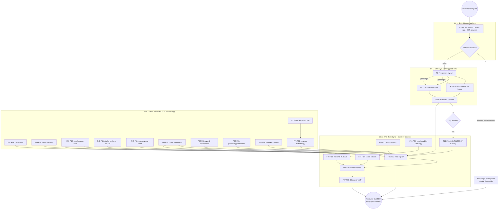

# Private-Cloud Media Hunt — ENDGAME (Pareto Execution Plan)

**Created:** 2026-08-16 20:06 CEST
**Mission:** Definitively answer *"where are the photos I remember viewing on my Mac?"* and close out the dead private-cloud box (died 2025-12-21/22) with **every byte classified**, zero risk of losing anything, and a clean decommission.
**Inputs:** `docs/status/2026-08-16_20-01_media-hunt-forensic-deep-dive.md` (session verdict + 40 next items), `2026-08-16_19-12_…final-verification.md` (addendum H + §F/§G), `2026-08-16_17-24_…sdf2-clone.md`.

---

## Context — what we PROVED this session (so the plan doesn't re-do it)

| Evidence layer | Result | Method |
|---|---|---|
| Immich PG volume (`postgres_immich_data`) | **0 tables** — server never connected once in its life | postgres 15.19 started on local socket |
| Paperless PG volume (`postgres_paperless_data`) | 54 tables, 129 migrations (burst 2025-11-01 20:10), **0 documents, 0 sessions, no human user ever** | SQL row counts |
| Pool datasets `databases/media/documents/backups` | `used=0B` at **every** hourly/daily/monthly snapshot (2025-11-25→12-21) | VM `zfs list -t snapshot` |
| All 439 `apps/<hex>` layer datasets + 488 snapshots | Only image-bundled UI assets (grafana/n8n/pgadmin) | full VM file sweep |
| Journal (3.8 GB, both boots) | postgres-immich/n8n crash-looped Dec 20→22 (missing sops secret); **no immich-server, no paperless container ever logged**; netdata: DB down since ≥Dec 14 | CONTAINER_NAME census |
| Docker registry on sdf2 | 13 images, **no immich image ever pulled**; paperless only as old 2.4.1 tag | repositories.json + imagedb mtimes |
| Dead box's own Chromium | 0 immich/paperless/photo URLs, ever | History sqlite |
| evo-x2 live immich | 17 GB but **all files dated 2026** (created after the box died) → NOT the Mac's memory (user confirmed) | find dates |

**Open frontier (the only unexamined bytes):** sdf2 deleted/free space, sdf3 swap (raw memory), Loki's 966k entries, orphan layer chains, zpool destroy history, Jul–Oct 2025 era (box predates the Nov stack; docker engine-id Jul 8, portainer volume Oct 10), git history of `home/art/projects/private-cloud`, and the user's own memory anchors (Mac/phone/GCP).

**Hard constraints:** read-only on sdf/sdb/sde until decommission decision; VM VFIO steals the USB controller shared with sdf — never run pool-VM and sdf work concurrently; `/data` has ~158 GB free (enough for a 49.45 GB zfs send + carve workspace); auto-git daemon commits continuously.

---

## Step 1 — Pareto Breakdown

### The 1% that delivers 51%
**The user's memory anchors + the carving green-light.**
Every structured byte on the dead disks is exhausted and says "no media ever existed here." The remembered viewing session therefore happened **somewhere I cannot see from this machine**: the Mac's browser history names the exact hostname+era (one line), the phone's Immich app names its server, and the GCP answer covers Jan–Oct 2025. These three 5-minute lookups redirect or close the entire hunt. The green-light decision unblocks the only remaining local work (carving). *Without this, we might carve 442 GB for nothing.*

### The 4% that delivers 64%
**Byte-level carving of the never-examined bytes: sdf2 free space + sdf3 swap.**
This is the sole remaining hypothesis for local data ("it existed and was deleted"): ext4 unallocated blocks and swap pages. Swap doubles as a RAM image (viewed photos leave JPEG bytes in page cache). Read-only, ~3–4 h machine time, covers "deleted" + "in-memory" in one sweep.

### The 20% that delivers 80%
**Residual-doubt archaeology (eliminate every last surprise vector):**
- Loki logs (966k entries — promtail captured container/app logs incl. anything from the journal-rotation gap)
- zpool history `zfs destroy` audit (the only way pool data could predate the snapshot era and vanish)
- Docker deep dig: 13 image configs, 412 layer chains vs 13 images (orphans = removed images, e.g. an immich image), distribution manifests (every pull ever)
- Git archaeology on the REAL repo (`.git` exists): migration commit `bdda5a3`, data-copy scripts, reflog
- Jul–Oct 2025 era reconstruction (box is 4 months older than the Nov stack)
- Filename-independent magic-byte sweeps (clone + pool): catches renamed/embedded media
- evo-x2 provenance (Caddy logs, pocket-id client date) — proves the 2026 library's story server-side
- Dead-box config mining: portainer.db, pgadmin servers, n8n workflows (42 MB DB), shell/.crush histories, Signal cache, Caddy vhosts, DNS, syncthing, real fstab/units (also fixes my symlink-escape debt)

### The other 20% (to reach 100%)
**Truth-sync, safety, closeout:** correct the H5 overclaim; AGENTS.md gotchas; TODO_LIST harvest; belt-and-suspenders full-pool `zfs send` (49.45 GB) before any wipe; second copy of irreplaceables (keys, 4 GiB journal); exposed-secret rotation plan; contingency path if carving finds ANY artifact (chain-of-custody); final "every byte classified" sign-off; decommission execution; 30-day manifest re-verify.

---

## Step 2 — Comprehensive Plan (tasks 30–100 min, ALL TODOs)

Sorted by importance → impact → effort → customer-value. Tier: **P1 = the 1%, P4 = the 4%, P2 = the 20%, C = closeout (other 20%).**

| # | Tier | Task | Why (customer value) | Impact | Effort | Deps |
|---|---|---|---|---|---|---|
| M1 | P1 | **User-side memory anchors**: 3-question interview + guided Mac/phone/GCP lookups; record answers; redirect-or-close decision | One hostname answer can end the hunt | 10 | 30m | — |
| M2 | P1 | **Carving prep + green-light**: read-only policy, extent maps, tool check (foremost/photorec/bulk_extractor), 1 GB dry-run, workspace+manifests on /data | Unblocks all carving safely | 9 | 30m | M1 |
| M3 | P4 | **sdf3 swap raw carve**: magic scan (JPEG/PDF/HEIC/MP4), URL strings, triage | RAM image of the death-day session | 9 | 60m | M2 |
| M4 | P4 | **sdf2 free-space scan (phase 1)**: unallocated extents, JPEG/PDF scan | The "deleted photos" hypothesis | 10 | 100m | M2 |
| M5 | P4 | **sdf2 free-space carve (phase 2)**: HEIC/RAW/MP4 scan, extract+validate hits, manual gallery review, classification | Converts hits into answers | 9 | 100m | M4 |
| M6 | P2 | **Dead-box REAL fstab/unit enumeration** from its own store path (`f5f5fylq…`) — settles `storage-backup-ssd*`/`nas` roles; fixes symlink-escape debt | Interprets every other finding correctly | 7 | 30m | — |
| M7 | P2 | **Loki log mining**: export, grep immich/paperless/upload/container-IDs, timeline | Covers the journal-rotation gap | 8 | 45m | — |
| M8 | P2 | **Git archaeology** on real repo (`home/art/projects/private-cloud/.git`): `bdda5a3` diff, upload/rsync scripts, reflog/stashes | Documents what the migration actually copied | 8 | 45m | — |
| M9 | P2 | **zpool history audit** via VM: `zfs destroy` events, pool creation date, dataset churn vs death timeline | Only way pre-snapshot data could vanish | 8 | 45m | — (VM slot) |
| M10 | P2 | **Docker archaeology**: decode 13 image configs, orphan layer diff (412 chains vs 13 images), distribution manifests (every pull ever), Jul–Oct era timeline | A removed immich image would rewrite history | 7 | 90m | — |
| M11 | P2 | **Magic-byte sweep of sdf2 clone** (filename-independent: JPEG/PDF/HEIC/CR2/MP4 magic) | Catches renamed/embedded media | 7 | 100m | — |
| M12 | P2 | **Magic-byte sweep of pool** (live + snapshots, in VM) | Same, pool-side | 7 | 100m | — (VM slot) |
| M13 | P2 | **evo-x2 provenance**: immich v3 table counts + earliest asset dates, Caddy access-log grep (immich vHost, Mac IPs), pocket-id immich client creation date | Server-side proof of what the Mac viewed | 7 | 60m | — |
| M14 | P2 | **App-data mining**: portainer.db stacks, pgadmin registered servers (GCP endpoints?), n8n workflow dump (42 MB DB) | Integrations reveal data flows | 6 | 60m | — |
| M15 | P2 | **History mining**: `/root/.bash_history`, art's shell/crush session logs, Signal cache scan | Upload commands name sources | 6 | 45m | — |
| M16 | P2 | **Network archaeology**: dead-box Caddy vhosts, `/etc/hosts`, DNS zones, syncthing folders/devices, `backups/{daily,weekly,monthly}` role | Where `immich.…cloud` pointed per era | 6 | 45m | M6 |
| M17 | C | **Documentation truth-sync**: rewrite Addendum H5 (hypothesis, not proof), AGENTS.md gotcha entries (foreign-NixOS /etc escape; empty-result rule), TODO_LIST harvest, cross-link reports | Reports must not lie | 8 | 45m | M13 |
| M18 | C | **Belt-and-suspenders full-pool `zfs send`** (49.45 GB → /data file) + SHA256 (§G-1) | Last chance copy before any wipe | 9 | 60m | M9, M12 |
| M19 | C | **Irreplaceables second copy**: inventory (SSH keys, sops age key, SB keys, 4 GiB journal, 3 manifests) → second target + hash verify (§G-2) | Survives NVMe failure | 9 | 45m | — |
| M20 | C | **Exposed-secret audit + rotation plan**: `.env` files, JWT secret in repo docs, certs; cross-check reuse; rotate what's live | Dead-box creds must not linger | 7 | 45m | — |
| M21 | C | **CONTINGENCY (if any artifact found)**: quiesce, chain-of-custody copy + hashes, Addendum I report | Evidence integrity | 10 | 100m | M3-M5/M11/M12 |
| M22 | C | **Final sign-off report**: evidence matrix, byte-coverage accounting ("every byte classified"), §G answers recorded | The deliverable that closes recovery | 9 | 60m | all |
| M23 | C | **Decommission execution** (after user decision): wipe/repool sdf+sdb+sde, verify, reclaim | Frees 500G SSD + 2×16 TB | 8 | 60m | M18, M22 |
| M24 | C | **30-day backup re-verification** of all three manifests (bit-rot check) | Keeps the recovery honest | 5 | 30m | M23 |

**Total: 24 tasks ≈ 17.6 h** (≈ 3–4 focused sessions). VM-dependent tasks (M9, M12, M18) serialize with sdf work (shared USB controller).

---

## Step 3 — Fine-Grained Breakdown (ALL tasks ≤ 12 min)

Sorted identically (P1 → P4 → P2 → C; F-numbers sequential within each M).

| # | Task (≤12 min each) | M | Min |
|---|---|---|---|
| F1 | Draft 3 anchor questions w/ exact click-paths (Mac Safari+Chrome history query, Immich app settings, GCP console check) | M1 | 5 |
| F2 | User runs Mac history query: `immich OR photo OR larsartmann.cloud OR 192.168.*` (Safari + Chrome + Firefox) | M1 | 10 |
| F3 | User opens Immich mobile app → Settings → capture server URL(s); check iOS/Android photo-app backup targets | M1 | 5 |
| F4 | User checks old GCP console: projects, buckets, disk snapshots, billing-lock status (Jan–Oct 2025 era) | M1 | 12 |
| F5 | Record answers in report; decide: REDIRECT (hostname found → new target) or CLOSE (local hunt ends) | M1 | 10 |
| F6 | Carving green-light decision from user; restate read-only guarantees | M2 | 5 |
| F7 | Verify tools: `nix shell nixpkgs#foremost nixpkgs#photorec nixpkgs#bulk-extractor` availability test | M2 | 10 |
| F8 | Map sdf2 free extents: `debugfs -R "stat <inode>"` sampling + `filefrag` overview; record free-space total | M2 | 12 |
| F9 | Dry-run carve on a 1 GB slice of sdf2 free space; validate pipeline (extract→identify→report) | M2 | 12 |
| F10 | Create /data/carve workspace + SHA256 manifest policy + disk-space guard (keep ≥50 GB free) | M2 | 10 |
| F11 | sdf3: identify device, confirm swap signature, `blockdev --ro` read-only open | M3 | 5 |
| F12 | Scan swap: JPEG (`FFD8FF`), PDF (`%PDF`), HEIC (`ftypheic`) magic | M3 | 12 |
| F13 | Scan swap: MP4/MOV (`ftyp`), PNG, WebP magic | M3 | 10 |
| F14 | Strings scan swap: `immich`, `paperless`, `larsartmann.cloud`, LAN IPs, `/api/assets`, `/upload` | M3 | 12 |
| F15 | Triage swap hits: sizes, dates in EXIF, user-vs-container classification | M3 | 12 |
| F16 | Document swap carve results (even if zero — that IS the result) | M3 | 5 |
| F17 | sdf2 free-space scan job 1: JPEG magic over unallocated regions | M4 | 12 |
| F18 | sdf2 free-space scan job 2: PDF + TIFF | M4 | 10 |
| F19 | sdf2 free-space scan job 3: HEIC/CR2/CR3/DNG/NEF/ARW/RAF | M4 | 12 |
| F20 | sdf2 free-space scan job 4: MP4/MOV/MKV/WebM | M4 | 12 |
| F21 | Collect hit list: offset, size, header sanity; dedupe against known container assets (grafana etc.) | M4 | 12 |
| F22 | Extract promising regions to /data/carve (carve by offset+size) | M5 | 12 |
| F23 | Validate extracted files (parse check; EXIF presence; thumbnail render for JPEGs) | M5 | 10 |
| F24 | Manual gallery review of validated hits (user eyeball pass) | M5 | 12 |
| F25 | Classify: user media vs container asset vs benchmark junk; count true candidates | M5 | 12 |
| F26 | Document free-space carve verdict + custody hashes for any keepers | M5 | 10 |
| F27 | Resolve dead-box real store path: `readlink /tmp/sdf-mount/nix/var/nix/profiles/system` → prepend mount (NO host store!) | M6 | 5 |
| F28 | Enumerate ALL units in `f5f5fylq…-nixos-system…/etc/systemd/system` — immich/paperless/docker/mount anything | M6 | 10 |
| F29 | Extract real fstab + mount units → full mount map of the dead box | M6 | 10 |
| F30 | Verdict on `storage-backup-ssd{,2,3,4}` + `nas/` roles (mount targets? rsync stubs?) | M6 | 10 |
| F31 | Export Loki ranges covering 2025-11-27→12-22 (logcli or raw chunks from clone) | M7 | 12 |
| F32 | Grep Loki for `immich` / `paperless` container names + IDs | M7 | 12 |
| F33 | Grep Loki for upload/activity endpoints (`/api/assets`, `/api/documents`, `webhook`) | M7 | 12 |
| F34 | Build activity timeline; compare against journal census; document | M7 | 10 |
| F35 | `git log --all --date-order` on `home/art/projects/private-cloud/.git` (safe.directory) | M8 | 10 |
| F36 | `git show bdda5a3` FULL diff — verify "config-only" claim (any data-path/db-dump references?) | M8 | 12 |
| F37 | Grep full git history for rsync/scp/gsutil/gcloud/pg_dump/photo/scripts | M8 | 12 |
| F38 | Check reflog + stashes + untracked-but-present files for post-death tampering | M8 | 8 |
| F39 | VM: export `zpool history datapool` (full, untruncated) to host | M9 | 12 |
| F40 | Grep history for `zfs destroy` — any destroyed dataset ever? | M9 | 8 |
| F41 | Pool creation date + earliest events; dataset birth timeline | M9 | 10 |
| F42 | Cross-ref history end (12-21 23:40) vs journal death (12-22 00:40) — document final-hour ops | M9 | 10 |
| F43 | Decode all 13 image configs (created, env, labels, cmd) — pull dates | M10 | 12 |
| F44 | Layerdb: count chains, map each to image/container; list 412 dirs vs 13 images | M10 | 12 |
| F45 | Orphan diff: unreferenced chains = removed images? Inspect each orphan's config blob | M10 | 12 |
| F46 | Distribution manifests: every digest ever pulled (incl. deleted) — was immich ever here? | M10 | 12 |
| F47 | Jul–Oct era: buildkit refs, engine-id (Jul 8), portainer volume (Oct 10) — what ran pre-Nov? | M10 | 12 |
| F48 | Docker-archaeology verdict + document | M10 | 5 |
| F49 | Magic sweep clone pass A: `/data/backup-…-ssh` JPEG+HEIC magic (name-independent) | M11 | 12 |
| F50 | Magic sweep clone pass B: PDF + CR2/DNG/NEF + MP4 magic | M11 | 12 |
| F51 | Triage magic hits vs extension-based results (new hits = renamed/embedded media) | M11 | 12 |
| F52 | Document clone magic-sweep results | M11 | 8 |
| F53 | VM: magic sweep pool LIVE datasets | M12 | 12 |
| F54 | VM: magic sweep pool SNAPSHOT trees (488 snaps, streaming) | M12 | 12 |
| F55 | Triage + cross-ref against extension sweep | M12 | 12 |
| F56 | Document pool magic-sweep results | M12 | 8 |
| F57 | evo-x2 immich v3: correct table names, count assets/users/albums | M13 | 8 |
| F58 | evo-x2: earliest asset createdAt + earliest library file mtime (proves 2026 start) | M13 | 10 |
| F59 | evo-x2 Caddy access logs: grep immich vHost, Mac IPs/user-agents, first-seen date | M13 | 12 |
| F60 | evo-x2 pocket-id: immich OIDC client creation timestamp | M13 | 10 |
| F61 | evo-x2 provenance verdict + document | M13 | 5 |
| F62 | portainer.db: decode stacks/templates ever deployed (bolt → strings or boltbrowser) | M14 | 12 |
| F63 | pgadmin_data: sqlite — registered servers, saved queries (GCP endpoints?) | M14 | 10 |
| F64 | n8n DB (42 MB): dump workflow_entity; grep immich/paperless/GCS nodes | M14 | 12 |
| F65 | App-data mining verdict + document | M14 | 10 |
| F66 | `/root/.bash_history` — full read, grep upload/migration commands | M15 | 8 |
| F67 | art's shell histories (bash/zsh/fish) — same | M15 | 8 |
| F68 | `.crush` session logs on dead box — grep immich/paperless/photo/upload | M15 | 12 |
| F69 | Signal cache/config on dead box — any received photos (the one real user-media source) | M15 | 12 |
| F70 | Dead-box Caddy config: full vhost list + upstreams | M16 | 10 |
| F71 | `/etc/hosts` + unbound/dns config: where `immich.larsartmann.cloud` resolved per era | M16 | 10 |
| F72 | Syncthing config: folders/devices — data may live on a synced peer | M16 | 10 |
| F73 | `backups/{daily,weekly,monthly,archives}` role verdict (with M6 fstab knowledge) | M16 | 8 |
| F74 | Rewrite Addendum H5: hypothesis framing, 2026-dating evidence, user rejection noted | M17 | 10 |
| F75 | AGENTS.md gotcha entries: foreign-NixOS `/etc` absolute-symlink escape; empty-structured-result rule | M17 | 12 |
| F76 | TODO_LIST.md harvest: add live items from this plan (living source) | M17 | 12 |
| F77 | Cross-link all four recovery reports (17-24, 19-12, 20-01, this plan) | M17 | 8 |
| F78 | VM: `zfs send -R datapool@<newest> > /data/datapool-final-<date>.zfs` (kick off, background) | M18 | 12 |
| F79 | Monitor send; then SHA256 the stream file | M18 | 12 |
| F80 | Verify restorability dry-run (`zfs receive -nv` on a scratch dataset) + document | M18 | 10 |
| F81 | Inventory irreplaceables: SSH keys, sops age key, SB keys (PK/KEK/db/dbx), 4 GiB journal, 3 manifests | M19 | 10 |
| F82 | Copy to user-chosen second target (part 1: keys + manifests) | M19 | 10 |
| F83 | Copy (part 2: journal + sdf1 boot clone) + space bookkeeping | M19 | 10 |
| F84 | Verify all second-copy hashes; document locations + restore procedure | M19 | 10 |
| F85 | Collect exposed secrets: `.env` (DB passwords), JWT in secrets docs, certs, API keys | M20 | 10 |
| F86 | Cross-check each against live infra (evo-x2, Forgejo, GCP) for reuse | M20 | 12 |
| F87 | Write rotation plan; execute what's user-approved | M20 | 10 |
| F88 | CONTINGENCY: quiesce source disk (no further access) | M21 | 5 |
| F89 | CONTINGENCY: chain-of-custody copy + SHA256 + timestamp log | M21 | 12 |
| F90 | CONTINGENCY: Addendum I report (what was found, where, custody chain) | M21 | 12 |
| F91 | Compile evidence matrix: every layer × every disk × verdict | M22 | 12 |
| F92 | Byte-coverage accounting: allocated+free+swap+snapshots = 100% of both disks examined? | M22 | 12 |
| F93 | Write final sign-off report; record §G answers; declare recovery closed | M22 | 12 |
| F94 | Confirm user decommission decision (wipe? keep? sell?) | M23 | 5 |
| F95 | Execute wipe/repool (sdf, sdb+sde) per decision | M23 | 12 |
| F96 | Verify wipe; reclaim partitions/mounts; update docs | M23 | 10 |
| F97 | Schedule 30-day re-verify task (calendar + script stub) | M24 | 5 |
| F98 | Run re-verify: all three manifests SHA256 spot-check (100% for irreplaceables) | M24 | 12 |
| F99 | Record re-verify results; final archive tag | M24 | 8 |

**Total: 99 fine tasks** (sums to ≈17.6 h; every task ≤12 min).

---

## Execution Graph (mermaid.js)

**Scheduling notes:** P1 immediately (user-side, zero machine time). P4 next (carving while user answers). P2 tasks are independent — run 2–3 in parallel sessions; VM tasks (F39-42, F53-56, F78-80) must NOT overlap sdf work (shared USB controller). CLOSE runs once hunting verdicts land. M21 (contingency) preempts everything if triggered.

**Verschlimmbesserung guards:** all carving read-only (`blockdev --ro`, never `mount rw`); no writes to sdf/sdb/sde; /data guarded ≥50 GB free; no reformat before M18+M22+user sign-off; reports corrected, never deleted; every "empty" result re-verified by one raw dump before it becomes a conclusion.

---

*Plan owner: recovery session. Living tasks mirrored to TODO_LIST.md (F76). Snapshot — re-verify before executing stale items.*
