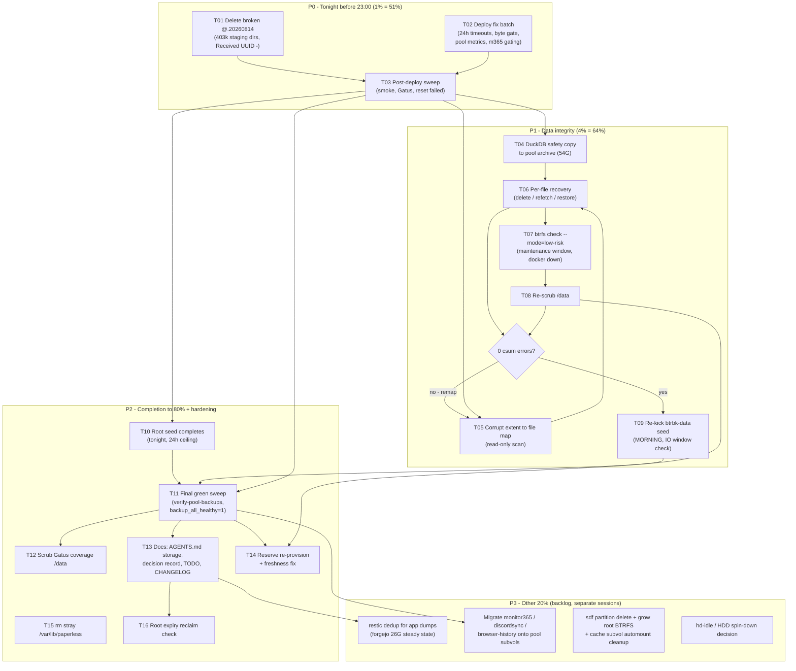

# Data Corruption Recovery & Pool Backup Completion — Master Plan

**Date:** 2026-08-17 14:41
**Scope:** Resolve the /data csum corruption, repair the broken pool receive, deploy the stranded fix batch, and drive all three backup tiers to verified green.
**Standing state at planning time:** Pool healthy (468G, RAID1, first scrub clean, all app backup timers green). /data has 1,351,271 uncorrectable csum errors (~1.3MB, 22 extents, 3 physical windows ~595G and ~627–639G). Pool holds a broken @.20260814 receive (403,251 `o*` staging dirs, `Received UUID: -`) from the 6h-timeout kill. Root 95% (39G free, CoW-pinned by snapshots; reclaims at expiry). Fix batch (24h btrbk timeouts, byte disk-gate, disk-growth preStart, pool metrics, monitor365 backup gating) committed in tree, **undeployed**.

---

## 1. User Decisions (recorded 2026-08-17)

| # | Question | Decision | Consequence |
|---|----------|----------|-------------|
| Q1 | /data recovery posture | **Aggressive** (minimal + `btrfs check --mode=low-risk`), pending explanation below | Minimal recovery runs first; check scheduled as its own maintenance-window task (T07) |
| Q2 | Monitor365 DuckDB on /data disposable? | **NO — preserve** | Safety-copy to pool BEFORE any destructive /data step (T04); /data copy is not deleted |
| Q3 | Emergency reserve timing | **After triage** | T14 runs only after /data is clean and seeds are re-established |

### What `btrfs check --mode=low-risk` actually is (answers the open question)

`btrfs check` (btrfsck) walks all **metadata** trees and verifies internal consistency (extent tree, backrefs, checksums of metadata blocks). Two things you must know before paying for it:

1. **It cannot repair DATA csum errors at all.** Corrupt data extents are fixed by deleting/rewriting the affected *files* (which frees the bad extents) — that is the "minimal" path and it is mandatory either way. `btrfs check` only tells us whether the torn-write event also damaged *structural* metadata.
2. **`--mode=low-risk`** restricts the tool to verification/repair operations considered safe (btrfs-progs ≥ 6.10). Without `--repair` it is **read-only and harmless** — it can only report, never change. The danger reputation of btrfsck comes from `--repair` rebuilding metadata, which we will NOT run.
3. **Cost:** it wants /data unmounted → stop Docker (its volumes live on /data), unmount, check, remount, restart. A ~60–90 min maintenance window. Expected runtime of the check itself on 840G: ~15–45 min.

**Honest recommendation:** minimal recovery almost certainly resolves everything (SMART clean, damage bounded to 22 data extents). The low-risk check is a confidence pass against hidden metadata damage. Since you chose it, it is planned as T07 — run it, read-only, in one window, after the file-level fix. If the post-fix scrub is clean and the check finds nothing, we close the incident.

---

## 2. Pareto Breakdown

### The 1% that delivers 51%
**Two tasks: delete the broken @.20260814 receive (T01) + deploy the committed fix batch (T02).**
They take ~2h total and: protect tonight's 23:00 btrbk chain from colliding with a corrupt receive, activate the 24h seed timeout (root seed can finally complete), fix the disk-gate that blocks all deploys, fix disk-growth-check, light up pool metrics + Gatus pool checks, and deploy the monitor365 backup gating (last blocker for `backup_all_healthy=1`).

### The 4% that delivers 64%
**Add: DuckDB safety copy (T04) → corrupt-file mapping (T05) → per-file recovery (T06).**
Resolves the actual data-integrity incident and unblocks the /data seed — the last unprotected tier.

### The 20% that delivers 80%
**Add: re-scrub to 0 csum (T08), re-kick data seed (T09), root seed completes (T10), verify-pool-backups + backup_all_healthy green (T11).**
End state: all three backup tiers (pool app dumps, on-pool snapshots, btrbk root+data sends) verified green simultaneously.

### The other 20% to 100%
Low-risk metadata check (T07), scrub Gatus coverage (T12), docs debt: AGENTS.md storage section + decision record + TODO_LIST/CHANGELOG (T13), reserve re-provision + freshness fix (T14), stray `/var/lib/paperless` (T15), root-disk relief verification (T16). Backlog (T17): restic dedup for app dumps, migrating the 3 still-empty pool service subvols, sdf/SanDisk reclaim, hd-idle.

---

## 3. Master Plan (tasks 30–100 min, sorted by impact/effort)

| ID | Task | Tier | Impact | Effort | Risk | Depends | Est |
|----|------|------|--------|--------|------|---------|-----|
| T01 | Delete broken `@.20260814T2300` on pool; verify @.20260812/13 chain intact | 1% | Critical | Low | Low (broken artifact only) | — | 45m |
| T02 | Deploy committed fix batch (24h timeouts, byte gate, disk-growth preStart, pool metrics, monitor365 gating) | 1% | Critical | Med | Low | — | 90m |
| T03 | Post-deploy sweep: smoke green, Gatus pool checks green, disk-growth-check fixed, failed units reset | 1% | High | Low | Low | T02 | 30m |
| T04 | Safety-copy monitor365 DuckDBs (/data 31G + /var/lib 23G) to `/mnt/pool/archive/monitor365-nvme-safety/` + checksums | 4% | High | Med | Low | — | 60m |
| T05 | Run corrupt extent→file mapping (journal inodes + physical addr ↔ fiemap join) | 4% | Critical | Med | None (read-only) | — | 45m |
| T06 | Per-file recovery per map (delete/redownload models, restore DBs from pool dumps) | 4% | Critical | Med | Med (validated per-file) | T04, T05 | 60m |
| T07 | Maintenance window: stop docker, umount /data, `btrfs check --mode=low-risk` (read-only), remount, restart | 20%→100% | Med | Med | Low (read-only) | T06 | 90m |
| T08 | Re-scrub /data → confirm 0 csum errors (read-only, background) | 20% | Critical | Low | None | T06 (T07) | 60m |
| T09 | Re-kick btrbk-data seed (MORNING, confirm no scrub/GC overlap, 24h ceiling live) | 20% | High | Low | Low | T08 | 30m |
| T10 | Monitor btrbk-root seed completion tonight under 24h ceiling; verify @.20260814..17 re-received incrementally | 20% | High | Low | None | T01, T02 | 15m |
| T11 | Final green sweep: btrfs-verify-pool-backups success, `backup_all_healthy=1`, Gatus all-green | 20% | High | Low | None | T02, T09, T10 | 30m |
| T12 | Scrub-result Gatus coverage for /data (audit wiring; add check if missing) | 100% | Med | Med | Low | T02 | 45m |
| T13 | Docs debt: AGENTS.md storage section (pool layout/tiers/freeze + reserve pinning caveat), plan decision record, TODO_LIST, CHANGELOG | 100% | Med | Med | None | — | 90m |
| T14 | Re-provision `/btrfs-emergency-reserve` + fix freshness semantics (periodic rewrite or documented caveat) | 100% | Med | Low | Low | T08 green | 45m |
| T15 | Remove stray `/var/lib/paperless` from misconfigured first deploy | 100% | Low | Low | None | — | 12m |
| T16 | Root-disk relief verification: snapshot expiry dates, post-expiry reclaim check (passive) | 100% | Low | Low | None | — | 15m |
| T17 | BACKLOG (separate sessions): restic repo for app dumps (forgejo dedup), migrate monitor365/discordsync/browser-history onto pool subvols, sdf/SanDisk reclaim batch, hd-idle decision | future | Med | High | Med | T11 | — |

---

## 4. Fine Breakdown (each ≤ 12 min, kick-off/checkpoint granularity)

Long-running ops (builds, copies, scrubs, seeds) are split into **kick-off** + **verification checkpoint** micro-tasks.

### T01 — Repair broken receive (deadline: before 23:00)

| ID | Micro-task | Est |
|----|-----------|-----|
| 01a | Re-verify broken state: `btrfs subvolume show @.20260814T2300` → `Received UUID: -`, count `o*` dirs | 5m |
| 01b | Snapshot evidence: `du -s` + `subvolume list` output into `/tmp/t01-evidence.txt` | 5m |
| 01c | Kick off deletion: `sudo btrfs subvolume delete /mnt/pool/backups/root/@.20260814T2300` | 5m |
| 01d | Monitor deletion to completion (403k dirs on HDD, background) | 12m |
| 01e | Verify chain: @.20260812 + @.20260813 both have Received UUID set; `btrfs subvolume list /mnt/pool` clean | 5m |
| 01f | Confirm df reclaim on pool (~575G du-equivalent freed, shared extents mean less) | 5m |

### T02 — Deploy fix batch

| ID | Micro-task | Est |
|----|-----------|-----|
| 02a | `nix fmt` | 5m |
| 02b | `nix flake check --no-build` | 8m |
| 02c | `nix eval .#nixosConfigurations.evo-x2.config.system.build.toplevel.drvPath` (eval gate) | 5m |
| 02d | Confirm no scrub/GC/seed currently active (IO-window check) | 5m |
| 02e | `bash scripts/pre-deploy-check.sh` (byte gate should now pass at 39G free) | 8m |
| 02f | Kick off `nix run .#deploy`; monitor build checkpoint 1 | 12m |
| 02g | Monitor build checkpoint 2 → activation | 12m |
| 02h | Confirm post-deploy smoke ran (expect all PASS) | 5m |

### T03 — Post-deploy sweep

| ID | Micro-task | Est |
|----|-----------|-----|
| 03a | `systemctl reset-failed` for: btrbk-root, btrbk-data, btrfs-verify-pool-backups, btrfs-scrub-data, disk-growth-check, nix-gc | 5m |
| 03b | Verify deployed unit has `TimeoutStartSec=24h` (btrbk-root, btrbk-data) — deploy-generation check | 5m |
| 03c | Verify byte-gate live in pre-deploy-check output | 3m |
| 03d | Start disk-growth-check manually → success (preStart fix) | 5m |
| 03e | Verify pool-metrics service runs + `.prom` written; Gatus "Pool Mounted" + "Pool Usage" green | 8m |
| 03f | Full failed-units list review — document remaining known failures | 5m |

### T04 — DuckDB safety copy (before any destructive /data step)

| ID | Micro-task | Est |
|----|-----------|-----|
| 04a | Create `/mnt/pool/archive/monitor365-nvme-safety/`; confirm pool free space | 3m |
| 04b | Kick off `rsync -a` /data/monitor365 (31G) → safety dir; checkpoint | 12m |
| 04c | Monitor copy completion | 12m |
| 04d | Kick off /var/lib/monitor365-server (23G) copy; monitor | 12m |
| 04e | Checksum both copies (`sha256sum` spot: main .duckdb files) | 12m |
| 04f | Record inventory (paths, sizes, hashes) in plan decision record | 5m |

### T05 — Corrupt-file mapping (read-only)

| ID | Micro-task | Est |
|----|-----------|-----|
| 05a | Re-create `/tmp/find-corrupt2.sh` (journal csum lines + inode + physical-addr fiemap join) | 10m |
| 05b | Syntax-verify tool calls by hand (`filefrag -v -b4096` on a known file; verify output non-empty) | 8m |
| 05c | Run inode-based mapping pass (kernel `csum failed ... inode N` lines) | 10m |
| 05d | Run physical-address fiemap pass over /data files (background, seek-bound) | 12m |
| 05e | Monitor pass completion; collect `/tmp/corrupt-map.txt` | 12m |
| 05f | Classify results: redownloadable / restorable-from-pool / DuckDB-adjacent / unknown | 10m |

### T06 — Per-file recovery

| ID | Micro-task | Est |
|----|-----------|-----|
| 06a | Present file list + proposed action per file; get user sign-off on destructive steps | 10m |
| 06b | Delete/redownload model files (llamacpp-models, ai, models dirs as mapped) | 12m |
| 06c | Restore affected docker/DB volumes from pool dumps (twenty/manifest/immich) | 12m |
| 06d | Rewrite non-restorable files (copy from pool snapshot if extent-shared, else refetch) | 12m |
| 06e | Verify: `cat` every recovered file end-to-end (no EIO) | 10m |
| 06f | Re-run targeted scrub on affected physical ranges only if supported, else full (→T08) | 5m |

### T07 — Low-risk metadata check (maintenance window)

| ID | Micro-task | Est |
|----|-----------|-----|
| 07a | Announce window; stop docker + dependent services cleanly | 10m |
| 07b | Verify /data quiesced (no open files: `lsof +f -- /data`), unmount /data | 8m |
| 07c | Run `btrfs check --mode=low-risk /dev/nvme0n1p8` (read-only); monitor | 12m |
| 07d | Collect result; remount /data; restart docker + services | 10m |
| 07e | Verify services healthy (post-deploy smoke subset) | 8m |

### T08 — Re-scrub /data

| ID | Micro-task | Est |
|----|-----------|-----|
| 08a | Kick `btrfs scrub start -B /data` in background (or via btrfs-scrub-data unit) | 5m |
| 08b | Progress checkpoint (expect ~60-90m on 840G) | 5m |
| 08c | Final: `btrfs scrub status /data` → **0 csum errors** gate | 5m |

### T09 — Re-kick /data seed

| ID | Micro-task | Est |
|----|-----------|-----|
| 09a | Morning check: no scrub/GC/balance active; pool IO idle | 5m |
| 09b | `systemctl start btrbk-data.service`; confirm send begins (journal) | 5m |
| 09c | Checkpoint: receive rate sane (~17+ MB/s), no EIO | 10m |

### T10 — Root seed completion (passive, tonight)

| ID | Micro-task | Est |
|----|-----------|-----|
| 10a | Pre-23:00: confirm T01 done + 24h timeout deployed | 3m |
| 10b | Morning: btrbk-root Result=success; @.20260814..17 received on pool | 8m |
| 10c | Verify received subvols have Received UUID set (no broken chain) | 5m |

### T11 — Final green sweep

| ID | Micro-task | Est |
|----|-----------|-----|
| 11a | `btrfs-verify-pool-backups` manual run → success | 8m |
| 11b | backup-coordination metrics: all `backup_healthy=1` incl. monitor365 | 5m |
| 11c | Gatus dashboard all-green; Discord: no unresolved storage alerts | 5m |
| 11d | Close incident: annotate status reports with resolution | 10m |

### T12 — Scrub Gatus coverage

| ID | Micro-task | Est |
|----|-----------|-----|
| 12a | Audit: which btrfs_scrub_* metrics cover /data vs only / | 10m |
| 12b | If missing: extend btrfs-health-metrics collector for /data + /mnt/pool | 12m |
| 12c | Add/extend Gatus check (fail-closed pattern); verify with pat() glob-safe syntax | 10m |
| 12d | Deploy if changed (reuse T02 pipeline) + verify green | 12m |

### T13 — Docs debt

| ID | Micro-task | Est |
|----|-----------|-----|
| 13a | AGENTS.md: new storage section (pool layout, 3 tiers, HDD freeze, sdf/SanDisk status) | 12m |
| 13b | AGENTS.md: emergency-reserve pinning caveat (old reserves free nothing until snapshot expiry) | 8m |
| 13c | Three-drive plan doc: decision record (this session's answers + broken-receive lesson) | 12m |
| 13d | TODO_LIST.md: harvest open items (incl. new: T17 backlog) | 10m |
| 13e | CHANGELOG.md entry for pool backups + corruption incident resolution | 10m |
| 13f | Getcha for the repo: "du overcounts on reflink-heavy btrfs; 1.9T du = 468G real" | 8m |

### T14 — Reserve re-provision

| ID | Micro-task | Est |
|----|-----------|-----|
| 14a | Confirm gate: /data clean (T08) + seeds re-established | 3m |
| 14b | `sudo systemctl start btrfs-emergency-reserve`; verify 10G file + metrics | 8m |
| 14c | Freshness fix: weekly rewrite timer or documented caveat in AGENTS.md | 12m |

### T15/T16 — Cleanup

| ID | Micro-task | Est |
|----|-----------|-----|
| 15a | Verify /var/lib/paperless is the stray (not in use; real dir is /mnt/pool/services/paperless) | 5m |
| 15b | `sudo trash` or rm stray dir; verify paperless still healthy | 7m |
| 16a | Compute root snapshot expiry dates (btrbk 14d retention) → expected reclaim | 8m |
| 16b | After expiry: verify root % dropped; record in status report | 7m |

---

## 5. Timing Constraints (hard windows)

1. **T01 + T02 before 23:00 tonight** — btrbk-root timer fires 23:00, btrbk-pool 23:45. A leftover broken @.20260814 collides with the resume attempt.
2. **btrbk-data at 23:30 will fail again (expected)** — leave failing loudly OR stop its timer during triage; do NOT mask it silently beyond /data recovery.
3. **Seeds kick in the MORNING only** — never midnight (learned 2026-08-16: scrub+GC+seed overlap halved throughput).
4. **No deploy during active scrub/seed** — check IO windows first.
5. **T04 strictly before T06** — DuckDB safety copy precedes any destructive /data operation.

---

## 6. Verification Criteria (definition of done)

| Criterion | Check |
|-----------|-------|
| Pool chain repaired | @.20260812..17 on pool, all Received UUID set, no `o*` dirs |
| /data integrity | `btrfs scrub status /data` → 0 csum errors, post-recovery `cat` test clean |
| Metadata confidence | `btrfs check --mode=low-risk` report captured (read-only) |
| All tiers green | btrbk-root, btrbk-data, btrbk-pool success; btrfs-verify-pool-backups success |
| Monitoring | `backup_all_healthy=1`; Gatus green incl. Pool Mounted/Usage; scrub coverage for /data verified |
| Root relief | expiry dates recorded; reserve re-provisioned with freshness semantics |
| Docs | AGENTS.md storage section + reserve caveat; TODO_LIST/CHANGELOG current; reports annotated |

---

## 7. Execution Graph

**Parallelism:** T01 ∥ T02 ∥ T04 ∥ T05 are independent and can run simultaneously (T01/T02 before 23:00; T04/T05 any time). T06 waits for T04+T05. T13 can run during T08's background scrub.

---

## 8. Verschlimmbesserung Guards

- **No `btrfs check --repair`** — read-only low-risk mode only. Repair is a last resort requiring a separate decision.
- **No deletion on /data before the map + user sign-off (06a).**
- **No `rm` of received pool snapshots except the verified-broken @.20260814** (Received UUID `-` proves incompleteness; @.20260812/13 untouched).
- **DuckDB /data copies are never deleted** (user decision Q2) — safety copy adds a third location.
- **No seed kicks at midnight, no deploys during scrubs.**
- **Every destructive step gets evidence-first verification** (show state → act → re-verify).
