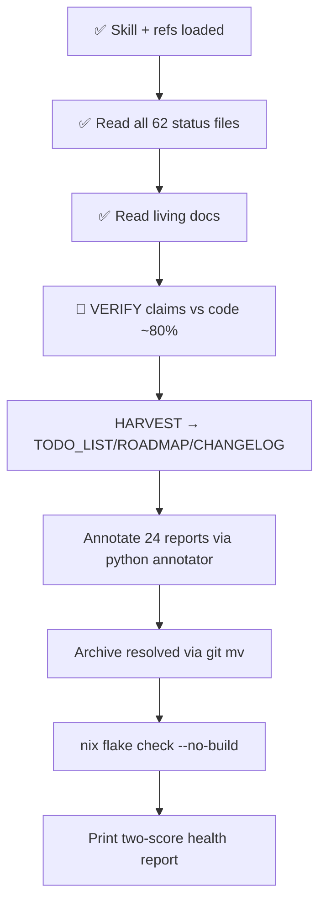

# Docs-Health Audit — Continuation Plan & Working State

**Created:** 2026-08-18 20:58 CEST
**Mandate:** View ALL `docs/status/2026-08-1*` (62 files), execute the **docs-health AUDIT** (BUILD + HARVEST + VERIFY + ANNOTATE + ARCHIVE), make TODO_LIST / CHANGELOG / AGENTS / ROADMAP / FEATURES superb, and **archive fully-done + inline-annotated files**.
**Skill:** `~/.config/crush/skills/docs-health/SKILL.md` — annotation grammar: inline `~~item~~ done at \`hash\`` is MANDATORY (appendix-only = #1 failure mode); open items left untouched (absence of marker = open); annotate-THEN-`git mv`; never renumber; cite hashes.

---

## Execution Graph

---

## 1. Completed Steps

1. ✅ Skill + 4 references loaded (harvest-guide, resolving-items, annotation-placement, verify-checklist, health-report-format)
2. ✅ All 62 status files read (incl. the concurrent session's new `2026-08-18_20-52`)
3. ✅ Living docs read: TODO_LIST.md (225 lines), CHANGELOG.md (153K), AGENTS.md (153K), ROADMAP.md (11K), FEATURES.md (93K)
4. 🔄 VERIFY ~80% done — concrete findings below

---

## 2. Verified Findings (code-checked, NOT report-trusted)

### 2.1 Confirmed-still-live bugs → HARVEST to TODO_LIST (source: 15-03 report)

- `modules/nixos/services/papdashboard.nix:102` — `journalUnits` default still `dns-blocker.service` (WRONG; repo canonical is `dnsblockd.service` → one evidence source silently empty in production)
- `papdashboard.nix:164` — pointless `TimeoutStartSec = "2min"` still present (worse-than-default; global 3min applies)
- **Zero** papdashboard checks in `scripts/post-deploy-check.sh` AND `scripts/pre-deploy-check.sh` (grep count 0)
- ✅ backup-coordination entry EXISTS (`platforms/nixos/system/configuration.nix:388`) — 15-03 item f.3 is DONE, do NOT harvest

### 2.2 Other verified gaps

- `crm.home.lan` NOT in post-deploy-check external checks (20-38 report c.3) — confirmed real
- CHANGELOG `[Unreleased]` missing entries:
  - **llama-server VRAM/ROCm session-vars fix** (17-42 report; `ai-stack.nix` `rocmEnv //` sessionVariables + `llama-server-rocm` wrapper; deployed via 20-52's deploys)
  - **Gatus OSS websites ×20 checks** (16-33 report; `gatus-config.nix` `ossWebsites` + `mkWebsiteCheck`; committed + deployed)
- FEATURES.md missing rows:
  - **PapDashboard** (port 8088, `alerts.home.lan`, LIVE, ingest verified 200s since 20-52 fix)
  - **google-sync** (ships disabled, placeholder sops scaffold)
  - **bank-sync** (verify enable state: commits `e3995077`/`4f1fe4bb` re-enabled with split-key sops)
  - **FastFlowLM module** (only the `systemnix-npu` dashboard row exists; as-built = `Accept=true` socket + `fastflowlm@.service` socat bridge, NOT socket-proxyd)
- TODO_LIST structural violations (skill: done items NEVER stay):
  - 8 `[x]` items present → DELETE (they live in CHANGELOG): P0 "Deploy google-sync disable + 226 fix", P0 "Scrub-result Gatus coverage /data", P1 "immich database backup health", P1 "Bump overview past a9321f0", P2.5 "sops assertion null-coercion", P7 "NPU utilization", P7 "FastFlowLM package+module+socket activation"
- **16 old-chain files annotated on 08-17 but NEVER archived** (git mv was queued behind `.git/index.lock`, then forgotten):
  `08-12_20-52`, `08-14_{10-00, 12-30, 15-24, 16-20, 18-29, 18-31, 20-12, 20-31, 20-35, 20-52}`, `08-15_{01-34, 01-44, 21-46, 22-05, 22-25}` → archive now with plain `git mv`
- 4 HTML reports (16-16 03-47/03-48/03-50, 17-15-31): deliberately un-annotated — correct per prior-pass convention (HTML annotation out of scope for the strikethrough grammar); LEAVE ALONE
- AGENTS.md = 153KB (skill threshold: FAIL >100KB) — compression session already tracked in TODO_LIST docs-debt; do NOT start in this pass (too large)

---

## 3. Remaining Work (in order)

### Step E — HARVEST → living docs

**TODO_LIST additions (~12 items, each with `file:line`-style evidence + report source):**

| Item | Source report |
|---|---|
| papdashboard: fix journalUnits default → `dnsblockd.service` + remove pointless TimeoutStartSec | 15-03 §d |
| papdashboard: pre/post-deploy-check coverage (port 8088, `/api/health` 200, ingest 401-unauthenticated) | 15-03 §f.4 |
| Add `crm.home.lan` (enable-gated) to post-deploy external checks | 20-38 §c.3/f.3 |
| sops manifest check-mode (`sops-install-secrets -check-mode`) in pre-deploy-check | 20-38 §e.1/f.4 |
| Twenty ENCRYPTION_KEY rotation decision + digest-pin twenty-postgres/redis (user-decision flavor) | 20-38 §c.1/c.2/f.6-7 |
| Upstream OTel instrumentation for overview + PMA (env wired ≠ instrumented; 0 spans ever) + phantom-telemetry Gatus detection | 02-38 |
| PMA commit-failure + journald-staleness Gatus checks (171 failures invisible; frozen journald blinded diagnosis) | 13-53 §e.2-3 |
| Rogue git-identity audit all repos (`noreply@anthropic.com`, `unknown@example.com`, `Claude`) + make global identity declarative + CV rewrite decision (162 Crush commits) | 13-53 §b/f |
| Gatus HTTP-method-uppercase lint (eval-time or pre-commit; the `post`→405 class) + synthetic ingest health probe + smoke enable-gate audit (`test -e` pattern) | 20-52 §e.3/7, §f.9/18 |
| FastFlowLM smoke: assert model NAME in `/v1/models` body + idle-check unit test (age math + instance guard) | 19-56 §e.3/f.21-22 |
| Sweep ALL LarsArtmann Go repos for `InvokeNamed[interface]` on concrete do registrations (samber/do trap class) | 02-27 §f.28 |
| deploy-window journal anchoring (`--since` = generation mtime) + retry/backoff on external HTTP checks | 20-38 §e.6-7 |

**TODO_LIST deletions:** the 8 `[x]` items above. **Header update:** new `Updated:` line citing this pass.

**CHANGELOG `[Unreleased]` additions:** llama-server ROCm session vars + wrapper (Fixed); Gatus OSS websites ×20 (Added). Verify data-to-pool/atticd entry exists (grep `atticd` in Unreleased — believed present).

**FEATURES.md:** add PapDashboard row (FULLY_FUNCTIONAL), google-sync row (PLANNED — ships disabled), bank-sync row (verify enable state first), FastFlowLM row update (as-built socat architecture).

**ROADMAP.md:** add shared `services.rocm-gpu` NixOS module idea (17-42 §C.5); OTel instrumentation theme (02-38).

### Step F — ANNOTATE 24 un-annotated reports

Use the **python annotator pattern** (proven 08-17): regex-strike numbered items, assert edit counts, fail loudly on mismatch. Files:

- 08-17: `16-33`, `16-37`, `21-05`, `21-32`, `22-46`, `22-47`, `22-55`, `22-56`
- 08-18: `00-00`, `00-40`, `01-34`*, `02-15_homepage`, `02-15_manifest`, `02-27`, `02-36`, `02-38`, `02-48`, `12-37`, `13-14`*, `13-33`, `13-38`, `13-51`, `13-53`, `14-51`, `14-52`, `15-03`, `17-42`, `17-44`, `19-45`, `19-56`, `20-38`, `20-52`, `signoz-vs-victoriametrics-research`

(*01-34 and 13-14 already carry addenda resolving their questions — light annotation + archivable)

**Known resolution facts from cross-reading (use as `done at` evidence):**
- 17-55 "deployed and active" = dead endpoint (corrected 08-18, socat rework `c6f91f33`/`99301327`)
- 13-22 all three bugs fixed + deployed; wedged-stc shipped; smoke live
- 19-56 pending batch (idle-check, gotenberg http://, paperless smoke) → deployed by 20-52 deploy #2; ingest 405 fixed by 20-52 (two stacked bugs)
- 20-38 twenty v2.32 DONE, issue #138 closed; dump-to-/tmp lesson; c.1-c.5 open → harvest
- 19-45 keys redacted + gitleaks rules live (`4d5270fd`, `85f41a62`, `ca61772e` pushed); user actions (rotate Resend/Synthetic/Context7, push purge) remain open
- 17-42 eval-verified only → 20-52 deploys shipped it; runtime verify + visionreviewd/hermes rocmEnv audit still open
- 12-37 + 08-15 root-cause fixes → deployed 13-51/14-52 sessions; guard + CI negative test permanent
- 13-53 journald frozen (user restart needed), Crush identity contained; remediation partially done (§a) — b/c items open → harvest
- 16-33 deployed via `e5edf0bd` sweep + later deploys; broken-3 sites → untracked/user (terraform apply, firebase deploy)
- 02-48/01-34: timer stopped 01:21:28 (system-686); sops scaffold done; go-live remains TODO_LIST P0

### Step G — ARCHIVE

1. The 16 old-chain files (annotated 08-17, moves never ran) — plain `git mv docs/status/<f> docs/status/archived/<f>`
2. Newly fully-resolved candidates (ONLY if EVERY numbered item has a verdict): 17-55, 18-13-22, 18-20-38, 18-02-27, 18-19-45, 18-01-34, 18-13-14
3. Keep live any file with genuinely open P0s / unresolved user questions that are NOT yet routed

### Step H — Quality gate

`nix flake check --no-build` — markdown-only edits (no .nix touched) → should stay green. Concurrent session has AGENTS/CHANGELOG/gatus-config changes in tree — NOT mine, never revert; re-read before every edit (mid-edit race rule).

### Step I — Health report

Print inline two-score report (Accuracy / Fitness) with visible math, per-doc findings table, no invented baseline (cite the 08-17 pass prose baseline only if needed — mark as "first machine-scored pass" otherwise).

---

## 4. Constraints

- Concurrent session ACTIVE (tree changes: AGENTS.md, CHANGELOG.md, gatus-config.nix modified + 20-52 report added — foreign work, flag not touch)
- No .nix edits planned in this pass → low collision risk
- Annotate-THEN-move ordering; one `done at` per item; never renumber
- `trash` not `rm`; `git mv` not `mv`; 2-space indent; never force-push
- Report date context: 2026-08-18 evening

---

*Pick up at Step E (HARVEST). Everything above is verified state, not intent.*
