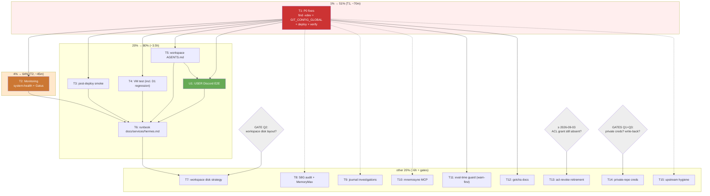

# Hermes Projects Access — Hardening & Completion Plan (Pareto)

> **EXECUTED 2026-08-20 ~10:45** (session report: `docs/status/2026-08-20_10-45_hermes-hardening-plan-execution-status.md`): T1–T6, T8–T13.1, T15 DONE and deployed/verified (VM test green, Gatus green, smoke 65/0). T1/D1 was fixed by a concurrent session (`962d433d`) — and the "dormant" landmine turned out to be a REAL outage (09:18→09:35). Remaining: U1 (user Discord E2E), T7 (GATE Q2), T14 (GATES Q1+Q3), T13.2 (time-gated ≥2026-09-03).

**Created:** 2026-08-20 09:18 · **Source:** `docs/status/2026-08-20_09-15_hermes-projects-readonly-access-status.md` (§a–g) · **Scope:** ALL follow-up work from the 2026-08-20 session that shipped `services.hermes.projectsDir` (RO bind mount). NOT a general SystemNix backlog plan — unrelated TODO_LIST items are out of scope.

**Format note:** user requested `.md` + mermaid — overrides the pareto-planning skill's HTML default.

---

## 0. Context (what this plan completes)

The Hermes agent gateway now sees `/home/lars/projects` **read-only** at `/home/hermes/workspace/projects` (kernel-enforced `BindReadOnlyPaths`, verified live via `/proc/<pid>/mountinfo`). The stale, mask-killed home-ACL grant was revoked; hermes was dropped from `users`. Terminal lands in `/home/hermes/workspace` (`TERMINAL_CWD`), upstream `write_file`/`patch` are confined by `HERMES_WRITE_SAFE_ROOT=/home/hermes`. Deploy: 63 PASS / 0 FAIL.

**But the self-review found the feature shipped with two real defects and five gaps:**

| # | Defect/Gap | Severity |
|---|---|---|
| D1 | `hermes-fix-permissions` does `chown -R /home/hermes`; the RO bind is inside the namespace BEFORE ExecStartPre → any stateDir perm drift = chown EROFS = crash-loop to start-limit-hit. Also the two `find … -exec chmod` walks cross the bind over ~100k foreign files. | **P0 landmine (dormant)** |
| D2 | Repos on the bind are owned by `lars`, gateway runs as `hermes` → git ≥2.35.2 refuses ALL git ops (`dubious ownership`). Feature is half-useless until fixed. | **P0 broken** |
| G1 | Hermes has ZERO Gatus/system-health monitoring (pre-existing, but new failure surface added). | P1 |
| G2 | No post-deploy smoke for the bind/gitconfig (silent regression class). | P1 |
| G3 | No VM test; the module has 5 moving parts (bind, env ×3, conditional tmpfiles, revoke script). | P1 |
| G4 | Agent clones accumulate in `/home/hermes/workspace` inside btrbk-snapshotted `@` on the 95%-gated root fs; `/home/hermes` already 58G. | P1 |
| G5 | Agent has no instructions (`AGENTS.md` in workspace) and there is no runbook (`docs/services/hermes.md`). | P2 |
| G6 | 3 open user decisions (private-repo creds, workspace disk layout, write-back policy) + 4 small investigations (mnemosyne MCP, slash-sync timeout, 09:09 exit-1, quickshell WARN line). | P2 |

**Goal:** hermes projects access is safe (no landmines), useful (git works), observable (monitoring + smoke), durable (VM-tested), and sustainable (disk strategy + docs).

---

## 1. Pareto Breakdown

### The 1% that delivers 51% of the result — **DO FIRST, ~70min total**

> **T1: The two P0 fixes in one module edit + one deploy.**
> `find -xdev` (kills the D1 crash landmine) + `GIT_CONFIG_GLOBAL` with `[safe] directory` (un-breaks ALL git tooling, D2). One edit, one deploy, one verification pass. After T1 the feature is: safe + useful.

### The 4% that delivers 64% — **+ ~45min**

> **T2: Monitoring wiring** (`system-health` monitoredServices + Gatus unit-state checks, fastflowlm pattern). If the bind, the revoke script, or the env ever breaks, Discord alerts instead of silence. This is the repo's "silent failures are unacceptable" rule applied to the new surface.

### The 20% that delivers 80% — **+ ~3.5h**

> **T3 post-deploy smoke** (regression tripwire per deploy) + **T4 VM test** (regression-proof forever, incl. a D1 regression test) + **T5 workspace AGENTS.md** (the agent stops discovering rules by failing) + **U1 user Discord E2E** (the only true functional proof) + **T6 runbook** (knowledge out of my head into the repo).

### The other 20% of the result — **the long tail, ~5–6h + gates**

> **T7** workspace disk strategy (gated), **T8** `/home/hermes` 58G audit + MemoryMax review, **T9/T10** investigations (09:09 exit, quickshell line, slash-sync, mnemosyne), **T11** eval-time chown-vs-bind guard (generalizes D1 beyond hermes), **T12** gotchas archive + global ACL lesson, **T13** acl-revoke retirement, **T14** private-repo creds (gated), **T15** upstream notes/PR outline, **U-GATE decisions** (questions 1–3).

**Effort↔value shape:** the 1% tier is two lines of Nix and a deploy. Everything after T6 is insurance and polish — valuable, but the feature is production-complete at the 80% mark.

---

## 2. Medium Plan (tasks of 30–100min) — sorted by importance/impact/effort

| ID | Task | Impact | Effort | Tier | Depends / Gate |
|----|------|--------|--------|------|----------------|
| T1 | **P0 fixes:** `find -xdev` in fixPermissions + `GIT_CONFIG_GLOBAL` safe.directory + deploy + verify | 5 | 60m | 1% | — |
| T2 | **Monitoring:** hermes into system-health monitoredServices + Gatus (`system_service_state` active/failed/start-limit, fastflowlm pattern; NO HTTP probe) | 5 | 45m | 4% | T1 (avoid double restart) |
| T3 | **Post-deploy smoke:** hermes section in `scripts/post-deploy-check.sh` — gateway-PID mountinfo shows `workspace/projects … ro`; gitconfig file exists; SKIP when disabled | 4 | 30m | 20% | T1 |
| T4 | **VM test** `tests/test-hermes.nix`: RO enforced (write→EROFS), `projectsDir=null` → no bind/env, env ×3 propagation, acl-revoke idempotent, fixPermissions-with-drift + bind = no EROFS failure (D1 regression test) | 5 | 100m | 20% | T1 |
| T5 | **Workspace `AGENTS.md`** delivered into stateDir (clobber-safe, once-only write): `./projects` is RO, clone into `./`, never edit the bind, git ownership note | 4 | 30m | 20% | T1 |
| U1 | **USER: Discord E2E** — ask hermes to read `projects/SystemNix/flake.nix` + run `git -C ./projects/SystemNix log -1` (expect success post-T1) | 5 | 10m | 20% | T1, T5 |
| T6 | **Runbook** `docs/services/hermes.md`: module map, options semantics, clone workflow, D1 landmine history, ops commands; cross-link AGENTS.md; document `HERMES_WRITE_SAFE_ROOT` + PrivateTmp scratch semantics | 3 | 45m | 20% | T1–T5 (document final state) |
| T7 | **Workspace disk strategy** (GATE Q2): recommend sibling subvolume `@hermes-workspace` (excluded from `@` snapshots AND pool sends by construction — the `@nix` lesson, zero btrbk changes) + migration oneshot for existing content + mount wiring | 4 | 100m | tail | **GATE Q2** |
| T8 | **`/home/hermes` 58G audit + MemoryMax review:** user-run `du` script (stateDir is 2770 hermes-only — lars cannot traverse); evaluate `MemoryMax=24G` vs OOM-storm era reality (GPU mapping ≠ RSS — document, don't blind-cut) | 3 | 30m | tail | — |
| T9 | **Journal investigations:** (a) confirm 09:09:32 `status=1/FAILURE` was the clean `--replace` stop of the old process; (b) read the 1 quickshell WARN line; (c) grep for `Slash command sync timed out` repro context | 2 | 30m | tail | — |
| T10 | **mnemosyne MCP:** find its config source (stateDir config.yaml/env), check upstream hermes-agent for the expected endpoint, fix or document the park | 2 | 30m | tail | — |
| T11 | **Eval-time guard:** lint ExecStartPre script texts for recursive `chown -R`/`find -exec chmod` lacking `-xdev` on units WITH `Bind*Paths` — start WARNING-only in flake check (do not break other modules); promote to assert after a clean cycle | 3 | 100m | tail | T1 (pattern proven) |
| T12 | **Docs — gotchas:** global AGENTS.md line ("never grant service access via home-dir ACLs — bind-mount; masks die on chmod"); `docs/gotchas-archive.md` entries ×2 (ACL-mask kill; chown-vs-bind namespace ordering) with dates + repro | 3 | 30m | tail | — |
| T13 | **acl-revoke retirement:** grace trigger (2 clean weeks / one verify command `getfacl` shows no entry), then delete script + ExecStartPre line + eval + deploy | 1 | 30m | tail | date ≥ 2026-09-03 |
| T14 | **Private-repo creds** (GATE Q1+Q3): read-only deploy key or fine-grained PAT → sops (public-key encrypt, no sudo) → hermes env + `core.sshCommand`/`insteadOf` in the safe-directory gitconfig → clone-verify ONE private repo from workspace | 4 | 60m | tail | **GATE Q1, Q3** |
| T15 | **Upstream hygiene:** flake-input comment documenting the `resolve_placeholder_terminal_cwd` env dependency (re-verify on input bump); outline upstream issue/PR for the projectsDir RO-bind pattern in hermes-agent's NixOS module; TODO for TERMINAL_CWD→config.yaml migration when upstream offers generated config | 1 | 30m | tail | — |

**Totals:** 16 tasks · ~12.5h estimated (incl. 100m×3 big ones) · 2 implementation gates + 1 user-action gate.

---

## 3. Micro Plan (tasks ≤12min each) — sorted by importance/impact/effort

**T1 — P0 fixes (1%→51%)**

| # | Microtask | Est |
|---|-----------|-----|
| 1.1 | Read `fixPermissionsScript`; rewrite chown + both chmod `find`s as `find /home/hermes -xdev …` variants (chown: `find -xdev -exec chown` instead of `chown -R`) | 12m |
| 1.2 | Add `hermesGitConfig` derivation (`pkgs.writeText` with `[safe] directory = "/home/hermes/workspace/projects"`) + `GIT_CONFIG_GLOBAL=` env in hermes.nix (gated on projectsDir) | 12m |
| 1.3 | Eval spot-checks: `Environment` contains `GIT_CONFIG_GLOBAL`; built script text contains `-xdev` (grep the store path) | 8m |
| 1.4 | `nix flake check --no-build` | 5m |
| 1.5 | `nix run .#deploy` | 20m |
| 1.6 | Runtime verify: journal clean start (no EROFS/chown lines), `/proc/<gateway-pid>/mountinfo` still shows the `ro` bind | 12m |

**T2 — Monitoring (4%→64%)**

| # | Microtask | Est |
|---|-----------|-----|
| 2.1 | Read how fastflowlm is wired in `system-health.nix` + `gatus-config.nix`; confirm metric names (`system_service_state`, `system_service_start_limit_hit`) | 10m |
| 2.2 | Add `hermes` to monitoredServices in system-health.nix | 6m |
| 2.3 | Add Gatus endpoint(s): hermes service active + not-start-limit, Discord alerting, fail-closed pat()s | 12m |
| 2.4 | Eval + `gatus-pattern-lint` clean | 8m |
| 2.5 | Deploy + verify endpoint green (gatus journal / sqlite, NOT the OIDC API) | 12m |

**T3 — Post-deploy smoke (20% tier)**

| # | Microtask | Est |
|---|-----------|-----|
| 3.1 | Add hermes section to `post-deploy-check.sh`: pgrep gateway PID → mountinfo grep `workspace/projects` + ` ro,`; PASS/FAIL/SKIP-when-absent | 12m |
| 3.2 | Add gitconfig-presence check (`test -f` on the store path is static; instead assert env var exists in `/proc/<pid>/environ`) | 10m |
| 3.3 | Exercise the section against the live service (run script standalone) | 8m |

**T4 — VM test (20% tier)**

| # | Microtask | Est |
|---|-----------|-----|
| 4.1 | Read `tests/` + `test-helpers.nix` conventions | 10m |
| 4.2 | Skeleton: enable hermes + projectsDir → tempdir with a fake repo (git init, file) | 12m |
| 4.3 | Assert: write through `/home/hermes/workspace/projects/...` → EROFS | 12m |
| 4.4 | Assert: `projectsDir = null` variant → no BindReadOnlyPaths, no TERMINAL_CWD/SAFE_ROOT/GIT_CONFIG_GLOBAL in unit env | 10m |
| 4.5 | Assert: env vars present in default variant (read unit config) | 8m |
| 4.6 | Assert: acl-revoke second start = no-op (idempotent) | 10m |
| 4.7 | Assert: simulate stateDir perm drift → run fixPermissions → unit still starts, NO EROFS in journal (D1 regression) | 12m |
| 4.8 | `nix run .#test`-style run; fix flakes until green | 20m |

**T5 — Workspace AGENTS.md (20% tier)**

| # | Microtask | Est |
|---|-----------|-----|
| 5.1 | Choose clobber-safe delivery: `ExecStartPre` `test -f … || install` (once-only; user edits survive deploys) — NOT tmpfiles `f` (would clobber) | 10m |
| 5.2 | Write content: `./projects` = read-only mirror of lars' checkouts; clone into `./`; never edit inside `./projects`; git ownership handled; write scope = stateDir | 10m |
| 5.3 | Wire + eval + verify file appears on next start | 10m |

**U1 — User E2E (gate)**

| # | Microtask | Est |
|---|-----------|-----|
| U1 | Discord: hermes reads `projects/SystemNix/flake.nix`; runs `git -C ./projects/SystemNix log -1` and `git clone ./projects/SystemNix ./systemnix-clone && ls` | 10m |

**T6 — Runbook (20% tier)**

| # | Microtask | Est |
|---|-----------|-----|
| 6.1 | Write `docs/services/hermes.md` (structure: overview, options, access model, workflow, landmine history, ops) | 25m |
| 6.2 | Document `HERMES_WRITE_SAFE_ROOT` semantics + PrivateTmp scratch note + the cosmetic TERMINAL_CWD warning ("do not fix") | 8m |
| 6.3 | Cross-link from AGENTS.md Hermes section + `modules/nixos/services/README.md` if it indexes docs | 10m |

**T7 — Workspace disk (tail, GATED)**

| # | Microtask | Est |
|---|-----------|-----|
| 7.1 | **GATE Q2** — user picks: sibling subvolume (recommended) / relocate to `/data` / quota+GC | user |
| 7.2 | Implement mount: `@hermes-workspace` subvol at `/home/hermes/workspace` (user creates subvol — sudo; mount via mkFilesystem helper) | 20m |
| 7.3 | Migration oneshot: move existing workspace content into subvol (rsync, idempotent) | 12m |
| 7.4 | Verify sibling exclusion: `@` btrbk snapshot + pool send contain NO workspace paths | 10m |
| 7.5 | Deploy + verify hermes starts against the new mount; bind still overlays correctly | 12m |

**T8 — 58G audit + MemoryMax (tail)**

| # | Microtask | Est |
|---|-----------|-----|
| 8.1 | Write a one-liner user-run audit command (`sudo du -x -d2 /home/hermes …` + biggest files); collect output | 8m |
| 8.2 | Classify contents (state.db / sessions / caches / models); map reduction levers | 12m |
| 8.3 | MemoryMax=24G review: document GPU-mapping vs RSS reasoning; propose value; DO NOT change without evidence | 10m |

**T9 — Journal investigations (tail)**

| # | Microtask | Est |
|---|-----------|-----|
| 9.1 | Confirm 09:09:32 exit-1 = old-process `--replace` stop (grep surrounding lines for shutdown/replace semantics) | 8m |
| 9.2 | Read the quickshell WARN line from the deploy window; classify benign/real; benign → note, real → TODO | 12m |
| 9.3 | `Slash command sync timed out`: locate occurrences, note deploy/first-boot context, decide if still live | 10m |

**T10 — mnemosyne MCP (tail)**

| # | Microtask | Est |
|---|-----------|-----|
| 10.1 | Find mnemosyne config (stateDir config.yaml / env / bundled default) | 12m |
| 10.2 | Check hermes-agent source for what mnemosyne is + expected endpoint | 10m |
| 10.3 | Fix (config) or document (upstream/broken) the park; record in runbook ops section | 8m |

**T11 — Eval-time guard (tail)**

| # | Microtask | Est |
|---|-----------|-----|
| 11.1 | Survey how timeout-audit/otel-audit iterate units; design script-text lint (chown -R / find -exec chmod without -xdev on Bind*Paths units) | 20m |
| 11.2 | Implement as WARNING first (eval-time `warn`, not `throw`) | 20m |
| 11.3 | Negative-test: throwaway eval with a violation → warning fires | 10m |
| 11.4 | Run full `nix flake check --no-build`; ensure zero new noise; note promote-to-assert date | 15m |

**T12 — Gotcha docs (tail)**

| # | Microtask | Est |
|---|-----------|-----|
| 12.1 | Add global AGENTS.md gotcha line (home-dir ACLs vs bind mounts) | 8m |
| 12.2 | Write gotchas-archive entry 1: ACL-mask kill (mechanism, repro, fix) | 10m |
| 12.3 | Write gotchas-archive entry 2: chown/chmod vs bind-namespace ordering (D1) | 12m |

**T13 — acl-revoke retirement (tail, time-gated)**

| # | Microtask | Est |
|---|-----------|-----|
| 13.1 | Add dated TODO (≥2026-09-03) + verify command (`getfacl /home/lars | grep hermes` empty) | 5m |
| 13.2 | Delete script + ExecStartPre entry + eval + deploy (when gate passes) | 15m |

**T14 — Private-repo creds (tail, GATED)**

| # | Microtask | Est |
|---|-----------|-----|
| 14.1 | **GATES Q1+Q3** — user decides scope (read-only forever?) and mechanism (deploy key vs PAT) | user |
| 14.2 | sops: encrypt secret with public key (no sudo), add guard + template/env wiring in hermes.nix | 12m |
| 14.3 | Extend the safe-directory gitconfig with `insteadOf`/`core.sshCommand` for private fetches | 12m |
| 14.4 | Deploy + clone-verify ONE private repo from the workspace (user-provided secret value) | 15m |

**T15 — Upstream hygiene (tail)**

| # | Microtask | Est |
|---|-----------|-----|
| 15.1 | Flake-input comment: env-cwd semantics depend on `resolve_placeholder_terminal_cwd` behavior — re-verify on bump | 8m |
| 15.2 | Draft upstream issue/PR outline for projectsDir RO-bind pattern | 12m |
| 15.3 | TODO: migrate TERMINAL_CWD → generated config.yaml when upstream supports it (kills cosmetic warning) | 5m |

**Totals:** 55 microtasks · ~12.5h · every microtask ≤12m except the two inherently-long deploys/test-runs (1.5, 4.8) which are single commands with wait time.

---

## 4. Execution Graph

**Critical path:** T1 → T2 → (T3,T4,T5 ∥) → U1 → T6 → T7(gated). T8–T15 are parallelizable side-quests; T4/T11 both encode the D1 lesson (runtime test vs eval-time lint — complementary layers, not duplicates).

---

## 5. Decision Gates (my recommendations, NEED USER)

| Gate | Question | Recommendation | Why |
|------|----------|----------------|-----|
| **Q1** | Private-repo clone creds for hermes? | **Yes, read-only fine-grained PAT** (or deploy key), scope: LarsArtmann private repos, RO | Enables clone-to-workspace on private code; RO bounds blast radius |
| **Q2** | Workspace disk layout? | **Sibling subvolume `@hermes-workspace`** mounted at `/home/hermes/workspace` | Excluded from `@` snapshots AND pool sends by construction (the `@nix` lesson, zero btrbk changes); NOT `/data` (has the un-repaired corruption); stays NVMe-fast |
| **Q3** | May hermes ever push branches/PRs? | **No — permanently read-only for now** | No write creds to revoke later; revisit only if a concrete workflow demands it |

## 6. VERSCHLIMMBESSER Guardrails (do NOT)

- **No module restructuring** — hermes.nix keeps its current shape; T1 is surgical edits.
- **Do NOT "fix" the cosmetic `TERMINAL_CWD found in .env` warning** by injecting config.yaml — it is runtime-owned; injecting it split-brains hermes settings.
- **Do NOT re-add any ACL on `/home/lars`** — masks die on the next chmod; the bind mount is the mechanism.
- **No write access, no credentials** without Q1/Q3 approval.
- **T11 ships WARNING-only** — never break `nix flake check` for other modules on day one.
- **No raw `nixos-rebuild`**, always `nix run .#deploy`; no manual unit activation.
- **T8/T9/T10 are investigations** — read-only unless a fix is trivial and local to hermes.
- **Don't touch unrelated services** (the quickshell WARN line gets classified, not "repaired").

## 7. Definition of Done (all tiers)

1. D1 + D2 fixed, deployed, runtime-verified (journal clean, mount `ro`, git works as hermes).
2. Gatus alerts on hermes failure; post-deploy smoke guards the bind every deploy.
3. VM test green including the D1 regression scenario.
4. Agent reads workspace AGENTS.md; user E2E passed via Discord.
5. Runbook exists; gotchas archived; global ACL lesson in AGENTS.md.
6. Gates resolved: workspace disk strategy implemented; creds decision executed or explicitly declined.
7. TODO_LIST updated from execution results (docs-health HARVEST pattern).
