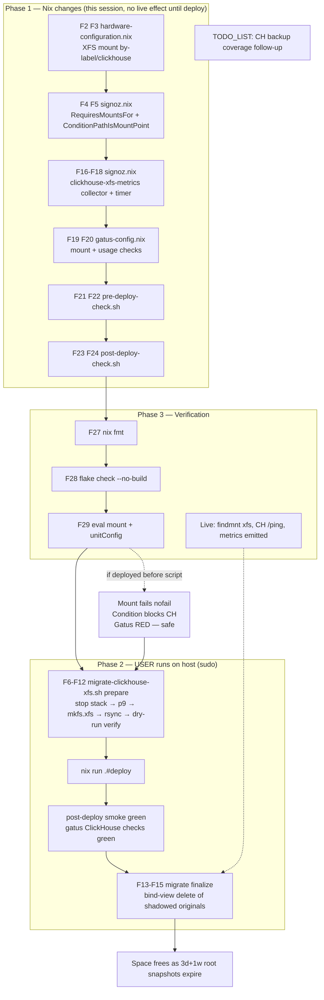

# ClickHouse → dedicated XFS partition (NVMe tail) — Execution Plan

**Date:** 2026-08-22 02:38
**Status:** Approved for execution (this session)
**Decision recap:** Convert the ~100 GiB unallocated NVMe tail (left when p9 `/rust-cache` was deleted) into a dedicated XFS partition mounted at `/var/lib/clickhouse`, and move ClickHouse (SigNoz telemetry store) onto it.

## Why (from the analysis)

| Fact                                                                                  | Consequence                                                                                                                    |
| ------------------------------------------------------------------------------------- | ------------------------------------------------------------------------------------------------------------------------------ |
| Root `@` is 96% full (36 GiB avail of 723 GiB)                                        | Chronic space crisis; every GiB matters                                                                                        |
| ClickHouse data lives on root `@` (BTRFS CoW)                                         | Merge/TTL churn = write-amplified CoW extent churn on QLC NAND                                                                 |
| btrbk root snapshots (3d+1w local, **forever** pool-side) pin every CH-written extent | Pool receives carry telemetry churn forever; root space frees only as snapshots expire                                         |
| `/data` has an unresolved EIO-corrupt extent                                          | Growing `/data` into the gap is off the table until repaired                                                                   |
| ClickHouse is merge-heavy, columnar, self-compressing (LZ4/ZSTD per column)           | XFS (parallel allocation groups, no CoW) is the reference fs for CH; FS-level compression on pre-compressed data buys ~nothing |

**Rejected alternatives:** XFS+lz4 (does not exist — XFS has no transparent compression), ZFS lz4 (third fs stack + ARC RAM pressure on an oomd-sensitive box), growing `/data` (EIO corruption), BTRFS subvol (keeps CoW + QLC amplification — the thing we're removing).

**Accepted tradeoffs:**

- ClickHouse data drops out of btrbk snapshots entirely → telemetry has **no backup coverage**. Follow-up task (TODO_LIST): decide on `clickhouse-backup`/FREEZE→pool. Telemetry is derived data; acceptable gap for now.
- XFS **cannot shrink**. 100 GiB is ample (52 GiB was the pre-TTL-cleanup high-water mark; current is far lower).
- `btrfs-health` metrics don't apply to XFS — a dedicated textfile collector + Gatus checks replace that coverage (buildcache pattern).
- Root space frees **gradually** as 3d+1w root snapshots expire after the old dir is deleted — not instantly.

## Safety design (the anti-verschlimmbesser rails)

1. **No root-fs contamination:** `clickhouse.service` gets `RequiresMountsFor=/var/lib/clickhouse` + `ConditionPathIsMountPoint=/var/lib/clickhouse`. If the XFS mount is absent (partition missing, fs corrupt, device renamed), ClickHouse **refuses to start** — it can never silently write telemetry into the root fs underneath the mountpoint. The mount uses `nofail` (boot proceeds; gatus alerts on the dead stack instead of an emergency shell).
2. **Self-wiring, zero breakage on other hosts:** the dependency is gated on `builtins.hasAttr "/var/lib/clickhouse" config.fileSystems` — hosts that don't declare the mount (VM tests, future hosts) keep today's behavior exactly.
3. **Zero ClickHouse config drift:** mounting AT `/var/lib/clickhouse` keeps the nixpkgs default dataDir and the embedded-keeper paths (`coordination/log`, `coordination/snapshots`) valid verbatim. No ClickHouse config changes at all.
4. **Fail-closed monitoring:** the metrics collector ALWAYS writes the `.prom` file (absent drive ⇒ `clickhouse_xfs_mounted 0` ⇒ Gatus RED, never a stale phantom green — buildcache doctrine). Mount presence gates on **real I/O** (`timeout 15 ls -A`), not mount-table presence (zombie-mount lesson).
5. **Migration order:** stop stack → rsync → **rsync dry-run delta as verification** (0 transferred = byte-identical) → only then deploy. Old originals stay shadowed under the mount until an explicit `finalize` phase deletes them through a `--bind /` view after health checks.
6. **Deploy-before-script is safe:** with no by-label device, the mount fails, `nofail` keeps boot going, the Condition blocks ClickHouse, Gatus fires "ClickHouse down". Recovery = run the script, deploy again. No data written to root.

## Pareto breakdown

- **The 1% that delivers 51%:** the `fileSystems."/var/lib/clickhouse"` XFS entry + the service mount-gating + the migration script. This IS the migration; nothing else matters without it.
- **The 4% that delivers 64%:** fail-closed monitoring (collector + 2 Gatus checks). Repo doctrine: silent failures are unacceptable — an ungated mount would trade one failure class for another.
- **The 20% that delivers 80%:** deploy integration (pre-deploy device check, phantom-metric allowlist, post-deploy smoke) + durable docs (AGENTS.md).
- **The other 20% (to 100%):** backup coverage for CH data (follow-up, TODO_LIST), VM test (declined — needs a real disk layout; eval + live smoke cover it), moving `/var/lib/signoz` (declined — 1.8 MB SQLite, not worth a second mount), fstrim coverage (already global, XFS included).

## Medium-granularity tasks (30–100 min each)

| #   | Task                                                                                                           | Impact   | Effort | Tier |
| --- | -------------------------------------------------------------------------------------------------------------- | -------- | ------ | ---- |
| M1  | Write this plan doc                                                                                            | —        | 20m    | 1%   |
| M2  | `hardware-configuration.nix`: XFS mount entry (`by-label/clickhouse`, nofail+noatime+nodiscard)                | Critical | 20m    | 1%   |
| M3  | `signoz.nix`: self-wiring mount gating on `clickhouse.service` (RequiresMountsFor + ConditionPathIsMountPoint) | Critical | 25m    | 1%   |
| M4  | `scripts/migrate-clickhouse-xfs.sh`: prepare (partition/mkfs/rsync/verify) + finalize (bind-view cleanup)      | Critical | 90m    | 1%   |
| M5  | `signoz.nix`: `clickhouse-xfs-metrics` collector + 5-min timer (buildcache pattern)                            | High     | 45m    | 4%   |
| M6  | `gatus-config.nix`: "ClickHouse Data Mount" + "ClickHouse Data Usage" checks (signoz-gated)                    | High     | 30m    | 4%   |
| M7  | `pre-deploy-check.sh`: by-label device presence + KNOWN_NEW_METRICS allowlist                                  | Med      | 20m    | 20%  |
| M8  | `post-deploy-check.sh`: FSTYPE==xfs + ClickHouse `/ping` smoke                                                 | Med      | 20m    | 20%  |
| M9  | AGENTS.md + TODO_LIST follow-up entry                                                                          | Med      | 25m    | 20%  |
| M10 | Verify: `nix fmt`, `nix flake check --no-build`, eval mount unit + service unitConfig                          | High     | 30m    | all  |
| M11 | Commit (detailed) + push                                                                                       | —        | 10m    | —    |

## Fine-grained tasks (≤12 min each)

| #   | Task                                                                                       | Parent |
| --- | ------------------------------------------------------------------------------------------ | ------ |
| F1  | Plan doc: decisions, tradeoffs, tables, mermaid graph                                      | M1     |
| F2  | hardware-configuration.nix: comment block (why XFS, why by-label, p9 history)              | M2     |
| F3  | hardware-configuration.nix: `mkFilesystem` entry, options `[noatime nodiscard nofail]`     | M2     |
| F4  | signoz.nix: `hasClickhouseDataMount` let-binding                                           | M3     |
| F5  | signoz.nix: `unitConfig` (RequiresMountsFor + ConditionPathIsMountPoint) via optionalAttrs | M3     |
| F6  | Script: arg parsing (prepare/finalize), root check, colored helpers                        | M4     |
| F7  | Script prepare: preflight (free-tail ≥90 GiB contiguous, p9 absent)                        | M4     |
| F8  | Script prepare: stop signoz.target stack, wait for clickhouse exit                         | M4     |
| F9  | Script prepare: sgdisk `-n 9:0:0 -t 9:8300` + partprobe + settle                           | M4     |
| F10 | Script prepare: `mkfs.xfs -L clickhouse` (12-char label limit!)                            | M4     |
| F11 | Script prepare: temp-mount, `rsync -aHAX --numeric-ids`, dry-run delta verify              | M4     |
| F12 | Script prepare: umount temp, print "now deploy" runbook                                    | M4     |
| F13 | Script finalize: verify XFS mounted + clickhouse answers SELECT 1                          | M4     |
| F14 | Script finalize: `mount --bind /` view, delete shadowed originals, umount                  | M4     |
| F15 | Script finalize: reminder — space frees as 3d+1w snapshots expire                          | M4     |
| F16 | signoz.nix: `clickhouse-xfs-metrics` writeShellApplication (real-I/O gated)                | M5     |
| F17 | signoz.nix: always-write `.prom` (fail-closed) + usage/over-threshold metrics              | M5     |
| F18 | signoz.nix: oneshot service + timer (5 min, Persistent), mkIf gate                         | M5     |
| F19 | gatus-config.nix: mount check (absence-of-0 + presence globs, HELP-safe)                   | M6     |
| F20 | gatus-config.nix: usage check (over_threshold 0)                                           | M6     |
| F21 | pre-deploy-check.sh: `/dev/disk/by-label/clickhouse` existence (unit-file gated)           | M7     |
| F22 | pre-deploy-check.sh: KNOWN_NEW_METRICS += clickhouse_xfs_* + removal note                  | M7     |
| F23 | post-deploy-check.sh: `findmnt -no FSTYPE` == xfs (mount-unit gated)                       | M8     |
| F24 | post-deploy-check.sh: CH `/ping` 200 on :8123                                              | M8     |
| F25 | AGENTS.md: BTRFS/Filesystems bullet + SigNoz section note                                  | M9     |
| F26 | TODO_LIST.md: clickhouse-backup coverage follow-up                                         | M9     |
| F27 | `nix fmt`                                                                                  | M10    |
| F28 | `nix flake check --no-build` (assertions + gatus lint)                                     | M10    |
| F29 | `nix eval` the mount unit + clickhouse unitConfig on evo-x2                                | M10    |
| F30 | git add (scoped) + detailed commit + push                                                  | M11    |

## Execution graph

## Post-migration state

- `/var/lib/clickhouse` = XFS on nvme0n1p9 (~100 GiB, label `clickhouse`), excluded from btrbk root snapshots and pool sends by construction (own filesystem).
- Root `@` usage drops by the CH data size once old snapshots expire.
- ClickHouse cannot start unless its data fs is mounted (no root-fs contamination path).
- Gatus watches the mount fail-closed; usage alerts at 85%.
