# PARETO Superb Execution Plan — SystemNix

**Created:** 2026-08-31 23:16 CEST · **Source:** `TODO_LIST.md` (post docs-health audit, 2026-08-31 22:57) + the audit session's 14 follow-ups
**Format:** user-requested `.md` with mermaid execution graph (status-report skill's HTML default overridden by explicit instruction — flagged)
**Rule zero:** do not VERSCHLIMMBESSER. Every task has a verify step; anything touching the running system deploys through `nix run .#deploy` and observes post-deploy smoke.

---

## Step 1 — Pareto Breakdown

### The 1% that delivers 51% (5 tasks — do these FIRST, most are USER-gated or one-action)

| # | The 1% | Why it is 51% of the value |
|---|--------|----------------------------|
| 1 | **/data EIO repair** (decision → docker-down window → inode 1331118 resolve → delete/restore → scrub verify → btrbk-data green) | The ONLY backup tier that has NEVER completed pool-side, open since Aug 17. Every night it fails is a night /data has no off-NVMe copy. Data safety = the whole point of this box. |
| 2 | **Kernel 7.2.2 reboot + flm v1.0.3 retry** | ONE reboot closes: booted==current (rollback-generation risk), the flm XRT enumeration question, the v1.0.2 SIGABRT watch, AND provides the maintenance window for #3 and the Samsung Phase-1 initial rsync. One action, four items. |
| 3 | **Root chunk-unalloc balance run** (~6.4 GiB CRITICAL) | The documented freeze precursor state. The gawk fix restored the balance jobs; the run itself is waiting for a quiet window — which #2 creates. |
| 4 | **Prevention batch A: CI executes trap-lints + shellcheck for scripts/ + unit-script binary-coverage lint** | Kills the three recurring August incident classes at the pipeline level (phantom-green lints, the awk-127 class that silently killed the ENOSPC-prevention layer for a week, unlinted scripts). Every future session inherits the protection. |
| 5 | **Alert-trust batch: KNOWN_NEW_METRICS retirement + known-outage WARN classification + website-deploy-monitor per-unit triage** | August's incidents all shared one failure: nobody trusted the red. Restoring signal fidelity (real regressions FAIL, known outages WARN with reason, stale allowlist entries gone) makes every OTHER alert actionable. |

### The 4% that delivers 64% (9 more tasks)

6. **Samsung Phase 1 — `/nix` → Samsung BTRFS** (biggest single infra win; exec-latency-under-buildstorm is the driver; rides the #2 window)
7. **Eval-time unit-shape audits** (ReadWritePaths⇒RequiresMountsFor + Persistent=true lint — the cv-226 class can never ship again)
8. **Security rotations** (Resend → Pocket ID email alive again; Context7; synthetic) — the standing P0 nag
9. **journald cap + journalctl bounds audit** (the 7.2G journal fed a sev1 desktop page for an afternoon)
10. **Gatus fail-closed batch** (niri hard-down false-negatives, flm smoke PSI-skip, user-unit pattern extension)
11. **niri-session-manager upstream + config hardening** (the terminal-storm class; upstream is the cure)
12. **deploy.sh IO-PSI gate + PSI/disk-util correlation** (crash3 + the 78%-IO deploy that got lucky)
13. **Docker retention follow-through** (deployed-unit verify, /data/docker metric + false-green detector — 5 months invisible)
14. **Docs-health defect fixes** (the audit session's own d.1-d.4 + FEATURES remainder + DOMAIN_LANGUAGE decision)

### The 20% that delivers 80% (13 more tasks)

15. SigNoz trace-gap flips (dnsblockd + bank-sync push/tag/relock → wiring enforced)
16. Backup observability cluster (backup_ever_succeeded, catchup-report.sh, receive/pool freshness, btrbk-data oom, btrbk-root catch-up)
17. Pre-deploy batch build (`#quick-go`) + §11 vendorHash dry-runs
18. Lint hardening (§10 URL-aware, zero-series sweep, provisioner-Result generalization, GOTRACEBACK sweep, nullglob audit, negative-test harness)
19. dnsblockd health batch (/health off-DB, SIGQUIT forensics armed, blocklist profiling, oomd omit)
20. Upstream batch A (registration-lock polish, import_export gate, do-sweep, CV CI gate, discordsync rebase+chattr+IO-flake)
21. Rogue git-identity audit + declarative identity + PMA daemon upstream
22. Pool/disk quality cluster (scrub metrics for /mnt/pool, commit=300 assertion, stale scripts, device constants, pool-subvols-ensure, shadow cleanup, das-recovery.md)
23. Twenty pins + ENCRYPTION_KEY doc + the P2 verify pile (paperless admin, SigNoz UI, wf-recorder, OAuth E2Es)
24. Hermes batch (PAT go-live, acl-revoke retirement due 09-03, Discord smoke, registry warnings, ROCm verify)
25. Own-tools pool migrations (discordsync + browser-history) + bh DB backup
26. User-decision pack (7 one-pagers: volume prune, snapshot widening, google-sync, offsite, btop, profileProbe, deploy policy)
27. The long tail roll-up (caddy reload root-cause, declarative health-check, gates lib, AUTH_VHOSTS, fetch helper, pocket-id busy, PMA metrics, gatus dedup, USB second path/UPS, stampede control, zram ADR, monitor365 G7, turso…)

### The other 20% to reach 100%

Pixel-6 cluster (udev rule, SMS/WhatsApp XMLs, SHA256SUMS, ffprobe sweep, Navidrome + FLAC + whisper), macOS deploy, MiniMax, BIOS, docs debt (appendix-only archives, AGENTS compression ~263KB, gotchas narratives, DOMAIN_LANGUAGE), P6 upstream (nixpkgs/HM/third-party rows), P7 long-term (Pi 3, auditd, AppArmor, @home layout, disko draft), and the standing watch items (flm v1.0.3 post-reboot, backup-age convergence, first granular prune Monday).

---

## Step 2 — Comprehensive Plan (medium tasks, 30–100 min, ALL TODOs, sorted by impact/effort)

Impact 1–10 · Effort S<45m, M 45–90m, L>90m · `Covers` = TODO_LIST rows rolled in.

| ID | Task (30–100 min) | Impact | Effort | Min | Tier | Covers |
|----|-------------------|--------|--------|-----|------|--------|
| T01 | /data EIO repair: decision, docker-down window, inode resolve, delete/restore, scrub verify, btrbk-data green | 10 | M | 90 | 1% | P0-1 |
| T02 | 7.2.2 reboot + flm v1.0.3 retry + 21.6GB re-pull + serve validation + booted==current + upstream issue draft | 9 | S | 45 | 1% | P0-6 |
| T03 | Root chunk balance: reserve rm → quiet check → metadata balance → >10G verify → reserve re-provision + pinning caveat | 9 | S | 40 | 1% | P0-2 |
| T04 | Prevention A: CI step building trap-lints; shellcheck pre-commit for scripts/; binary-coverage lint (path vs exec'd commands) | 8 | M | 90 | 1% | P1.5-1/2 |
| T05 | Alert trust: retire 11 KNOWN_NEW entries + self-cleaning allowlist; known-outage WARN classification; website-deploy-monitor per-unit triage | 8 | M | 75 | 1% | P1-2/3, P1.5-4 |
| T06 | Security rotations: Resend → sops → redeploy (Pocket ID email), Context7 + MCP config, synthetic remnants purge | 7 | S | 30 | 4% | P0-5 |
| T07 | Samsung Phase 1: migration script (partition, mkfs, rsync ×2, fileSystems, deploy, reboot) + post-verify + Samsung in btrfs-health/smartd/Gatus | 9 | L | 100 | 4% | P3-S1 |
| T08 | Eval audits: ReadWritePaths⇒RequiresMountsFor+creator; backup-timer Persistent=true lint; timer+oneshot TimeoutStartSec floor | 7 | M | 60 | 4% | P1.5-5 |
| T09 | journald SystemMaxUse 2–3G; repo-wide journalctl --since/timeout audit; SIGPIPE audit; system-health MemoryMax headroom | 7 | M | 60 | 4% | P1.5-8 |
| T10 | Gatus fail-closed: niri hard-down conditions; flm smoke PSI-skip; smart-audio absence pattern; alert-noise convention | 6 | M | 60 | 4% | P1-8, P3-5 |
| T11 | niri-session-manager: upstream 3 fixes + cap/skip/cwd + tag + input bump; SystemNix interim (skip_apps, ⊆ eval guard, restartTriggers, Restart=on-failure) | 8 | M | 90 | 4% | P1-4, P2.5-5 |
| T12 | deploy.sh: IO-PSI gate ≥20% + PSI×disk-util correlation + automount probe timeouts + lock-wait serialization | 7 | S | 45 | 4% | P1-7, P3 |
| T13 | Docker retention: deployed-unit verify + smoke assert; /data/docker metric+Gatus; false-green 0B detector; timer move; runCommand no-bare-prune check; volume policy prep | 7 | M | 75 | 4% | P3-3 |
| T14 | Docs-health defects: 9 partial strikethroughs, empty-marker strike, imprecise marker, link-checker rewrite, EXECUTED banners, FEATURES §4-6/10/11, DOMAIN_LANGUAGE decision | 6 | S | 45 | 4% | session f.1-6 |
| T15 | SigNoz trace flips: dnsblockd + bank-sync push/tag/relock (+vendorHash), flip wiring to enforced | 6 | M | 60 | 20% | P1-1 |
| T16 | Backup observability: backup_ever_succeeded; catchup-report.sh; receive+pool freshness gauges; btrbk-data oom containment; btrbk-root catch-up trigger; RandomizedDelaySec comment | 6 | M | 90 | 20% | P1.5-6/7, P1-11, P3 |
| T17 | Pre-deploy batch build: `.#quick-go` flake output + pre-deploy wiring + §11 vendorHash dry-runs | 6 | M | 60 | 20% | P1.5-3/12 |
| T18 | Lint hardening: §10 URL-aware extraction + 2 regression tests; zero-series sweep script; provisioner-Result generalization; GOTRACEBACK sweep; nullglob audit; negative-test harness script | 5 | M | 90 | 20% | P1.5-10/11, P4 |
| T19 | dnsblockd: /health off-DB; SIGQUIT forensics armed + wedge Q; blocklist 79s profiling; ManagedOOMPreference=omit | 5 | M | 60 | 20% | P1-12, P0-8 |
| T20 | Upstream A: registration-lock polish + import_export gate; do-InvokeNamed sweep; CV CI nix gate; discordsync rebase+chattr+IO-flake; PMA flake.lock + env quoting | 5 | M | 90 | 20% | P1 rows, P6-LarsArtmann |
| T21 | Identity: repo-wide author audit; declarative git identity; PMA commit-failure + journald-staleness checks upstream | 5 | M | 60 | 20% | P1-5/6 |
| T22 | Pool/disk: /mnt/pool scrub metrics; commit=300+nodiscard eval assert; trash p8/p9 scripts; device-constants lib; pool-subvols-ensure; shadow-dir cleanup; das-recovery.md + script exit codes; alert-path proof | 5 | M | 90 | 20% | P3-6 |
| T23 | Twenty digest pins + ENCRYPTION_KEY rotation doc; paperless admin handover; SigNoz UI browser test; wf-recorder; bh OAuth E2E; dnsblockd dashboard; WebAuthn .lan; Minimax; macOS deploy | 4 | M | 75 | 20% | P2 rows |
| T24 | Hermes: PAT go-live; acl-revoke retirement (due 09-03, verify getfacl); Discord gateway smoke; tools.registry classify; ROCm verify; fallback model; upstream projectsDir proposal | 4 | M | 60 | 20% | P2/P1 rows |
| T25 | Own-tools migrations: discordsync + browser-history → pool subvols; bh sqlite .backup + backup-coordination; stray /var/lib/paperless; restic-on-pool decision | 4 | M | 75 | 20% | P3 rows |
| T26 | User-decision pack: 7 one-pagers (volume prune, snapshot widen, google-sync go/dormant, offsite, btop, profileProbe, deploy policy) + Turso + monitor365 G7 options | 4 | S | 45 | 80–100% | P0/P2 user rows |
| T27 | Long tail roll-up: caddy reload root-cause; declarative health-check; gates→lib/gates.nix + eval asserts; AUTH_VHOSTS derive; fetch() helper; pocket-id busy; gatus dedup; USB second path + hub/UPS; stampede control; zram ADR + recompression; kdump review; scratch scripts trash; attic cache create | 3 | L | 100 | 100% | P3/P7 remainder |

**27 tasks · ~27.5 h total · covers every open TODO_LIST row + all 14 session follow-ups.**

---

## Step 3 — Detailed Breakdown (fine tasks, ≤12 min each, ALL TODOs)

Sorted by tier then impact. `P` = parent task.

| ID | Micro-task | Min | P | Tier |
|----|-----------|-----|---|------|
| F01 | Confirm T04-window with user; write docker-down + safety-copy checklist | 5 | T01 | 1% |
| F02 | `sudo find /data -xdev -inum 1331118`; classify (docker-runtime vs monitor365) | 10 | T01 | 1% |
| F03 | DuckDB 54G safety-copy to pool archive + hashes (if monitor365-owned) | 12 | T01 | 1% |
| F04 | Delete/restore per-file plan execute (models re-fetch list, DB volumes from dumps) | 12 | T01 | 1% |
| F05 | `btrfs scrub start -B /data`; verify csum errors stop | 10 | T01 | 1% |
| F06 | Watch next btrbk-data run to green pool-side receive; record | 10 | T01 | 1% |
| F07 | Pre-reboot checklist (sessions down, generation note, flm wrapper fix present) | 8 | T02 | 1% |
| F08 | USER reboot into 7.2.2; verify `/run/booted-system == /run/current-system` | 5 | T02 | 1% |
| F09 | Diff 7.2.0→7.2.2 amdxdna ABI (one grep in kernel source) | 8 | T02 | 1% |
| F10 | `flm pull qwen3.6-moe:35b-a3b` (21.6 GB) + `flm serve` validation | 12 | T02 | 1% |
| F11 | flm module retune if Q4_K size differs (MemoryMax/MemoryHigh/smoke timeout) | 10 | T02 | 1% |
| F12 | File XRT-2.25/kernel-7.2.0 upstream issue (verify-before-filing pass first) | 12 | T02 | 1% |
| F13 | `rm /btrfs-emergency-reserve`; PSI/zram quiet check | 5 | T03 | 1% |
| F14 | `sudo ionice -c 3 btrfs balance start -musage=50 /` (watch) | 12 | T03 | 1% |
| F15 | Re-check unalloc >10G; re-provision reserve; AGENTS pinning caveat | 10 | T03 | 1% |
| F16 | CI: add `nix build .#checks...gatus-pattern-lint signoz-query-lint` step | 10 | T04 | 1% |
| F17 | Pre-commit: shellcheck hook for staged `scripts/*.sh` | 10 | T04 | 1% |
| F18 | Binary-coverage lint v0: grep exec'd binaries vs `path`/`runtimeInputs` (runCommand check) | 12 | T04 | 1% |
| F19 | Negative-test the lint through nix (mutation fixture) | 12 | T04 | 1% |
| F20 | Retire bank_sync ×2 + dnsblockd_fresh + legacy_unchanged from KNOWN_NEW (post-verify) | 8 | T05 | 1% |
| F21 | Self-cleaning allowlist: flag entries already present in /metrics | 12 | T05 | 1% |
| F22 | post-deploy-check: known-outage WARN classification (unit+dependency-aware) | 12 | T05 | 1% |
| F23 | Per-unit triage: website-deploy-monitor, disk-growth, verify-snapshots journal review | 12 | T05 | 1% |
| F24 | Resend key generate → `sops --set` → redeploy → Pocket ID email E2E | 12 | T06 | 4% |
| F25 | Context7 rotate + MCP config update; synthetic remnants purge | 10 | T06 | 4% |
| F26 | Samsung Phase-1 script: partition + mkfs.btrfs -L nix + initial rsync -aH | 12 | T07 | 4% |
| F27 | Quiesce builds → final rsync --delete; fileSystems entry + neededForBoot | 12 | T07 | 4% |
| F28 | Deploy + reboot (ride T02 window); readlink/dry-run/fio verification | 10 | T07 | 4% |
| F29 | Samsung → btrfs-health metrics + smartd by-id + Gatus mount/space | 12 | T07 | 4% |
| F30 | 3-day soak → delete old @nix; attic store-rebuild verify first | 10 | T07 | 4% |
| F31 | Audit module: ReadWritePaths under /mnt/pool ⇒ RequiresMountsFor + creator | 12 | T08 | 4% |
| F32 | Flake check: backup timers must set Persistent=true | 10 | T08 | 4% |
| F33 | Audit: timer+oneshot units carry explicit TimeoutStartSec | 10 | T08 | 4% |
| F34 | journald SystemMaxUse=2G (+restart); verify journal size drops | 8 | T09 | 4% |
| F35 | journalctl bounds audit: monitor365-watchdog, niri-health, collectors (--since/-n/timeout) | 12 | T09 | 4% |
| F36 | SIGPIPE/pipefail audit of collector pipelines (`|| true` + herestring) | 12 | T09 | 4% |
| F37 | system-health MemoryMax → 256M + NRestarts single-read + docker timeouts | 10 | T09 | 4% |
| F38 | Niri gatus: reproduce hard-down; fix conditions fail-closed; negative-test | 12 | T10 | 4% |
| F39 | flm smoke: PSI-skip guard (avg10 ≥20% → skip-not-fail) | 10 | T10 | 4% |
| F40 | Alert-noise convention: alert-after-N-retries for self-healing races | 12 | T10 | 4% |
| F41 | NSM upstream branch: restore-once gate + save dedup + null-terminal skip | 12 | T11 | 4% |
| F42 | NSM upstream: cap>20 warn, transient skip list, cwd capture | 12 | T11 | 4% |
| F43 | Tag NSM release + `nix flake lock --update-input` + deploy + login verify | 10 | T11 | 4% |
| F44 | SystemNix interim: gcr-prompter skip_apps + emacs audit + ⊆ eval guard + restartTriggers | 12 | T11 | 4% |
| F45 | deploy.sh: IO-PSI gate + escape hatch doc | 10 | T12 | 4% |
| F46 | Correlate PSI with disk %util in gate + gatus conditions | 12 | T12 | 4% |
| F47 | Automount probe timeouts: remaining bare probes bounded | 10 | T12 | 4% |
| F48 | Docker: verify deployed prune unit = 4-command list (smoke assert) | 8 | T13 | 4% |
| F49 | /data/docker usage metric + Gatus >80% + AGENTS numbers | 12 | T13 | 4% |
| F50 | False-green detector: 0B-reclaimed ≥2 runs → Discord | 12 | T13 | 4% |
| F51 | Timer out of Mon 03:00 window; runCommand no-bare-prune check; identify 4 deleted containers | 12 | T13 | 4% |
| F52 | Fix 9 partial strikethroughs (extend ~~ over continuations) | 10 | T14 | 4% |
| F53 | Fix empty-marker strike (28-04-51) + imprecise marker (03-58 #5) | 5 | T14 | 4% |
| F54 | Link-checker rewrite + run over living docs | 8 | T14 | 4% |
| F55 | EXECUTED banners on 7 archived planning docs | 10 | T14 | 4% |
| F56 | FEATURES §4-6/10/11 read+fix; TODO row wording ("targeted update") | 12 | T14 | 4% |
| F57 | DOMAIN_LANGUAGE decision recorded | 5 | T14 | 4% |
| F58 | dnsblockd push+tag+relock; flip wiring "config"; verify spans | 12 | T15 | 20% |
| F59 | bank-sync push+tag+relock; flip wiring "env"; verify spans | 12 | T15 | 20% |
| F60 | `backup_ever_succeeded` metric in backup-coordination | 10 | T16 | 20% |
| F61 | `scripts/backup-catchup-report.sh` (stamps vs OnCalendar + prom diff + dry-run) | 12 | T16 | 20% |
| F62 | btrbk receive + pool-snapshot freshness gauges in backups.prom | 12 | T16 | 20% |
| F63 | btrbk-data MemoryHigh/OOMScoreAdjust sizing | 10 | T16 | 20% |
| F64 | btrbk-root deploy/boot catch-up (`--no-block`) + paperless comment fix | 10 | T16 | 20% |
| F65 | `.#quick-go` flake output building mkLarsPackages+cv+hermes batch | 12 | T17 | 20% |
| F66 | Wire into pre-deploy-check; §11 vendorHash FOD dry-runs | 12 | T17 | 20% |
| F67 | §10 URL-aware extraction + shrink exclusion regex | 12 | T18 | 20% |
| F68 | Regression tests: convergence-guard prefix + JSON-field pattern case | 12 | T18 | 20% |
| F69 | Zero-series sweep script (rules/dashboards vs ClickHouse series) | 12 | T18 | 20% |
| F70 | Provisioner-Result assertion → all deploy.sh provisioners | 10 | T18 | 20% |
| F71 | GOTRACEBACK=all sweep (discordsync, browser-history); nullgrep audit + harness script | 12 | T18 | 20% |
| F72 | dnsblockd /health off-DB (lock-free path) | 12 | T19 | 20% |
| F73 | ManagedOOMPreference=omit on dnsblockd | 5 | T19 | 20% |
| F74 | Blocklist 79s mapping.json profiling note/options | 8 | T19 | 20% |
| F75 | cqrs-htmx: friendly 403 UI + user_count metric + import_export gate | 12 | T20 | 20% |
| F76 | do-InvokeNamed sweep script over LarsArtmann repos | 12 | T20 | 20% |
| F77 | CV CI: nix build .#cv gate + AGENTS lessons | 12 | T20 | 20% |
| F78 | discordsync: rebase branch→master + relock; chattr upstream; IO-baseline flake file | 12 | T20 | 20% |
| F79 | Identity audit loop over ~/projects + report | 12 | T21 | 20% |
| F80 | Declarative global git identity (git.nix + PMA gitIdentity check) | 10 | T21 | 20% |
| F81 | PMA upstream: pma_commits_failed_total + journald-staleness probe | 12 | T21 | 20% |
| F82 | /mnt/pool scrub metrics (mount-gated) in btrfs-health | 10 | T22 | 20% |
| F83 | commit=300+nodiscard eval assertion for btrfs mounts | 10 | T22 | 20% |
| F84 | Trash p8/p9-era disk scripts; device-constants consolidation | 12 | T22 | 20% |
| F85 | pool-subvols-ensure oneshot; shadow-dir cleanup under mounts | 12 | T22 | 20% |
| F86 | docs/services/das-recovery.md + script exit codes + Pool-Mounted delivery proof | 12 | T22 | 20% |
| F87 | Twenty postgres/redis digest pins + ENCRYPTION_KEY rotation doc | 10 | T23 | 20% |
| F88 | Paperless admin handover + login/OCR/AI smoke prompts | 8 | T23 | 20% |
| F89 | SigNoz UI browser test + 5 dashboards eyeball + oauth2-proxy round-trip | 10 | T23 | 20% |
| F90 | Verify pile: wf-recorder, bh OAuth E2E, dnsblockd dashboard, WebAuthn .lan | 12 | T23 | 20% |
| F91 | Hermes PAT create+set+canary verify | 10 | T24 | 20% |
| F92 | Hermes acl-revoke retirement (getfacl empty → delete script+ExecStartPre) | 10 | T24 | 20% |
| F93 | Hermes: Discord gateway smoke line in post-deploy-check | 10 | T24 | 20% |
| F94 | Hermes: tools.registry classify + ROCm verify + fallback model | 12 | T24 | 20% |
| F95 | discordsync → pool subvol migration (rsync + flip + verify) | 12 | T25 | 20% |
| F96 | browser-history → pool + sqlite .backup + backup-coordination | 12 | T25 | 20% |
| F97 | Stray /var/lib/paperless trash + restic-on-pool decision | 8 | T25 | 20% |
| F98 | 7 one-pagers for user decisions (volume/snapshot/google-sync/offsite/btop/profileProbe/policy) | 12 | T26 | 100% |
| F99 | Turso + monitor365 G7 + MiniMax option sheets | 10 | T26 | 100% |
| F100 | Caddy reload root-cause (PrivateTmp vs systemctl) | 12 | T27 | 100% |
| F101 | Declarative criticalSystemServices + AUTH_VHOSTS derive + fetch() helper | 12 | T27 | 100% |
| F102 | Gates → lib/gates.nix + eval asserts; pocket-id busy probe | 12 | T27 | 100% |
| F103 | Gatus dedup + USB second-path/UPS eval one-pager + zram ADR + stampede control note | 12 | T27 | 100% |
| F104 | Attic cache create + CI token + signoz-frontend/hermes push | 12 | T27 | 100% |
| F105 | Pixel6: udev 18d1 rule + android-tools + first re-pull | 12 | T26→pixel | 100% |
| F106 | Pixel6: SHA256SUMS ×3 + ffprobe sweep 591 WAVs | 12 | T26→pixel | 100% |
| F107 | Docs debt: appendix-only archives ×11 + gotchas narratives ×6 | 12 | T14 | 100% |
| F108 | AGENTS compression session (263KB → rules + archive narratives) | 12×N | T14 | 100% |
| F109 | Watch items: backup-age convergence, first granular prune Monday, flm post-reboot | 5 | T02/13 | 100% |
| F110 | memory-emergency-guard VM test flake fix (socket start-limit → mkForce burst) | 10 | T04 | 1% |

**110 micro-tasks · ≈19.5 h · every TODO_LIST row + session follow-up covered.**

---

## Execution Graph (mermaid)

```mermaid
flowchart TD
    subgraph T1["1% — 51% (do first)"]
        T01["T01 /data EIO repair<br/>(USER window)"]
        T02["T02 7.2.2 reboot + flm v1.0.3<br/>(USER reboot)"]
        T03["T03 root balance run"]
        T04["T04 prevention batch A<br/>(lints: CI+shellcheck+bincover)"]
        T05["T05 alert-trust batch"]
        F110["F110 guard VM-test flake fix"]
    end
    subgraph T4["4% — next 13%"]
        T06["T06 key rotations"]
        T07["T07 Samsung Phase 1"]
        T08["T08 unit-shape eval audits"]
        T09["T09 journald + journalctl bounds"]
        T10["T10 gatus fail-closed"]
        T11["T11 niri-session-manager"]
        T12["T12 deploy IO-PSI gate"]
        T13["T13 docker retention"]
        T14["T14 docs-health defects"]
    end
    subgraph T20["20% — next 16%"]
        T15["T15 signoz trace flips"]
        T16["T16 backup observability"]
        T17["T17 pre-deploy batch build"]
        T18["T18 lint hardening"]
        T19["T19 dnsblockd health"]
        T20B["T20 upstream batch A"]
        T21["T21 git identity + PMA"]
        T22["T22 pool/disk quality"]
        T23["T23 twenty+verify pile"]
        T24["T24 hermes batch"]
        T25["T25 own-tools migrations"]
    end
    subgraph REST["other 20% — 100%"]
        T26["T26 user-decision pack"]
        T27["T27 long tail"]
        PX["Pixel6 cluster + docs debt + P6/P7"]
    end

    F110 --> T04
    T02 -->|maintenance window| T03
    T02 -->|reboot window| T07
    T01 -->|btrbk-data green| T16
    T03 -->|quiet IO| T07
    T04 --> T18
    T05 --> T10
    T08 --> T13
    T12 --> T07
    T06 --> T23
    T07 --> T25
    T11 --> T20B
    T17 --> T15
    T26 -.->|unblocks| T01
    T26 -.-> T07
    T4 --> T20
    T20 --> REST
```

**Critical path:** F110 → T04 (pipeline trustworthy) → T02 (reboot) → T03+T07 (window work) → T01 (EIO, user-gated) → T16 (backup observability locks it in).

---

## Standing rules for execution

1. Every code task: verify with `nix flake check --no-build` minimum; checks with runtime semantics get executed through nix (the nullglob lesson).
2. Deploys only through `nix run .#deploy`; observe the deploy pressure gate (IO-PSI gate lands as T12 — until then, check PSI manually).
3. Foreign in-flight tree changes: flag, pathspec-commit, never sweep (AGENTS rule 4).
4. VM-test storms only under `heavy-job` and PSI <20% (freeze doctrine).
5. If a task would VERSCHLIMMBESSER: stop, write the finding, skip.

*Point-in-time snapshot — stale items get docs-health ANNOTATE treatment, never rewritten. New tasks surfaced during execution go to TODO_LIST.md (living source).*
