# Paperless SSO Closeout & Box Stability — Pareto Execution Plan

**Created:** 2026-09-02 19:13 (CLI date) · **Planner session:** continuation of the Paperless Pocket-ID OIDC / SSO-only session
**Inputs:** `docs/status/2026-09-02_17-49_paperless-pocketid-oidc-layer1-self-review.md`, `docs/status/2026-09-02_18-51_paperless-sso-only-password-login-eliminated-self-review.md` (§f lists 24 open items — ALL mapped below), live read-only telemetry pulled 19:06–19:13.
**Customer:** Lars, single operator. What he values: (1) the box never freezes, (2) paperless login just works and is locked down, (3) deploys are boring and debuggable, (4) alerts are trustworthy (no phantom greens/reds).

---

## 0. Current verified facts (measured this evening, not assumed)

| Fact | Value | Source | Implication |
|---|---|---|---|
| zram swap fill | **97.5%** (SwapFree 143 MB / 29.5 GB, orig_data 29.3 GB) | `/proc/meminfo`, `mm_stat`, `system_health.prom` 18:47 | Documented "real cliff" state — next big anon allocation has no shock absorber |
| MemAvailable | ~26.3 GB (27%), PSI some avg10 **0.00%** | `/proc/meminfo`, `/proc/pressure/memory` 19:06 | Pressure EASED since the 18:51 report (was ~8%); calm right now |
| FastFlowLM | **resident again, 28.0 GB** (`system.slice_fastflowlm.service`), socket listening since 17:28:23 | census metrics + journal | **Socket auto-restore CONFIRMED — handoff item 11 is DONE.** flm shmem + full zram = documented freeze-config (incidents #1/#2) |
| user.slice | 25.6 GB; sessions 2.5–4.5 GB each; **`system_crush_sessions` = 27** (alert threshold >6) | census metrics | 27 parallel crush sessions is the most likely answer to "who ate the memory" — handoff item 10 largely answered by data |
| system.slice total | 47.7 GB (flm 28 GB of it) | census metrics | — |
| memory-emergency-guard | cycling clean every 30 s since 17:00, no trips | journal | Guard healthy, watching; did NOT need to sacrifice in this window |
| dnsblockd `:9090` stats API | **fresh = 1** (not wedged) | `system_dnsblockd_metrics_fresh` | Goroutine-dump task stays dormant/ops-only |
| Git tree | clean; `origin/master` == `master` (0 unpushed) | git | Auto-commit daemon committed AND pushed the session's work; this plan commits cleanly on top |
| Paperless | SSO-only live; `/admin/*` → 403; bare `/admin` → 301 hop (effectively closed, untidy) | 18:51 report + caddy.nix:158 | T08 quick win |

---

## 1. Pareto analysis

### The 1% that deliver 51%

1. **T01 — Decision gate: the 3 user questions, re-asked with fresh evidence.** Every login-surface task is gated on these answers (handoff rule: no login changes before answers). Zero implementation effort, unblocks the whole SSO cluster. Also rolls up handoff item 24 (SSO-only appetite for other Layer-1 apps).
2. **T02 — Memory-pressure disposition.** The box sat at zram ~97% for hours; it degraded flm, pocket-id (SQLITE_BUSY), deploy gates, and metric collection all session. Fresh data already names the holders (flm 28 GB + 27 crush sessions + 56 GB page cache). What remains is a written assessment + ONE user decision (accept vs remediate). A freeze kills everything — this is the meta-dependency of every other task.
3. **T03 — Runtime-verify the new Gatus Paperless SSO check.** The session's core outcome ships with monitoring that was lint-checked but never live-evaluated (the session's own honest ledger: "lint ≠ live evaluation"). If the check misbehaves, trust in ALL alerting erodes. Reproduce the body-pattern evaluation against the live vHost from this box (python3 urllib + house CA), no root needed for the semantics.

### The 4% that deliver 64% (add these)

4. **T04 — pocket-id SPOF monitoring.** Paperless now has NO second login; pocket-id serves but journals `database is locked` streaks under pressure. Continuous SQLITE_BUSY/streak detection in the system-health textfile + a Gatus alert (deploy-time smoke is not coverage).
5. **T05 — deploy.sh exit logging.** Round 7 of the deploy saga died silently and was never root-caused because nothing recorded the exit path. One trap + logfile makes every future silent death diagnosable in 60 s.
6. **T06 — Gatus `node_textfile_scrape_error == 0` check.** One value-less metric line darked ALL 38 `system_*` metrics this session and blocked every deploy. This check makes the whole class visible forever.
7. **T07 — post-deploy-check pressure-logic audit.** It printed "healthy" while memory PSI avg10 was 48–77% (a storm). That is a lying gate — fix the thresholds/semantics.
8. **T08 — Quick-win batch riding ONE deploy.** Exact `handle /admin` (kills the 301 hop), verified admin-password rotation procedure, and the T06 check — all in a single deploy train (deploy discipline below).

### The 20% that deliver 80% (add these)

9. **T09 — `docs/services/paperless.md` runbook** (SSO-only ops, break-glass, degradation semantics, monitoring, API caveat, rotation-with-DB nuance).
10. **T10 — eval-time/VM assertion of the pocket-id client registration shape** (paperless client, pkce, callback URL) — negative-testable guard against silent config drift.
11. **T11 — pre-deploy §10 fixture tests** for the two new branches (TEXTFILE_SCRAPE_ERROR, FORGEJO_SCAN_FAILED) — the gate script's logic currently has no tests.
12. **T12 — deploy round-7 forensics, time-boxed.** Journal hunt for the silent death; expected verdict "unrecoverable" — T05 is the real mitigation.

### The other 20% to reach 100%

13. **T13 — REST API password-auth closure** (GATED on Q2 — mobile app / API client usage; includes paperless token/OIDC-headless research, handoff items 4+5).
14. **T14 — Logout/session-lifetime hardening** (GATED on Q1 — is bounce-back-in acceptable; shorter paperless session or Pocket ID RP-logout).
15. **T15 — generalized emission-guard lint** for textfile collectors (warn-level CI lint; runtime side already covered by T06).
16. **T16 — forgejo mirror journal-scan performance** (narrower `--grep` / cursor-based counting; correctness is already fail-closed).
17. **T17 — dnsblockd goroutine-dump readiness** (currently fresh; keep runbook warm, capture on next wedge — needs a root window).
18. **T18 — other-owner coordination ledger** (mail-relay go-live + paperless email wiring, CV typst `/export/pdf`, PMA KNOWN_NEW_METRICS, bank-sync vendorHash override drop check). Coordinate, do NOT touch their files.
19. **T19 — Layer-1 SSO-only rollout survey** (gatus/forgejo/immich/browser-history still have local logins — user preference unknown; survey only).

### Verified-done / removed from the backlog (no task)

- Handoff item 11 (flm socket auto-restore) — **confirmed this evening**, socket listening since 17:28, guard clean.
- dnsblockd `:9090` — currently healthy (fresh=1); T17 keeps only the readiness.
- Handoff item 10's "hunt the 86G holder" — census data answers it (see §0); T02 converts it into a decision.
- Carried "flake.lock intent check before any push" — origin already in sync with master, daemon pushed; no pending foreign lock churn.

### Coverage map (all 24 handoff §f items → tasks)

| Handoff §f | Task | Handoff §f | Task |
|---|---|---|---|
| 1, 2 | T01 (Q1) | 13 | T05 + T12 |
| 3 | T03 | 14 | T06 |
| 4, 5 | T13 | 15 | T07 |
| 6 | T08 | 16–18 | T18 |
| 7 | T08 | 19 | T16 |
| 8 | T04 | 20 | T09 |
| 9 | T04 (data) + optional upstream tuning note | 21 | T10 |
| 10 | T02 | 22 | T15 |
| 11 | **verified done** | 23 | T11 |
| 12 | T17 | 24 | T19 |

---

## 2. Comprehensive plan — medium granularity (30–100 min per task)

Sorted by importance → impact → effort → customer value. XS = under 30 min, intentionally kept atomic (batched at deploy/commit level).

| # | Task | Tier | Imp | Effort | Customer value | Depends on |
|---|---|---|---|---|---|---|
| T01 | Re-ask 3 user questions with fresh evidence; record answers; unblock gated tasks | 1% | 5 | XS 15m | Unblocks ALL login work; zero risk | — |
| T02 | Memory-pressure disposition: write holder analysis (flm 28G, 27 crush sessions, cache), map vs guard zones, ONE user decision accept-vs-remediate | 1% | 5 | 45m | Freeze prevention = protects everything | T01/Q3 |
| T03 | Runtime-verify Gatus Paperless SSO check: python3 urllib pattern-repro vs live vHost; root sqlite runbook as definitive fallback | 1% | 4 | 30m | Alert trustworthiness | — |
| T04 | pocket-id SPOF monitoring: SQLITE_BUSY 24h counter + streak in system-health (doctrine: `--since` + `timeout` + exit-0/1 trap, fail-closed scrape_errors), Gatus alert, §10 awareness | 4% | 5 | 90m | Paperless's only login path gets continuous cover | — |
| T05 | deploy.sh exit logging: exit-trap → logfile + journal (code + last 30 lines output tail) on every death path | 4% | 4 | 45m | Silent deploy deaths become diagnosable | — |
| T06 | Gatus check `node_textfile_scrape_error == 0` (anchored `\n` patterns per doctrine) | 4% | 4 | 30m | The class that darked 38 metrics never recurs silently | — |
| T07 | post-deploy-check pressure-logic audit: fix "healthy" at PSI avg10 48–77% | 4% | 3 | 45m | Gates stop lying under storm | — |
| T08 | Quick-win batch → ONE deploy: exact `handle /admin` in caddy paperless vHost + verified admin-password rotation procedure (DB password via manage command — sops value only seeds bootstrap!) + T06 check rides along | 4% | 4 | XS 12m + deploy | Security-surface tidy + secret hygiene, one deploy | T06 |
| T09 | `docs/services/paperless.md` runbook: SSO-only ops, break-glass, degradation semantics, monitoring, API caveat, `/admin` block, rotation nuance; link from AGENTS.md | 20% | 3 | 60m | Future sessions stop re-deriving | — |
| T10 | Eval-time/VM assertion: `paperless` OIDC client registered with pkce + exact callback; negative test (mutate callback → assertion throws) | 20% | 3 | 30m | Config drift becomes a build failure | — |
| T11 | Pre-deploy §10 fixture tests: TEXTFILE_SCRAPE_ERROR + FORGEJO_SCAN_FAILED branches with fixture `.prom` bodies (nullglob-proof, store fixtures) | 20% | 3 | 75m | Gate logic itself is tested | — |
| T12 | Deploy round-7 forensics (time-boxed journal hunt); expected verdict "unrecoverable"; close with T05 as mitigation | 20% | 2 | 45m | Closure on the mystery | T05 |
| T13 | REST API password-auth closure (GATED Q2): research paperless token/OIDC options → implement + VM test + deploy | 100% | cond | 75m | Attack surface closed if unused | T01/Q2 |
| T14 | Logout/session-lifetime hardening (GATED Q1): shorter paperless session or Pocket ID RP-initiated logout; verify with user in browser | 100% | cond | 45m | Logout means logout | T01/Q1 |
| T15 | Emission-guard lint for textfile collectors (CI warn-level: value-less echo lines in collector unit scripts); false-positive sweep | 100% | 2 | 60m | Prevention layer for the metric-dark class | — |
| T16 | forgejo journal-scan performance: narrower `--grep`, cursor/`-n` caps; verify counts unchanged | 100% | 2 | 45m | Collector stops flirting with timeouts | — |
| T17 | dnsblockd goroutine-dump readiness: verify runbook script + preconditions documented (root + wedged instance required) | 100% | 2 | XS 15m | Next wedge gets CAPTURED, not restarted blind | — |
| T18 | Other-owner coordination ledger: mail-relay go-live, CV typst, PMA KNOWN_NEW_METRICS, bank-sync vendorHash drop check — message owners, never edit their files | 100% | 2 | XS 20m | No lost work, no mid-edit races | — |
| T19 | Layer-1 SSO-only rollout survey: gatus/forgejo/immich/browser-history local-login exposure + one preference question | 100% | cond | 30m | Consistent login policy across the homelab | T01 |

**Total:** 19 tasks ≈ 11.5 h agent time + 1 deploy train + 3 user decisions. Tier 1+2 = 8 tasks ≈ 4.9 h delivering ~80% of the value.

---

## 3. Fine granularity — every task ≤ 12 min

Same sort order as §2. `→ D` = rides the single deploy train (T08/D). `→ C` = own commit (pathspec).

| # | Micro-task | Parent | Est |
|---|---|---|---|
| F01 | Re-ask the 3 questions in the plan hand-off message with the §0 evidence table | T01 | 5m |
| F02 | Record user answers as annotations here + flip gated tasks to ready | T01 | 5m |
| F03 | Pull user.slice session-scope top-N breakdown + crush session trend from census/journal | T02 | 10m |
| F04 | Map holders vs guard zones; check flm idle-TTL journal (last TCP connection) | T02 | 10m |
| F05 | Write §findings: holders, risk verdict, options (session cap? fewer parallel agents? shorter flm idle?) | T02 | 10m |
| F06 | User decision: accept recurring near-cliff OR remediate (links: TODO_LIST IO-PSI guard tier item) | T02 | 5m |
| F07 | python3 urllib fetch of live `https://paperless.home.lan` login page (house CA via REQUESTS_CA_BUNDLE) | T03 | 10m |
| F08 | Evaluate the four gatus conditions verbatim against the fetched body (incl. negated `type="password"`) | T03 | 10m |
| F09 | Write root-runbook one-liner (gatus sqlite read like system-health does) for definitive state; hand to user | T03 | 5m |
| F10 | Read system-health.nix forgejo section (the env-gated emission pair pattern to copy) | T04 | 10m |
| F11 | Add pocket-id section: `database is locked` count 24h (`--since`, `timeout 30`, exit 0/1 both valid) | T04 | 12m |
| F12 | Emit busy-streak gauge + `scrape_errors` fail-closed; never skip the .prom write | T04 | 12m |
| F13 | Gatus check + `discordAlert` on streak; §10 awareness line if needed | T04 | 12m |
| F14 | `nix flake check --no-build` + fmt --ci + pathspec commit | T04 | 10m |
| F15 | Read deploy.sh exit paths (nh invocation, existing traps, post-switch block) | T05 | 10m |
| F16 | Add EXIT trap: logfile append (code, timestamp, last 30 lines of output) + `systemd-cat` or echo to journal-tagged log | T05 | 12m |
| F17 | `bash -n` + review all early-exit paths for trap coverage; commit | T05 | 10m |
| F18 | Write gatus check with anchored patterns (`*node_textfile_scrape_error 0\n*` doctrine, single-backslash `\n`) | T06 | 12m |
| F19 | `gatus-pattern-lint` flake check green; commit | T06 | 8m |
| F20 | Read post-deploy-check pressure block; identify why avg10 48–77% passed as healthy | T07 | 12m |
| F21 | Fix thresholds/logic (align semantics with deploy.sh pressure gate); commit | T07 | 12m |
| F22 | Fixture-test the branch (synthetic PSI input) | T07 | 12m |
| F23 | Add exact `handle /admin` to caddy paperless vHost (before `handle /admin/*`) | T08 | 2m |
| F24 | Rotation research: confirm manage-command path changes the LIVE DB password (sops only seeds bootstrap via superuser-state) | T08 | 12m |
| F25 | Write interactive rotation commands for user (sops editor + manage command + verify login 401 on old password) | T08 | 8m |
| F26 | `nix flake check --no-build` + fmt --ci for the batch | T08 | 8m |
| F27 | Deploy train (T06+T08) at flm-warm, PSI-calm moment; post-deploy smoke green; mark done | T08 | 12m |
| F28 | Draft runbook: architecture, SSO-only semantics (JS auto-submit ≠ 302), break-glass, auto-break-glass, `/admin` block | T09 | 12m |
| F29 | Draft runbook: monitoring map (gatus + smoke), API caveat, rotation nuance, FAQ (logout bounce) | T09 | 12m |
| F30 | Link from AGENTS.md paperless section; commit | T09 | 6m |
| F31 | Write eval assertion (or VM step): paperless client present, `pkceEnabled`, exact callback | T10 | 12m |
| F32 | Negative test: mutate callback → assertion message appears (`nix flake check --no-build`) | T10 | 10m |
| F33 | Commit | T10 | 4m |
| F34 | Extract §10 metric-loop into a testable script/function with fixture input support | T11 | 12m |
| F35 | Fixture A: value-less line + `node_textfile_scrape_error 1` → expect WARN-downgrade branch | T11 | 12m |
| F36 | Fixture B: `system_forgejo_mirror_scrape_errors 1` → expect FORGEJO_SCAN_FAILED branch | T11 | 12m |
| F37 | Fixture C: clean body → hard-fail branch still fires (no phantom pass) | T11 | 10m |
| F38 | Wire into tests/ + flake check; commit | T11 | 12m |
| F39 | journalctl hunt round-7 window (nh exit codes, unit restarts around the silent death) | T12 | 12m |
| F40 | Document verdict (likely "unrecoverable") + point at T05 logging as the recurrence guard; close | T12 | 10m |
| F41 | GATED (Q2): research paperless API auth surface (token auth, session, OIDC-for-API) from docs | T13 | 12m |
| F42 | GATED (Q2): design closure; implement + VM test | T13 | 12m |
| F43 | GATED (Q2): ride next deploy; verify old password rejected on API | T13 | 8m |
| F44 | GATED (Q1): research paperless session lifetime setting | T14 | 10m |
| F45 | GATED (Q1): implement + verify logout behavior with user in browser | T14 | 12m |
| F46 | Design lint scope (collector unit scripts only, warn-level) | T15 | 10m |
| F47 | Implement grep-based CI lint | T15 | 12m |
| F48 | False-positive sweep over all existing collectors; commit | T15 | 12m |
| F49 | Profile current forgejo scan duration (timer journal) | T16 | 8m |
| F50 | Narrow `--grep` / add cursor-based counting; verify counts unchanged vs baseline | T16 | 12m |
| F51 | Verify dnsblockd dump runbook script exists + preconditions (root, wedged instance, SIGQUIT=restart) documented | T17 | 10m |
| F52 | Ledger message to other-session owners (mail-relay, CV, PMA, bank-sync items) | T18 | 10m |
| F53 | bank-sync vendorHash upstream check: eval lock subtree vs upstream rev (read-only) | T18 | 10m |
| F54 | Survey Layer-1 apps' local-login exposure (config-level, read-only) | T19 | 12m |
| F55 | Compose single preference question for user; record answer | T19 | 5m |

---

## 4. Execution graph

```mermaid
flowchart TD
    subgraph VERIFIED["Already verified this evening (no task)"]
        V1(["flm socket auto-restored 17:28"])
        V2(["dnsblockd :9090 fresh = 1"])
        V3(["git clean, origin in sync"])
    end

    subgraph TIER1["1% → 51% — decision & stability core"]
        T01["T01 Decision gate<br/>3 questions + fresh evidence"]
        T02["T02 Memory-pressure disposition<br/>flm 28G · 27 crush sessions · zram 97.5%"]
        T03["T03 Gatus Paperless check<br/>runtime verification"]
    end

    subgraph TIER2["4% → 64% — SPOF cover & deploy reliability"]
        T04["T04 pocket-id SQLITE_BUSY<br/>streak monitoring"]
        T05["T05 deploy.sh exit logging"]
        T06["T06 node_textfile_scrape_error<br/>gatus check"]
        T07["T07 pressure-logic audit fix"]
        T08["T08 quick-win batch<br/>handle /admin · rotation"]
    end

    subgraph TIER3["20% → 80% — durability"]
        T09["T09 paperless runbook"]
        T10["T10 client-shape assertion"]
        T11["T11 §10 fixture tests"]
        T12["T12 round-7 forensics"]
    end

    subgraph TIER4["other 20% → 100% — gated & carried"]
        T13["T13 REST API closure"]
        T14["T14 logout / session lifetime"]
        T15["T15 emission-guard lint"]
        T16["T16 forgejo scan perf"]
        T17["T17 dnsblockd dump readiness"]
        T18["T18 other-owner ledger"]
        T19["T19 Layer-1 SSO survey"]
    end

    DEP(["deploy train — ONE deploy<br/>flm-warm + PSI-calm window"])

    T01 -->|"Q1 answer"| T14
    T01 -->|"Q2 answer"| T13
    T01 -->|"Q3 answer"| T02
    T01 -->|"preference"| T19
    T02 --> REM{"remediate?<br/>(user decision)"}
    REM -.->|"links, no dupes"| TODO(["existing TODO_LIST items:<br/>IO-PSI guard tier · crush cap"])
    T03 --> OK1(["alert trust verified"])
    T06 --> T08
    T08 --> DEP
    T05 --> T12
    T11 --> T07
    T04 --> OK2(["SPOF continuously covered"])
    T13 -.-> DEP
    T14 -.->|"verify with user"| T01
```



Solid = hard dependency. Dotted = optional/conditional. T04, T05, T09, T10, T11, T15, T16 are independent and can run in any order or parallel sessions.

---

## 5. Execution principles (anti-verschlimmbessern rules)

1. **No login-surface changes before the three answers** (handoff rule). T13/T14 stay dormant until T01.
2. **ONE deploy train.** With zram at 97.5%: deploy when flm is warm (model resident — smoke connects to warm model, no cold load) and PSI some avg10 < 5%; NEVER deploy while flm is sacrificed (a smoke connection would cold-load 21.6 GB into a full-zram box — the incident-#2 feedback loop). Batch everything deployable (T06+T08, later T13).
3. **Other-owner items are coordination-only** (mail-relay, CV, PMA, bank-sync): message owners, never edit their files; pathspec commits only.
4. **Every monitoring change gets a runtime verification** (this session's scar: lint ≠ live evaluation). T03 is the template.
5. **Journal-query doctrine** for every new counter: `--since` window + `timeout` ceiling + journalctl exit 0 AND 1 both valid + fail-closed `scrape_errors` gauge + never skip the `.prom` write.
6. **Rotation nuance:** the sops `paperless_admin_password` only seeds bootstrap (superuser-state); a real rotation must change the live DB password via the manage command FIRST, then update sops to match. A bare sops rotation is a phantom.
7. **TODO_LIST.md is NOT bulk-edited by this plan.** Per docs-health doctrine, harvest the genuinely-new items (T03, T04, T08 rotation, T09, T10) into TODO_LIST after the user approves this plan; several other items already exist there (IO-PSI guard, dnsblockd oomd) — link, don't duplicate.
8. **Concurrent-session hazard:** re-view before every edit; keep negative-test cycles atomic; verify shared surfaces (evo-x2 eval, fmt --ci) only at quiescent moments.

---

## 6. Open questions for the user (T01 — sharpened with tonight's data)

1. **Seamless flow + logout:** fresh tab → straight into the paperless dashboard? And when you log out of paperless, does it bounce you straight back in while the Pocket ID session is alive — OK, or should logout actually end access (T14)?
2. **Mobile app / API client:** do you use the paperless mobile app or any API client? The REST API still accepts username/password (kept deliberately); if nothing needs it, T13 closes it.
3. **Memory pressure — now with data:** tonight the box sits at zram 97.5% with flm resident (28 GB) plus **27 concurrent crush sessions** (user.slice 25.6 GB) and 56 GB page cache; MemAvailable recovered to 26 GB and the guard is cycling clean. Is this sustained load intentional (parallel agent work), or should T02's disposition end in remediation (session cap, shorter flm idle TTL, fewer parallel sessions)?

---

## 7. Verification commands (per workstream)

```bash
# Eval / syntax / formatting
nix flake check --no-build
nix fmt --no-update-lock-file -- --ci

# Paperless VM test (attr is `paperless`)
nix build .#checks.x86_64-linux.paperless --no-link --print-out-paths

# T03: reproduce gatus body conditions against the live vHost (no root needed)
python3 - <<'PY'
import os, urllib.request
ctx = __import__("ssl").create_default_context(cafile=os.environ.get("REQUESTS_CA_BUNDLE"))
body = urllib.request.urlopen("https://paperless.home.lan/", context=ctx, timeout=10).read().decode()
assert "oidc/pocket-id" in body and "getElementById" in body, "SSO flow missing"
assert 'type="password"' not in body, "password form present (bridge degraded?)"
print("gatus Paperless conditions: all four would evaluate GREEN")
PY

# T03 definitive (root, user-run): gatus state like system-health does
# sqlite3 -readonly /var/lib/private/gatus/gatus.db 'select name,status from endpoints;'

# T02 inputs
grep system_cgroup_mem_bytes /var/lib/prometheus-node-exporter/textfile_collectors/system_health.prom | sort -k2 -rn | head
grep -E 'zram_swap_fill|crush_sessions ' /var/lib/prometheus-node-exporter/textfile_collectors/system_health.prom
```

---

## 8. Post-approval

- Run docs-health **HARVEST** to pull the new items (T03, T04, T08-rotation, T09, T10) into `TODO_LIST.md`; annotate this plan as executed item-by-item (never rewrite it — plans are point-in-time).
- Then: "NOW GET SHIT DONE" mode on Tier 1 → Tier 2 → the deploy train → Tier 3, with the gating rules of §5.

*Plan written by the Paperless SSO closeout session, 2026-09-02 19:13.*

---

## 9. Execution annotations (2026-09-02/03 — appended, plan body never rewritten)

### T01 answers (recorded 19:40 via question tool)

- **Q1 logout-bounce:** acceptable → **T14 CLOSED, no change**.
- **Q2 API clients:** "unsure" → **T13 research-first**; no login-surface change without explicit go.
- **Q3 memory:** user will "up the RAM - UMA Frame in the BIOS when we start again" → **T02 disposition = hardware path documented; no session caps, no flm-TTL changes**. Semantics ambiguity (physical RAM vs carveout vs both) flagged in the TODO_LIST item.

### T02 — memory-pressure disposition (WRITTEN, closes the task)

**Holders (measured 19:06–23:58):** flm 28 GB shmem (socket-activated; guard-sacrificable), 26–27 concurrent crush sessions (user.slice 25.6–31.9 GB; largest session scopes 8.5/2.8/2.6 GB), clickhouse 3.8 GB, ~50 GB page cache. **zram 97.5–97.7% ALL EVENING** (SwapFree 480 kB / 29.5 GB) — the documented real-cliff state; yet MemAvailable held 26–29 GB and memory PSI some avg10 = 0.00%. **Guard-zone mapping:** Zones 1–3 cycled clean all evening (correct: full-but-not-thrashing is not a trip condition); the episodic freeze-#3 class is Zone 5's job. **Verdict:** high-water-but-stable; risk accepted until the BIOS change, then re-baseline (TODO_LIST P2 item added with the full re-measurement checklist + UMA-semantics warning: raising the carveout REDUCES CPU-visible RAM and tightens zram margins — resolve the ambiguity at the BIOS screen). **Remediation options if post-BIOS zram still >90% steady** (links, no dupes): workload-admission cap on concurrent sessions (existing crush-cap TODO), flm idle-TTL shortening (existing fastflowlm TODO), zram re-size. Session-cap decision deliberately DEFERRED to post-BIOS data.

### T19 — Layer-1 SSO-only survey (CLOSED: rollout already effectively complete)

Read-only config survey 2026-09-02: **forgejo** `ENABLE_INTERNAL_SIGNIN=false` + `ENABLE_BASIC_AUTHENTICATION=false` (SSO-only; git HTTPS via tokens) · **immich** `passwordLogin.enabled=false` (OAuth-only) · **gatus** native OIDC, no local accounts · **browser-history** passkey WebAuthn + OAuth2, `MAX_USERS=1` (no passwords) · **paperless** SSO-only in UI since this plan's parent session. The ONLY remaining password surface in the SSO stack = **paperless REST API** (= T13's subject). No separate preference question needed — it folds into T13's recommendation.

### Deploy-train convergence (annotated 2026-09-02 23:5x)

Concurrent sessions ran the train: gen **753** switched 21:59 (deploy exit 0, 22:07) carrying all Tier-1/2 code. Live-verified post-switch: `system_pocket_id_busy_*` LIVE (events_24h=30, over_threshold=1 — the SQLITE_BUSY alert fires TRUTHFULLY; user may tune the 10/24h threshold later), `node_textfile_scrape_error 0`, paperless login 5-conditions green, `/admin` + `/admin/documents` → 403. T05 exit-record proven live (all six 2026-09-02 evening deploys logged structured exit lines). **Fallout fixed:** the 21:57 deploy's `post-deploy-check` app failed its own build (shellcheck SC1091 unstaged lib + mail-relay SC2016) → smoke never ran for gen 753 → fixed with sibling-lib staging + directives; re-run completed the missing smoke.
