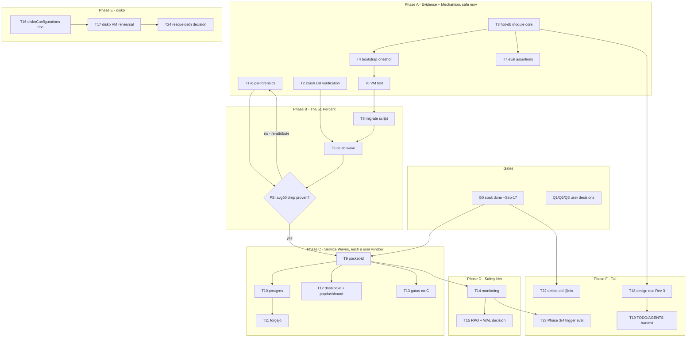

# Samsung Phase 2 — Hot-DB Tier, Nix-Native (Pareto Plan)

**Date:** 2026-09-14 13:27 · **Status:** PROPOSED — awaiting user approval; execution additionally gated (see Gates)
**Scope:** Move latency-critical databases onto the Samsung 970 EVO Plus TLC pool as fully declared NixOS state; adopt disko the safe way; kill the IO-storm class that is cycling guard Zone 6 and force-gating deploys.
**Sources:** `docs/planning/2026-08-31_samsung-role-assignment-first-principles.md` (Rev 2, ratified) · TODO_LIST P1 "crush session DBs off the QLC root" (2026-09-14) · `docs/status/2026-09-14_12-06_post776-verification-loan-fix-llama-rearm-guard-churn.md` §f · live guard journal 2026-09-14 (Zone 6 trips #71–75)

---

## 1. Context & Evidence

- **Phase 1 (`/nix` → Samsung p2 `tlc`) is LIVE and soaking** (day 1 of 3, through ~2026-09-17). 81 G used of 928 G. Boot-time fstab mount proven on kernel 7.2.5.
- **The storm that motivates Phase 2 is running RIGHT NOW**: IO PSI some avg60 40–65% for hours with pristine memory (MemAvailable ~70%) — the exact crash-#3 signature Zone 6 was calibrated for. 25 concurrent crush sessions drive it; their `crush.db` (2.9 GB + WALs) live on the **QLC root** (`@`, snapshotted, CoW). Guard trips #71–75 (2026-09-14) each stopped flm mid-cold-load; the memory-calm-only restore path churns the daily restore budget.
- **Design (ratified Rev 2):** hot DBs live on a `nodatacow` BTRFS subvol `hot` inside Samsung p2 — NOT a separate XFS partition (XFS never grows; partition starts never move). fsync ~1–2 ms.
- **This plan's amendment (Rev 3):** mount each subvol **at the service's existing dataDir** via `fileSystems` — services and their modules stay untouched; the tier is pure declaration. Supersedes the doc's "stop → rsync → re-point → restart" per-service re-pointing.
- **disko stance:** adopted as eval-checked geometry documentation + blank-vdisk VM rehearsal + future rescue path. Destructive modes NEVER on disks with data. (Flag-level facts verified against disko docs 2026-09-14: `--dry-run` prints the script; `destroy` prompts unless `--yes-wipe-all-disks`; `mount` mode targets `--root-mountpoint`, i.e. installer context.)

## 2. Goals / Non-Goals

**Goals**
1. Zero crush-session sync writes on the QLC root (stops the live storm driver).
2. Auth/photo/git-push sync DBs (pocket-id, postgres, forgejo) serving fsync from TLC.
3. Everything steady-state declarative: one `services.hot-db` module in, mounts/oneshot/assertions/tmpfiles out; rollback = flip an attr.
4. Samsung geometry recorded as an executable spec (disko) + rehearsed rescue path (VM).

**Non-Goals (explicitly)**
- Moving models/Steam (589 G, bandwidth-bound — design doc §"why models stay").
- `/home` (Phase 3) and Go caches (Phase 4) — trigger-based decisions, deferred, out of scope.
- Touching guard Zone 6 logic (that is standing question Q1 — user-owned).
- Any structural work before the soak completes.

## 3. Hard Constraints & Gates

| Gate | What | Owner |
|---|---|---|
| **G0 — Soak** | No disk-structural deploy before ~2026-09-17 (Phase-1 soak 3 days). Coding/VM tests are safe now; deploys gated. | time |
| **G1 — Q1** | Zone 6 vs flm decision (exempt flm / io-restore gate). Independent of this plan but shares the storm; answered separately. | user |
| **G2 — Q2** | llama pin-back vs bisect. Every deploy re-arms stopped llama units until decided. | user |
| **G3 — Q3** | flm v1.0.3 upstream issue or drop. | user |
| **G4 — Pressure** | Deploys during storms need `DEPLOY_FORCE_PRESSURE=1`; heavy local builds ride `heavy-job` admission control; no full `nix flake check` builds while flm cold-loads. | agent discipline |

**Anti-Verschlimmbesser rules:** no destructive disk ops in agent sessions; user-run sudo scripts for every rsync/flip; `trash` not `rm`; every gate script verified (negative-tested) before trusted; nothing reverts the flm v1.0.2 pin; nothing restarts the stopped llama units outside a deploy's known re-arm (re-stop after).

## 4. Pareto Breakdown

### The 1% that delivers 51%
**Move crush session DBs off the QLC root.** One relocation eliminates the live storm driver → Zone 6 stops cycling flm → deploys stop needing pressure-force → the box stops spending its guard restore budget daily. Everything else in this plan is leverage on top of a calm disk.

### The 4% that delivers 64%
1. `io-psi-forensics.sh` (prove/disprove the crush attribution with captured evidence, not circumstantial CPU%).
2. `services.hot-db` module core (option schema → `fileSystems` generation) — the mechanism all waves reuse.
3. Crush wave end-to-end (symlinks/tmpfiles + migrate script + PSI before/after measurement).

### The 20% that delivers 80%
4. Bootstrap oneshot (subvol create + `chattr +C` + fstab-before-mount ordering) + eval-time assertions (btrbk exclusion, anti-shadow wiring) + VM test.
5. First service migration (pocket-id — smallest, hottest auth path) proving the per-service runbook.
6. postgres + forgejo migrations (every photo browse / git push waits on these).

### The other 20% to reach 100%
Wave-2 DBs (dnsblockd, papdashboard, gatus-no-C) · monitoring wiring (fail-closed Gatus + scrub/smartd) · RPO adjustment (dumps become sole path; WAL-archiving decision) · disko documentation + VM rehearsal · design-doc Rev 3 + TODO/AGENTS harvest · old QLC `@nix` subvol deletion (frees 129 G, post-soak, user-run) · Phase 3/4 trigger evaluation · rescue-ISO decision.

## 5. Comprehensive Plan — Medium Granularity (30–100 min each)

Sorted by importance → impact → effort → value. Owner: **A** = agent session, **U** = user window (agent preps + verifies). Tier: the Pareto tier the task feeds.

| ID | Task | Tier | Impact | Effort | Depends | Owner |
|----|------|------|--------|--------|---------|-------|
| T1 | `scripts/io-psi-forensics.sh` — per-cgroup `io.stat` + D-state stacks + top offenders snapshot at trap time; output to dated dir | 4% | Evidence gate: converts "crush DBs are the driver" from circumstantial to proven | 60m | — | A |
| T2 | Crush DB verification — enumerate `.crush/` dirs+sizes across checkouts; source-check crush for a supported state-dir/XDG redirect (verify-before-build) | 1% | Decides symlink vs native redirect; sizes the hot dir | 30m | — | A |
| T3 | `services.hot-db` module core — options (`entries.<name>`: path, cow, device), `fileSystems` generation via `mkFilesystem`, flake-parts module wrapper shape | 4% | The mechanism every wave reuses | 90m | — | A |
| T4 | Bootstrap oneshot — idempotent `btrfs subvolume create` + `chattr +C` per root, `ConditionPathIsMountPoint` on pool, `before=` local-fs + each `.mount`, `harden{}` | 4% | fstab can't create subvols; this is the sanctioned pattern (atticd-storage-dir class) | 90m | T3 | A |
| T5 | **Crush wave** — `hot/crush` target layout, tmpfiles `L+` symlinks from a `projects` attrset, user-run migrate script, PSI before/after measurement procedure | 1% | THE 51%: storm driver eliminated | 90m | T1,T2,T3,T4 | A+U |
| T6 | VM test `tests/test-hot-db.nix` — real btrfs disk: mount, ordering (service waits for mount), anti-shadow (missing disk → unit FAILS, no root-fs shadow write), assertion eval | 4% | Proves the mechanism before any live deploy | 100m | T3,T4 | A |
| T7 | Eval-time assertions — btrbk config never references `hot`/dataDir paths (snapshot landmine), negative tests | 20% | Landmine is silent (one snapshot reverts nodatacow) — must be machine-enforced | 45m | T3 | A |
| T8 | `scripts/migrate-hot-db.sh prepare\|finalize` — stop → ionice'd rsync → flip enable; rollback path; pressure-gated | 20% | User-run migration doctrine (clickhouse precedent) | 60m | T6 | A |
| T9 | pocket-id migration (first service) — pre-checks, user window, Gatus green | 20% | Hottest auth path; validates the per-service runbook | 30m + U-window | T8,G0 | A+U |
| T10 | postgres migration (immich+paperless) — pre-dump, window, verification queries | 20% | Every photo browse; biggest blast radius → second, not first | 60m + U-window | T9 | A+U |
| T11 | forgejo migration — pre-checks, window, mirror+auth green | 20% | Every git push | 60m + U-window | T9 | A+U |
| T12 | Wave 2: dnsblockd + papdashboard runbooks + execution | tail | dnsblockd = hottest write DB on root | 60m + U-window | T9 | A+U |
| T13 | gatus entry WITHOUT `+C` (integrity over latency) + verify | tail | Monitoring store must detect corruption | 30m | T9 | A |
| T14 | Monitoring wiring — textfile metric for hot-db mount presence (fail-closed), Gatus checks, Samsung joins autoScrub/smartd | tail | Silent failures are unacceptable (repo doctrine) | 45m | T9 | A |
| T15 | RPO review — nightly dump coverage inventory per migrated DB; postgres WAL archiving decision (Phase 2.5) | tail | DBs leave btrbk coverage; dumps become sole recovery path | 45m | T10 | A |
| T16 | disko documentation — `diskoConfigurations.samsung-tlc` (by-id pin, p1+p2+subvols incl. `hot`), NOT imported by nixosConfigurations (discovery trap), eval check, optional geometry-drift check | tail | Executable spec of the disk; closes the stuck-boot-class gap | 60m | — | A |
| T17 | `tests/test-disko-layout.nix` — blank vdisk, apply layout, assert partitions/labels/subvols/`+C`; CI wiring | tail | Rehearsed rescue path — proven before needed | 100m | T16 | A |
| T18 | Design doc Rev 3 amendment — mount-at-dataDir supersedes re-point; nodatacow doctrine; disko stance recorded | tail | Keeps the ratified doc truthful (docs-health doctrine) | 30m | T3 | A |
| T19 | Doc harvest — TODO_LIST entries for every not-yet-listed task; AGENTS bullet for hot-db module + disko doctrine | tail | Plan is snapshot; TODO_LIST is living source | 30m | T18 | A |
| T20 | *Gate:* soak completion ~2026-09-17 (observation only; daily pre-reboot-check + failed-units + smoke-baseline diff) | gate | Structural deploys blocked until then | — | — | time |
| T21 | *Gate:* Q1/Q2/Q3 user decisions — tracked separately; Q2 forces post-deploy llama re-stop until answered | gate | — | — | — | user |
| T22 | Old QLC `@nix` subvol deletion (user-run; frees 129 G immediately — sibling subvol, not snapshot-pinned) | tail | Reclaims QLC space; clears chunk pressure structurally | 30m U-run | G0 | U |
| T23 | Phase 3 (`/home`) + Phase 4 (Go caches) trigger evaluation — one-page decision doc, only if QLC still feels slow post-Phase-2 | tail | Explicit "not now" with recorded trigger | 30m | T14 | A |
| T24 | Rescue-path decision — nixos-anywhere/disko-install runbook vs deferral (destructive disko belongs here, user-triggered) | tail | Completes the disko story | 30m | T17 | A+U |

**Agent-executable total ≈ 14.5 h** + user windows (5 migrations ≈ 15–30 min each) + gates.

## 6. Fine Breakdown — max 12 min each

All tasks above, split into atomic verifiable steps. Convention: `Fn.m` = step m of task `Tn`. Every step ends in a verifiable artifact (file + eval/test green, or recorded output).

| ID | Step | Est | Verifies |
|----|------|-----|----------|
| F1.1 | Script skeleton: arg parsing (trap-time vs live), output dir `/var/lib/io-psi-forensics/<ts>`, `set -euo pipefail` | 12m | `bash -n` |
| F1.2 | Per-cgroup `io.stat` capture (root + user slices, sorted by write bytes) | 12m | fixture run |
| F1.3 | D-state process capture (`ps` + per-pid kernel stack via `/proc/<pid>/stack`) | 12m | fixture run |
| F1.4 | Top-offender snapshot (CPU/IO per process, crush-session count) + PSI trio | 12m | output shape |
| F1.5 | Wire: systemd oneshot template callable at guard trip; retention ≤ 20 runs | 12m | unit eval |
| F2.1 | Enumerate `.crush/` dirs: find across `~/projects`, record sizes+WAL counts to plan appendix | 12m | table in file |
| F2.2 | Source-check crush (vendored config code) for state-dir/env override; record verdict + evidence lines | 12m | quoted source refs |
| F2.3 | Decision: symlink vs redirect, written into §Crush-wave spec of this doc | 6m | doc edit |
| F3.1 | Option declarations (`pool`, `entries.<name>.{path,cow}`, `crush.projects`) with types + defaults | 12m | `nix eval` option tree |
| F3.2 | `fileSystems` generation via `mkFilesystem` (by-label `tlc`, `subvol=hot/<name>`, `nodatacow` when !cow) | 12m | eval of generated entry |
| F3.3 | Consumer overlay: `RequiresMountsFor` + `ConditionPathIsMountPoint` per entry | 12m | unit text eval |
| F3.4 | Validation: no entry path outside `/var/lib`, no duplicate paths, cow defaults true | 12m | eval throws on fixture |
| F3.5 | flake-parts wrapper shape (`flake.nixosModules.hot-db`), filename uniqueness across services/desktop | 12m | `nix flake check --no-build` |
| F3.6 | Throwaway-expression eval on evo-x2 (extendModules, never deployed) — module renders mounts | 12m | store-path print |
| F3.7 | Module header docs: doctrine refs (nodatacow, landmine, anti-shadow) | 6m | docstring |
| F4.1 | Oneshot unit: `ConditionPathIsMountPoint=` pool mount, `RemainAfterExit=true` | 12m | unit eval |
| F4.2 | Idempotent subvol creation loop over entries (`subvolume list` check → create) | 12m | VM run |
| F4.3 | `chattr +C` per subvol root (fresh-subvol inheritance does NOT carry the flag) | 12m | `lsattr` in VM |
| F4.4 | Ordering: `before = local-fs.target` + each generated `.mount`; `wantedBy` wiring (the fstab-before-mount gotcha) | 12m | VM boot order |
| F4.5 | `harden{}` + runtimeInputs (`btrfs-progs`, `e2fsprogs`); mktemp discipline (textfile audit class) | 12m | `audit-textfile-tmp.sh` |
| F4.6 | Generated unit text dry-eval + `systemd-analyze verify` in VM | 12m | verify output |
| F5.1 | `hot/crush` layout decision + tmpfiles generation from `crush.projects` attrset | 12m | tmpfile lines |
| F5.2 | User-run migrate script: per-project stop-session note → `trash`-safe rsync `.crush` → symlink swap; `--dry-run` default | 12m | dry-run output |
| F5.3 | Baseline capture procedure: PSI avg60 + forensics snapshot BEFORE wave | 12m | recorded file |
| F5.4 | Post-wave capture + side-by-side comparison table | 12m | recorded file |
| F5.5 | Runbook section: session restart expectations, rollback (symlink back) | 12m | doc |
| F6.1 | VM test skeleton: btrfs scratch disk + module import + mock service with StateDirectory on entry path | 12m | test boots |
| F6.2 | Assert: subvol created, mounted at dataDir, `nodatacow` effective (`lsattr`) | 12m | assertion green |
| F6.3 | Assert: mock service orders after mount (job graph) | 12m | assertion green |
| F6.4 | Assert: missing pool → service FAILS (no shadow write under mountpoint on root fs) | 12m | assertion green |
| F6.5 | Assert: eval-time assertions fire on evil fixture (btrbk referencing hot path) | 12m | assertion green |
| F6.6 | Full test green × 2 consecutive runs (flake check) | 12m | exit 0 |
| F7.1 | Assertion: walk btrbk settings (all instances) for any `hot`/entry-path reference → throw | 12m | negative test |
| F7.2 | Assertion: every entry has a consumer unit OR is explicitly `unmanaged` (shadow-guard completeness) | 12m | negative test |
| F7.3 | Register module in the module-shape-lint negative harness | 12m | lint catches |
| F8.1 | `prepare`: service stop → `ionice -c3` rsync → verify (size+count) → checkpoint snapshot (one-shot, deleted after) | 12m | dry-run |
| F8.2 | `finalize`: flip `enable` → deploy → Gatus green checklist per service | 12m | checklist |
| F8.3 | Rollback: flip off → rsync back → restart (documented, never automated mid-incident) | 12m | doc |
| F8.4 | Pressure-gate the script itself (refuse when IO PSI avg10 ≥ 20%) | 12m | gate test |
| F9.1 | pocket-id pre-checks: size, dump exists, Gatus list, window steps written | 12m | checklist |
| F9.2 | Window support + post-verify (Gatus green, auth round-trip, backup still lands pool-side) | 18m | live green |
| F10.1 | postgres pre-checks: `pg_dump` baseline, DB sizes, consumer list (immich, paperless, twenty? — inventory) | 12m | inventory |
| F10.2 | Window runbook (stop → dump → prepare → finalize under 15-min window) | 12m | doc |
| F10.3 | Post-verify: photo browse + paperless login + Gatus | 12m | live green |
| F11.1 | forgejo pre-checks: size, mirrors paused?, dump | 12m | checklist |
| F11.2 | Window runbook + execute | 12m | live |
| F11.3 | Post-verify: git push round-trip + mirror sync + Gatus | 12m | live green |
| F12.1 | dnsblockd runbook (hottest write DB; short window — DNS blip only) | 12m | doc |
| F12.2 | papdashboard runbook | 12m | doc |
| F12.3 | Execute both + verify (resolve probe / ingest 200) | 12m | live green |
| F13.1 | gatus entry (cow=true, no `+C` — integrity over latency) + migrate + verify | 12m | live green |
| F14.1 | Textfile collector: `hot_db_mount_present{entry}` fail-closed (0 when absent, never missing) | 12m | metric present |
| F14.2 | Gatus checks per entry + alert wiring (Discord) | 12m | check green |
| F14.3 | Samsung in autoScrub + smartd (by-id) — verify coverage | 12m | unit/config |
| F15.1 | RPO inventory: per migrated DB — dump cadence, retention, restore-time estimate | 12m | table |
| F15.2 | WAL-archiving decision note (Phase 2.5): recommend defer-until-incident vs pre-wire | 12m | decision doc |
| F16.1 | `diskoConfigurations.samsung-tlc`: by-id device pin, p1 EF00 4G `SAMSUNG-EFI` (no mountpoint), p2 btrfs `-L tlc` + subvols (`nix`, `hot/*`) | 12m | eval |
| F16.2 | Guard: config lives OUTSIDE nixosConfigurations imports (discovery trap: `disko --flake .#evo-x2` must find NOTHING applicable) | 12m | negative eval |
| F16.3 | CI/eval check: disko config evaluates + `--dry-run` script renders | 12m | check green |
| F16.4 | Optional drift check: declared geometry vs `lsblk --json` reality, WARN-only | 12m | check green |
| F17.1 | VM test: `emptyDiskImages` blank vdisk + disko apply in guest | 12m | test boots |
| F17.2 | Assert partitions: EF00 4G + rest; labels `SAMSUNG-EFI`/`tlc` | 12m | assertions |
| F17.3 | Assert subvols `nix` + `hot` exist, `hot` roots carry `+C` | 12m | assertions |
| F17.4 | Assert mounts per options; no `--yes-wipe-all-disks` anywhere in wrappers | 12m | assertions |
| F17.5 | Wire into `nix flake check`; two consecutive greens | 12m | exit 0 |
| F18.1 | Rev-3 amendment to design doc (mount-at-dataDir, disko stance, this plan's pointer) | 12m | doc |
| F19.1 | TODO_LIST: add missing items (hot-db module P1 link, disko P2, forensics, monitoring) | 12m | TODO edit |
| F19.2 | AGENTS.md: hot-db + disko doctrine bullet (short, pointer to plan) | 12m | AGENTS edit |
| F22.1 | `@nix` deletion checklist (user-run): confirm no boot entry references QLC store paths → `btrfs subvolume delete` → space verify | 12m | checklist |
| F23.1 | Phase 3/4 trigger-eval one-pager (post-Phase-2 QLC feel; explicit defer default) | 12m | doc |
| F24.1 | Rescue-path decision one-pager (nixos-anywhere vs manual rebuild; disko destructive = rescue-only) | 12m | doc |

**Fine total: 76 steps ≈ 13.5 h agent time** (+ live windows). Deployment of ANY of it waits for G0 (soak) — coding/VM phases can start immediately.

## 7. Execution Graph

Phase ordering logic: crush wave (T5) is gated on the mechanism being VM-proven (T6) AND deployable (G0); every service wave is one migration at a time with Gatus green between; monitoring (T14) lands with the first wave, not after the last.

## 8. Acceptance Criteria

1. **Storm dead:** IO PSI some avg60 < 20% sustained across a full workday incl. 25 crush sessions; guard Zone 6 zero trips in 72 h (vs. 5 on 2026-09-14).
2. **Measurement, not vibes:** forensics before/after tables archived under `docs/status/` at wave completion.
3. **Declaration completeness:** every migrated DB's steady state is reproducible from a fresh checkout by `nix run .#deploy` — no imperative mount/chattr/symlink steps left behind (bootstrap oneshot covers subvol+chattr idempotently).
4. **Safety proven in VM:** anti-shadow, ordering, landmine assertions green ×2 runs; disko rehearsal green ×2.
5. **RPO explicit:** every migrated DB has a dump cadence + restore estimate documented; btrbk exclusion machine-enforced.
6. **No regressions:** flm v1.0.2 pin untouched; llama units still contained; failed-units set unchanged (the 2 known); smoke baseline delta only the expected green flips (FastFlowLM on guard restore; llama entries only when Q2 resolves).

## 9. Risks

| Risk | Mitigation |
|---|---|
| Wrong attribution (crush DBs not the driver) | T1 evidence gate BEFORE T5; `M1` decision node re-routes to re-attribution |
| nodatacow landmine (snapshot reverts to CoW) | T7 machine-enforced btrbk exclusion + one-shot checkpoints only |
| Shadow-dir writes when Samsung absent | `ConditionPathIsMountPoint` per consumer (clickhouse doctrine); VM-asserted |
| Postgres window overrun | pre-dump baseline; 15-min window; rollback path rehearsed in T8 |
| disko wipe | never on data disks; discovery-trap guard T16.2; `--dry-run` in every wrapper; user-only execution |
| Storm-time builds | G4: heavy-job wrapper, no full flake-check builds during cold-loads |
| Parallel sessions race the tree | pathspec commits; re-read before edit; quiescent-moment evals |

## 10. Standing Items Explicitly NOT in This Plan

Q1 (Zone 6 vs flm churn), Q2 (llama pin-back), Q3 (flm v1.0.3 issue) — user decisions, tracked in the 2026-09-12:06 report §g. User-owned external steps: Wise SCA, InboxClean re-consent (production first), Resend domain verify, paperless retro-decrypt push. Soak observation continues independently.

*Point-in-time snapshot (docs-health doctrine): harvest changes via TODO_LIST; annotate, never rewrite.*
