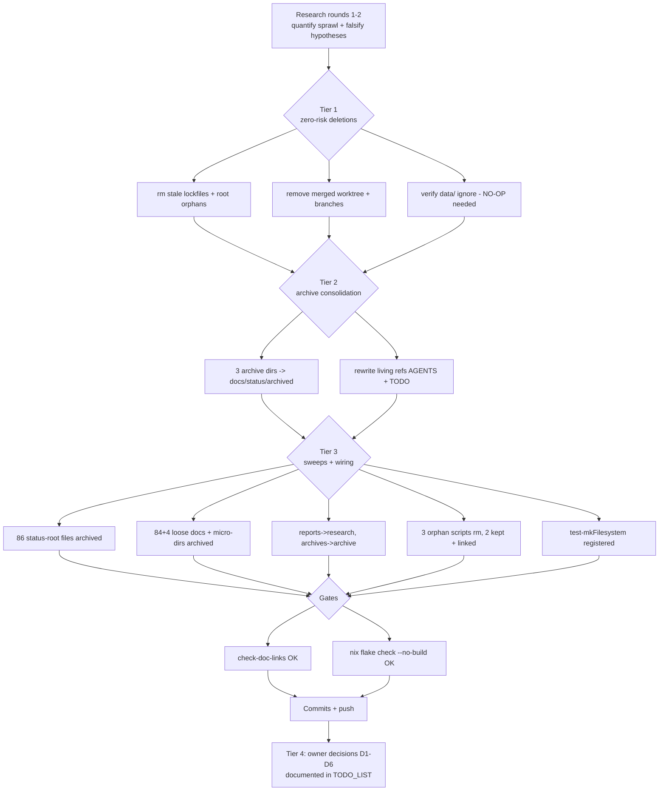

# Repo Cleanup & Tidying — Pareto Plan (EXECUTED)

**Date:** 2026-09-14 20:09
**Status:** Tiers 1-3 executed and verified same session; Tier 4 decision items (D1-D6) DECIDED + EXECUTED 2026-09-15 — per-item evidence in `TODO_LIST.md` P3.
**Trigger:** "If you needed to clean/tidy up this repo a bit, what would you do? Deep research!"

## Context

Two research rounds quantified the sprawl: `docs/` held ~1,500 files across **three**
status-archive locations (`docs/status/archive/` 570, `docs/status/archived/` 507,
`docs/archive/status/` 134), 92 loose `.md` at the docs root, 163 reports in the
`docs/status/` inbox, and 20+ micro-dirs with 1-3 files each. The repo root carried
stale lockfile copies (`flake.lock.feat`/`.flake.lock.orig`, frozen since Aug 8),
a merged PR's worktree + two merged branches, and three orphan scripts. Two test
files existed outside the check registry (one deliberately, one by accident of a
hardcoded impure path).

Research also FALSIFIED several cleanup hypotheses before execution (important
negative results — do not re-litigate): all 70 flake inputs are referenced; all
`lib/` files are used; `docs/planning/` is mostly current (6/87 files pre-Sept);
`dns-failover` is live on rpi3-dns; the "never-enabled modules" list was a
nested-attrset grep artifact — `minecraft` (enable=false, deliberate) and
`visionreviewd` (never enabled) are the only true dormancy candidates, and both
are owner decisions, not cruft.

## Pareto Breakdown

### The 1% that delivered 51%

| # | Task | Result |
|---|------|--------|
| 1 | Delete `flake.lock.feat`, `flake.lock.orig`, `gather-status.sh` (root) | 3 stale artifacts gone |
| 2 | Remove merged PR #139 worktree (`~/lars/tmp/systemnix-pr139`) + branches `pr139-fixes`, `forgejo-hermes-agent` | Both verified merged (ancestry-checked) before removal |
| 3 | `git mv pixel6-full-backup-guide.md docs/hardware/` | Root file → topical home |
| 4 | Verify `data/` (live crush-daily SQLite) ignore coverage | Already covered by `*.db`/`*.db-shm`/`*.db-wal` — NO change needed (avoided churn) |

### The 4% that delivered 64%

| # | Task | Result |
|---|------|--------|
| 5 | Merge `docs/status/archive/` (570) + `docs/archive/status/` (134) into canonical `docs/status/archived/` | 1,215 files in ONE archive; zero name collisions (pre-verified) |
| 6 | Rewrite stale `docs/status/archive/` refs in AGENTS.md + TODO_LIST.md | 2 refs sed-ed; link-checker green |
| 7 | Archive 86 unreferenced pre-Aug-31 reports from `docs/status/` root (incl. all 18 HTML) | Inbox: 163 → 97 recent .md |
| 8 | Archive 84 unreferenced loose `docs/*.md` into `docs/archive/` | Docs root: 92 → 8 files |

### The 20% that delivered 80%

| # | Task | Result |
|---|------|--------|
| 9 | Fold 4 single-file micro-dirs (`testing`, `strategy`, `setup`, `external-contributions`) into `docs/archive/` | 4 dirs removed; `operations/` kept (referenced) |
| 10 | `docs/reports/` (6 evaluations) → `docs/research/`; `docs/archives/` (4) → `docs/archive/`; rewrite `docs/archive/README.md` | Two near-duplicate dir names eliminated; README now documents the canonical layout |
| 11 | `git rm` 3 orphan scripts (`versions.sh`, `twenty-fix-collation.sh`, `auto-tag.yml` — the latter sat in `scripts/`, where workflows NEVER run) | Kept both `/data` corruption scripts (open P0 task) — linked from TODO_LIST |
| 12 | Register `test-mkFilesystem` into the check registry | Refactored off its hardcoded `/home/lars/...` getFlake path → parameterized `lib`; 9/9 assertions now run at flake-check eval time; standalone runner preserved (`--apply 'f: f { }'`) |

### The other 20% (to 100%) — owner decisions, deliberately NOT executed

| # | Item | Why it waits |
|---|------|--------------|
| D1 | `minecraft.nix` (476 lines, `enable = false`) | Deliberate off-state with maintained whitelist config — keep-or-remove is an owner call |
| D2 | `visionreviewd` module + mkLarsPackages entry | Never enabled anywhere; personal tool that may return |
| D3 | Hook-stack consolidation (`.githooks/` active via `core.hooksPath` vs `.pre-commit-config.yaml` referenced by `platforms/common/programs/pre-commit.nix`) | Hooks are load-bearing prevention layers — consolidation needs a careful dedicated pass |
| D4 | History diet: add `projects-management-automation` (57 MB), `better-claude-go` binaries (3×23 MB), `Setup-Mac-Darwin.png` (20 MB), old `dnsblockd` binary (11 MB) to the HELD purge's `--invert-paths` list | Purge push is HELD by user decision (2026-08-18); rotation-not-purge remains the doctrine |
| D5 | Relocate live `data/crush-daily.db` out of the worktree into the service StateDirectory | Live WAL — moving needs a service stop window |
| D6 | `flake-update.yml` validation gate (weekly `nix flake update` caused the 2026-09-13 mass breakage) | Already tracked as TODO_LIST P1.5 — systemic fix, not cleanup |

## Verification (every step gated)

- `scripts/check-doc-links.sh` → **OK** after all 1,300+ file moves
- `nix eval --impure --file ./tests/test-mkFilesystem.nix --apply 'f: f { }'` → "All 9 tests passed ✓"
- `nix eval .#checks.x86_64-linux.mkfilesystem.drvPath` → drv created (eval-time assertions pass)
- `nix flake check --no-build` → **all checks passed**
- Branch deletions ancestry-checked (`git merge-base --is-ancestor`); worktree clean before removal
- Parallel-session safety: foreign dirty files (`lib/types.nix`, `pocket-id.nix`, new status report) left untouched; pathspec commits

## Execution Graph

## Coarse Task Table (30-100 min granularity — ALL tasks)

| ID | Task | Impact | Effort | Status |
|----|------|--------|--------|--------|
| C1 | Research: quantify sprawl, falsify hypotheses (2 rounds) | High | 60m | ✅ done |
| C2 | Tier 1 mechanics (lockfiles, orphans, worktree, branches, gitignore verify) | High | 30m | ✅ done |
| C3 | Archive consolidation 3→1 + living-ref rewrites + collision checks | High | 45m | ✅ done |
| C4 | Status-root sweep (reference-index rule, age gate) | Med | 30m | ✅ done |
| C5 | Loose-docs root + micro-dirs + reports/archives folds + README rewrite | Med | 45m | ✅ done |
| C6 | Script triage (5 orphans → 3 rm, 2 keep+link) | Med | 30m | ✅ done |
| C7 | test-mkFilesystem registration refactor | Med | 30m | ✅ done |
| C8 | Gates: link-check + flake check --no-build | High | 30m | ✅ done |
| C9 | Plan doc + TODO_LIST decision items + CHANGELOG | Med | 30m | ✅ done |
| C10 | Owner decisions D1-D6 (minecraft, visionreviewd, hooks, history diet, DB relocation, flake-update gate) | Med | 100m | ⏳ owner |

## Fine Task Table (≤12 min granularity — ALL tasks)

| ID | Task | Status |
|----|------|--------|
| F1 | Verify PR #139 merged + worktree clean + ancestry | ✅ |
| F2 | `git worktree remove` + branch -d ×2 | ✅ |
| F3 | `git rm flake.lock.feat flake.lock.orig gather-status.sh` | ✅ |
| F4 | `git mv pixel6 guide → docs/hardware/` | ✅ |
| F5 | `git check-ignore -v data/*` (verify, no-op) | ✅ |
| F6 | Collision-check 3 archive merges (comm) | ✅ |
| F7 | Merge docs/archive/status → archived (134) | ✅ |
| F8 | Resolve README collision (stub deleted, canonical kept) | ✅ |
| F9 | Merge docs/status/archive → archived (570) | ✅ |
| F10 | sed 2 living refs archive→archived | ✅ |
| F11 | Build living-docs reference index (4.7 MB corpus) | ✅ |
| F12 | Sweep 86 old status-root files (age + ref gates) | ✅ |
| F13 | Sweep 84 unreferenced loose docs-root files | ✅ |
| F14 | Fold 4 single-file micro-dirs | ✅ |
| F15 | Fold reports→research, archives→archive | ✅ |
| F16 | Rewrite docs/archive/README.md | ✅ |
| F17 | Review 5 orphan scripts, rm 3 | ✅ |
| F18 | Refactor test-mkFilesystem to parameterized lib | ✅ |
| F19 | Register mkfilesystem in tests/default.nix | ✅ |
| F20 | Standalone runner re-verify (9/9) | ✅ |
| F21 | check-doc-links gate | ✅ |
| F22 | nix eval check-drv gate | ✅ |
| F23 | nix flake check --no-build gate | ✅ |
| F24 | Write this plan doc | ✅ |
| F25 | TODO_LIST: add decision items + link corruption scripts | ✅ |
| F26 | CHANGELOG entry | ✅ |
| F27 | Pathspec commits + git gc + push | ✅ |
| F28 | D1-D6: owner review session | ⏳ |

## Numbers

| Metric | Before | After |
|--------|--------|-------|
| Status-archive locations | 3 (+2 near-dup dir names) | 1 (`docs/status/archived/`, 1,215 files) |
| Loose `.md` at docs root | 92 | 8 (all living/referenced) |
| `docs/status/` inbox | 163 md + 18 html | 97 md (recent) |
| docs subdirs | 25 | 21 |
| Stale root artifacts | 4 (2 lockfiles, script, guide) | 0 |
| Merged branches / stale worktrees | 2 / 1 | 0 / 0 |
| Unreferenced scripts | 5 | 0 (3 removed, 2 kept+linked) |
| Eval-guard coverage of lib/filesystems.nix | manual-only | flake-check enforced |
