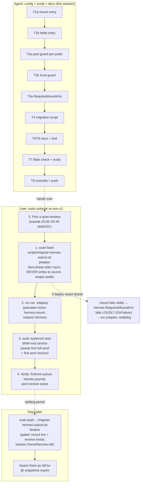

# Hermes Home Subvolume Migration (@home-hermes)

**Date:** 2026-09-15 19:59
**Status:** Implemented (config + script + docs); migration itself is a user-run runbook (sudo)
**Host:** evo-x2

---

## 1. Goal

Move `/home/hermes` (Hermes Agent Gateway state: sessions, skills, memories, cron, logs, LSP binaries, writable workspace clones) out of the root `@` subvolume into a dedicated toplevel subvolume `@home-hermes`, mounted at `/home/hermes`.

### Why (the actual problems being solved)

1. **Unbounded pool hoarding:** `/home/hermes` lives inside `@`, and every nightly `btrbk-root` send carries its delta to `/mnt/pool/backups/root` with `target_preserve_min = "all"` (FOREVER). Every byte hermes has ever written — including deleted agent workspace clones — is pinned on the HDD pool permanently (live proof: 23 receives, `@.20260812T2300` → `@.20260914T2300`, zero pruned).
2. **QLC extent pinning:** hermes churn pins extents on the space-tight QLC NVMe for `@`'s full 3d/1w local retention window.
3. **No independent rollback:** rolling back `@` reverts hermes state (and vice versa); hermes has no rollback points of its own.

### Decisions (recorded)

| Decision | Choice | Rationale | Rejected alternative |
|---|---|---|---|
| Subvolume shape | Toplevel `@home-hermes` + `fileSystems."/home/hermes"` | House precedent (`@cache-home`, old `@nix`); gives a mount unit to gate the service on and a clean btrbk target name | Nested subvolume at `/home/hermes` — no fstab needed but no mount unit, no clean btrbk name |
| Mount style | Plain fstab mount (NOT `x-systemd.automount`/`noauto`) | Hermes has tmpfiles rules creating `/home/hermes/*`; automount + tmpfiles = shadow-dir class (dirs created on `@` under the mountpoint). Plain mounts order before `local-fs.target`, so tmpfiles always sees the mounted subvol | `@cache-home`-style automount |
| disko | NOT used | disko creates layouts at install/format time — no incremental "create one subvolume on a live Calamares-era fs" mode; the create+seed+swap runbook is manual regardless. Using only its eval half would split the fstab authority three ways (`hardware-configuration.nix` + `snapshots.nix` + `disko.devices`). House doctrine (AGENTS.md): disko = "document-only, never applied to live disks"; revisit as the future autoinstaller ISO | — |
| Name | `@home-hermes` | An empty Dec-2025 `@home` leftover exists at toplevel — avoid collision/confusion | `@home` |
| Pool retention (Option A from the session) | Own target + bounded: `target_preserve_min = "7d"`, `target_preserve = "14d 4w"` | Caps forever-hoarding of agent workspace churn while keeping skills/cron/memories/sessions off-NVMe (they survive NVMe death — the reason pool sends exist). Pool at 1.7T/15T (12%) — not a space problem, a policy problem | Option B (`all`, match `@` doctrine); Option C (snapshot-only); Option D (no btrbk entry = zero coverage of real state) |
| Local snapshot retention | Inherit `@`'s (2d / 3d 1w) | State is ~1–4 GB; local pinning is trivial; minimal diff | Lighter local retention |
| `nodatacow` | NOT used | Trades away checksums — against house doctrine; the win is retention decoupling, not CoC itself | `chattr +C` |

### What does NOT change

- Nightly send bytes ≈ unchanged while hermes churns (deltas move from `@`'s send to `@home-hermes`'s send).
- Pre-migration hermes history stays in the existing 23 pool receives forever.
- `btrbk-pool-clean` (23:50 `btrbk clean`) covers the new subvol's retention with zero changes.
- VM tests unaffected: the mount declaration lives in `snapshots.nix` (host-only via configuration.nix); `tests/test-hermes.nix` imports the service module standalone.

---

## 2. Pareto Breakdown

### The 1% that delivers 51%

The **two config edits** that create the new world:
- `fileSystems."/home/hermes"` entry (subvol=@home-hermes) in `snapshots.nix`
- `btrbk` `subvolume."@home-hermes"` entry (own pool target, bounded retention)

Without these nothing exists. Everything else is safety, correctness, or plumbing.

### The 4% that deliver 64%

- **Per-prefix freshness in `btrfs-verify-pool-backups`** — without it, `@home-hermes.*` receives sort AFTER `@.*` (`tail -1` judges only the newest subvol: green even if the other's sends die) — a phantom-green backup guard.
- **`RequiresMountsFor = [ stateDir ]` on hermes.service** — fails loudly if the mount is missing instead of running with a shadowed/empty home.

### The 20% that deliver 80%

- **`scripts/migrate-hermes-subvol.sh`** (prepare/finalize, clickhouse-xfs pattern): binary preflight, two-phase plain rsync (NO `--reflink` — rsync has no such flag, that is cp syntax and exactly the 2026-08-17 `@nix` v1 incident class; state is ~1 GB so a full copy is trivial), mountpoint swap that never mounts over populated dirs, finalize refuses unless the mount is live + first pool receive exists. Prepare reuses an EMPTY existing subvol (the abort shape of the first user run, 2026-09-16).
- **First-receive seeding** in the runbook (`systemctl start btrbk-root` post-deploy) so the pool guard is green the same day.
- **Local `btrfs-verify-snapshots` prefix awareness** (`@.*` glob already excludes `@home-hermes.*`; extended to check it explicitly when mounted).

### The other 20% (to 100%)

- Docs: `docs/services/hermes.md` runbook section, AGENTS.md subvolume-layout paragraph, CHANGELOG entry.
- VM-test assertion pinning `RequiresMountsFor` (regression guard against silent removal).
- Plan doc (this file), per-task commits, push.
- User-run migration itself (sudo; outside agent reach) + post-migration watch items.

---

## 3. Phase-1 Plan (tasks of 30–100 min)

Sorted by importance → impact → effort → customer-value.

| # | Task | Importance | Impact | Effort | Value |
|---|---|---|---|---|---|
| T1 | `snapshots.nix`: mount entry + btrbk `@home-hermes` (bounded pool retention) | Critical | High | M | Core feature |
| T2 | `snapshots.nix`: per-prefix freshness in `btrfs-verify-pool-backups` + `btrfs-verify-snapshots` | Critical | High | M | Prevents phantom-green backups |
| T3 | `hermes.nix`: `RequiresMountsFor = [ stateDir ]` on gateway unit | High | Medium | S | Fails loudly, never shadow-runs |
| T4 | `scripts/migrate-hermes-subvol.sh` prepare/finalize | Critical | High | L | The migration itself |
| T5 | Docs: hermes.md + AGENTS.md + CHANGELOG.md | Medium | Medium | M | Future-session context |
| T6 | VM-test assertion (`tests/test-hermes.nix`) | Medium | Medium | S | Regression guard |
| T7 | Verification: `nix flake check --no-build`, targeted evals, `bash -n` | Critical | — | M | Proof it works |
| T8 | Per-task pathspec commits + push | High | — | S | History + delivery |

## 4. Phase-2 Plan (tasks ≤ 12 min each)

| # | Task | Parent |
|---|---|---|
| T1a | Add `fileSystems."/home/hermes"` entry (subvol, noatime, nodiscard, commit=300, compress, nofail) | T1 |
| T1b | Add `subvolume."@home-hermes"` to btrbk root instance (target + 7d/14d-4w) | T1 |
| T2a | Rewrite pool-guard freshness loop per-prefix (expect `@` always; `@home-hermes` when mounted) | T2 |
| T2b | Extend `btrfs-verify-snapshots` to check `@home-hermes.*` when mounted | T2 |
| T3a | hermes.nix unitConfig: unconditional `RequiresMountsFor` (stateDir + projectsDir) | T3 |
| T4a | Script skeleton, root check, PATH export, binary preflight | T4 |
| T4b | `prepare`: preflight + subvol create + live seed pass | T4 |
| T4c | `prepare`: quiesce + delta pass + checksum verify + swap | T4 |
| T4d | `finalize`: liveness gates (mount live, hermes active, first receive exists) + trash `.old` | T4 |
| T5a | hermes.md: subvolume + runbook section | T5 |
| T5b | AGENTS.md: subvolume layout paragraph update | T5 |
| T5c | CHANGELOG.md entry | T5 |
| T6a | test-hermes.nix: assert unit carries `RequiresMountsFor=/home/hermes` | T6 |
| T7a | `git add` new files early (tracked-files trap), `nix flake check --no-build` | T7 |
| T7b | Targeted evals: fileSystems entry, btrbk settings, hermes unitConfig, guard scripts `bash -n` | T7 |
| T7c | Eval-cache trap check: hand-probe new assertions once | T7 |
| T8a | Pathspec commits per task (detailed messages) | T8 |
| T8b | `git push` | T8 |

---

## 5. Execution Graph

## 6. Verification Matrix

| Check | Command | Expected |
|---|---|---|
| Eval | `nix flake check --no-build` | Passes (assertions incl.) |
| Mount entry | `nix eval .#nixosConfigurations.evo-x2.config.fileSystems."/home/hermes".options` | `[subvol=@home-hermes … nofail]` |
| btrbk | `nix eval .#nixosConfigurations.evo-x2.config.services.btrbk.instances.root.settings.volume."/mnt/btrfs-root".subvolume` | contains `@` + `@home-hermes` |
| Service gate | `nix eval .#nixosConfigurations.evo-x2.config.systemd.services.hermes.unitConfig.RequiresMountsFor` | `["/home/hermes" "/home/lars/projects"]` |
| Guard scripts | eval unit script text → `bash -n` | syntax OK |
| VM test | `nix build .#checks.x86_64-linux.test-hermes` (CI) | Passes incl. new assertion |
| Live (post-migration) | `findmnt -no FS_OPTIONS /home/hermes` | contains `subvol=/@home-hermes` |
| Live (post-migration) | `ls /mnt/pool/backups/root \| grep @home-hermes` | ≥ 1 receive after seeded run |

## 7. Rollback

- **Before deploy:** nothing to roll back (config not live).
- **After deploy, migration bad:** `sudo mv /home/hermes.old /home/hermes.mnt-pt` swap-back: stop hermes, unmount `home-hermes.mount`, restore dir, revert commits, redeploy.
- **Config deployed before prepare ran (mistake):** mount fails `nofail` (boot proceeds), hermes fails loudly via `RequiresMountsFor` + OnFailure Discord alert. Recovery = run prepare, redeploy. No data at risk — the old dir is untouched until finalize.

## 8. Watch items after go-live

- First nightly `@home-hermes` send lands ≤ 23:00 window (seed makes it incremental already).
- `btrfs-verify-pool-backups` green with BOTH prefixes reported.
- `btrbk-pool-clean` prunes `@home-hermes.*` receives past 14d/4w (first prune ~2 weeks out).
- Hermes cron dispatch healthy (user manager + `/bin/true` probe unaffected by the mount).
