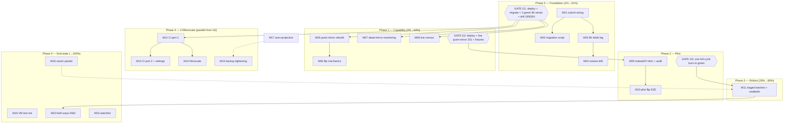

# Forgejo Primary — Staged Foundation & Rollout Plan

**Date:** 2026-09-18 16:44 CEST
**Status:** PLAN — awaiting owner review; execution begins with Phase 0
**Supersedes:** `docs/planning/2026-08-31_21-15_forgejo-primary-migration.md` (its "push mirrors already exist" premise was falsified by the 2026-09-18 audit — they never worked and the code was removed; all other decisions carry forward, see §2)
**Method:** pareto-planning skill, `.md` format per explicit user instruction (skill's HTML default overridden, divergence flagged)

---

## 1. Goal & Strategy

**User goal (2026-09-18):** Forgejo becomes the primary forge. One day: full bidirectional sync ("both ways") including git, Issues, PRs, everything. **Staged approach decided:** set Forgejo up _perfectly_ first, verify everything, and only then make it primary. Storage: SSD, backed up to HDD pool at least every 8h, preferably via a dedicated BTRFS subvolume.

**Strategy:** three big gates — **Foundation** (storage + backup + restore proven), **Capability** (push mirrors rebuilt correctly + flip mechanics piloted + monitoring that sees dead mirrors), **Rollout** (staged per-repo flips with burn-in windows). Bidirectional sync is a post-rollout R&D track, not a rollout dependency.

**Already done by parallel sessions (2026-09-18, system-785):** mirror sync hardened + deployed (385 mirrors incl. ~225 private, 0 failures), reconcile metrics + Gatus green, deploy.sh post-switch trigger, runbook `docs/services/forgejo.md` created, rate-limit fail-loud guard, unit hardening. These are EXCLUDED from this plan.

## 2. Standing decisions (carry forward + today)

| #  | Decision                                                                                                                                                                                                                                         | Source                                           |
| -- | ------------------------------------------------------------------------------------------------------------------------------------------------------------------------------------------------------------------------------------------------ | ------------------------------------------------ |
| D1 | All repos canonical on Forgejo (incl. public)                                                                                                                                                                                                    | 2026-08-31 decision #2 — reconfirm at Phase 3    |
| D2 | GitHub stays as live push-mirror, **strictly read-only**                                                                                                                                                                                         | 2026-08-31 #3                                    |
| D3 | Off-LAN access NOT a goal (LAN-only)                                                                                                                                                                                                             | 2026-08-31 #1 — reconfirm, "primary" re-opens it |
| D4 | Offsite backup after the flip, not a prerequisite                                                                                                                                                                                                | 2026-08-31 #4                                    |
| D5 | Storage: dedicated Samsung-TLC subvol mounted at `/var/lib/forgejo`, **Set B semantics** (own subvol + own btrbk entry + send to pool, 8h cadence) — NOT Set C (+C/no-snapshots): primary ≠ disposable; snapshots re-enable CoW, accepted on TLC | today (this plan)                                |
| D6 | "Both ways" = end-state ambition; transition shape is: convergence window (both mirror directions) → GitHub read-only                                                                                                                            | today                                            |
| D7 | Issues/PRs: one-time full import at flip (re-migrate `mirror:false`); continuous bidirectional issue sync deferred to R&D track                                                                                                                  | today                                            |
| D8 | Dump stays nightly alongside the 8h snapshot leg (transaction-consistent restore path)                                                                                                                                                           | today                                            |

**Open owner decisions (consolidated packet = task M18):** GitHub-issues policy post-flip (freeze vs keep-open-with-one-way-import) · off-LAN confirm · public-repo scope confirm · Artmann-Minecraft 2 transfers · 32 frozen archives keep/prune · `forgejo-ensure-repos` collapse · Codeberg account identity.

## 3. Pareto breakdown

### The 1% that delivers 51% — _Protect the data_ (Phase 0)

1. Dedicated subvol on Samsung TLC mounted at `/var/lib/forgejo` (+ data migration)
2. 8h btrbk snapshot+send leg to the HDD pool (+ guard/monitoring wiring)
3. Restore drill (dump AND received-subvol paths, scripted, repeatable)

_Nothing else may touch Forgejo state until these three exist and are verified — every later step either risks primary data or is reversible polish._

### The 4% that delivers 64% — _Make "primary" mechanically possible_ (Phase 1)

4. Push-mirror creation rebuilt correctly (`interval: "8h"`, opt-in canonical list, refuses pull-mirrors — clobber guard)
5. Per-repo flip mechanics: DELETE disposable mirror → re-migrate with `mirror:false` (imports issues/PRs/labels/milestones/releases/wiki) → attach push mirror
6. Dead-mirror monitoring (the 12-day-outage detection class; TouchMirror makes `updated_unix` useless alone)
7. Scoped `insteadOf` remote shim (HM, both machines, flag-gated) + stray-repo audit

### The 20% that delivers 80% — _Roll out_ (Phases 2-4)

8. Pilot flip (one repo end-to-end incl. nix-input resolution via the GitHub mirror)
9. Staged rollout: private batches → SystemNix/cv → public libs; GitHub branch-protection seatbelts; per-batch burn-in gates
10. CI port (4 workflows, dual-run) + `DEFAULT_ACTIONS_URL` + retention/migrations hardening
11. Self-hosted Renovate on `platform=forgejo`
12. Backup-coordination tightening + offsite leg hookup (Hetzner/Borg, decided separately)

### The other 20% to reach 100% — _End-state & hygiene_

13. Bidirectional issue-sync R&D (identity mapping, loop suppression, webhook daemons) + build/no-build verdict
14. Upstream: file the 3 verified mirror bugs (Tier-1 once primary); repo-scoped tokens; commit-graph locks
15. Watchlist: ForgeFed cross-instance issues, v17.0 (2026-10-15) mirror-redirect hardening, LTS-jump decision
16. Polish + leftovers: size measurement/growth projection, starred-org reconcile design, Catppuccin theme, gitea-mcp probe, owner-decision packet

## 4. Phases with verification gates

| Phase              | Contents                         | EXIT GATE (all must pass before next phase)                                                                                                                          |
| ------------------ | -------------------------------- | -------------------------------------------------------------------------------------------------------------------------------------------------------------------- |
| **P0 Foundation**  | M01-M04 (+M17)                   | Subvol mounted with live data; ≥2 consecutive 8h btrbk sends received pool-side; restore drill GREEN from both paths; forgejo + mirrors healthy post-migration       |
| **P1 Capability**  | M05-M08                          | Push-mirror POST verified against live API (201, listed); flip script fixture-verified; dead-mirror collector live + calibrated; live-forge census recorded          |
| **P2 Pilot**       | M09-M10                          | One repo flipped: commits land Forgejo→GitHub (`sync_on_commit`), nix resolves it via `github:` URL, reconcile ignores it, monitoring green for one full 6h/8h cycle |
| **P3 Rollout**     | M11                              | Per batch: flips → 1 natural sync cycle green → seatbelt applied → next batch. GitHub issues policy executed per D7 decision                                         |
| **P4 CI/Renovate** | M12-M15 (parallelizable from P2) | All 4 workflows green on forgejo-runner; GH Actions retireable; Renovate MRs appearing on native repos                                                               |
| **P5 End-state**   | M16, M22-M23                     | VM regression net merged; both-ways verdict documented; watchlist items calendared                                                                                   |

**Verschlimmbessern guardrails (hard rules):**

- No repository DELETE outside `forgejo-flip-repo` (which dry-runs first and only ever deletes repos proven `mirror==true`)
- Shim (`insteadOf`) never ships enabled before the pilot — it would redirect every `LarsArtmann` push (PMA, tq agents, daemon) into Forgejo, which rejects pushes to mirrors
- Subvol migration uses the ClickHouse-XFS prepare/finalize pattern (live pre-rsync, brief-stop delta, content-count + sampled-checksum verify); fstab mount never enabled while old data still occupies the mountpoint (shadow-dir class)
- Every btrbk/balance-class unit joins `memory-emergency-guard.ioChurnUnits`; migration + first sends run in a quiet-IO window (deploy pressure gate discipline)
- Deploys are owner-gated (sudo); every gate is an explicit checklist row, never silently skipped

## 5. Medium-granularity plan (30–100 min per task)

Sorted by importance (dependency spine first), then impact/effort. "Gate" rows are owner/sudo-gated events.

| ID     | Task                                                                                                                                                                                                                                                                                                                                                                   | Phase | Impact | Effort | Est       | Depends  |
| ------ | ---------------------------------------------------------------------------------------------------------------------------------------------------------------------------------------------------------------------------------------------------------------------------------------------------------------------------------------------------------------------- | ----- | ------ | ------ | --------- | -------- |
| M01    | Forgejo subvol storage wiring: `dedicatedSubvolume` option, `fileSystems."/var/lib/forgejo"` (tlc, `subvol=hot/forgejo`, nofail, via `mkFilesystem`), `forgejo-subvol-bootstrap` oneshot (idempotent subvol create via `/mnt/hot`), unit gating (`RequiresMountsFor` + `ConditionPathIsMountPoint` on forgejo.service, option-conditional)                             | P0    | High   | M      | 60m       | —        |
| M02    | `scripts/migrate-forgejo-subvol.sh` (prepare/finalize; tool preflight BEFORE stopping anything; live pre-rsync → stop-unit delta rsync → count+checksum verify → restart)                                                                                                                                                                                              | P0    | High   | M      | 60m       | M01      |
| M03    | 8h btrbk leg: `btrbk-forgejo` config (local snapshot + send to `/mnt/pool/backups/forgejo-subvol`), 3 staggered timer slots (05:40/13:40/21:40, clear of the 23:00-04:00 window and 6h sync ticks), mount-gated, registered in guard `ioChurnUnits` + btrfs-health churn window                                                                                        | P0    | High   | M      | 90m       | M01      |
| M04    | Restore drill: `scripts/forgejo-restore-drill.sh` (latest dump zip → scratch → unzip + `git fsck` sample + sqlite `integrity_check`; received-subvol variant via read-only mount), weekly timer + last-drill metric + Gatus                                                                                                                                            | P0    | High   | M      | 90m       | M03      |
| **G1** | GATE: deploy Phase-0 batch (option still inert); owner-runs `migrate-forgejo-subvol.sh prepare+finalize`; flip option on; deploy again; verify exit criteria                                                                                                                                                                                                           | P0    | —      | —      | 30m       | M01-M04  |
| M17    | Size measurement (`sudo -u forgejo du -sh`) + pool/btrbk growth projection                                                                                                                                                                                                                                                                                             | P0    | Med    | S      | 30m       | G1       |
| M05    | Push-mirror capability: `services.forgejo.canonicalRepos` option (default `[]` = inert), `forgejo-push-mirror` script (idempotent GET→POST `/push_mirrors` with `interval:"8h"`, `sync_on_commit`, **refuses repos where `mirror==true`**), folded as phase 3 of `forgejo-github-sync`                                                                                 | P1    | High   | M      | 60m       | G1       |
| M06    | Flip mechanics: `forgejo-flip-repo <name>` — preconditions (pull mirror, exists on GH, no pending reconcile verdict) → DELETE mirror (disposable by definition) → re-migrate `mirror:false` FULL import (issues/PRs/labels/milestones/releases/wiki) → attach push mirror → post-verify (mirror==false, issue count, push mirror listed); `--dry-run`; lossiness notes | P1    | High   | L      | 90m       | M05      |
| M07    | Dead-mirror monitoring (REDESIGNED 2026-09-18 evening, see §10 addendum): notice-table collector (one Type=1 row per FAILED sync) minus the reconcile known-stale set, `forgejo_mirror_dead_candidates` metric + Gatus. The original mirror_updated-vs-updated_at heuristic was FALSIFIED against live data                                                            | P1    | High   | M      | 60m       | G1       |
| M08    | Live-forge census: native-vs-mirror split, real counts, runner version, workflow runs, LFS presence → runbook                                                                                                                                                                                                                                                          | P1    | Med    | S      | 30m       | G1       |
| **G2** | GATE: deploy P1 batch; live-verify push-mirror POST (201) + collector green; fixtures pass                                                                                                                                                                                                                                                                             | P1    | —      | —      | 30m       | M05-M08  |
| M09    | `insteadOf` shim behind flag (HM `programs.git`, evo-x2 + darwin) + `scripts/forgejo-remote-audit.sh` (origins census, join vs forgejo repo list)                                                                                                                                                                                                                      | P2    | High   | M      | 45m       | G2       |
| M10    | Pilot flip end-to-end: native repo → push mirror → GitHub receives; second commit via `sync_on_commit`; scratch-nix resolves it via `github:` URL; reconcile non-interference verified                                                                                                                                                                                 | P2    | High   | M      | 45m       | M06, M09 |
| **G3** | GATE: pilot burn-in — one full 6h/8h cycle green (sync, reconcile, freshness, btrbk) before ANY rollout batch                                                                                                                                                                                                                                                          | P2    | —      | —      | —         | M10      |
| M11    | Rollout: batch definitions (private-low-value → private-core → SystemNix/cv → public libs), per-batch executor runbook, GitHub branch-protection seatbelts (bypass for sync PAT), issues-policy execution                                                                                                                                                              | P3    | High   | L      | 60m/batch | G3       |
| M12    | CI port 1: `nix-check.yml` → `.forgejo/workflows/` on SystemNix (dual-run), runner secrets strategy (deploy keys on host runner)                                                                                                                                                                                                                                       | P4    | High   | L      | 90m       | G2       |
| M13    | CI port 2: remaining 3 workflows; `DEFAULT_ACTIONS_URL` → `data.forgejo.org`; `LOG/ARTIFACT_RETENTION_DAYS=30`; `[migrations] ALLOWED_DOMAINS=github.com`                                                                                                                                                                                                              | P4    | Med    | M      | 60m       | M12      |
| M14    | Self-hosted Renovate (`platform=forgejo`, sops PAT, native-repo allowlist), pilot on one repo                                                                                                                                                                                                                                                                          | P4    | Med    | L      | 90m       | M12      |
| M15    | Backup tightening: registry `maxAgeHours` vs dump timer re-check; dump retention size-aware post-M17; offsite pointer into the Hetzner/Borg TODO                                                                                                                                                                                                                       | P4    | Med    | S      | 45m       | M17      |
| M16    | `tests/test-forgejo.nix` VM test (module eval, backup unit, OIDC-env bridge) + flip/push-mirror fixtures into `tests/test-scripts.nix`                                                                                                                                                                                                                                 | P5    | Med    | L      | 100m      | M06      |
| M18    | Owner-decision packet: ONE table with all 7 open decisions + recommendations                                                                                                                                                                                                                                                                                           | P5    | Med    | S      | 30m       | —        |
| M19    | Docs/memory sync: runbook extensions (subvol/flip/drill/shim), AGENTS.md forgejo section, TODO_LIST harvest, annotate 2026-08-31 plan stale-premise                                                                                                                                                                                                                    | P5    | Med    | M      | 45m       | —        |
| M20    | Upstream: Codeberg account (owner) + file the 3 verified mirror issues (Tier-1 post-flip)                                                                                                                                                                                                                                                                              | P5    | Med    | S      | 60m       | —        |
| M21    | Hygiene: repo-scoped token re-issues (sync/hermes), `forgejo doctor` commit-status dry-run, starred-org reconcile design, `forgejo-ensure-repos` collapse, commit-graph.lock cleanup line                                                                                                                                                                              | P5    | Low    | M      | 45m       | —        |
| M22    | Both-ways R&D (DEFERRED to post-rollout): webhook inventory both APIs, identity mapping (Pocket ID sub ↔ GH login), loop suppression (bot watermarks), build/no-build verdict doc                                                                                                                                                                                      | P5    | Med    | L      | 90m       | M11      |
| M23    | Watchlist: v17.0 notes (2026-10-15) + mirror-redirect impact, LTS-jump memo, ForgeFed issues/PR tracker                                                                                                                                                                                                                                                                | P5    | Low    | S      | 30m       | —        |

## 6. Fine-granularity plan (≤12 min per task)

Grouped by medium task; execution order within groups is top-down unless `dep` says otherwise.

| ID      | Task                                                                                                                                                                                                                                                                                                                                                                                                                                             | Est | Dep      |
| ------- | ------------------------------------------------------------------------------------------------------------------------------------------------------------------------------------------------------------------------------------------------------------------------------------------------------------------------------------------------------------------------------------------------------------------------------------------------ | --- | -------- |
| **M01** |                                                                                                                                                                                                                                                                                                                                                                                                                                                  |     |          |
| F01     | Read `snapshots.nix` btrbk unit shapes + `crush-hot-db.nix` mount wiring + `lib/filesystems.nix` `mkFilesystem`                                                                                                                                                                                                                                                                                                                                  | 10m | —        |
| F02     | Add `dedicatedSubvolume` option + conditional `fileSystems."/var/lib/forgejo"` via `mkFilesystem` (tlc by-label, `subvol=hot/forgejo`, nofail, zstd)                                                                                                                                                                                                                                                                                             | 12m | F01      |
| F03     | `forgejo-subvol-bootstrap` oneshot: idempotent `mkdir -p /mnt/hot/hot` + `btrfs subvolume create`, after `mnt-hot.mount`, before the dataDir mount; add to deploy.sh restart list + deploy-restart-audit expectations                                                                                                                                                                                                                            | 12m | F02      |
| F04     | Option-conditional `RequiresMountsFor=/var/lib/forgejo` + `ConditionPathIsMountPoint` on forgejo.service (clickhouse precedent)                                                                                                                                                                                                                                                                                                                  | 8m  | F02      |
| F05     | Enable option in evo-x2 configuration.nix (ship inert first: option off until migration done — see F22 gate) — state 2026-09-18: option EXISTS + ships inert; the enable line lands WITH the G1 gate (the migration finalize deliberately leaves forgejo down until the mount flips)                                                                                                                                                             | 2m  | F04      |
| F06     | Eval `evo-x2` toplevel + `nix flake check --no-build`                                                                                                                                                                                                                                                                                                                                                                                            | 10m | F05      |
| **M02** |                                                                                                                                                                                                                                                                                                                                                                                                                                                  |     |          |
| F07     | Script skeleton + tool preflight (resolve every binary up front — the sgdisk lesson; `set -euo pipefail`, dry-run default)                                                                                                                                                                                                                                                                                                                       | 12m | M01      |
| F08     | `prepare`: live pre-rsync (no `--delete`) QLC→subvol, progress + summary output                                                                                                                                                                                                                                                                                                                                                                  | 12m | F07      |
| F09     | `finalize`: stop forgejo + sync timer units, delta rsync `--delete`, entry-count + sampled-checksum verify, restart units                                                                                                                                                                                                                                                                                                                        | 12m | F08      |
| F10     | ShellCheck/build the script via nix; runbook section                                                                                                                                                                                                                                                                                                                                                                                             | 8m  | F09      |
| **M03** |                                                                                                                                                                                                                                                                                                                                                                                                                                                  |     |          |
| F11     | `btrbk-forgejo` config: source subvol, `snapshot_preserve 48h`, `target_preserve 7d 8w`, target `/mnt/pool/backups/forgejo-subvol`                                                                                                                                                                                                                                                                                                               | 12m | M01      |
| F12     | Service + timer: 3 slots `05:40/13:40/21:40`, `Persistent=true`, `ioTier.background`, `serviceOneshotDefaults`, `startLimitBurst 5/300`                                                                                                                                                                                                                                                                                                          | 10m | F11      |
| F13     | Add `btrbk-forgejo.service` to guard `ioChurnUnits` default + btrfs-health churn-window consumption check                                                                                                                                                                                                                                                                                                                                        | 8m  | F12      |
| F14     | Freshness collector: newest receive/snapshot age → `forgejo_subvol_backup_{fresh,last_age_seconds,scrape_errors}` textfile + registry Gatus check (anchored `\n` pats)                                                                                                                                                                                                                                                                           | 12m | F12      |
| F15     | Mount gating both ends (`RequiresMountsFor=/mnt/pool` + dataDir) + target-dir bootstrap decision (btrbk-created vs oneshot)                                                                                                                                                                                                                                                                                                                      | 8m  | F11      |
| F16     | Eval + verify rendered config; btrbk dry-run (`btrbk -c … dryrun`) inside the unit before first live run                                                                                                                                                                                                                                                                                                                                         | 8m  | F15      |
| **M04** |                                                                                                                                                                                                                                                                                                                                                                                                                                                  |     |          |
| F17     | Dump-drill: latest zip → scratch → unzip → `git fsck` on 3 sampled repos → sqlite `integrity_check` on extracted `forgejo.db` → verdict                                                                                                                                                                                                                                                                                                          | 12m | M03      |
| F18     | Subvol-drill: read-only mount of newest received subvol → `git fsck` sample → unmount                                                                                                                                                                                                                                                                                                                                                            | 12m | F17      |
| F19     | Weekly timer + `forgejo_restore_drill_last_age` metric + Gatus (fail-closed absence) — SHIPPED 2026-09-18 as a deliberate simplification: weekly timer + OnFailure + system-health monitored unit (event alerting, not a freshness metric — a drill is an event, not a continuous signal)                                                                                                                                                        | 10m | F18      |
| F20     | Runbook restore section + evidence formatting                                                                                                                                                                                                                                                                                                                                                                                                    | 8m  | F19      |
| **G1**  |                                                                                                                                                                                                                                                                                                                                                                                                                                                  |     |          |
| F21     | DEPLOY (owner): Phase-0 inert batch; watch post-deploy smoke + §10 metric loans                                                                                                                                                                                                                                                                                                                                                                  | 10m | M01-M04  |
| F22     | OWNER-RUN: `migrate-forgejo-subvol.sh prepare` then `finalize` in a quiet-IO window; capture counts                                                                                                                                                                                                                                                                                                                                              | 12m | F21      |
| F23     | DEPLOY (owner): enable mount option; verify mount, forgejo healthy, mirrors syncing                                                                                                                                                                                                                                                                                                                                                              | 10m | F22      |
| F24     | Verify: 2 consecutive 8h sends received pool-side + freshness Gatus green + restore drill GREEN                                                                                                                                                                                                                                                                                                                                                  | 10m | F23      |
| **M17** |                                                                                                                                                                                                                                                                                                                                                                                                                                                  |     |          |
| F25     | Runbook one-liner `sudo -u forgejo du -sh /var/lib/forgejo` + capture result                                                                                                                                                                                                                                                                                                                                                                     | 4m  | F23      |
| F26     | Growth projection: pool receive growth/8h estimate + dump-zip size note + retention sanity                                                                                                                                                                                                                                                                                                                                                       | 8m  | F25      |
| **M05** |                                                                                                                                                                                                                                                                                                                                                                                                                                                  |     |          |
| F27     | `services.forgejo.canonicalRepos` option (listOf str, default `[]`) + doc comment (inert semantics)                                                                                                                                                                                                                                                                                                                                              | 6m  | G1       |
| F28     | `forgejo-push-mirror` script: for each canonical repo — GET repo (refuse if `mirror==true`), GET push_mirrors (skip if present), POST with `interval:"8h"`, `sync_on_commit:true`, auth token                                                                                                                                                                                                                                                    | 12m | F27      |
| F29     | Wire as phase-3 ExecStart of `forgejo-github-sync` gated on non-empty list                                                                                                                                                                                                                                                                                                                                                                       | 8m  | F28      |
| F30     | Fixture test: stubbed curl — create / skip-existing / refuse-pull-mirror / 400-verbose paths                                                                                                                                                                                                                                                                                                                                                     | 12m | F29      |
| **M06** |                                                                                                                                                                                                                                                                                                                                                                                                                                                  |     |          |
| F31     | `forgejo-flip-repo` preconditions + `--dry-run` (repo is mirror; on GitHub; no pending reconcile verdict; not starred-org)                                                                                                                                                                                                                                                                                                                       | 12m | M05      |
| F32     | Delete mirror → `POST /repos/migrate` with `mirror:false, issues:true, pull_requests:true, labels:true, milestones:true, releases:true, wiki:true`                                                                                                                                                                                                                                                                                               | 12m | F31      |
| F33     | Attach push mirror + post-verify: `mirror==false`, issue count > 0 (when source had issues), push mirror listed, default branch present                                                                                                                                                                                                                                                                                                          | 12m | F32      |
| F34     | Fixture test: full stubbed flow + failure mid-flip (migrate 422 → repo recreated as mirror, no data loss)                                                                                                                                                                                                                                                                                                                                        | 12m | F33      |
| F35     | Lossiness doc: reactions, some review metadata, cross-references, GH-only features (projects, insights) — runbook                                                                                                                                                                                                                                                                                                                                | 8m  | F34      |
| **M07** |                                                                                                                                                                                                                                                                                                                                                                                                                                                  |     |          |
| F36     | ~~Collector: page `GET /repos/search?mirror=true`, per repo compare `mirror_updated` age vs `updated_at` age~~ FALSIFIED 2026-09-18: TouchMirror advances mirror_updated on FAILED syncs (all 385 mirrors incl. frozen ones carry fresh mirror_updated), and idle-healthy mirrors carry frozen updated_at — the pair cannot separate dead from idle. REPLACEMENT: notice-table query (Type=1 rows in 24h) + name parse + known-stale subtraction | 12m | G1       |
| F37     | Textfile metrics + unit/timer (5m) + registry Gatus check (`forgejo_mirror_dead_candidates 0`) — DONE 2026-09-18: `forgejo-mirror-health` unit/timer + `forgejo_mirror_health.prom` + "Forgejo Dead Mirror Candidates" check (fail-closed absence)                                                                                                                                                                                               | 12m | F36      |
| F38     | Calibrate: exclude 8h-interval repos, tolerate in-flight syncs (one-cycle grace via state file) — superseded by the redesign: known-stale subtraction (reconcile persists `known-stale.txt`) replaces interval tuning; the 24h notice window = 3 missed 8h cycles                                                                                                                                                                                | 8m  | F37      |
| **M08** |                                                                                                                                                                                                                                                                                                                                                                                                                                                  |     |          |
| F39     | One-shot census script (native vs mirror counts, per-org) + run                                                                                                                                                                                                                                                                                                                                                                                  | 10m | G1       |
| F40     | Runner/workflow/LFS facts → runbook "live state" section                                                                                                                                                                                                                                                                                                                                                                                         | 8m  | F39      |
| **G2**  |                                                                                                                                                                                                                                                                                                                                                                                                                                                  |     |          |
| F41     | DEPLOY (owner): P1 batch; live push-mirror POST 201 verified on a scratch repo; collector green; fixtures green                                                                                                                                                                                                                                                                                                                                  | 12m | M05-M08  |
| **M09** |                                                                                                                                                                                                                                                                                                                                                                                                                                                  |     |          |
| F42     | `scripts/forgejo-remote-audit.sh` (find origins → join forgejo list → strays report); run on evo-x2                                                                                                                                                                                                                                                                                                                                              | 12m | G2       |
| F43     | HM shim behind `programs.git` flag (nixos + darwin paths); doc: enabling redirects PMA/tq/daemon pushes — only at pilot                                                                                                                                                                                                                                                                                                                          | 10m | F42      |
| F44     | Run audit on Lars-MacBook-Air (user or ssh); record strays                                                                                                                                                                                                                                                                                                                                                                                       | 8m  | F42      |
| **M10** |                                                                                                                                                                                                                                                                                                                                                                                                                                                  |     |          |
| F45     | Create pilot repo natively (forgejo UI/API) + local clone + first push                                                                                                                                                                                                                                                                                                                                                                           | 10m | M06, F43 |
| F46     | Add pilot to `canonicalRepos`; verify push mirror created + GitHub receives                                                                                                                                                                                                                                                                                                                                                                      | 10m | F45      |
| F47     | Second commit → `sync_on_commit` lands ≤1min; force-push behavior probe on a scratch branch                                                                                                                                                                                                                                                                                                                                                      | 10m | F46      |
| F48     | Scratch flake eval: `github:LarsArtmann/<pilot>` input resolves the new rev                                                                                                                                                                                                                                                                                                                                                                      | 10m | F47      |
| **G3**  |                                                                                                                                                                                                                                                                                                                                                                                                                                                  |     |          |
| F49     | Burn-in: one full 6h sync + 8h btrbk cycle green (sync, reconcile, freshness, backup, dead-mirror 0)                                                                                                                                                                                                                                                                                                                                             | —   | M10      |
| **M11** |                                                                                                                                                                                                                                                                                                                                                                                                                                                  |     |          |
| F50     | Batch definitions + ordering doc (private-low-value → private-core → SystemNix/cv → public)                                                                                                                                                                                                                                                                                                                                                      | 10m | G3       |
| F51     | Per-batch executor runbook: flips → verify → 1-cycle burn-in → proceed gate                                                                                                                                                                                                                                                                                                                                                                      | 12m | F50      |
| F52     | GitHub seatbelt design: branch protection with bypass for the sync PAT (so force-pushes from forgejo pass, humans blocked)                                                                                                                                                                                                                                                                                                                       | 12m | F50      |
| F53     | Apply seatbelts per flipped batch (gh api)                                                                                                                                                                                                                                                                                                                                                                                                       | 10m | F52      |
| F54     | Post-first-batch: reconcile non-interference + dead-mirror collector noise check                                                                                                                                                                                                                                                                                                                                                                 | 8m  | F53      |
| **M12** |                                                                                                                                                                                                                                                                                                                                                                                                                                                  |     |          |
| F55     | Read `.github/workflows/nix-check.yml` + runner config (`runnerConfigFile`)                                                                                                                                                                                                                                                                                                                                                                      | 8m  | G2       |
| F56     | Port to `.forgejo/workflows/nix-check.yml` (dual-run; `data.forgejo.org` actions or pinned GH for now)                                                                                                                                                                                                                                                                                                                                           | 12m | F55      |
| F57     | Runner secrets strategy: host-level deploy keys/ssh-agent vs forgejo secrets — decide + wire                                                                                                                                                                                                                                                                                                                                                     | 12m | F56      |
| F58     | Trigger run on forgejo; observe; fix loop until green                                                                                                                                                                                                                                                                                                                                                                                            | 12m | F57      |
| **M13** |                                                                                                                                                                                                                                                                                                                                                                                                                                                  |     |          |
| F59     | Port remaining 3 workflows (nixpkgs-compat, secret-history-scan, image-updates — the latter needs Forgejo-API issue creation + token)                                                                                                                                                                                                                                                                                                            | 12m | M12      |
| F60     | `DEFAULT_ACTIONS_URL = "https://data.forgejo.org"` + verify the 3 live workflows' `uses:` resolve                                                                                                                                                                                                                                                                                                                                                | 10m | F59      |
| F61     | `LOG_RETENTION_DAYS=30`, `ARTIFACT_RETENTION_DAYS=30`                                                                                                                                                                                                                                                                                                                                                                                            | 5m  | —        |
| F62     | `[migrations] ALLOWED_DOMAINS=github.com`, `ALLOW_LOCALNETWORKS=false`; observe one mirror sync after                                                                                                                                                                                                                                                                                                                                            | 10m | —        |
| **M14** |                                                                                                                                                                                                                                                                                                                                                                                                                                                  |     |          |
| F63     | Renovate config: `platform=forgejo`, endpoint, sops PAT, explicit allowlist (native repos only)                                                                                                                                                                                                                                                                                                                                                  | 12m | M12      |
| F64     | Schedule via forgejo Actions cron (or system timer fallback)                                                                                                                                                                                                                                                                                                                                                                                     | 12m | F63      |
| F65     | Pilot on one native repo; verify autodiscovery skips mirrors                                                                                                                                                                                                                                                                                                                                                                                     | 12m | F64      |
| **M15** |                                                                                                                                                                                                                                                                                                                                                                                                                                                  |     |          |
| F66     | Re-check registry `backup.maxAgeHours` vs dump timer cadence                                                                                                                                                                                                                                                                                                                                                                                     | 5m  | —        |
| F67     | Dump retention decision after F25 numbers (7d default vs size)                                                                                                                                                                                                                                                                                                                                                                                   | 8m  | F66      |
| F68     | Offsite pointer: fold forgejo zips + received-subvols into the Hetzner/Borg TODO scope line                                                                                                                                                                                                                                                                                                                                                      | 5m  | —        |
| **M16** |                                                                                                                                                                                                                                                                                                                                                                                                                                                  |     |          |
| F69     | `tests/test-forgejo.nix` skeleton: module import, service eval, OIDC-env bridge, backup unit assertions                                                                                                                                                                                                                                                                                                                                          | 12m | M06      |
| F70     | Push-mirror + flip-script fixtures into `tests/test-scripts.nix` (PATH-sed stubs, runtimeInputs-shadow lesson)                                                                                                                                                                                                                                                                                                                                   | 12m | F69      |
| F71     | VM: backup zip materializes + restore-drill inside guest                                                                                                                                                                                                                                                                                                                                                                                         | 12m | F69      |
| **M18** |                                                                                                                                                                                                                                                                                                                                                                                                                                                  |     |          |
| F72     | Write the owner-decision table (7 decisions + recommendations + consequences) into the runbook                                                                                                                                                                                                                                                                                                                                                   | 12m | —        |
| **M19** |                                                                                                                                                                                                                                                                                                                                                                                                                                                  |     |          |
| F73     | Runbook extensions: subvol layout, flip procedure, drill, shim semantics                                                                                                                                                                                                                                                                                                                                                                         | 12m | —        |
| F74     | AGENTS.md forgejo section update (staged plan pointer, Set-B storage, flip mechanics)                                                                                                                                                                                                                                                                                                                                                            | 12m | F73      |
| F75     | TODO_LIST harvest: new items in, done items checked                                                                                                                                                                                                                                                                                                                                                                                              | 10m | F74      |
| F76     | Annotate 2026-08-31 plan: push-mirror premise stale → superseded-by pointer                                                                                                                                                                                                                                                                                                                                                                      | 8m  | —        |
| **M20** |                                                                                                                                                                                                                                                                                                                                                                                                                                                  |     |          |
| F77     | Owner: create Codeberg account; record identity                                                                                                                                                                                                                                                                                                                                                                                                  | 5m  | —        |
| F78     | File the 3 drafted issues (docs/services/forgejo-upstream-issues.md verbatim) + record URLs                                                                                                                                                                                                                                                                                                                                                      | 12m | F77      |
| **M21** |                                                                                                                                                                                                                                                                                                                                                                                                                                                  |     |          |
| F79     | Re-issue repo-scoped tokens for sync + hermes (v15 feature); update sops/unit wiring                                                                                                                                                                                                                                                                                                                                                             | 12m | —        |
| F80     | `forgejo doctor cleanup-commit-status --dry-run` in a quiet window                                                                                                                                                                                                                                                                                                                                                                               | 8m  | —        |
| F81     | Starred-org reconcile design decision (full_name-in-description) — write verdict                                                                                                                                                                                                                                                                                                                                                                 | 12m | —        |
| F82     | Collapse `forgejo-ensure-repos` list into general sync (owner decision + edit)                                                                                                                                                                                                                                                                                                                                                                   | 10m | —        |
| F83     | Runbook line: commit-graph.lock cleanup as forgejo user (owner sudo)                                                                                                                                                                                                                                                                                                                                                                             | 4m  | —        |
| **M22** |                                                                                                                                                                                                                                                                                                                                                                                                                                                  |     |          |
| F84     | Webhook/event inventory: GitHub webhooks + Forgejo webhooks payload map                                                                                                                                                                                                                                                                                                                                                                          | 12m | M11      |
| F85     | Identity-mapping design (Pocket ID sub ↔ GH login; unmapped fallback)                                                                                                                                                                                                                                                                                                                                                                            | 12m | F84      |
| F86     | Loop-suppression design (bot attribution + watermark comments)                                                                                                                                                                                                                                                                                                                                                                                   | 12m | F85      |
| F87     | Build/no-build verdict memo with effort/ROI honesty (the 2026-07-22 analysis updated post-primary)                                                                                                                                                                                                                                                                                                                                               | 12m | F86      |
| **M23** |                                                                                                                                                                                                                                                                                                                                                                                                                                                  |     |          |
| F88     | Read v17.0 release notes (2026-10-15) — mirror-redirect hardening impact on 385 mirrors                                                                                                                                                                                                                                                                                                                                                          | 10m | —        |
| F89     | LTS-jump decision memo (hold v15 LTS → Apr-2027 LTS vs mid-cycle v16)                                                                                                                                                                                                                                                                                                                                                                            | 12m | F88      |
| F90     | ForgeFed cross-instance issues/PR tracker status note + revisit date                                                                                                                                                                                                                                                                                                                                                                             | 8m  | —        |

## 7. Execution graph

## 8. Risks & open questions

- **Push-mirror force-push semantics:** seatbelt design (F52) must allow the sync identity while blocking humans — verify GitHub bypass-list support for fine-grained PATs before relying on it.
- **Re-migrate lossiness:** issues import via migrate is good-not-perfect (reactions, review threads, cross-refs); acceptable for sovereignty goal, documented (F35).
- **`forgejo-github-sync` runtime growth:** each flip adds API calls; the unit's 2h `TimeoutStartSec` (mass-migration era) can be re-tightened post-rollout.
- **Runner trust boundary:** `container.network=host` + `native` label stays only while 100% of workflows are self-authored (standing research note).
- **IO discipline:** Phase-0 migration + first sends must respect the deploy pressure gate / quiet windows (chronic storms noted by the parallel session).
- **Both-ways (M22)** may conclude "don't build it" — that is a valid outcome; the convergence-window pattern (D6) already covers the practical need.

## 9. Sources

- `docs/planning/2026-08-31_21-15_forgejo-primary-migration.md` (decisions D1-D4, insteadOf mechanics, P1-P4)
- `docs/status/2026-09-18_16-45_forgejo-mirror-continuation-hardening-metrics-live-bugfix-deployed.md` (done-baseline, leftovers)
- `docs/brainstorming/2026-07-22_forgejo-runners-github-sync.md` (sync layers, why issues don't sync, no-daemon verdict)
- `docs/research/2026-09-18_forgejo-deep-research.html` + `docs/status/2026-09-18_07-47_*` (roadmap R1-R19, 50-item list)
- AGENTS.md: Forgejo GitHub Mirror Sync section, per-service-subvolume doctrine, `docs/planning/2026-09-15_per-service-btrfs-subvolumes-analysis.md` (Set A/B/C)
- This conversation (2026-09-18): staged-goal directive, storage requirements, both-ways end-state

---

## 10. Status addendum — 2026-09-18 evening session (Phase-1 code complete)

All Phase-1 capability tasks are now CODE-COMPLETE, fixture-tested, and shipped inert; G1 (data migration) remains the owner gate before any of it deploys. Evidence: flake checks `forgejo-scripts-fixture` + `migrate-forgejo-subvol-fixture` (both green; they also caught four fixture-authoring bugs live, proving they can fail).

| Task          | Status                          | Notes                                                                                                                                                                                                                                                                                                                                                        |
| ------------- | ------------------------------- | ------------------------------------------------------------------------------------------------------------------------------------------------------------------------------------------------------------------------------------------------------------------------------------------------------------------------------------------------------------ |
| M05 / F27-F30 | **DONE (inert)**                | `services.forgejo.canonicalRepos` (default []), `forgejo-push-mirror` as sync-unit phase 3, fixture asserts the POST payload carries `interval: "8h"` (the exact field whose absence killed the original 18 attempts)                                                                                                                                        |
| M06 / F31-F35 | **DONE (inert)**                | `forgejo-flip-repo` + `forgejo-flip@` / `forgejo-flip-check@` template units (env + OnFailure without secrets on any command line). F34 fixture covers the mid-flip migrate-422 path with recovery guidance. F35 lossiness doc → runbook section                                                                                                             |
| M07 / F36-F38 | **DONE (inert), REDESIGNED**    | Original heuristic falsified (F36 row above). `forgejo-mirror-health` 5-min collector reads the `notice` table via `sqlite3 -readonly` + subtracts the reconcile-persisted `known-stale.txt`; Gatus check fails closed on metric absence. Until the first reconcile run post-deploy publishes the stale file, the check is RED BY DESIGN (deploy-order note) |
| M08 / F39-F40 | **Script DONE; run pending G2** | `forgejo-census` unit (manual `sudo systemctl start forgejo-census`); census numbers land in the runbook at G2                                                                                                                                                                                                                                               |
| M02 debt      | **DONE**                        | `migrate-forgejo-subvol-fixture` covers 7 guard branches incl. the checksum-tamper refusal (same size+mtime so rsync quick-check skips it — the only way the verification branch is reachable)                                                                                                                                                               |
| M03 debt      | **DONE**                        | `systemd-analyze calendar '*-*-* 05,13,21:40:00'` normalizes correctly, next elapse verified — 3 slots/day exactly 8h apart                                                                                                                                                                                                                                  |
| F16           | **partial**                     | btrbk config evaluated clean; the in-unit dry-run gate was NOT added (btrbk nixpkgs unit has no ExecStartPre hook wired; first-live-run verification stays a G1 checklist row instead)                                                                                                                                                                       |
| F76           | **DONE**                        | supersede annotation added to the 2026-08-31 plan header                                                                                                                                                                                                                                                                                                     |

**Deploy-order note (G2):** the reconcile script's `known-stale.txt` persistence ships in the same batch as the `forgejo-mirror-health` timer — deploy.sh starts `forgejo-github-sync` post-switch (`--no-block`), so the stale file exists within minutes; the dead-mirror check may show one red 5-min cycle on the very first post-deploy evaluation. Expected, self-healing.

**Fixture-authoring lessons (for the next PATH-stub fixture):** (1) never name a capture variable `out` in a nix build script — it shadows the derivation output path and the final `echo PASS > "$out"` redirects into a garbage filename; (2) writeShellApplication PATH injection must RE-ADD the opening quote (`export PATH="<stub>:`), dropping it corrupts the whole wrapper; (3) stubs need the store bash shebang — `/usr/bin/env` does not exist in the sandbox; (4) `printf ''` in nix `''`-strings is an escape collision — use `: >`.
