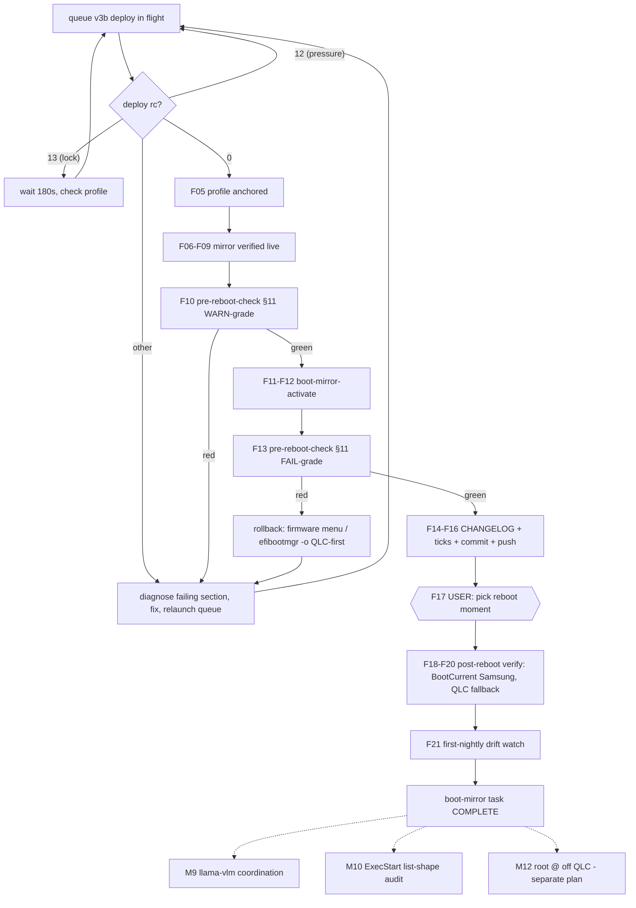

# SAMSUNG BOOT MIRROR — FINISH-LINE PARETO PLAN (2026-09-19 10:48)

_Sequence of: `2026-09-18_19-53_SAMSUNG-2ND-BOOT-DISK-PARETO-PLAN.md` (build phase, DONE) + `docs/status/2026-09-19_10-44_boot-mirror-deploy-queue-v3-two-llama-vlm-deploy-blockers-fixed.md` (deploy saga). This plan covers ONLY the remaining finish-line: deploy verification → firmware activation → user reboot → closeout, plus the bounded follow-up pool. Point-in-time snapshot; the living queue is `TODO_LIST.md` / `docs/todo/*.md` (harvest pending — TODO_LIST is under active refactor by a parallel session, deliberately untouched here)._

**Standing guard-rail: NO verschlimmbessern.** The QLC boot chain is never modified by any step below — everything is additive (mirror ESP + one new EFI entry). Worst case of any single step = firmware still boots the untouched QLC entry.

---

## 0. Situation (what is already true)

| Item | State (10:47) |
| --- | --- |
| Code | committed `260f86ef` (09-18) + `f0cfff20` (types fix 09:26) + ExecStart fix (10:29, daemon commit pending); all eval-green |
| Deploy | queue v3b fired 10:37:01 (gate-green x2), in pre-deploy validation; rc=12 → auto-retry, rc=13 → wait+re-check profile, other rc → stop+diagnose |
| Profile | `system-785` (target: advance + anchor `/run/current-system == profile`) |
| Blockers fixed today | llama-vlm `types.path` eval blocker; llama-vlm list-shaped ExecStart (§12 catch — real unit-load-breaking bug) |
| Mirror | NOT mounted yet (mount unit goes live with the deploy's fstab) |
| Firmware | QLC `Linux Boot Manager` 0x0001 first; Samsung entry created by activation step |

## 1. Pareto breakdown

### The 1% that delivers 51% — the switch itself
**`deploy lands → verify mirror → nix run .#boot-mirror-activate`**
Three commands. After them the firmware boots loader+kernel+initrd from the Samsung mirror on next reboot, QLC stays as fallback entry. This is the entire user ask ("switching asap").

### The 4% that delivers 64% — proof + record
**+ pre-reboot-check §11 (both grades) + CHANGELOG + plan ticks + commit/push.**
Verification that the armed state is actually sound (not phantom-green) and a durable record so future sessions don't re-derive any of this.

### The 20% that delivers 80% — the actual boot
**+ user reboot + post-reboot verification (BootCurrent = Samsung PARTUUID `023f66c0-…`, QLC fallback intact, pre-reboot-check green from the booted state) + first-nightly drift watch.**
Everything before the reboot is preparation; the reboot is the first real execution of the Samsung chain.

### The other 20% (to 100%)
- Root `@` off QLC (would make Samsung survive FULL QLC death — currently only the boot chain is redundant) — separate task, owner decision pending
- llama-vlm `/data` model downloads (feature ships dark without them) — owner decision
- `ExecStart`-list-shape eval-time audit (systemd-shape-audit candidate — §12 caught it late; flake-check should catch it early)
- Optional hardening: post-deploy §15 mirror-freshness assert, system-health mirror-age metric, deliberate QLC-fallback firmware-menu boot test, ESP growth watch

---

## 2. Comprehensive plan — medium granularity (30–100 min each, ALL remaining TODOs, sorted by importance/impact/effort/customer-value)

| # | Task | Importance | Impact | Effort | Customer value | Tier | Depends on |
| --- | --- | --- | --- | --- | --- | --- | --- |
| M1 | **Deploy completes + profile anchors** (queue v3b owns it; contingency: exit-4 on `boot-mirror-sync` → fix + re-queue) | CRITICAL | Everything rides on it | 0–60 min (autonomous) | Unblocks the switch | 1% | gate-green |
| M2 | **Verify mirror live** (mount by-uuid, loader/EFI/kernel entries, df, unit ran clean, diff-gate green) | CRITICAL | Catches a broken mirror BEFORE arming firmware | 15 min | Trust in the switch | 1% | M1 |
| M3 | **pre-reboot-check §11 WARN-grade** (exit 0) | CRITICAL | Independent audit incl. boot-chain, GC anchors | 10 min | Safety | 1% | M2 |
| M4 | **`boot-mirror-activate`** (Samsung first in BootOrder, QLC second; verify ✓ output + BootOrder) | CRITICAL | THE switch | 5 min | The ask | 1% | M3 |
| M5 | **pre-reboot-check §11 FAIL-grade** (armed state, still exit 0) | HIGH | Proves armed state sound | 10 min | Safety | 4% | M4 |
| M6 | **Record: CHANGELOG entry + Samsung plan-doc ticks 6/7/9 + commit + push** | HIGH | Durable record, no re-derivation | 30 min | Future sessions | 4% | M5 |
| M7 | **User reboot + post-reboot verification** (BootCurrent PARTUUID, `bootctl status`, pre-reboot-check green booted, QLC fallback second) | HIGH | First real Samsung boot | 20 min + reboot | The payoff | 20% | M4, USER |
| M8 | **First-nightly drift watch** (post-23:00: `boot-mirror-sync` re-ran, no diff drift, journal clean) | MEDIUM | Proves the converger holds without deploys | 15 min | Confidence | 20% | M7 |
| M9 | **llama-vlm closeout coordination** (flag both fixes to owning session; owner decides model downloads) | MEDIUM | Feature dark until models land | 15 min | Unblocks their feature | other 20% | independent |
| M10 | **`ExecStart` list-shape eval-time audit** (systemd-shape-audit class: `isList` ExecStart with >1 element on non-oneshot = argv mistake; negative test) | MEDIUM | Catches the §12 class at flake-check, not deploy | 60–100 min | Fleet-wide prevention | other 20% | independent |
| M11 | **Optional hardening batch** (post-deploy §15 freshness assert OR mirror-age metric — pick ONE, only if the skipped-sync class is ever observed) | LOW | Nice-to-have | 60 min | Marginal | other 20% | M8 evidence |
| M12 | **Root `@` off QLC — investigation + plan** (separate task; needs its own Pareto doc; do NOT start today) | LOW (now) | HUGE (later) | 100 min (plan only) | QLC-death survival | other 20% | M8 green, owner decision |

## 3. Fine breakdown — EVERY task ≤ 12 min each, sorted by importance/impact/effort/customer-value

| # | Subtask | Parent | Est | Verify by |
| --- | --- | --- | --- | --- |
| F01 | Poll queue log until `deploy rc=` line appears | M1 | 2 min ×N | log line |
| F02 | If rc=12: nothing (queue auto-retries) | M1 | 0 | next heartbeat |
| F03 | If rc=13: nothing (queue waits 180s, re-checks profile) | M1 | 0 | log line |
| F04 | If rc=1/other: read failing §, diagnose, fix, relaunch queue v3c | M1 | 12 min | § passes |
| F05 | `readlink /nix/var/nix/profiles/system` ≠ system-785 AND == `/run/current-system` | M1 | 1 min | anchored readlinks |
| F06 | `findmnt /boot-mirror` shows UUID `4F53-C156`, rw, vfat | M2 | 1 min | findmnt output |
| F07 | `ls /boot-mirror`: `loader/loader.conf`, `EFI/systemd/systemd-bootx64.efi`, `EFI/BOOT/BOOTX64.EFI`, `<generation entries>/` | M2 | 2 min | ls output |
| F08 | `df -h /boot-mirror` — usage sane vs 4G (kernels × entries) | M2 | 1 min | df output |
| F09 | `boot-mirror-sync` unit ran clean (via pre-reboot-check §11 output — journalctl restricted from bash tool) | M2 | 3 min | §11 report |
| F10 | `nix run .#pre-reboot-check` → exit 0, §11 WARN-grade green | M3 | 8 min | exit code + §11 lines |
| F11 | `nix run .#boot-mirror-activate` → prints ✓ line | M4 | 3 min | ✓ output |
| F12 | Verify BootOrder from activate output: Samsung entry FIRST, QLC `0x0001` SECOND | M4 | 2 min | BootOrder line |
| F13 | Re-run pre-reboot-check → exit 0, §11 now FAIL-grade green | M5 | 8 min | exit code |
| F14 | Write CHANGELOG entry (boot-mirror shipped + 2 llama-vlm blockers + rc=12/13 doctrine) | M6 | 10 min | entry reads correct |
| F15 | Tick Samsung plan-doc items 6, 7, 9 (leave 8 for post-reboot) | M6 | 2 min | checkboxes |
| F16 | `git status` → pathspec commit(s), detailed message(s) → push | M6 | 10 min | clean status + pushed |
| F17 | Hand reboot timing to user (single remaining user action) | M7 | 1 min | user answers |
| F18 | Post-reboot: `bootctl status` → Current Boot Loader PARTUUID `023f66c0-…` | M7 | 2 min | bootctl output |
| F19 | Post-reboot: pre-reboot-check green from booted state | M7 | 8 min | exit 0 |
| F20 | Post-reboot: QLC entry still second + one QLC fallback boot (optional firmware-menu test) | M7 | 10 min | manual boot OK |
| F21 | Morning after 23:00: sync re-ran, no drift alert, mirror df stable | M8 | 5 min | journal + df |
| F22 | Ping llama-vlm owning session: types fix + ExecStart fix (both surgical, documented) | M9 | 5 min | acknowledged |
| F23 | Owner decision: download the two GGUF sets (paths in configuration.nix e4b/cap) | M9 | 12 min | `/health` 200 |
| F24 | Audit: extend systemd-shape-audit with `isList ExecStart` class + negative test | M10 | 12 min ×5 | flake check red→green on fixture |
| F25 | (Only if skipped-sync ever observed) add §15 freshness assert | M11 | 12 min ×5 | assert fires on stale |
| F26 | (Only if drift class observed) mirror-age system-health metric | M11 | 12 min ×5 | metric + Gatus |
| F27 | Root `@` investigation doc (SEPARATE session; do not start) | M12 | — | n/a today |

**Progress rule:** F01–F16 are today's executable spine (~90 min wall-clock, mostly waiting on the build). F17+ are user-gated or next-day. Nothing in this list touches the QLC boot chain.

## 4. Execution graph

**Rollback at every red edge:** firmware boot menu (F8/F11/F12) or `efibootmgr -o` with QLC `Linux Boot Manager` first — the QLC chain itself is never modified by anything above.

## 5. Do-not-do list (verschlimmbessern guard)

1. NO `boot-mirror-sync` changes while the deploy is mid-flight (unit churn mid-activation = the exit-4 class).
2. NO TODO_LIST.md edits (parallel session owns its refactor; harvest from this plan later via docs-health HARVEST).
3. NO model downloads by me (llama-vlm is another session's in-flight feature — owner decision).
4. NO root `@` work today (separate task, needs its own plan).
5. NO reboots without the user (kills their desktop session — the only irreversible step in this plan).
6. NO sweeping parallel sessions' dirty files into commits (pathspec commits only; CHANGELOG shared-file risk checked at commit time).
