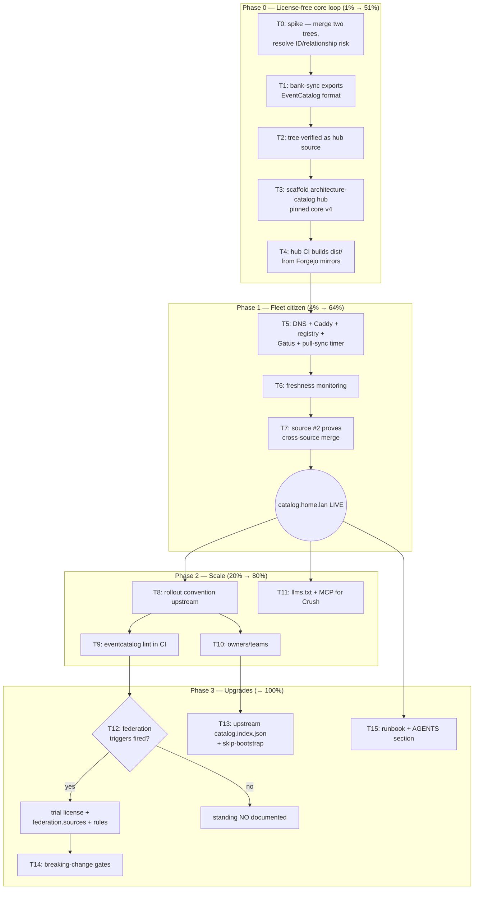

# EventCatalog Federation Hub — Comprehensive Pareto Plan

> **Status addendum (2026-09-24): HUB PHASE SHIPPED OUT-OF-BAND; SystemNix
> tiers NOT STARTED.** The hub repo (`eventcatalog-hub`, local Forgejo
> mirror `lars/eventcatalog-hub`) now implements Option B end-to-end:
> CI-generated source trees from Forgejo mirrors, `merge.py` union-merge
> with a strict governance gate (owners union, bare→versioned ref
> canonicalization, dangling-ref / version-pin-drift / coeffects
> validation), per-source governance lint (`scripts/lint-sources.sh`,
> plain-refs re-exports via the exporter's `WithPlainRefIDs`), and a
> scheduled stale-source probe (`scripts/check-stale-sources.sh` + 8h
> workflow). Sources onboarded: bank-sync, cqrs-htmx, and go-cqrs-lite's
> mesh-demo contexts (orders + billing). Research finding F4 is OUTDATED:
> the exporter ships `catalog.index.json` since 2026-09-24 (plus
> `WithSkipBootstrapFiles`, owners on every ownable kind). Driver plan and
> execution evidence: go-cqrs-lite
> `docs/planning/2026-09-23_22-12_SUPERB-data-mesh-federation-pareto-plan.md`
> + `docs/status/2026-09-24_13-32_data-mesh-completion-session.md`.
> **Still open here:** the hub build workflow has NEVER published a `dist`
> branch (owner: run `scripts/setup-forgejo.sh` on evo-x2 / check the
> Actions tab), and every SystemNix-side task in this plan (DNS/
> protectedVHost Layer 2, Gatus check, evo-x2 pull timer) remains not
> started — the serving chain cannot go live before the dist publish does.
> Original plan text below, unchanged.

- **Date:** 2026-09-22 23:27 CEST · **REV 3** (2026-09-23, owner decisions landed) · REV 2 (2026-09-23, self-review pass)
- **Status:** PLANNED (not started)
- **Goal:** One endpoint (`catalog.home.lan`) that aggregates the EventCatalog trees generated by every service using `go-cqrs-lite/catalog`, starting with bank-sync.
- **Anti-goal (Verschlimmbessern guard):** No SystemNix runtime changes until the hub-repo decision is made; this plan lands docs + TODO routing only.

## REV 2 changelog (what got better)

1. **License demoted from gate to upgrade.** REV 1 gated P0 on the Enterprise trial. Since Lars owns every source catalog, federation's team-ownership validation adds little today: a **license-free single hub** (CI copies each repo's committed `catalog/` tree into one EventCatalog project) delivers the same one-endpoint outcome with zero waiting. Federation becomes a Phase-2 upgrade with explicit triggers.
2. **Builds moved off the box into CI.** REV 1 built Astro nightly on evo-x2 (npm churn on a QLC-storm-prone box). REV 2: hub CI (Forgejo runner, sourcing Forgejo mirrors — GitHub-outage immune) builds `dist/`; the box only pulls static files. IO doctrine respected.
3. **Decision matrix added** (A Go hub / B license-free Node hub / C Enterprise federation) with B as default — REV 1 assumed C-with-fallback without evaluating A/B.
4. **New technical risk surfaced and front-loaded:** cross-source relationship resolution in a single merged catalog (ID collisions, domain scoping) is now spike task T0 — it is THE thing that can break option B.
5. **Version-skew risk made explicit:** exporter targets `@eventcatalog/core ^4.6.3`; EventCatalog majors (v2/v3/v4) change MDX/frontmatter shape — hub pins the v4 line and owns the upgrade choreography.

## REV 3 — owner decisions (2026-09-23 01:20 CEST, via questions tool)

1. **GO on Option B; hub repo = `LarsArtmann/eventcatalog-hub`** (renamed from the working title `architecture-catalog`).
2. **Source trees are CI-GENERATED, not committed**: hub CI checks out source repos (Forgejo mirrors) and runs each service's catalog export itself — no generated-file churn in source repos. Consequence: every source repo needs a deterministic, headless export command (bank-sync's `bank-sync catalog` already documents "No database is required" — F5).
3. **`catalog.home.lan` = Layer 2 `protectedVHost`** (behind Pocket ID, like dash/geo/searxng) — the merged catalog documents private architecture.

---

## 1. Research findings (verified 2026-09-22/23)

| # | Finding | Evidence |
|---|---------|----------|
| F1 | Built-in federation (`npx eventcatalog federate`) is an **Enterprise feature** — offline `license.jwt` (free trial: hello@eventcatalog.dev). Node 22+. | eventcatalog.dev/docs/federation/overview |
| F2 | Federation model: central catalog declares `federation.sources` (`github:owner/repo` + `path` + `ref`, or `file:`), validates cross-catalog ownership/versions, materializes into `federated/`, then `npm run build` renders ONE static site (`dist/`). | /docs/federation/first-federation, how-to/configure-github-sources |
| F3 | `go-cqrs-lite/catalog/v4/eventcatalog` writes a **complete EventCatalog project** (MDX + frontmatter, JSON schemas, `llms.txt`, own `eventcatalog.config.js`/`package.json` pinning `@eventcatalog/core ^4.6.3`). Producers/consumers auto-derived. | `catalog/eventcatalog/doc.go`, goldens `eventcatalog-config/package.snap` |
| F4 | Exporter does **NOT** emit `catalog.index.json` (federation builds the index per run — works, weaker source-side validation). | `rg 'catalog.index' catalog/` → none |
| F5 | **bank-sync is the only real consumer today**; its `bank-sync catalog` command exports AsyncAPI + D2 + Markdown to `docs/catalog` — EventCatalog format not wired yet. | `bank-sync/cmd/bank-sync/catalog.go:10-24,127,145` |
| F6 | SystemNix is greenfield for EventCatalog. House pattern for static-site services: registry entry + hand-written Caddy `file_server` vHost (systemd-timer-monitor precedent) + Gatus HTML check + DNS subdomain. | `rg eventcatalog` SystemNix → empty; AGENTS.md |
| F7 | Legacy free fallback: `@eventcatalog/generator-federation` (clone+copy, no validation). | /docs/federation/legacy-federation |
| F8 | **`docserver` is per-service only.** It serves OpenAPI/AsyncAPI UI + D2 + EventCatalog-style templ views for ONE catalog; `GenerateEventCatalog` is explicitly a startup-time MDX writer ("no meaningful way to serve it as a single HTTP response"). NOT a multi-service hub. | `catalog/docserver/docserver.go:1-25`, `docserver/eventcatalog.go:5-15` |
| F9 | **No Go round-trip loader exists** for exported EventCatalog trees — a Go hub cannot read other repos' exported trees back; merging in Go requires compile-time imports of every service's registry (world-module coupling) or upstream loader work. | `rg 'func Load|ReadTree' catalog/eventcatalog` → none |
| F10 | Fleet has its own CI: Forgejo + forgejo-runner, and **every GitHub repo is mirrored to Forgejo** (read mirror) — hub CI can source trees from `git.home.lan`, immune to GitHub outages (house flake-input doctrine). | AGENTS.md Forgejo mirror section |

## 2. Architecture decision matrix (NEW — the core of REV 2)

| Option | How | License | Cost | Verdict |
|--------|-----|---------|------|---------|
| **A. Go-native hub** | One Go binary imports every service's catalog registry, merges, serves via `docserver` / emits MDX at startup | none | Compile-time coupling to ALL services (F9: no tree loader); docserver UI ≠ EventCatalog web app; Astro build still needed for the real UI | **Rejected** — reevaluate only if upstream adds a tree loader |
| **B. License-free Node hub** ★ default (REV 3: CI-generated) | Hub CI checks out source repos (Forgejo mirrors), runs each service's catalog export headlessly, copies the generated trees into ONE EventCatalog project → `npm run build` → publish `dist/` (dist branch/artifact the box pulls) | none | No cross-catalog validation/lockfile/provenance; Go builds in hub CI; ID collisions across sources must be managed by convention (domain scoping) | **DECIDED 2026-09-23** — repo `eventcatalog-hub` |
| **C. Enterprise federation** | Hub runs `eventcatalog federate` over `github:`/`file:` sources | Enterprise (trial free) | Validation rules, lockfile, provenance, GitHub-source fetching | **Upgrade path** — adopt when triggers fire (see §7) |

**The contract that makes it "just work"** (unchanged): any service importing `go-cqrs-lite/catalog/v4` + one exporter call produces a source tree; the hub picks it up by one config/CI line.

---

## 3. Pareto breakdown (REV 2 — re-tiered)

| Tier | Delivers | Contents |
|------|----------|----------|
| **1% → 51%** | One live endpoint, license-free | bank-sync emits EventCatalog format (committed tree) + hub repo (option B) + hub CI builds `dist/` + Caddy serves it. **No license, no waiting.** |
| **4% → 64%** | Fleet citizen + proven generality | DNS/registry/Gatus/tile + box-side pull sync + post-deploy smoke + source #2 (cqrs-htmx demo) proves cross-source merge; **T0 spike resolves the ID-resolution risk**. |
| **20% → 80%** | Scales to "everything using catalog" | Rollout convention upstream (README + example + versioning), source #3+, `eventcatalog lint` free governance in CI, owners/teams, llms.txt + MCP for Crush. |
| **→ 100%** | Completeness + upgrades | Federation upgrade evaluation (triggers below) OR legacy-generator if ever needed; upstream `catalog.index.json` + skip-bootstrap options; breaking-change gates; runbook + AGENTS section. |

## 4. Comprehensive plan (30–100 min tasks, dependency- and impact-ordered)

| # | Task | Min | Impact | Phase |
|---|------|-----|--------|-------|
| T0 | **Spike: merge two generated trees into ONE EventCatalog project → `npm run build`** — do cross-source relationships resolve? ID collisions? domain scoping needed? (option B's only existential risk) | 60 | H | P0 |
| T1 | Wire EventCatalog export format into `bank-sync catalog`; verify the export runs HEADLESS in CI (no DB, no network) | 60 | H | P0 |
| T2 | Verify the generated tree is a valid hub source (local copy-in + build smoke; also probes federate behavior later) | 45 | H | P0 |
| T3 | Scaffold hub repo `LarsArtmann/eventcatalog-hub` (empty catalog, pinned `@eventcatalog/core` v4 line) + source-export layout + README | 45 | H | P0 |
| T4 | Hub CI (Forgejo runner, sources from Forgejo mirrors per F10): checkout sources → run each service's Go catalog export → merge trees → `npm run build` → publish `dist/` branch | 90 | H | P0 |
| T5 | NixOS serving leg: DNS `catalog` + Layer 2 protected vHost (REV 3) serving the pulled `dist/` + registry entry + Gatus (behind-auth probe semantics) + tile + pull-sync timer (atomic swap) | 90 | H | P1 |
| T6 | Freshness monitoring: build-stamp in `dist/` + Gatus age check + post-deploy smoke section | 45 | M | P1 |
| T7 | Onboard source #2 (cqrs-htmx catalog-demo) + verify cross-source graph end-to-end through the deployed hub | 60 | M | P1 |
| T8 | Rollout convention upstream: go-cqrs-lite `catalog/README.md` + `cmd/catalog-export` example + versioning guidance | 75 | H | P2 |
| T9 | Free governance: `eventcatalog lint` in hub CI (missing owners, dead links; supports external-catalog refs) | 45 | M | P2 |
| T10 | Owners/teams provisioning (frontmatter owners → writeTeam/writeUser convention per source repo) | 60 | M | P2 |
| T11 | AI access: `llms.txt` + EventCatalog MCP server in crushrc | 60 | M | P2 |
| T12 | Federation upgrade evaluation vs triggers (§7); if GO: trial license, `federation.sources` migration, validation rules; if NO: document standing decision | 45 | M | P3 |
| T13 | Upstream go-cqrs-lite exporter: `catalog.index.json` emission + skip-bootstrap-files option | 90 | M | P3 |
| T14 | Architecture change detection (breaking-change gates on source PRs) | 90 | M | P3 |
| T15 | Documentation: `docs/services/architecture-catalog.md` runbook + SystemNix AGENTS.md section | 60 | M | P3 |

## 5. Micro plan (≤12 min tasks)

| ID | Task | Min | Parent |
|----|------|-----|--------|
| 0.1 | Export demo + bank-sync-shaped fixture trees into one scratch catalog's content dir | 12 | T0 |
| 0.2 | `npm install && npm run build` scratch; record relationship/collision findings | 12 | T0 |
| 0.3 | If collisions: define domain-scoping convention (e.g. `bank-sync/*` IDs); note in hub README | 10 | T0 |
| 1.1 | Add `formatEventCatalog` const + flag help to `bank-sync/catalog.go` | 12 | T1 |
| 1.2 | Import `catalog/v4/eventcatalog`; `NewExporter(out).Export(cat)` in `renderCatalog` | 12 | T1 |
| 1.3 | Extend golden/fixture test for the new format | 10 | T1 |
| 1.4 | Run export; inspect tree (config, package.json, llms.txt, schemas) | 10 | T1 |
| 1.5 | Verify headless export in a CI-like container (no DB/network); wire export invocation into hub CI source list | 12 | T1 |
| 2.1 | `npm install` (Node 22 check) + `npm run dev` on bank-sync tree; pages render | 10 | T2 |
| 2.2 | Confirm which bootstrap files the hub needs vs which each source re-emits | 10 | T2 |
| 3.1 | Create hub repo `eventcatalog-hub` (`create-eventcatalog --empty`) | 10 | T3 |
| 3.2 | Pin `@eventcatalog/core` v4 line in hub package.json; document why | 8 | T3 |
| 3.3 | Define sources layout: per-source export command table (repo → export cmd → output dir) | 12 | T3 |
| 3.4 | Hub README: contract, layout, upgrade path | 10 | T3 |
| 4.1 | Forgejo Actions workflow: checkout mirrors → run Go exports → merge trees → npm ci → build | 12 | T4 |
| 4.2 | Publish `dist/` as a dist branch the box can pull | 12 | T4 |
| 4.3 | Trigger on source-push (webhook/poll) + nightly fallback cron | 12 | T4 |
| 4.4 | CI cache node_modules analogue; verify cold-build time | 10 | T4 |
| 5.1 | `catalog` DNS entry in `dns-local.nix` | 5 | T5 |
| 5.2 | Layer 2 vHost: registry `vHost.layer = "protected"`; extend helper for static root if needed (OpenSEO precedent for custom blocks) | 12 | T5 |
| 5.3 | Registry entry `services.integration.catalog` (Gatus, tile, monitored; no backup) | 12 | T5 |
| 5.4 | `architecture-catalog-sync` oneshot: pull `dist/` → atomic swap into serving root | 12 | T5 |
| 5.5 | Sync timer (hourly) + ioTier.background + deploy.sh provisioner entry | 10 | T5 |
| 5.6 | `nix flake check --no-build` + eval audits green | 12 | T5 |
| 5.7 | Deploy + post-deploy smoke (curl HTML, Gatus green, DNS answers) | 12 | T5 |
| 6.1 | Build-stamp file in `dist/` + Gatus freshness check | 10 | T6 |
| 6.2 | `post-deploy-check.sh` section: hub HTML + stamp age | 10 | T6 |
| 7.1 | Export cqrs-htmx catalog-demo tree; commit to that repo | 12 | T7 |
| 7.2 | Add as hub source #2; CI rebuild | 8 | T7 |
| 7.3 | Verify cross-source relationships render on deployed hub | 10 | T7 |
| 8.1 | go-cqrs-lite `catalog/README.md` federation/feeding section | 12 | T8 |
| 8.2 | `catalog/cmd/catalog-export` copy-paste example | 12 | T8 |
| 8.3 | Versioning guidance (when to `versionEvent`, changelogs) | 10 | T8 |
| 9.1 | Add `eventcatalog lint` step to hub CI; triage first findings | 12 | T9 |
| 9.2 | Wire external-catalog refs if lint config supports (docs check) | 10 | T9 |
| 10.1 | Teams/users convention + hub-side writeTeam/writeUser files | 12 | T10 |
| 10.2 | owners frontmatter on bank-sync + cqrs-htmx resources; rebuild | 10 | T10 |
| 11.1 | Enable `llmsTxt`; verify `/llms.txt` | 8 | T11 |
| 11.2 | EventCatalog MCP entry in crushrc; restart-session note | 12 | T11 |
| 12.1 | Evaluate federation triggers (§7) → GO/NO-GO note in hub README | 12 | T12 |
| 12.2 | If GO: email trial request + migrate sources to `federation.sources` + rules | 12 | T12 |
| 13.1 | Upstream: emit `catalog.index.json` (golden-tested) | 12 | T13 |
| 13.2 | Upstream: skip-bootstrap-files export option | 12 | T13 |
| 13.3 | Route via go-cqrs-lite TODO_LIST (cross-repo rule) | 8 | T13 |
| 14.1 | Evaluate `architecture-change-detection` for hub | 12 | T14 |
| 14.2 | Write PR pipeline-gate recipe | 12 | T14 |
| 15.1 | Write `docs/services/architecture-catalog.md` runbook | 12 | T15 |
| 15.2 | SystemNix AGENTS.md hub section | 12 | T15 |
| 15.3 | Plan handoff: ANNOTATE phases done; TODO recap | 8 | T15 |

## 6. Execution graph

## 7. Federation upgrade triggers (adopt option C when ANY fires)

1. ≥3 active sources AND a cross-source relationship broke silently in CI (option B has no validator).
2. A second maintainer/team joins (ownership validation becomes valuable).
3. Source trees want independent cadence/pinning (`eventcatalog.lock` provenance needed).
4. EventCatalog upstream ships federation features that require it (e.g. change-detection integration).

## 8. Risks & gotchas

1. **T0 is load-bearing (option B's existential risk):** EventCatalog resolves relationships by resource ID across the whole content tree — two sources both defining `OrderService` or unscoped message IDs will collide/mis-link. Mitigation: domain-scoped IDs per source (convention from 0.3).
2. **Bootstrap files in sources (F3):** each source tree re-emits `eventcatalog.config.js`/`package.json`; hub copy-in must NOT let source configs override the hub's. T2.2 inventories; T13.2 fixes upstream.
3. **No `catalog.index.json` (F4):** harmless for B (whole-tree build), only matters for C — T13.1.
4. **Version skew (F3/F1):** exporter writes for core `^4.6.3`; EventCatalog majors reshape MDX/frontmatter. Hub pins v4; upstream exporter bumps become coordinated upgrades (note in hub README + go-cqrs-lite release notes).
5. **Private sources:** hub CI reads Forgejo mirrors internally (F10) — no PAT needed in the default path; a PAT only enters if/when option C's `github:` fetchers are adopted (fine-grained, Contents:Read, sops).
6. **IO doctrine:** no Node/npm on evo-x2 at all in REV 2 — builds live in CI; the box only rsyncs static files (ioTier.background, atomic swap).
7. **Mirror freshness:** Forgejo mirrors pull every 8h by default — hub freshness is bounded by mirror cadence; acceptable for docs, noted in runbook.
8. **Shared-tree discipline:** SystemNix edits stay docs-only; pathspec commits.
9. **REV 3 — Go builds in hub CI (CI-generated trees):** every source needs a headless export command; runner needs Go + Node 22; a service whose export needs a DB or network cannot be a source without an exporter variant. Freshness chain: source push → mirror (≤8h) → CI → dist branch → box sync — mirror-dominated.

## 9. Verification checklist (definition of done per phase)

> **VERIFICATION RECORD (2026-09-23, sessions 1–4 — see
> `docs/status/2026-09-23_13-26_eventcatalog-hub-session3-t5-t13-executed.md`):**
> - **P0: DONE** (sessions 1–2). Two-tree scratch build resolved cross-source
>   relationships; hub CI code + E2E validated locally; first CI dispatch is
>   owner-gated (`setup-forgejo.sh`).
> - **P1: DONE code-side** (session 3). DNS/vHost/registry/sync/sops/smoke all
>   in-tree, `nix flake check --no-build` green, sync swap/prune/refusal +
>   collector paths fixture-verified (incl. a pre-deploy syntax-bug catch);
>   the LIVE `catalog.home.lan` 200 + Gatus-green legs are the owner-gated
>   go-live sequence (runbook § "Go-live checklist").
> - **P2: DONE at plan-corrected scope.** 2 sources (not ≥3 — onboarding more
>   is per-source adoption, routed); `eventcatalog lint` does NOT exist in the
>   free CLI — replaced by strict `linkValidation` + `@eventcatalog/linter` in
>   CI (rc=0, two rules at `warn` pending exporter upgrades); owners visible
>   on both sources; `/llms.txt` verified; MCP found Scale-license gated —
>   deliberately not wired.
> - **P3: DONE** (session 4). Federation NO-GO documented in the hub README
>   (all §7 triggers un-fired); `catalog.index.json` NOT emitted — routed to
>   go-cqrs-lite TODO_LIST (T13) with the free breaking-change gate recipe
>   shipping instead (hub `scripts/check-architecture-changes.sh`); runbook +
>   SystemNix AGENTS section merged. **Remaining owner-gated:** the §f/§g
>   go-live steps of the 13-26 report.

- **P0:** bank-sync tree serves via `npm run dev`; two-tree scratch catalog builds with resolved relationships (T0 memo); hub CI publishes `dist/` green.
- **P1:** `catalog.home.lan` 200 + Gatus green + tile; sync timer swaps atomically; stamp-age check live; cqrs-htmx source renders WITH cross-source links.
- **P2:** ≥3 sources; lint gate green in CI; owners visible; `/llms.txt` + Crush MCP query works.
- **P3:** federation GO/NO-GO documented; if GO: lockfile + validation rules active; upstream exporter emits `catalog.index.json` (golden-tested); runbook + AGENTS merged.

## 10. Cross-repo routing (TODO discipline)

- **SystemNix** (this repo): T5, T6, T11 (crushrc), T15 → `docs/todo/services.md` (entries landed 2026-09-22, REV 2 reworded: license no longer gates).
- **go-cqrs-lite**: T8, T13 → its own TODO_LIST.
- **bank-sync**: T1, T7 owner frontmatter → its own TODO_LIST.
- **Hub repo** (new): T0, T2–T4, T9, T12, T14 → its own TODO_LIST once created.
