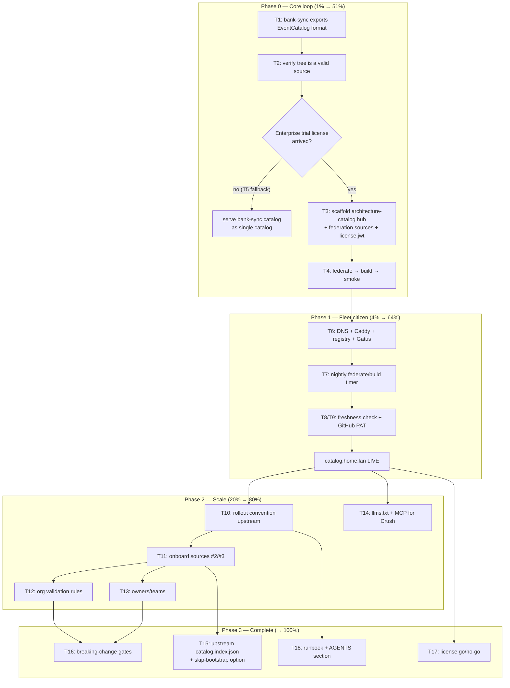

# EventCatalog Federation Hub — Comprehensive Pareto Plan

- **Date:** 2026-09-22 23:27 CEST
- **Status:** PLANNED (not started)
- **Goal:** One endpoint (`catalog.home.lan`) that federates the EventCatalog trees generated by every service using `go-cqrs-lite/catalog`, starting with bank-sync.
- **Anti-goal (Verschlimmbessern guard):** No changes to SystemNix runtime config until the hub repo + license decision is made; this plan only lands docs + TODO routing today.

---

## 1. Research findings (READ/UNDERSTAND/RESEARCH — verified 2026-09-22)

| # | Finding | Evidence |
|---|---------|----------|
| F1 | Built-in federation (`npx eventcatalog federate`) is an **Enterprise feature** — needs an offline `license.jwt` in the central catalog root; free trial via `hello@eventcatalog.dev`. Node 22+ required. | https://www.eventcatalog.dev/docs/federation/overview |
| F2 | Federation model: each team repo owns an EventCatalog project; the **central "organization" catalog** declares `federation.sources` (`github:owner/repo` + `path` + `ref`, or `file:` local), validates cross-catalog ownership/versions, and materializes everything into `federated/`; then `npm run build` renders ONE static site (`dist/`). `eventcatalog.lock` records what resolved. | /docs/federation/first-federation, /docs/federation/how-to/configure-github-sources |
| F3 | `go-cqrs-lite/catalog/v4/eventcatalog` already writes a **complete EventCatalog project** (MDX + frontmatter, JSON schemas, `llms.txt`, its own `eventcatalog.config.js` + `package.json` pinning `@eventcatalog/core ^4.6.3`). Producers/consumers auto-derived. | `go-cqrs-lite/catalog/eventcatalog/doc.go`, goldens `testdata/golden/{eventcatalog-config,package}.snap` |
| F4 | The exporter does **NOT** emit `catalog.index.json` (federation falls back to building the index for the run — works, just slower/no source-side validation). | `rg 'catalog.index' go-cqrs-lite/catalog` → no matches |
| F5 | **bank-sync is the only real consumer today** and already has a `bank-sync catalog` cobra command exporting **AsyncAPI + D2 + Markdown** to `docs/catalog` — the EventCatalog format is simply not wired yet. | `bank-sync/cmd/bank-sync/catalog.go:10-24,127,145` |
| F6 | SystemNix has zero EventCatalog references today — greenfield; the house pattern for a static site service is a registry entry + hand-written Caddy `file_server` vHost (systemd-timer-monitor precedent) + Gatus HTML body check + DNS subdomain. | `rg eventcatalog` in SystemNix → empty; AGENTS.md "Adding a Service" |
| F7 | Legacy free fallback exists: `@eventcatalog/generator-federation` (clone + copy, no validation). | /docs/federation/legacy-federation |

## 2. The contract that makes it "just work"

> Any service that imports `go-cqrs-lite/catalog/v4`, registers its messages, and runs the eventcatalog exporter once produces a federation-ready source tree. The hub picks it up by adding one config line.

---

## 3. Pareto breakdown

| Tier | Delivers | Contents |
|------|----------|----------|
| **1% → 51%** | "One endpoint showing real architecture docs" | bank-sync emits EventCatalog format into its repo; hub catalog federates that ONE source; static site served on evo-x2. License trial requested in parallel (F1 gate). Fallback while unlicensed: serve bank-sync's tree as a single (non-federated) catalog — the endpoint exists from day one. |
| **4% → 64%** | The endpoint is a first-class fleet citizen | NixOS integration (DNS + Caddy + registry + Gatus + tile), nightly federate/build timer with atomic dist swap, post-deploy smoke + freshness check, GitHub PAT for private sources. |
| **20% → 80%** | It scales to "everything that uses the catalog" | Rollout convention documented in go-cqrs-lite (README + example cmd + versioning guidance), 2nd/3rd sources onboarded, org-wide validation rules (`federation.rules` = error), owners/teams, llms.txt + MCP for Crush. |
| **Remaining 80% → 100%** | Completeness | Upstream exporter improvements (`catalog.index.json` emission, skip-bootstrap-files option), architecture-change-detection (breaking-change gates), license go/no-go (pay vs legacy generator), hub runbook + AGENTS section. |

---

## 4. Comprehensive plan (30–100 min tasks, sorted by impact/value)

| # | Task | Min | Impact | Effort | Phase |
|---|------|-----|--------|--------|-------|
| T1 | Wire EventCatalog export format into `bank-sync catalog` and commit the generated `catalog/` tree | 60 | H | M | P0 |
| T2 | Verify the generated tree is a valid federation source (local `file:` federate smoke) | 60 | H | M | P0 |
| T3 | Request Enterprise trial license (USER) + scaffold hub repo `LarsArtmann/architecture-catalog` with `federation.sources` | 45 | H | L | P0 |
| T4 | Hub end-to-end: `federate` → `build` → local serve smoke | 45 | H | L | P0 |
| T5 | Interim fallback: serve bank-sync's tree as a single catalog until the license lands | 45 | M | L | P0 |
| T6 | NixOS integration: DNS `catalog` + Caddy `file_server` vHost + registry entry + Gatus + tile | 90 | H | M | P1 |
| T7 | Nightly rebuild oneshot/timer (npm ci → federate → build → atomic dist swap) + deploy.sh wiring | 60 | H | M | P1 |
| T8 | Source freshness monitoring (build-stamp Gatus check + post-deploy smoke section) | 60 | M | L | P1 |
| T9 | GitHub read PAT for private sources wired into the hub build (EVENTCATALOG_GITHUB_TOKEN) | 30 | M | L | P1 |
| T10 | Rollout convention upstream: go-cqrs-lite `catalog/README.md` section + `cmd/catalog-export` example + versioning guidance | 75 | H | M | P2 |
| T11 | Onboard sources #2/#3 (cqrs-htmx catalog-demo, next real consumer) and verify cross-source relationships | 60 | M | M | P2 |
| T12 | Organization validation rules (`federation/missing-resource`, `federation/unresolved-version` = error) | 45 | M | L | P2 |
| T13 | Owners/teams provisioning in the hub (frontmatter owners → writeTeam/writeUser) | 60 | M | M | P2 |
| T14 | AI access: enable `llms.txt` + add EventCatalog MCP server to crushrc | 60 | M | L | P2 |
| T15 | Upstream go-cqrs-lite exporter: emit `catalog.index.json` + option to skip bootstrap files (config/package.json) | 90 | M | M | P3 |
| T16 | Architecture change detection: breaking-change gates on source PRs | 90 | M | M | P3 |
| T17 | License decision: trial → paid, or migrate to legacy `@eventcatalog/generator-federation` | 30 | M | L | P3 |
| T18 | Documentation: `docs/services/architecture-catalog.md` runbook + SystemNix AGENTS.md section | 60 | M | L | P3 |

## 5. Micro plan (≤12 min tasks, same order)

| ID | Task | Min | Parent |
|----|------|-----|--------|
| 1.1 | Add `formatEventCatalog` const + flag help to `bank-sync/catalog.go` | 12 | T1 |
| 1.2 | Import `catalog/v4/eventcatalog`; call `NewExporter(out).Export(cat)` in `renderCatalog` | 12 | T1 |
| 1.3 | Extend golden/fixture test for the new format | 10 | T1 |
| 1.4 | Run `bank-sync catalog --format eventcatalog`; inspect tree (config, package.json, llms.txt) | 10 | T1 |
| 1.5 | Commit generated `catalog/` tree (+ .gitignore decision for build junk) | 8 | T1 |
| 2.1 | `npm install` inside the generated tree (Node 22 present?) | 10 | T2 |
| 2.2 | `npm run dev` on the bank-sync tree; verify pages/schemas render | 10 | T2 |
| 2.3 | Probe federate against `file:../bank-sync/catalog` from a scratch hub (validates F-federation-source assumption + bootstrap-file behavior) | 12 | T2 |
| 3.1 | USER: email hello@eventcatalog.dev (subject: EventCatalog Federation Trial) | 5 | T3 |
| 3.2 | `npx @eventcatalog/create-eventcatalog@latest architecture-catalog --empty` | 10 | T3 |
| 3.3 | Add `federation.sources` entry for bank-sync (file: first, github: later) | 8 | T3 |
| 3.4 | Drop `license.jwt` into hub root; gitignore `federated/` + `.eventcatalog-cache/` | 5 | T3 |
| 4.1 | `npx eventcatalog federate` (file source); review diagnostics + `eventcatalog.lock` | 12 | T4 |
| 4.2 | Fix first-round validation warnings (ownership/versions) | 12 | T4 |
| 4.3 | `npm run build`; serve `dist/`; click through bank-sync resources | 10 | T4 |
| 5.1 | Fallback path: hub renders bank-sync tree as sole catalog (no federation) | 12 | T5 |
| 5.2 | Document fallback + upgrade path in hub README | 5 | T5 |
| 6.1 | Add `catalog` to `platforms/common/dns-local.nix` | 5 | T6 |
| 6.2 | Hand-written Caddy vHost (file_server root) in `caddy.nix` (registry `vHost.layer = "none"`) | 12 | T6 |
| 6.3 | Registry entry `services.integration.catalog` (checks, homepage tile, monitored unit; no backup) | 12 | T6 |
| 6.4 | `nix flake check --no-build` + eval audits green | 12 | T6 |
| 6.5 | Deploy + post-deploy smoke (curl HTML, Gatus green, DNS answers) | 12 | T6 |
| 7.1 | `architecture-catalog-build` oneshot: npm ci → federate → build → `dist.new`/`dist` swap | 12 | T7 |
| 7.2 | Timer nightly 04:40 + ioTier.background | 10 | T7 |
| 7.3 | Add unit to deploy.sh provisioner restart list (deploy-restart-audit) | 8 | T7 |
| 8.1 | Build-stamp file in `dist/` + Gatus freshness check (HTML body pat on stamp) | 10 | T8 |
| 8.2 | `post-deploy-check.sh` section: hub HTML + stamp age | 10 | T8 |
| 9.1 | Fine-grained PAT (Contents:Read, LarsArtmann) → sops → hub build env `EVENTCATALOG_GITHUB_TOKEN` | 12 | T9 |
| 9.2 | Switch hub source from `file:` to `github:LarsArtmann/bank-sync` + `path: catalog`, `ref: main` | 8 | T9 |
| 10.1 | go-cqrs-lite `catalog/README.md`: "Feed EventCatalog federation" section | 12 | T10 |
| 10.2 | `catalog/cmd/catalog-export` example template (copy-paste main.go) | 12 | T10 |
| 10.3 | Versioning guidance (when to `versionEvent`, changelog expectations) | 10 | T10 |
| 11.1 | Onboard cqrs-htmx catalog-demo as source #2 | 12 | T11 |
| 11.2 | Re-federate; verify cross-source relationships/ownership render | 10 | T11 |
| 12.1 | `federation.rules`: missing-resource/unresolved-version = error | 8 | T12 |
| 12.2 | Optional PR gate: `federate --verbose` in hub CI | 10 | T12 |
| 13.1 | Define teams/users in hub (SDK `writeTeam`/`writeUser` or resource files) | 12 | T13 |
| 13.2 | Attach `owners` frontmatter to bank-sync resources; re-federate | 10 | T13 |
| 14.1 | Enable `llmsTxt` in hub config; verify `/llms.txt` served | 8 | T14 |
| 14.2 | Add EventCatalog MCP server entry to crushrc (qmd-style), restart-session note | 12 | T14 |
| 15.1 | Upstream: exporter emits `catalog.index.json` | 12 | T15 |
| 15.2 | Upstream: `SkipBootstrapFiles` option (config.js/package.json) | 12 | T15 |
| 15.3 | Upstream tests; route via go-cqrs-lite TODO_LIST (cross-repo rule) | 12 | T15 |
| 16.1 | Evaluate `architecture-change-detection` config for the hub | 12 | T16 |
| 16.2 | Write the PR pipeline-gate recipe | 12 | T16 |
| 17.1 | License go/no-go + cost note; legacy-generator migration plan if NO | 12 | T17 |
| 18.1 | Write `docs/services/architecture-catalog.md` runbook | 12 | T18 |
| 18.2 | SystemNix AGENTS.md section for the hub service | 12 | T18 |
| 18.3 | Plan handoff: ANNOTATE this doc when phases complete; TODO recap | 8 | T18 |

---

## 6. Execution graph

## 7. Risks & gotchas (from research — do not rediscover)

1. **License gate (F1):** nothing P0-blocks without it EXCEPT `federate`; the T5 fallback keeps the endpoint alive meanwhile. Request the trial FIRST (parallel to T1/T2).
2. **Bootstrap files in sources (F3):** the exporter emits `eventcatalog.config.js`/`package.json` into each source tree; the hub owns its own config. Verify at T2.3 how federate treats them; if noisy → T15.2 upstream option.
3. **No `catalog.index.json` (F4):** works without it; T15.1 makes sources self-describing and validation stronger.
4. **Private repos:** `github:` sources need `EVENTCATALOG_GITHUB_TOKEN` (fine-grained PAT, Contents:Read) — same class as `NIX_GITHUB_RO_TOKEN`. Never inline.
5. **Build cost on evo-x2:** Astro builds are small at this fleet size, but ride `ioTier.background` and the existing IO-PSI gates; never stack a rebuild on a btrbk send window (house freeze doctrine).
6. **Version skew:** exporter pins `@eventcatalog/core ^4.6.3`; hub scaffolded from latest create-eventcatalog. Sources are read as files by federate (no core install needed), but pin hub deps deliberately and note the versions in the hub README.
7. **Shared-tree discipline:** SystemNix working tree is multi-session; this plan lands docs only today, pathspec-committed.

## 8. Verification checklist (definition of done per phase)

- **P0:** `bank-sync catalog --format eventcatalog` tree serves via `npm run dev`; scratch federate against `file:` source succeeds; hub `npm run build` produces `dist/` containing bank-sync resources.
- **P1:** `catalog.home.lan` answers 200 with EventCatalog HTML; Gatus green; nightly timer journal shows federate+build with dist swap; post-deploy smoke passes.
- **P2:** ≥3 sources federated with cross-source relationships rendered; validation rules fire on a deliberately broken fixture; `/llms.txt` + MCP queries work from Crush.
- **P3:** upstream exporter emits `catalog.index.json` (golden-tested); breaking-change gate blocks a fixture PR; runbook + AGENTS section merged.

## 9. Cross-repo routing (TODO discipline)

- **SystemNix** (this repo): T6–T9, T14 (crushrc), T18 → tracked in `docs/todo/services.md` (decision/blocked entries added today).
- **go-cqrs-lite**: T10, T15 (upstream exporter work) → its own TODO_LIST.
- **bank-sync**: T1, T11, T13 owner frontmatter → its own TODO_LIST.
- **Hub repo** (new): T3–T5, T12, T16, T17 → its own TODO_LIST once created.
