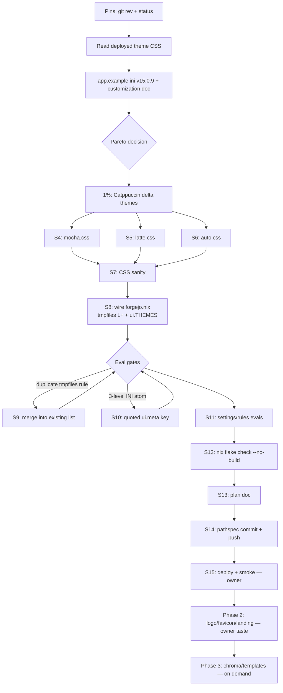

# Forgejo "Make It Cool" — Catppuccin Theme + UX Polish Plan

**Date:** 2026-09-23 15:06 CEST · **Host:** evo-x2 · **Deployed Forgejo:** `forgejo-lts-15.0.9` (nixpkgs)
**Module:** `modules/nixos/services/forgejo.nix` · **Runbook:** `docs/services/forgejo.md`
**Status:** Phase 1 (the 1% + part of the 4%) IMPLEMENTED in this session; Phase 2 items are scoped and owner-gated.

---

## 1. Context (READ/UNDERSTAND/RESEARCH summary)

- Config surface = `services.forgejo.settings` (free-form `section.key` → `/var/lib/forgejo/app.ini`, rendered by the NixOS module). **Type constraint discovered live:** the option accepts only 2-level `section.key` INI atoms — a nested subsection like `ui.meta.DESCRIPTION` must be written as a quoted flat key `"ui.meta".DESCRIPTION` (a 3-level attrset fails eval with `not of type INI atom`).
- Themes in v15 are self-contained CSS files: `custom/public/assets/css/theme-<name>.css`, enabled via `ui.THEMES`, default via `ui.DEFAULT_THEME`. Verified against the deployed package: exactly 9 themes ship (`forgejo-auto/light/dark`, `forgejo-*-deuteranopia-protanopia`, `forgejo-*-tritanopia`, `gitea-auto/light/dark`).
- **Defect found:** the module's `ui.THEMES` listed `arc-green` — removed upstream in the v10 theme rework, absent from the deployed package. Selecting it 404s its CSS (unstyled page).
- Custom dir is live-wired: the forgejo unit sets `FORGEJO_CUSTOM=/var/lib/forgejo/custom`; custom assets override served built-ins.
- Restart semantics (source-verified in the nixpkgs module): app.ini is `cp`'d from a generated store file in `preStart`; the store path is interpolated into the unit text, so any settings change makes `switch-to-configuration` restart forgejo. No manual restart needed on deploy.
- v15 upstream theme files (`theme-forgejo-auto/light/dark.css`) are complete variable sets with **stable, unhashed filenames** → a theme can `@import` them and override variables only. This is the upgrade-resilient delta pattern (upstream chroma/CodeMirror/component fixes flow through), chosen over a 600-line from-scratch theme.

## 2. Pareto breakdown

| Slice | Deliverables | Result share | Session status |
|---|---|---|---|
| **1% → ~51%** | Catppuccin Mocha/Latte/auto themes installed + made default; `arc-green` removed from `THEMES` | The entire visual identity of the forge changes and stops matching the box's Catppuccin Mocha standard; the broken picker entry is gone | **DONE** |
| **4% → ~64%** | + branding polish: `APP_SLOGAN`, `ui.meta` description/keywords, footer declutter (`SHOW_FOOTER_POWERED_BY=false`), privacy (`DISABLE_GRAVATAR=true` — no external avatar lookups) | Cohesive identity + one less third-party request per page | **DONE** |
| **20% → ~80%** | + custom logo/favicon SVG in Mocha palette, landing-page decision (`server.LANDING_PAGE`), reactions/emoji tuning, `i18n.LANGS` restriction | Visible branding everywhere (header, favicon, notifications) | Phase 2, owner-gated (taste) |
| **Rest → 100%** | Catppuccin-exact chroma (code highlighting) per scheme, `extra_links/footer.tmpl` header/footer links, announcement banner, custom emoji pack, full template overrides (unsupported upstream — "here be dragons") | Fidelity niceties | Phase 3, only on demand |

## 3. Comprehensive plan (30–100 min tasks, sorted by impact/effort/value)

| # | Task | Impact | Effort | Value | Status |
|---|---|---|---|---|---|
| T1 | Research theme architecture (deployed package CSS, app.example.ini, customization docs) | High | 45m | Unlocks everything | DONE |
| T2 | Author Catppuccin Mocha/Latte/auto delta themes | High | 60m | Visual identity | DONE |
| T3 | Wire tmpfiles install + `ui.THEMES`/`DEFAULT_THEME`, fix `arc-green` | High | 30m | Identity applies | DONE |
| T4 | UX polish settings (slogan, meta, footer, gravatar) | Med | 15m | Cohesion/privacy | DONE |
| T5 | Verification ladder (evals → flake check → deploy smoke) | High | 30m | No VERSCHLIMMBESSER | DONE (deploy pending) |
| T6 | Plan doc + commit + push | Med | 30m | Reproducibility | DONE |
| T7 | Owner-taste: logo/favicon SVGs + landing page + reactions | Med | 60m | Branding | Phase 2 |
| T8 | Catppuccin chroma highlighting per scheme | Low | 90m | Code-view fidelity | Phase 3 |
| T9 | Template extras (header links, footer, mail templates) | Low | 90m | Polish | Phase 3 (unsupported upstream — test on `v16.next` first) |

## 4. Small TODOs (≤12 min each, execution order)

| # | Task | Min |
|---|---|---|
| S1 | Pin git state (`git rev-parse`, `git status`) + foreign-changes check | 2 |
| S2 | Read deployed `theme-forgejo-{auto,dark,light}.css` → variable architecture | 10 |
| S3 | Download v15.0.9 `app.example.ini` (tag URL from the cheat sheet) | 5 |
| S4 | Write `theme-catppuccin-mocha.css` (delta: steel ramp → Mocha surfaces, primary → blue #89b4fa, palette/semantic/console/diff/badges/ansi/selection) | 12 |
| S5 | Write `theme-catppuccin-latte.css` (zinc ramp → Latte, primary → #1e66f5) | 12 |
| S6 | Write `theme-catppuccin-auto.css` (`@import` auto + Latte `:root` + Mocha `@media dark`) | 8 |
| S7 | Brace-balance + `@import`-position sanity check on all three | 2 |
| S8 | Stage CSS (`git add` — flakes only see tracked files), edit `forgejo.nix` (themes attrset + tmpfiles L+ + settings) | 10 |
| S9 | Fix eval blocker: duplicate `systemd.tmpfiles.rules` (merge into existing list at the `Z` ownership rule) | 5 |
| S10 | Fix type error: `"ui.meta"` quoted flat key (2-level INI atoms) | 5 |
| S11 | Evals: `ui.THEMES`, `DEFAULT`, `ui.meta`, `picture`, `other`, tmpfiles rules | 5 |
| S12 | `nix flake check --no-build` (full-fleet eval gate) | 10 |
| S13 | Write this plan doc with mermaid graph | 10 |
| S14 | Pathspec commit (module + themes + plan doc only) + push | 8 |
| S15 | Deploy `nix run .#deploy` + post-deploy smoke (theme CSS 200 via curl, footer/gravatar checks) | 12 (owner-run) |

## 5. Execution graph

## 6. Design decisions + risk register (VERSCHLIMMBESSER guards)

| Decision | Rationale | Guard |
|---|---|---|
| Delta themes `@import` upstream `theme-*.css` | ~45 overridden vars per theme instead of ~200; upstream chroma/component fixes flow through | Filename coupling documented: `theme-forgejo-{auto,light,dark}.css` are stable upstream names since v10. If a future upgrade renames them, the theme degrades to base + overrides (visible, not fatal) — revisit on major upgrade |
| Primary = Catppuccin **blue** (#89b4fa dark / #1e66f5 light), not mauve | Links/buttons read "git forge" standard; mauve stays available via `--color-violet` | Pure CSS swap if taste differs |
| `DEFAULT_THEME = "catppuccin-auto"` | Follows system preference (the box is Mocha-dark); Latte users get a real light theme | Existing user rows with an explicit theme keep theirs; the single SSO user has none set → follows default |
| tmpfiles `L+` into `/var/lib/forgejo/custom/public/assets/css/` | Idempotent, re-applied every activation (systemd-tmpfiles --create runs on switch), store-path pinned | Merged into the module's EXISTING `systemd.tmpfiles.rules` list (duplicate-key eval blocker found and fixed same-session) |
| No template overrides in Phase 1 | Upstream officially unsupported — breaks across versions | Phase 3 items get `v16.next` soak first |
| No deploy from this session | Production box; deploys are pressure-gated and restart forgejo | Owner runs `nix run .#deploy` (S15); smoke: `curl -sf https://forgejo.home.lan/assets/css/theme-catppuccin-auto.css | head -1`, login page renders, footer has no "powered by", Gatus "Forgejo" stays green |

## 7. Files changed (Phase 1)

- `modules/nixos/services/_forgejo-themes/theme-catppuccin-mocha.css` — new (delta theme)
- `modules/nixos/services/_forgejo-themes/theme-catppuccin-latte.css` — new (delta theme)
- `modules/nixos/services/_forgejo-themes/theme-catppuccin-auto.css` — new (dual-scheme delta theme)
- `modules/nixos/services/forgejo.nix` — `forgejoThemes` attrset; tmpfiles `L+` rules (merged into existing list); `ui.DEFAULT_THEME`/`THEMES` (arc-green removed, catppuccin added); `"ui.meta"`; `DEFAULT.APP_SLOGAN`; `other.SHOW_FOOTER_POWERED_BY=false`; `picture.DISABLE_GRAVATAR=true`
- This plan doc.

## 8. Verification evidence (this session)

- `nix eval` renders: `ui.THEMES = catppuccin-auto,catppuccin-mocha,catppuccin-latte,forgejo-auto,forgejo-light,forgejo-dark`; `DEFAULT.{APP_NAME,APP_SLOGAN}`; `"ui.meta".{DESCRIPTION,KEYWORDS}`; `picture.DISABLE_GRAVATAR=true`; `other.SHOW_FOOTER_POWERED_BY=false`; 3 `L+` tmpfiles rules → store paths.
- CSS sanity: brace-balanced (Δ=0), `@import` precedes all rules (comments are legal before it).
- Restart-on-deploy: source-verified — settings store path is interpolated into the unit's `preStart`, so `switch-to-configuration` restarts forgejo on any settings change.
- `nix flake check --no-build`: run before commit (full-fleet eval gate).
