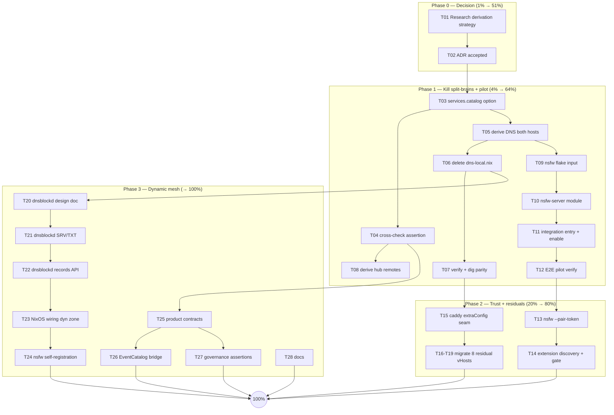

# Dynamic Service Mesh &amp; Registry — Derive Everything From Service Declarations

- **Date:** 2026-09-23 18:15
- **Status:** PLANNED (not started)
- **Scope:** `~/projects/SystemNix` (primary), `~/projects/dnsblockd`, `~/projects/nsfw-classifier` (pilot)
- **Origin:** Discovery discussion for nsfw-server on the LAN → "make services more dynamic in SystemNix-style, config inside the services, enable Data Meshes"

---

## 1. Context — what already exists (do not rebuild!)

The self-registration pattern is **already deployed**. `services.integration`
(`modules/nixos/services/integration.nix:113`) is a central registry that 49
service modules populate _inside their own module_, fanning out to:

| Consumer                            | Seam                                                         | Where                                              |
| ----------------------------------- | ------------------------------------------------------------ | -------------------------------------------------- |
| Caddy vHosts                        | `services.caddy-config.extraVHosts`                          | `integration.nix:429-439` → `caddy.nix:145-194`    |
| Gatus probes + Discord alerts       | `services.gatus-config.extraEndpoints`                       | `integration.nix:440-460` → `gatus-config.nix:960` |
| PapDashboard tiles                  | `services.papdashboard.extraTiles`                           | `integration.nix:461-465`                          |
| Backups                             | `services.backup-coordination.backups`                       | `integration.nix:466-468`                          |
| System health                       | `services.system-health.extraMonitoredServices`              | `integration.nix:469-471`                          |
| SigNoz/OTel coverage + OIDC clients | `signoz-coverage`, `otel-endpoint-audit`, `pocket-id-config` | `integration.nix:475-494`                          |

Eval-time governance already exists: subdomain-exists assertion
(`integration.nix:391-407`), layer/subdomain/port consistency (`:408-413`),
port collision throw (`lib/default.nix:156-165`), Exec-port regex audit
(`port-registry-audit.nix`), gatus reverse-coverage audit
(`gatus-coverage-audit.nix`). Doctrine: `AGENTS.md:55-67`.

**What is still hand-wired (the gaps this plan closes):**

| Gap                         | Today                                                                                                        | Evidence                                                                  |
| --------------------------- | ------------------------------------------------------------------------------------------------------------ | ------------------------------------------------------------------------- |
| DNS subdomains              | Hand-list in `platforms/common/dns-local.nix`, _asserted_ against registry, duplicated into two host configs | `dns-blocker-config.nix:75-85`, `rpi3/default.nix:112-123`, ROADMAP.md:71 |
| health-dashboard federation | Central `remotes` hand-list                                                                                  | `health-dashboard.nix:50-62`, `configuration.nix:925-930`                 |
| ~8 hand-written vHosts      | `auth`, `paperless`, `tasks`, `seo`, `dnsblock*`, `voice`/`whisper`, `monitor`, `timers` in caddy.nix        | `caddy.nix:235-389`                                                       |
| Runtime dynamics            | None — Nix is build-time static; no way for a service instance to appear at runtime                          | —                                                                         |
| Mesh product contracts      | No `owner`/`api`/`exports`/`SLO` fields; EventCatalog not registry-driven                                    | `architecture-catalog.nix` (Forgejo sync only)                            |

**dnsblockd facts** (verified 2026-09-23): sole LAN resolver on keepalived VIP
`192.168.1.53` (evo-x2 master, rpi3 backup), zone `home.lan`; local records are
**A/AAAA only** (`internal/dns/localzone.go:56-101`); no SRV/TXT/PTR/HTTPS; no
wildcard answers (explicit subdomain list required); config keys
`dns_local_records` / `dns_local_zones` (`internal/config/config.go:134-135`).

---

## 2. Goals &amp; Non-Goals

**Goals**

1. One declaration per service (subdomain, port, checks, product metadata) — everything else derived.
2. Zero split-brains: no parallel hand-lists for DNS, federation, or vHosts.
3. A runtime-dynamic tier: services can register themselves into DNS at boot (TTL + expiry), without weakening the static Nix floor.
4. nsfw-classifier as the pilot exercising every tier.

**Non-Goals (Verschlimmbesser guardrails — HARD)**

- **No `mkIf` shape regressions** — the `optionalAttrs (options ? ...)` guard-shape doctrine stands (`integration.nix:375-386`, see `docs/status/2026-09-15_17-57_integration-mkif-survivable-shape-evaluation.md`).
- **No codegen drift** — DNS/vHost/gatus config stays _derived at Nix eval time_, never generated files on disk.
- **Keepalived parity is sacred** — evo-x2 and rpi3 must serve _byte-identical_ `home.lan` answers (VIP failover). Every derivation is verified with `dig` against both hosts.
- **Port registry stays central** (`lib/ports.nix`) — it is a namespace _allocator_ (like IANA), not a declaration; modules keep referencing it to fill their registry entry.
- **vHost migrations must preserve exact behavior** — paperless `/admin` 403, `seo` GSC-callback exemption, `auth` oauth2-proxy specifics. One migration = one verified commit, no batching.
- **dnsblockd changes need real query verification** (actual `dig` answers, not unit tests alone) — the ORT-api-guard lesson: a pin without a live check fails silently.
- **No secrets in new code paths** — dynamic-record API auth uses sops-provisioned tokens; never env-plainspread credentials.
- VM tests keep co-importing `integration.nix` (open wart, `docs/todo/pipeline.md:115`) — noted, not fixed here.

---

## 3. Pareto Analysis — what really delivers

| Tier           | Work                                                                                                                                                                                                             | Cumulative result                                                                                   |
| -------------- | ---------------------------------------------------------------------------------------------------------------------------------------------------------------------------------------------------------------- | --------------------------------------------------------------------------------------------------- |
| **1% → 51%**   | Derive DNS `localRecords` on **both** DNS hosts from a host-independent service registry (T01–T07). DNS is the single dependency beneath vHosts, gatus URLs, hub federation, extension discovery, and the pilot. | Split-brain dead; platform-wide derivation unblocked; pilot DNS free                                |
| **4% → 64%**   | + Derive health-dashboard `remotes` (T08) + nsfw-classifier pilot end-to-end (T09–T12).                                                                                                                          | First user-visible outcome: `nsfw.home.lan` live, monitored, federated — added with zero hand-edits |
| **20% → 80%**  | + nsfw pairing token (T13), extension discovery (T14), residual vHost migration (T15–T19).                                                                                                                       | Trust floor for discovery; registry = _complete_ integration surface                                |
| **80% → 100%** | dnsblockd SRV/TXT + dynamic records API `dyn.home.lan` (T20–T23), nsfw self-registration (T24), product contracts (T25), EventCatalog bridge (T26), governance (T27), docs (T28).                                | Full mesh: static floor + dynamic tier + product contracts + computational governance               |

---

## 4. Comprehensive Plan — tasks 30–100 min (ALL todos, sorted by impact/value/effort)

| #   | Task                                                                                                                                                                                                 | Repo            | Min | Impact   | User value           | Tier | Depends  |
| --- | ---------------------------------------------------------------------------------------------------------------------------------------------------------------------------------------------------- | --------------- | --- | -------- | -------------------- | ---- | -------- |
| T01 | Research cross-host registry derivation: (A) new host-independent `services.catalog` option vs (B) flake cross-ref `nixosConfigurations.evo-x2` vs (C) keep shared list + CI audit. Write ADR draft. | SystemNix       | 90  | critical | unblocks all         | 1%   | —        |
| T02 | Decide + finalize ADR (recommend A: "what exists" must be host-independent; "what runs here" stays in `services.integration`)                                                                        | SystemNix       | 30  | critical | prevents rework      | 1%   | T01      |
| T03 | Introduce `services.catalog.<name>` declarations (subdomain, port, owner, description, healthPath); populate cv + 3 exemplars                                                                        | SystemNix       | 90  | critical | kills split-brain    | 1%   | T02      |
| T04 | Cross-check assertion `services.integration` ↔ `services.catalog` + eval test                                                                                                                        | SystemNix       | 45  | high     | governance           | 1%   | T03      |
| T05 | Derive `localRecords` on evo-x2 AND rpi3 from catalog (keep apex + `*.home.lan` wildcard records)                                                                                                    | SystemNix       | 60  | critical | DNS parity           | 1%   | T03      |
| T06 | Delete `dns-local.nix` hand-list; rewire assertions; dead-ref sweep                                                                                                                                  | SystemNix       | 45  | high     | single source        | 1%   | T05      |
| T07 | Verify: `nix flake check`, VM tests, `dig` parity vs both DNS hosts                                                                                                                                  | SystemNix       | 45  | high     | safety               | 1%   | T06      |
| T08 | Derive health-dashboard `remotes` from registry entries with checks (host-local eval, no cross-host problem)                                                                                         | SystemNix       | 45  | medium   | mesh consumption     | 4%   | T04      |
| T09 | Add nsfw-classifier flake input + pin + vendor hash                                                                                                                                                  | SystemNix       | 30  | medium   | pilot prereq         | 4%   | T05      |
| T10 | `nsfw-server` NixOS module: systemd unit, hardening (DynamicUser, ProtectSystem), loopback bind, models/ + cache dirs, ROCm variant choice                                                           | SystemNix       | 90  | high     | pilot                | 4%   | T09      |
| T11 | nsfw integration entry: `subdomain="nsfw"`, `port=ports.nsfw (8104)`, `vHost.layer="plain"`, checks `/readyz` + `/health`; register port; enable on evo-x2                                           | SystemNix       | 45  | high     | pilot visible        | 4%   | T10      |
| T12 | End-to-end verify: `https://nsfw.home.lan`, classify round-trip, gatus green, hub federation shows nsfw                                                                                              | SystemNix       | 45  | high     | **first outcome**    | 4%   | T11      |
| T13 | nsfw-server `--pair-token`: generate + persist + `/readyz` echo + Go tests (discovery finds candidates, never trusts)                                                                                | nsfw-classifier | 90  | high     | trust floor          | 20%  | T12      |
| T14 | Extension: candidate-URL list (`nsfw.home.lan` → `localhost:8080`), `/readyz` fingerprint + token gate before first upload, bun tests                                                                | nsfw-extension  | 90  | high     | auto-discovery       | 20%  | T13      |
| T15 | Caddy `vHost.extraConfig` seam option                                                                                                                                                                | SystemNix       | 45  | medium   | completeness         | 20%  | T07      |
| T16 | Migrate `auth` + `paperless` vHosts (preserve oauth2-proxy chain, `/admin` 403)                                                                                                                      | SystemNix       | 45  | medium   | zero hand-vhosts     | 20%  | T15      |
| T17 | Migrate `tasks` + `seo` (preserve GSC-callback exemption)                                                                                                                                            | SystemNix       | 45  | medium   | zero hand-vhosts     | 20%  | T15      |
| T18 | Migrate `monitor` + `voice`/`whisper`                                                                                                                                                                | SystemNix       | 45  | medium   | zero hand-vhosts     | 20%  | T15      |
| T19 | Migrate `dnsblock`/`dnsblockd` + static `timers` root vHost                                                                                                                                          | SystemNix       | 45  | medium   | zero hand-vhosts     | 20%  | T15      |
| T20 | dnsblockd design doc: typed local records (SRV/TXT) + `dyn.home.lan` records API (auth, TTL, expiry) — own planning doc in dnsblockd                                                                 | dnsblockd       | 100 | high     | dynamic tier         | 100% | T06      |
| T21 | dnsblockd: implement SRV/TXT in `localzone.go` + config surface + unit/handler tests                                                                                                                 | dnsblockd       | 100 | high     | DNS-SD enabler       | 100% | T20      |
| T22 | dnsblockd: records REST API (`PUT/DELETE /api/records`, sops token auth, TTL sweeper) + OpenAPI + tests                                                                                              | dnsblockd       | 100 | high     | runtime registration | 100% | T21      |
| T23 | dnsblockd NixOS module options (dyn zone, API token) + SystemNix wiring on both hosts                                                                                                                | both            | 60  | medium   | platform capability  | 100% | T22      |
| T24 | nsfw-server room instances self-register into `dyn.home.lan` (heartbeat, goodbye on shutdown)                                                                                                        | nsfw-classifier | 60  | medium   | full dynamic story   | 100% | T23, T13 |
| T25 | Registry product contracts: `owner`, `api`, `exports`, `slo` fields + fetchability assertion                                                                                                         | SystemNix       | 90  | medium   | mesh formalization   | 100% | T04      |
| T26 | EventCatalog bridge: generator renders catalog nodes from registry → Forgejo dist branch                                                                                                             | SystemNix       | 90  | medium   | discovery UI         | 100% | T25      |
| T27 | Governance: "every registered port must have ≥1 check" + product-field audit updates                                                                                                                 | SystemNix       | 60  | medium   | mesh governance      | 100% | T25      |
| T28 | Docs: SystemNix AGENTS/ROADMAP (tick :71)/CHANGELOG; nsfw-classifier AGENTS discovery section                                                                                                        | both            | 60  | low      | maintainability      | 100% | all      |

Total ≈ 1,800 min ≈ 30 h across three repos.

---

## 5. Micro Plan — every task broken to ≤12 min steps

| Macro | Micro steps (each ≤12 min)                                                                                                                                                                                                                                                                                                  |
| ----- | --------------------------------------------------------------------------------------------------------------------------------------------------------------------------------------------------------------------------------------------------------------------------------------------------------------------------- |
| T01   | m1 map host-import graph for modules (10) · m2 sketch option A: catalog module + eval implications (15→12) · m3 sketch option B: flake self-ref eval, recursion/time cost (12) · m4 sketch option C: shared list + CI audit (10) · m5 draft ADR with decision matrix (30→3×10) · m6 peer-check vs guard-shape doctrine (12) |
| T02   | m1 read ADR once more against §2 non-goals (15) · m2 decision + ADR status→accepted, commit (15)                                                                                                                                                                                                                            |
| T03   | m1 declare `services.catalog` option (types: attrsOf submodule) (12) · m2 catalog entry for cv (12) · m3 entries for forgejo + miniflux + health-dashboard (3×12) · m4 import catalog module on both hosts, eval (12)                                                                                                       |
| T04   | m1 assertion: integration subdomain ∈ catalog (12) · m2 assertion: catalog entry without integration entry = warn-list (12) · m3 eval test `tests/test-catalog.nix` (12)                                                                                                                                                    |
| T05   | m1 dns-blocker-config.nix: `localRecords` from catalog (12) · m2 keep apex + wildcard + NXDOMAIN zone boundary (12) · m3 rpi3 same derivation (12) · m4 dig parity script `scripts/dig-parity.sh` (12)                                                                                                                      |
| T06   | m1 delete `localSubdomains`, rewire `integration.nix:391` assertion to catalog (12) · m2 grep dead refs `localSubdomains` (10) · m3 fix stragglers (12)                                                                                                                                                                     |
| T07   | m1 `nix flake check` (12) · m2 VM test cv (12) · m3 `nix run .#dig-parity` vs .53/.150/.151 (12) · m4 port-registry + gatus audits (12)                                                                                                                                                                                     |
| T08   | m1 `remotes` option → internal, derived attr (12) · m2 derivation from `services.integration` (12) · m3 keep explicit-override escape hatch (12) · m4 verify hub `/readyz` aggregate (12)                                                                                                                                   |
| T09   | m1 flake input `nsfw-classifier` (12) · m2 lock + vendorHash check (12)                                                                                                                                                                                                                                                     |
| T10   | m1 module skeleton + options (12) · m2 systemd unit + hardening (12) · m3 models path + cache state dir + `ONNXRUNTIME_SHARED_LIBRARY_PATH` wrapper (3×12) · m4 ROCm vs CPU package choice (12)                                                                                                                             |
| T11   | m1 `ports.nsfw = 8104` (5) · m2 integration entry + checks (12) · m3 enable on evo-x2 (10) · m4 eval + build (12)                                                                                                                                                                                                           |
| T12   | m1 switch + `curl https://nsfw.home.lan/readyz` (12) · m2 classify round-trip (12) · m3 gatus green (10) · m4 hub federation shows nsfw (12)                                                                                                                                                                                |
| T13   | m1 `--pair-token` flag + crypto/rand gen (12) · m2 persist to state dir (12) · m3 `/readyz` echo field + server test (2×12) · m4 AGENTS/CHANGELOG (12)                                                                                                                                                                      |
| T14   | m1 `DEFAULT_SERVER_URLS` constant + storage (12) · m2 probe loop + `/readyz` fingerprint (12) · m3 token compare gate before upload (12) · m4 bun tests (12)                                                                                                                                                                |
| T15   | m1 `vHost.extraConfig` option (12) · m2 render into vHost body (12)                                                                                                                                                                                                                                                         |
| T16   | m1 auth vHost → registry + extraConfig (12) · m2 verify oauth2-proxy chain (12) · m3 paperless + `/admin` 403 (12) · m4 verify (12)                                                                                                                                                                                         |
| T17   | m1 tasks migrate (12) · m2 verify (10) · m3 seo migrate (12) · m4 GSC callback exemption verify (12)                                                                                                                                                                                                                        |
| T18   | m1 monitor migrate (12) · m2 verify (10) · m3 voice/whisper migrate (12) · m4 verify (10)                                                                                                                                                                                                                                   |
| T19   | m1 dnsblock pair migrate (12) · m2 timers static root migrate (12) · m3 grep caddy.nix for hand vhosts = 0 (10)                                                                                                                                                                                                             |
| T20   | m1 scope + non-goals (12) · m2 record-type schema (12) · m3 API endpoint draft (12) · m4 auth + expiry design (12) · m5 NixOS option design (12) · m6 review + commit doc (3×12)                                                                                                                                            |
| T21   | m1 SRV struct + encode (12) · m2 TXT strings encode/decode (12) · m3 `AddRecord` typed (12) · m4 config YAML parse (12) · m5 unit tests (12) · m6 handler answer tests (12) · m7 `dig SRV/TXT` live verify (12)                                                                                                             |
| T22   | m1 route + auth middleware (12) · m2 PUT/DELETE handlers (12) · m3 TTL sweeper goroutine (12) · m4 OpenAPI spec (12) · m5 API tests (2×12) · m6 e2e curl script (12)                                                                                                                                                        |
| T23   | m1 dnsblockd module options (12) · m2 SystemNix wiring dyn zone both hosts (12) · m3 dig verify (12)                                                                                                                                                                                                                        |
| T24   | m1 registration client (12) · m2 heartbeat + backoff (12) · m3 goodbye on shutdown (12) · m4 e2e (12)                                                                                                                                                                                                                       |
| T25   | m1 option fields owner/api/exports/slo (12) · m2 fetchability assertion (12) · m3 migrate 3 exemplar entries (3×12)                                                                                                                                                                                                         |
| T26   | m1 node template (12) · m2 generator script (12) · m3 Forgejo push wiring (12)                                                                                                                                                                                                                                              |
| T27   | m1 port↔check assertion (12) · m2 audit script updates (12)                                                                                                                                                                                                                                                                 |
| T28   | m1 SystemNix AGENTS registry section (12) · m2 ROADMAP tick (10) · m3 CHANGELOG (12) · m4 nsfw AGENTS discovery (12)                                                                                                                                                                                                        |

---

## 6. Execution Graph



---

## 7. Open Design Decisions

| ID | Decision                          | Options                                                                                                                                   | Recommendation                                                                                                                                                                            |
| -- | --------------------------------- | ----------------------------------------------------------------------------------------------------------------------------------------- | ----------------------------------------------------------------------------------------------------------------------------------------------------------------------------------------- |
| D1 | Host-independent registry view    | (A) new `services.catalog` option imported by all hosts · (B) flake self-ref to `nixosConfigurations.evo-x2` · (C) shared list + CI audit | **A** — "what exists" is platform truth, "what runs here" is host truth; no eval coupling; B doubles eval time and creates fragile DAG; C keeps the split-brain                           |
| D2 | nsfw vHost layer                  | `plain` (direct TLS) vs `protected` (oauth2-proxy)                                                                                        | **`plain`** — machine-to-machine client (extension background fetch); pairing token is the auth layer; forward-auth adds browser-interactive friction for zero gain                       |
| D3 | dnsblockd records-API auth        | per-service sops token vs mTLS vs tailnet-only                                                                                            | **per-service sops token** scoped to `dyn.home.lan` — matches existing token classes (dnsblockd already has 3 credential classes), no PKI roll-out                                        |
| D4 | nsfw package variant in SystemNix | `server-go` (CPU) vs `server-go-rocm`                                                                                                     | **ROCm** on evo-x2 (Strix Halo iGPU, verified working 2026-09-23) with CPU fallback flag; warmup note: MIGraphX first-inference ~2 min — readiness must tolerate it (`/startupz` latches) |

---

## 8. Risk Register

| Risk                                        | Mitigation                                                                                          |
| ------------------------------------------- | --------------------------------------------------------------------------------------------------- |
| Derivation changes DNS answers → LAN outage | dig-parity script gates every step (§2 guardrail); keepalived failover tested after T05             |
| vHost migration breaks oauth2-proxy chain   | one vHost per commit, live verification each, instant `nixos-rebuild test` rollback path            |
| nsfw pilot leaks images cross-origin        | T13 token gate BEFORE T14 auto-discovery ships; discovery never auto-trusts                         |
| dnsblockd SRV/TXT breaks blocklist pipeline | typed records only in `localzone.go` answer path (before blocklist lookup), full handler test sweep |
| scope creep into "rewrite everything"       | phases are independently shippable; 51% tier is self-contained                                      |

---

## 9. Definition of Done

- [ ] `nix flake check` + VM tests green after every phase
- [ ] `dig` parity: evo-x2, rpi3, VIP answer identically for all `home.lan` names
- [ ] `grep`-verified: zero hand-written vHosts in caddy.nix; zero subdomain hand-lists
- [ ] `https://nsfw.home.lan` live, gatus green, health hub federates it
- [ ] Extension auto-discovers the server and refuses tokenless servers
- [ ] dnsblockd serves SRV/TXT; `dyn.home.lan` API registers + expires records (live `dig` verified)
- [ ] Docs updated in all three repos; work committed + pushed per workstream

## 10. Verification Commands

```bash
# DNS parity (after T05/T06/T23)
for h in 192.168.1.53 192.168.1.150 192.168.1.151; do
  dig @$h nsfw.home.lan +short; done

# Pilot end-to-end (after T12)
curl -fsS https://nsfw.home.lan/readyz | jq
curl -fsS https://nsfw.home.lan/health | jq '.status'

# dnsblockd dynamic tier (after T22/T23)
dig @192.168.1.53 _nsfw-classifier._tcp.home.lan SRV +short
```
