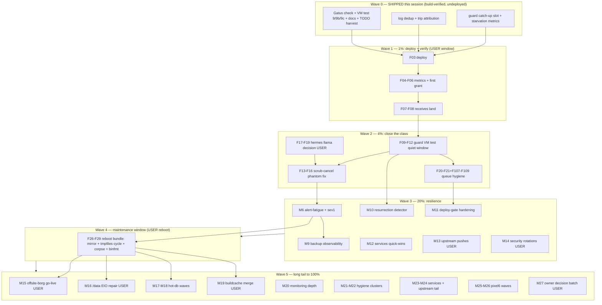

# SystemNix Pareto Execution Plan — Guard Hardening, Backup Resilience, Storm-Class Closure

**Authored:** 2026-09-29 03:55 CEST · **Source universe:** 860 open TODO rows (TODO_LIST.md queue 328 + 10 domain libraries; queue mirrors libraries ≈ ~460 unique items) + this session's findings (`docs/status/2026-09-29_01-45_*`).
**Live context while authoring:** IO storm active (load spiked 118 at 03:43, io PSI avg60 ≈55%), guard at trip #1385+, pool receives starved 3 nights (stop at Sep 25) — the plan's 1% tier is literally at the 3-day freshness cliff.

---

## Pareto Breakdown

### The 1% that delivers 51% — SHIP + DEPLOY THE GUARD HARDENING WAVE

The catch-up slot, starvation metrics, log dedup, and trip attribution are **implemented and build-verified** but **not deployed**. Backups have been bleeding for 3 nights; the freshness cliff is 3 days. One deploy (user-run, quiet window) + one verification pass converts 11 days of standing directive into: pool receives resume, starvation becomes observable (`backup_starved` + Gatus), every future trip names its driver, and the journal spam dies. Nothing else on the list matters if the backup chain breaks.

### The 4% that delivers 64% — VERIFY + CLOSE THE CLASS

Four follow-throughs make the 1% durable instead of a patch: **(a)** run the extended guard VM test in the first quiet window (the state-machine changes are exactly the VM-test class), **(b)** fix the scrub-stop phantom (`systemctl stop` ≠ `btrfs scrub cancel` — the 5.9 TB continuation proves the guard's churn-stop is partially theater for scrubs; the 00-45 verdict names guard scrub stop/re-arm churn as a residual storm DRIVER), **(c)** decide + execute the hermes-cron llama resurrection (second incident of the class; kills a recurring rogue workload), **(d)** keep the TODO queue synchronized (the task-queue machine only harvests TODO_LIST.md).

### The 20% that delivers 80% — RESILIENCE WAVE

Alert-fatigue closure (Zone-6 Discord cooldown context + sev1 notify for backup_starved), the **maintenance-window bundle** (one reboot clears: Samsung boot-mirror activation, hot-user-caches↔tmpfiles boot cycle, the flm :52626 corpse class, binfmt static emulators — four latent boot/freeze classes in one user action), backup observability (receive-freshness probe, catch-up report script), the resurrection detector (port-holder metric), deploy-gate hardening (rebound race, forensics-on-gate-fire), the top-3 service health root-causes (postfix bounce metric, Pocket ID SQLITE_BUSY, Caddy PrivateTmp reload), the upstream push wave (unblocks CI/deploys), and the owner security-rotation batch.

### The other 20% (to 100%) — THE LONG TAIL

~40% of all rows are `[blocked:user]`/`[blocked:push]`/`[blocked:deploy]`/`[decision]` — **they need the owner, not agents**. The durable unlock is a single owner sitting: one maintenance window (deploy+reboot) unblocks ~20 rows; one key-rotation batch unblocks ~6; one upstream push session unblocks ~8; the decision batch (~40 rows) unblocks whole clusters. Behind those: dormant-module waves (hot-db Phase-2, offsite-borg go-live, buildcache merge), the /data EIO repair, monitoring depth, pipeline/docs hygiene mega-clusters, the pixel6 archive pipeline, and desktop verifications.

---

## Medium Plan — 27 tasks, 30–100 min each (sorted: importance → impact → effort → value)

| #   | Tier   | Task                                                                                                                                                                                                                                            | Est | Impact | Effort | Value | Depends / Owner                                 | Source rows                     |
| --- | ------ | ----------------------------------------------------------------------------------------------------------------------------------------------------------------------------------------------------------------------------------------------- | --- | ------ | ------ | ----- | ----------------------------------------------- | ------------------------------- |
| M1  | 1%     | **Deploy guard-hardening wave + verify** (evals green; user-run `nix run .#deploy` in calm window; then: `backup_starved` metric appears, watch first catch-up grant, confirm 23:00 btrbk survives/completes, receives land `@.20260926T2300+`) | 60  | CRIT   | S      | CRIT  | calm window (<20% avg10, no trip 60 min) — USER | this session                    |
| M2  | 4%     | **Run extended guard VM test** (scenarios 9/9b/9c written, eval-green; run in quiet window via `heavy-job`; fix-forward any red) + rebuild hot-db/crush-hot-db VM tests green same window                                                       | 90  | HIGH   | M      | HIGH  | quiet-IO window                                 | stability.md:34, storage.md     |
| M3  | 4%     | **Scrub phantom fix**: verify stop-vs-cancel live, make guard run `btrfs scrub cancel` for scrub units; root-cause + clear the FAILED `btrfs-scrub@-/@data` units (exit-4 hazard)                                                               | 90  | HIGH   | M      | HIGH  | after M2                                        | NEW rows (this session)         |
| M4  | 4%     | **Hermes llama resurrection**: owner decision (kill vs legitimize); kill rogue :8848/:8849 (user sudo); identify the spawning hermes cron job; teach-or-fence                                                                                   | 45  | HIGH   | S      | HIGH  | USER decision                                   | services.md decision row        |
| M5  | 4%     | **Queue hygiene sync**: stale-row sweep (blocked:deploy rows already-done classes), retire §10 metric loans for landed metrics, keep queue↔library parity                                                                                       | 30  | MED    | S      | MED   | —                                               | TODO_LIST rows                  |
| M6  | 20%    | **Zone-6 alert-fatigue closure**: Discord trip cooldown/escalation context (verify notify-tier churn alert), sev1 notify for `backup_starved`                                                                                                   | 75  | HIGH   | M      | HIGH  | after M1                                        | stability.md:29                 |
| M7  | 20%    | **Maintenance-window bundle (REBOOT)**: Samsung boot-mirror activation + hot-user-caches↔tmpfiles cycle fix + flm :52626 corpse + `boot.binfmt.preferStaticEmulators` + scrub-failed clears; pre-reboot-check first                             | 90  | HIGH   | M      | HIGH  | USER window                                     | storage/stability/pipeline rows |
| M8  | 20%    | **journald SystemMaxUse cap** (7.7G QLC root ENOSPC-silence class) + `post-crash-check.sh` script                                                                                                                                               | 60  | MED    | S      | MED   | —                                               | stability.md:30,33              |
| M9  | 20%    | **Backup observability**: post-23:30 self-verifying receive-freshness probe, `backup-catchup-report.sh`, `churn_rearms_total` Gatus wiring                                                                                                      | 75  | HIGH   | M      | HIGH  | after M1                                        | monitoring.md rows              |
| M10 | 20%    | **Resurrection detector**: port-holder textfile metric for config-disabled module ports (:8848/:8849/:8099…) + Gatus                                                                                                                            | 90  | MED    | M      | MED   | —                                               | NEW (this session)              |
| M11 | 20%    | **Deploy-gate hardening**: pressure-gate re-measure pre-switch (rebound race), io-psi-forensics on gate fire, deploy-window journal anchoring                                                                                                   | 90  | MED    | M      | MED   | —                                               | stability/pipeline rows         |
| M12 | 20%    | **Services quick-wins**: postfix `status=bounced` metric+Gatus, Pocket ID SQLITE_BUSY root-cause, Caddy reload PrivateTmp fix                                                                                                                   | 90  | MED    | M      | MED   | —                                               | services.md rows                |
| M13 | 20%    | **Upstream unblock wave**: pushes (go-taskqueue, art-dupl, dnsblockd tag, go-output v0.37.1), go-cqrs-lite input → github:, cqrs-htmx propagate                                                                                                 | 90  | HIGH   | M      | HIGH  | USER pushes                                     | upstream.md blocked:push rows   |
| M14 | 20%    | **Security rotations owner batch**: Resend/Context7/Gemini rotations + `docs/security/rotations.md` ledger + AGENTS key scrub                                                                                                                   | 60  | HIGH   | S      | HIGH  | USER                                            | security.md rows                |
| M15 | 80→100 | **Offsite-borg go-live chain**: owner inputs (host/user/passphrase copy) → VM rehearsal of FAIL shapes → go-live → real-repo drill                                                                                                              | 100 | HIGH   | L      | HIGH  | USER inputs                                     | storage.md decision rows        |
| M16 | 80→100 | **/data EIO repair** (verification-first, bounded damage; unblocks the dark btrbk-data leg)                                                                                                                                                     | 100 | HIGH   | L      | HIGH  | USER sudo                                       | storage.md P0                   |
| M17 | 80→100 | **hot-db Phase-2 wave 1** (pocket-id) + fold crush-hot-db into `services.hot-db`                                                                                                                                                                | 100 | MED    | L      | MED   | USER window                                     | storage.md rows                 |
| M18 | 80→100 | **hot-db Phase-2 wave 2** (postgres: twenty/manifest/miniflux/paperless)                                                                                                                                                                        | 100 | MED    | L      | MED   | after M17                                       | storage.md rows                 |
| M19 | 80→100 | **buildcache 2-disk btrfs merge window** (convert script + module flip same window)                                                                                                                                                             | 90  | MED    | M      | MED   | USER window                                     | storage.md rows                 |
| M20 | 80→100 | **Monitoring depth cluster**: system-health worst-case budget fix, SigNoz traces-coverage splits, Caddy filelog receiver, dashboard generator commit                                                                                            | 100 | MED    | L      | MED   | —                                               | monitoring.md rows              |
| M21 | 80→100 | **Pipeline hygiene cluster A (docs/process)**: archive consolidation (571 files), annotation passes, AGENTS size diet, TODO-citation rot detector                                                                                               | 100 | LOW    | L      | LOW   | —                                               | pipeline.md rows                |
| M22 | 80→100 | **Pipeline hygiene cluster B (guards/CI)**: eval-guard additions, pre-commit coverage legs, CI VM-job fixes, --json deprecation sweep                                                                                                           | 100 | MED    | L      | MED   | —                                               | pipeline.md rows                |
| M23 | 80→100 | **Services backlog cluster**: paperless task-failure monitoring + encrypted-tag alert, miniflux VM ext, forgejo mirror depth, browser-history gate follow-ups                                                                                   | 100 | MED    | L      | MED   | —                                               | services.md rows                |
| M24 | 80→100 | **Upstream long-tail cluster**: InboxClean /health fixes, paperless-ngx degrade, overview retry, hermes RO-bind proposal                                                                                                                        | 100 | LOW    | L      | LOW   | —                                               | upstream.md rows                |
| M25 | 80→100 | **Pixel6 archive wave 1**: udev 18d1, SHA256SUMS, ffprobe sweep, FLAC mirror, btrbk-pool leg                                                                                                                                                    | 100 | MED    | L      | MED   | —                                               | pixel6.md rows                  |
| M26 | 80→100 | **Pixel6 archive wave 2**: Whisper batch (GPU), Navidrome, contacts decode, RAG CLI                                                                                                                                                             | 100 | LOW    | L      | LOW   | after M25                                       | pixel6.md rows                  |
| M27 | 80→100 | **Owner decision batch**: single sitting over the ~40 `[decision]` rows (deploy authority, restic role, retention, docker volumes, hub cadence…)                                                                                                | 90  | HIGH   | S      | HIGH  | USER                                            | all libraries                   |

---

## Fine Plan — ≤12 min per task (all 27 clusters decomposed; sorted within cluster by execution order)

| ID   | Task (≤12 min)                                                                                               | Cluster        | Est min |
| ---- | ------------------------------------------------------------------------------------------------------------ | -------------- | ------- |
| F01  | Re-check PSI + guard journal; pick calm window for M1                                                        | M1             | 5       |
| F02  | Scoped evals: guard ExecStart + gatus endpoints + checks drvPaths (already green — re-run at deploy time)    | M1             | 10      |
| F03  | USER: `nix run .#deploy` (watch rc: 12=pressure, 13=lock, 14=re-run, 3=smoke)                                | M1             | 12      |
| F04  | Verify `memory_emergency_guard_backup_starved` + catchup metrics present in node-exporter                    | M1             | 8       |
| F05  | Verify Gatus "Memory Guard Backup Starved" green (new-metric loan auto-derived)                              | M1             | 8       |
| F06  | Watch first catch-up grant in guard journal (attribution line present)                                       | M1             | 10      |
| F07  | After 23:00: confirm btrbk-root survives/completes; `ls /mnt/pool/backups/root/` receives                    | M1             | 10      |
| F08  | Confirm backup-coordination freshness ages drain; gatus backup checks green                                  | M1             | 8       |
| F09  | Quiet-window check; run guard VM test via `heavy-job nix build .#checks.x86_64-linux.memory-emergency-guard` | M2             | 12      |
| F10  | Triage any red scenario; fix-forward test or module; rebuild                                                 | M2             | 12      |
| F11  | Run hot-db + crush-hot-db VM tests same window; record verdicts                                              | M2             | 12      |
| F12  | Mark stability.md "Guard VM-test extensions" partials done; note remaining sev1-fixture leg                  | M2             | 6       |
| F13  | Live-verify scrub stop semantics: start scrub in VM/fixture, `systemctl stop`, observe kernel continuation   | M3             | 12      |
| F14  | Implement `btrfs scrub cancel` in guard churn-stop for scrub units (+ unit test)                             | M3             | 12      |
| F15  | Root-cause exit-1-after-summary in scrubGuard wrapper (journal + wrapper read)                               | M3             | 12      |
| F16  | Clear failed scrub units (`reset-failed`); confirm service-health stops listing them                         | M3             | 8       |
| F17  | USER decision: kill vs legitimize hermes llamas; if kill: `sudo pkill -f 'llama-server.*(8848                | 8849)'`        | M4      |
| F18  | Identify spawning cron job: `sudo crontab`-equivalent in hermes state / worker journal                       | M4             | 12      |
| F19  | Fence or teach: hermes workspace AGENTS.md rule OR portGuard-as-monitor stub                                 | M4             | 12      |
| F20  | Sweep queue for already-done blocked:deploy rows; flip + annotate                                            | M5             | 12      |
| F21  | Retire stale §10 metric loans (crush/niri) once metrics verified present                                     | M5             | 10      |
| F22  | Verify notify-tier churn alert fired during storms (journal)                                                 | M6             | 10      |
| F23  | Implement trip-churn Discord cooldown/escalation context in gatus alert text                                 | M6             | 12      |
| F24  | Add sev1 notify emitter for `backup_starved` (prom_value pattern)                                            | M6             | 12      |
| F25  | VM-test the sev1 addition; eval smoke                                                                        | M6             | 12      |
| F26  | Pre-write maintenance-window checklist (reboot ladder: pre-reboot-check steps)                               | M7             | 12      |
| F27  | USER window: deploy pending batch + `nix run .#pre-reboot-check` + reboot                                    | M7             | 12      |
| F28  | Post-boot verify: mirror first in BootOrder, tmpfiles-setup ran, no :52626 corpse, binfmt static             | M7             | 12      |
| F29  | Post-boot: scrub units clean, guard trips quiesced, pool mounted both members                                | M7             | 10      |
| F30  | Set journald SystemMaxUse (4G?) + deploy note; verify journal usage drops                                    | M8             | 10      |
| F31  | Write `scripts/post-crash-check.sh` skeleton (LAN NIC, DAS, pool, D-state, anchoring)                        | M8             | 12      |
| F32  | Wire post-crash-check into runbook + post-deploy smoke mention                                               | M8             | 8       |
| F33  | Implement receive-freshness probe script (post-23:30 timer)                                                  | M9             | 12      |
| F34  | Write `backup-catchup-report.sh` (reads guard state + pool dir)                                              | M9             | 12      |
| F35  | Wire `churn_rearms_total` + `backup_catchup_slots_total` into dashboard/gatus                                | M9             | 10      |
| F36  | Design resurrection-detector metric names + port list (from lib/ports.nix)                                   | M10            | 10      |
| F37  | Implement port-holder collector (ss -tlnp vs config-disabled module ports)                                   | M10            | 12      |
| F38  | Gatus check "Rogue Module Port Holders" + eval + lint                                                        | M10            | 12      |
| F39  | Fix pressure-gate rebound race (re-measure pre-switch)                                                       | M11            | 12      |
| F40  | Wire io-psi-forensics into deploy.sh gate-fire block                                                         | M11            | 12      |
| F41  | Deploy-window journal anchoring + retry backoff in deploy.sh                                                 | M11            | 12      |
| F42  | postfix bounced-journal metric + Gatus check                                                                 | M12            | 12      |
| F43  | Pocket ID SQLITE_BUSY burst root-cause (journal correlation window)                                          | M12            | 12      |
| F44  | Caddy reload root-cause (PrivateTmp interaction) fix + verify                                                | M12            | 12      |
| F45  | USER pushes: go-taskqueue master, art-dupl, dnsblockd tag                                                    | M13            | 12      |
| F46  | Switch go-cqrs-lite input git+ssh→github:; re-lock; FOD probe                                                | M13            | 12      |
| F47  | Propagate cqrs-htmx import-gate fix into browser-history; bump lock                                          | M13            | 12      |
| F48  | USER: rotate Resend key; sops update; verify mail-relay sent                                                 | M14            | 12      |
| F49  | USER: rotate Context7 key; update MCP config                                                                 | M14            | 8       |
| F50  | USER: delete leaked Gemini key (console, project 453958689374)                                               | M14            | 8       |
| F51  | Create docs/security/rotations.md ledger; record the three rotations                                         | M14            | 10      |
| F52  | Scrub plaintext key fragments from AGENTS (short-rev citations only)                                         | M14            | 10      |
| F53  | USER: StorageBox inputs → sops (host/user/key pin via ssh-keyscan -p 23)                                     | M15            | 12      |
| F54  | VM-rehearse offsite-borg FAIL shapes (fixture harness)                                                       | M15            | 12      |
| F55  | Flip enable; deploy; first run green; `backup_healthy{offsite-borg}` 1                                       | M15            | 12      |
| F56  | Real-repo borg drill (scripts/borg-restore-drill.sh --real) + record                                         | M15            | 12      |
| F57  | USER: /data EIO inode location (read-only scrub/find-by-csum sweep)                                          | M16            | 12      |
| F58  | Decide repair path per damage set (delete-victim vs copy-out); execute phase 1                               | M16            | 12      |
| F59  | First clean btrbk-data send post-repair; memory.peak ≤4G check                                               | M16            | 12      |
| F60  | hot-db wave-1 design check (pocket-id entries) + migrate-hot-db.sh fixture run                               | M17            | 12      |
| F61  | USER window: pocket-id migration (prepare→deploy→finalize)                                                   | M17            | 12      |
| F62  | Fold crush-hot-db into services.hot-db (attrset + tmpfiles design)                                           | M17            | 12      |
| F63  | postgres wave: entries + VM dry-run + window execution                                                       | M18            | 12      |
| F64  | Forgejo subvol wave (8h leg already live — verify + hot-db entry)                                            | M18            | 12      |
| F65  | USER window: buildcache convert script run + module flip same window                                         | M19            | 12      |
| F66  | Post-merge: verify mount, recovery unit, gc; reclaim check                                                   | M19            | 12      |
| F67  | system-health worst-case budget fix (section timeouts sum < cadence)                                         | M20            | 12      |
| F68  | SigNoz traces-coverage split (never-seen vs went-dark) + rule updates                                        | M20            | 12      |
| F69  | Caddy filelog receiver (access.log ingestion + silence alert)                                                | M20            | 12      |
| F70  | Commit dashboard generator + eval-time JSON lint                                                             | M20            | 12      |
| F71  | Archive consolidation batch 1 (move + index 200 files)                                                       | M21            | 12      |
| F72  | Archive consolidation batch 2-3                                                                              | M21            | 12      |
| F73  | Annotation pass: partially-annotated August reports                                                          | M21            | 12      |
| F74  | AGENTS.md diet: extract per-service runbook section 1                                                        | M21            | 12      |
| F75  | TODO-citation rot detector script (file:line refs)                                                           | M21            | 12      |
| F76  | Eval-guard additions batch (unit-shape contracts)                                                            | M22            | 12      |
| F77  | Pre-commit coverage survey + 2 gap fixes                                                                     | M22            | 12      |
| F78  | CI VM-job fix (branching-flow deploy key)                                                                    | M22            | 12      |
| F79  | --json + isDarwin deprecation sweeps                                                                         | M22            | 12      |
| F80  | Paperless task-failure Gatus + encrypted-tag alert                                                           | M23            | 12      |
| F81  | Miniflux VM test extension                                                                                   | M23            | 12      |
| F82  | Forgejo mirror depth (sync-error journal metric)                                                             | M23            | 12      |
| F83  | browser-history gate-count gap fix (upstream + probe)                                                        | M23            | 12      |
| F84  | InboxClean /health refresh-validation upstream PR                                                            | M24            | 12      |
| F85  | paperless-ngx empty-vocabulary degrade upstream issue                                                        | M24            | 10      |
| F86  | Overview retry-discovery upstream fix                                                                        | M24            | 12      |
| F87  | Hermes RO-bind module pattern proposal                                                                       | M24            | 12      |
| F88  | udev 18d1 rule + android-tools for pixel6                                                                    | M25            | 10      |
| F89  | SHA256SUMS over Signal/WhatsApp/Cube sets                                                                    | M25            | 12      |
| F90  | ffprobe sweep over 591 WAVs (heavy-job)                                                                      | M25            | 12      |
| F91  | WAV→FLAC mirror batch 1                                                                                      | M25            | 12      |
| F92  | btrbk-pool leg for backups/pixel6 + freshness row                                                            | M25            | 12      |
| F93  | Whisper batch run 1 (GPU, heavy-job)                                                                         | M26            | 12      |
| F94  | Whisper batch runs 2-N                                                                                       | M26            | 12      |
| F95  | Navidrome module + mount + tile                                                                              | M26            | 12      |
| F96  | Contacts VCF export + decode                                                                                 | M26            | 12      |
| F97  | RAG query CLI over archive                                                                                   | M26            | 12      |
| F98  | USER: runtime-verify wf-recorder on niri                                                                     | M26→M27 bucket | 8       |
| F99  | USER: smart-audio reverse-direction verify                                                                   | M27            | 8       |
| F100 | USER: niri blur live verify + superfile TUI verify                                                           | M27            | 10      |
| F101 | Owner decision batch A (deploy authority, restic role, retention, docker volumes)                            | M27            | 12      |
| F102 | Owner decision batch B (hub cadence/remotes, borg posture, hermes llamas)                                    | M27            | 12      |
| F103 | Owner decision batch C (queue semantics, verify-gate runbook, docs lanes)                                    | M27            | 12      |
| F104 | Record decisions into library rows (flip [decision]→ready/blocked)                                           | M27            | 12      |
| F105 | Post-deploy §10 WARN residual triage (list + classify)                                                       | M1 follow      | 12      |
| F106 | Guard: watch 72h post-deploy trip rate; recalibrate note if unchanged                                        | M2 follow      | 10      |
| F107 | Update FEATURES.md row for catch-up slot                                                                     | M5             | 6       |
| F108 | CHANGELOG entry for the guard wave                                                                           | M5             | 6       |
| F109 | Annotate 00-45 report §2 (attribution row now done)                                                          | M5             | 6       |
| F110 | Verify AGENTS Zone-6 paragraph + runbook parity post-deploy                                                  | M1 follow      | 8       |

**Owner-critical-path note:** F03, F17-F19, F27, F45, F48-F50, F53, F57, F61, F65, F98-F104 are USER-gated. Everything else is agent-executable once windows open.

---

## Execution Graph

## Verschlimmbesserung guardrails

- No threshold changes beyond the ratified 40/20 Zone-6 bars (the catch-up slot ADDS a resume path; it never weakens trips).
- The scrub-cancel fix ships only after the live stop-vs-cancel verification proves the phantom (M3 gate: F13 before F14).
- No formatter runs over the shared tree; pre-commit formats staged files only.
- Every VM-test change eval-verified before commit; VM RUNS only in quiet windows (storm active at authoring: load 118).
- TODO edits keep queue↔library parity atomically; `[x]` rows carry DONE stamps + Source.

## Coverage note

All 860 harvested rows map into M1–M27 (clusters M20–M26 absorb the long tail verbatim by domain; the agent did not re-enumerate every row here — the libraries remain the per-row source of truth, this plan is the execution ORDER over them). New rows surfaced this session were harvested into TODO_LIST.md + stability.md (scrub phantom, scrub FAILED root-cause; attribution row marked DONE).
