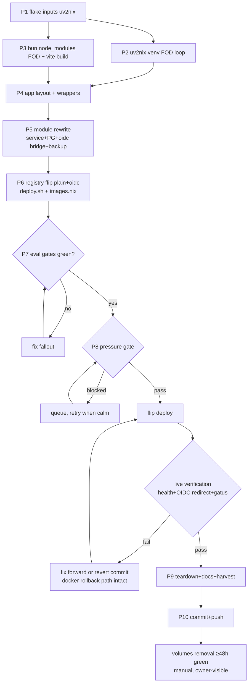

# GeoMetrikks → Native Nix Service (Docker Removed)

**Goal:** Replace the GeoMetrikks Docker deployment (app container + timescaledb-ha sidecar
+ init_db bootstrap) with a fully native Nix service: source-built Python package (uv2nix),
bun-built frontend, TimescaleDB+PostGIS on the host's shared PostgreSQL cluster, native
systemd unit, and native Pocket ID OIDC (Layer 1). After this migration, nothing about
GeoMetrikks touches Docker.

**Owner directive:** "getting rid of Docker in favour of Nix native services" — GeoMetrikks
is the pilot; the wider fleet (manifest, twenty, dozzle, …) is a follow-up program, NOT in
scope here. The plan ends with a fleet inventory as roadmap input.

---

## Verified research facts (all live/source-verified 2026-09-29)

| Fact | Source |
|---|---|
| Upstream latest stable = **v0.19.0** (2026-09-27), tag-pinnable | GitHub releases API |
| Python 3.13 only (`>=3.13,<3.14`), hatchling, **no extras** (only dev group) | pyproject.toml @ v0.19.0 |
| Runtime deps include C/Rust extensions: asyncpg, cryptography, pydantic-core, granian, brotli, argon2-cffi | pyproject.toml |
| nixpkgs (locked): python313 = 3.13.15, **bun = 1.4.2 (matches upstream's pinned bun)**, postgresql17Packages.timescaledb = 2.30.1 (≥ 2.28 requirement) | nix eval |
| **`buildBunPackage` / `fetchBunDeps` do NOT exist in nixpkgs** → hand-rolled bun node_modules FOD (qmd-upstream pattern) | nix eval (attr missing) |
| uv2nix ecosystem lives at `pyproject-nix/{uv2nix,pyproject.nix,build-system-pkgs}` (renamed from pyproject.build-systems) | GitHub API |
| **PostGIS is REQUIRED**: initial migration `CREATE EXTENSION IF NOT EXISTS postgis` + geoalchemy2 `Geography(POINT,4326)` column | migrations/versions/2026-07-05_initial_schema |
| TimescaleDB objects applied by app at startup (`server/timescale.py`), alembic runs at startup by default (`DB_MIGRATE_ON_STARTUP=true`) | migrations/README, docs/configuration.md |
| Shared PG cluster: **17.11**, dataDir `/var/lib/postgresql/17`, enabled via paperless/miniflux `createLocally` | nix eval evo-x2 |
| Caddy access logs: `caddy:caddy 0600` → native unit needs `CAP_DAC_READ_SEARCH` (cv-backup precedent) | current module |
| App CWD contract: `alembic.ini` + `migrations/` + `public/` (+ `index.html` inside public) at WorkingDirectory; `.litestar.json` is CREATED by the app at runtime (Dockerfile ships none) | Dockerfile |
| Absolute-path env knobs exist: `GEOIP_DB_PATH`, `GEOIP_ASN_DB_PATH`, `LOG_DIR` | docs/configuration.md |
| Log tailer is a POLLER (`LOGPARSER_POLL_INTERVAL=1.0`) — no inotify requirement | docs/configuration.md |
| **DB is effectively EMPTY**: service has run geo-degraded since bring-up (MaxMind keys user-gated → ingestion never started) → **no data migration needed**, fresh schema on native cluster | README (geo-degraded semantics) + docs/todo/services.md go-live item |
| OIDC contract: auth-code + PKCE confidential client; `OIDC_ALLOWED_USERS` (verified emails or subject IDs) REQUIRED; password login stays as break-glass while `APP_ADMIN_PASSWORD` set | README + docs/configuration.md |
| Registry `oidc` field fans to `pocket-id-config.provision.extraOidcClients`; secret lands at `/var/lib/pocket-id/client-secrets/<clientId>` (pocket-id:pocket-id) | integration.nix + pocket-id.nix |
| Bridge pattern for provisioner-owned secrets: env-writing oneshot + daemon restart via deploy.sh dedicated is-active-gated block (dnsblockd-oidc-secret / cv-oidc-env precedent) | deploy.sh |
| eval guard: new converger-named oneshots MUST appear in deploy.sh (`deploy-restart-audit`) | AGENTS.md |

---

## Pareto breakdown

**The 1% that delivers 51%:** the **module rewrite + atomic flip deploy** — replacing
`mkDockerService` with a native `systemd.services.geometrikks`. That single change removes
Docker from this service's serving path; everything else is making it real and safe.

**The 4% that delivers 64%:** the **package** (uv2nix venv + bun frontend FOD) — the
riskiest and most valuable artifact; nothing runs without it, and it carries ~all novel
technical risk (native C/Rust builds, bun sandbox).

**The 20% that delivers 80%:** package + module + **registry flip to Layer 1 plain with
native OIDC** — together these make GeoMetrikks a real native, passkey-SSO'd service.

**The other 20% (to 100%):** shared-PG plugin wiring + db-provision oneshot, native
backup unit swap, deploy.sh wiring, runbook/docs rewrite, todo harvest, Docker teardown
(volumes/images/lint entries), full verification battery.

---

## Design decisions

| Decision | Choice | Rationale / rejected alternative |
|---|---|---|
| DB home | **Shared PG17 cluster** + `timescaledb`+`postgis` plugins + `shared_preload_libraries` | Second postgres instance is unsupported by the nixpkgs module (hand-rolled = split brain). Cost: one postgres restart at flip (paperless/immich/miniflux blip, all retry). Rejected: keep docker sidecar (goal is zero Docker) |
| TS worker tuning | global `max_worker_processes = 48`; per-DB `timescaledb.max_background_workers = 32`, `max_parallel_workers = 8` via db-provision `ALTER DATABASE` | Upstream's 40/8/51 are GUCs; only `max_worker_processes` is POSTMASTER-level (global), the rest are per-DB settable — avoids globally matching upstream's container-only values |
| App DB auth | TCP 127.0.0.1 + scram password from existing sops `geometrikks_db_password` | The app's tested config path (all upstream docs use TCP+password); unix-socket/peer DSN shape is unverified upstream. Password converged by `geometrikks-db-provision` oneshot (User=postgres, peer auth, charset-guarded inline literal — miniflux-oidc-setup doctrine) |
| Package | `pkgs/geometrikks.nix`: fetchFromGitHub @ v0.19.0 → uv2nix venv (deps.default) + bun FOD `node_modules` + `bun run build` → `$out/share/geometrikks/{public,migrations,alembic.ini}` + `$out/bin/geometrikks-{server,cli}` wrappers | Mirrors the Docker runtime layout exactly; venv installs the app as a package (wheel-equivalent) |
| Runtime dir | `StateDirectory=geometrikks`, `WorkingDirectory=/var/lib/geometrikks`; ExecStartPre stamp-gated copy of `public/`, `alembic.ini`, `migrations/` from the store | App writes `.litestar.json` + logs + mmdb in CWD → CWD must be writable; store assets must track package version |
| OIDC secret bridge | `geometrikks-oidc-env` oneshot (LoadCredential reads `/var/lib/pocket-id/client-secrets/geometrikks` as PID 1) → writes `/var/lib/geometrikks-oidc/oidc.env` with **ALL** OIDC vars (all-or-none, browser-history lesson); app unit `EnvironmentFile`-consumes it; deploy.sh dedicated block restarts bridge+daemon | Provisioner-owned dynamic secret must not go through sops |
| vHost | registry `vHost.layer` **protected → plain** + `oidc = {...pkceEnabled=true}` | Native OIDC behind protectedVHost = double-auth loop (doctrine) |
| Break-glass | `APP_ADMIN_PASSWORD` stays (sops) | Provider-down fallback, upstream-sanctioned |
| Frontend serving | app-served (SPA shell + `/static/*`), Caddy unchanged except layer flip | No new moving parts |
| Docker teardown | same-commit module flip + images.nix entries removed; **named volumes retained ≥48h green**, removal is a documented manual step | Verschllimmbesser guard: data (empty as it is) + instant rollback path preserved |
| Rollback | revert commit → docker module back (images still pinned in store/registry) | Atomic single-commit flip |

---

## Phase plan (30–100 min tasks, sorted by impact/effort)

| # | Task | Impact | Effort | Est | Depends |
|---|---|---|---|---|---|
| P1 | flake.nix: add `uv2nix`, `pyproject-nix`, `pyproject-build-systems` inputs (follows wired), re-lock | enabler | S | 30m | — |
| P2 | `pkgs/geometrikks.nix`: src pin + uv2nix venv; iterate FOD hashes until `nix build` green | **critical** | M-H | 100m | P1 |
| P3 | bun `node_modules` FOD + frontend build (`bun run build` → `public/`); FOD loop | **critical** | M | 60m | P1 |
| P4 | app-layout derivation + `geometrikks-server`/`-cli` wrappers (public/, index.html, alembic.ini, migrations) | high | S | 30m | P2,P3 |
| P5 | module rewrite: user, PG wiring (plugins/preload/settings), `geometrikks-db-provision`, service unit (harden+CAP_DAC_READ_SEARCH+ioTier+DNS gate), oidc bridge, native backup | **critical** | M-H | 100m | P4 |
| P6 | registry flip (layer plain, oidc entry, checks), sops template reshape, images.nix removal, deploy.sh wiring | high | M | 40m | P5 |
| P7 | eval battery: `nix flake check --no-build --all-systems`, evo-x2 eval, deploy-restart-audit green, port-registry/gatus audits green | high | S | 30m | P6 |
| P8 | **Flip deploy** (pressure-gated) + live verification (health, vHost plain, OIDC redirect 302→auth.home.lan, Gatus green, ingestion idle-not-degraded, paperless/immich/miniflux recover post-PG-restart) | **critical** | M | 60m | P7 |
| P9 | Teardown + docs: docker ps confirm no geometrikks containers, runbook rewrite, plan/TODO/CHANGELOG harvest, docker volume removal runbook (manual, ≥48h green) | high | S-M | 40m | P8 |
| P10 | Commit (detailed) + push | — | S | 12m | P9 |

## Micro-task breakdown (≤12 min each)

| Phase | Micro-tasks |
|---|---|
| P1 | add 3 inputs w/ follows → `nix flake lock --update-input` each → verify lock nodes → eval flake loads |
| P2 | write pkgs/geometrikks.nix skeleton (src/venv) → build venv FOD → paste got-hash → rebuild → fix override if a dep fails (per-dep) → venv builds → smoke `python -c "import geometrikks"` in venv |
| P3 | write bunDeps FOD (bun install --frozen-lockfile, HOME=$TMP) → hash loop → build derivation with node_modules copy → `bun run build` → fix cache/permission nits → verify `public/` + index.html present |
| P4 | assemble share/ layout → write server wrapper (litestar CLI form) → write cli wrapper → `nix build` green |
| P5 | write module (per decision table): user+group → PG block (optionalAttrs guard) → db-provision oneshot → oidc-env bridge → main service (ExecStartPre copies, env, sandbox) → backup timer/oneshot + dir oneshot → sops template reshape |
| P6 | registry: layer plain + oidc + unchanged checks → drop mkDockerService remnants → images.nix remove 2 entries → deploy.sh: provisioner list + dedicated block → `bash -n` deploy.sh |
| P7 | flake check --no-build --all-systems → evo-x2 toplevel eval → targeted nix eval probes (unit text, env files, vHost, oidc client) → fix fallout |
| P8 | pressure gate → deploy → post-deploy-check → curl /health,/health/ready,/login → OIDC redirect probe → gatus cycle green → journal sweep (alembic, geoip, ingestion) → sibling DB recovery check |
| P9 | docker ps/a → runbook rewrite → plan §follow-ups → TODO_LIST + docs/todo/services.md harvest → CHANGELOG → AGENTS.md geometrikks section update |
| P10 | `git add` per-pathspec → detailed commit → push → verify CI |

---

## Execution graph

---

## Risks & guardrails

| Risk | Likelihood | Mitigation |
|---|---|---|
| uv2nix native dep build failures (cryptography/pydantic-core/granian rust, asyncpg C) | medium | `build-system-pkgs` overlays carry maturin/cffi hooks; per-dep overrides as needed; hermes proves the pattern |
| bun build in sandbox (cache dirs, native platform pkgs) | medium | HOME/XDG_CACHE to $TMP; `--frozen-lockfile`; prebuilt platform wheels need no scripts |
| PG shared-cluster restart at flip | certain, bounded | one restart; paperless/immich/miniflux self-retry; verify post-deploy |
| TS extension creation privileges | low | db-provision runs as postgres (superuser, peer auth) and pre-creates both extensions |
| Pocket ID email_verified claim mismatch → OIDC allow-list rejects | low | fallback documented: use Pocket ID `sub` UUID in `OIDC_ALLOWED_USERS` (README-sanctioned) |
| Alembic on empty DB fails | low | fresh DB, migrations run idempotently at app startup; `DB_STARTUP_WAIT_SECONDS` + degraded-then-recover semantics |
| First deploy of new unit never runs (health-dashboard class) | low | `wantedBy = multi-user.target` + deploy.sh starts unit + post-deploy smoke + first green gatus cycle gate |
| Verschlimmbesser | — | atomic single flip; docker volumes kept ≥48h; admin password retained; no other service touched; revert-commit rollback |

## Verification checklist (Definition of Done)

- [ ] `nix build .#...` package green; `nix flake check --no-build --all-systems` green
- [ ] No `docker-geometrikks.service`; `docker ps` shows no geometrikks containers post-deploy
- [ ] `geometrikks.service` active; `/health` + `/health/ready` 200 on :8102
- [ ] `geo.home.lan` serves UI over plain vHost (no oauth2-proxy hop)
- [ ] Login page offers SSO; `/api/v1/auth/oidc/*` redirects to `auth.home.lan` (302, correct client_id)
- [ ] Pocket ID shows `geometrikks` client with PKCE + exact callback
- [ ] Gatus "GeoMetrikks" green; backup registry row green after first nightly (05:15)
- [ ] paperless/immich/miniflux healthy after the shared-PG restart
- [ ] Runbook + AGENTS.md + CHANGELOG + todo harvest landed
- [ ] Committed (detailed message) + pushed

## Follow-ups (out of scope, harvested)

- Fleet Docker→native program (manifest, twenty, dozzle, geometrikks-done) — ROADMAP candidate
- Docker volume removal runbook step (owner, ≥48h green)
- MaxMind/CARTO go-live keys remain user-gated (existing todo item, unchanged)
- Optionally `MAP_HOME_LATITUDE/LONGITUDE` pin if ipify auto-detect geolocates wrong
