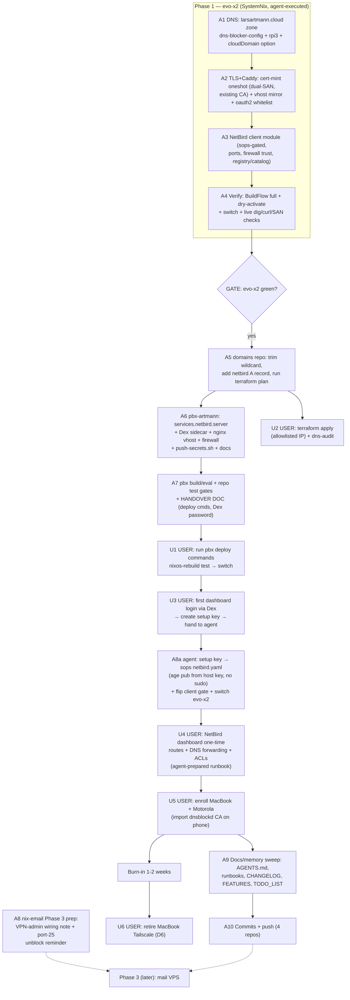

# NetBird + larsartmann.cloud Rollout — Execution Plan

_Source architecture: `docs/brainstorming/2026-09-30_netbird-larsartmann-cloud-selfhosted-vpn.md` (ratified D1-D9). This document decomposes that plan into executable, verified tasks. Created 2026-09-30 04:51._

_Prime directive: do not verschlimmbessern. evo-x2 is the live daily driver; pbx-artmann is live production telephony. Every change is additive, gated, dry-activated first, and rollback-safe (`nixos-rebuild switch --rollback` / generations)._

---

## 0. Researched implementation facts (verified 2026-09-30)

| Fact                                                                                                                                                                                      | Consequence for implementation                                                                                                                                                                                                                                                                                 |
| ----------------------------------------------------------------------------------------------------------------------------------------------------------------------------------------- | -------------------------------------------------------------------------------------------------------------------------------------------------------------------------------------------------------------------------------------------------------------------------------------------------------------- |
| dnsblockd supports **multiple zones** (`dns_local_zones` list; `NewLocalZoneStore` is variadic) and the SystemNix module already exposes `localZones`/`localRecords`                      | Adding `larsartmann.cloud` = config-only change in `dns-blocker-config.nix` + rpi3                                                                                                                                                                                                                             |
| dnsblockd mints leaf certs **per-SNI at handshake** (`SANs = [domain, *.domain]`, tls.go:211); no CLI, no pre-mint tooling exists                                                         | Caddy cannot use that path — we mint OUR leaf via a root systemd oneshot (openssl) reading the existing sops'd CA secrets (`dnsblockd_ca_cert`/`dnsblockd_ca_key`, already root-readable at activation). **Zero sops edits, zero sudo needed**                                                                 |
| Wildcard entries in `localRecords` are silently ignored (sdns limitation, gotchas-archive.md:97)                                                                                          | Explicit per-subdomain records from `dns-local.nix` list only — same as today                                                                                                                                                                                                                                  |
| Caddy vhosts: one merged attrset; registry fan-out is ONE `mapAttrs'` (caddy.nix:392); `tlsConfig` is a single helper baked into every vhost                                              | Strategy: mint ONE dual-zone cert (SANs `home.lan`, `*.home.lan`, `larsartmann.cloud`, `*.larsartmann.cloud`, same dnsblockd CA), swap `tlsConfig` to it, then **mirror the existing vhost attrset** 1:1 with domain-swapped keys — no renderer refactor, no behavior change for home.lan (identical CA chain) |
| oauth2-proxy guards redirect targets by whitelist                                                                                                                                         | Must add `.larsartmann.cloud` to its whitelist or cloud-originated SSO redirects get rejected                                                                                                                                                                                                                  |
| pbx-artmann policy: assistant NEVER runs deploy/SSH (`AGENTS.md:11-13`); deploy = `nixos-rebuild test/switch --flake .#pbx --target-host root@pbx.artmann.tech` run by Lars               | Phase 2 VPS side = prepare + local build/eval + tests + **handover document** with exact commands                                                                                                                                                                                                              |
| pbx secrets: NO sops; runtime files under `/var/lib/telephony-secrets/` pushed by `~/.pbx-prod-secrets/push-secrets.sh` (exists, verified)                                                | Dex bcrypt hash + NetBird OIDC client secret follow that pattern; script list must be extended in the same change                                                                                                                                                                                              |
| domains repo: `nix run .#plan/.#apply`; Namecheap API **requires allowlisted source IP** (CI runner or Tailscale exit node); apply does not read back → verify with `nix run .#dns-audit` | Terraform apply is likely BLOCKED from evo-x2 → stage `.tf` + hand over (or Lars runs from MacBook)                                                                                                                                                                                                            |
| pbx box = cx23 (4 GB RAM, hel1), nixos-unstable 2026-09-28; `mail.nix:95-98` is the sidecar-vhost + ACME precedent                                                                        | NetBird server (native NixOS, no docker) + Dex ≈ 0.5-0.8 GB — flag headroom in handover                                                                                                                                                                                                                        |
| NetBird server module lives in nixpkgs (`services.netbird.server`, requires external IdP); pbx pin is 2026-09-28 unstable → module present                                                | Verify exact option surface via `nix eval` during A6                                                                                                                                                                                                                                                           |
| SystemNix nixpkgs pin ≈ 2026-09-28/29 (lastModified 1790653553)                                                                                                                           | `services.netbird.tunnels` client module available; verify via `nix eval` during A3                                                                                                                                                                                                                            |
| NetBird peers enroll with **setup keys** (no IdP at enrollment); relay rides TCP 443 (coturn optional)                                                                                    | No new UDP ports on pbx firewall for v1; IdP (Dex) only serves dashboard logins                                                                                                                                                                                                                                |
| `sudo` is unavailable to the agent on evo-x2                                                                                                                                              | All deployment root-actions go through NixOS activation (mint oneshot runs as root via systemd, not via my shell)                                                                                                                                                                                              |

## 1. Pareto decomposition

### The 20% that deliver 80%

1. **Phase 1 core** — dual-zone DNS + dual-zone TLS + vhost mirroring on evo-x2 (A1+A2+A4). Delivers: `*.larsartmann.cloud` live on LAN with trusted TLS, the entire naming layer for the VPN, and the client module staged. Everything else consumes this.
2. **NetBird server config on pbx** (A6+A7) — the only public ingress piece.

### The 4% that deliver 64%

- **A2 alone** (cert mint unit + caddy mirror): the split-horizon naming/TLS layer is THE keystone — DNS zone without TLS = useless in browsers; VPN without names = IP soup. Once A2 lands, the architecture is real even before any VPN exists.

### The 1% that deliver 51%

- **The ratified architecture itself** (brainstorming doc D1-D9): the decisions (self-hosted-only, availability-domain IdP split, pbx-box control plane, dnsblockd-CA certs, matched-domain DNS forwarding) already resolved the combinatorial risk. Implementation is now mechanical.

### The other 20% to reach 100%

- Gatus checks + post-deploy verification for new endpoints (A4 tail)
- oauth2-proxy whitelist + native-OIDC redirect notes (A2)
- pbx handover doc + secrets push script + docs discipline across 4 repos (A7, A9)
- Domains-repo Terraform staging (A5)
- Enrollment runbook + device onboarding + Tailscale retirement (U-gates)
- nix-email Phase 3 prep (A8)
- AGENTS.md / FEATURES / CHANGELOG / TODO_LIST bookkeeping (A9)

## 2. Execution graph

## 3. Task table A — macro tasks (30-100 min each, sorted by impact / effort / value)

| ID  | Task                                                                                                                                                                                                                      | Repo        | Impact | Effort   | Depends  | Verification                                                                                     |
| --- | ------------------------------------------------------------------------------------------------------------------------------------------------------------------------------------------------------------------------- | ----------- | ------ | -------- | -------- | ------------------------------------------------------------------------------------------------ |
| A2  | Cert-mint oneshot (dual-SAN, existing dnsblockd CA via sops) + caddy vhost mirror + `:80` matcher + cloud catch-all + oauth2-proxy whitelist                                                                              | SystemNix   | 10     | M (90m)  | —        | eval test (vhost keys ×2 domains, tls path, SAN list in mint cmd); dry-activate; curl SAN checks |
| A1  | `larsartmann.cloud` zone: `networking.local.cloudDomain` option, records fold in `dns-blocker-config.nix` + rpi3                                                                                                          | SystemNix   | 9      | S (45m)  | —        | eval test zone+records; live `dig @127.0.0.1 dash.larsartmann.cloud`                             |
| A4  | Full verification + deploy evo-x2: BuildFlow full, `nixos-rebuild dry-activate` → `switch`, live dig/curl/SAN/gatus spot                                                                                                  | SystemNix   | 9      | S (45m)  | A1,A2,A3 | post-deploy checks; rollback = `switch --rollback`                                               |
| A6  | pbx: `services.netbird.server` (mgmt/signal/dashboard, relay on 443, coturn off) + `services.dex` static user + nginx vhost `netbird.larsartmann.cloud` (mail.nix precedent) + firewall + `~/.pbx-prod-secrets` extension | pbx-artmann | 8      | M (90m)  | —        | `nix build .#nixosConfigurations.pbx` + repo gates; NOT deployed by agent (policy)               |
| A3  | NetBird client wrapper: `services.netbird.tunnels`, sops-gated enable=false, ports.nix, trustedInterfaces, integration+catalog entries                                                                                    | SystemNix   | 7      | S (60m)  | —        | eval test gating + port registry + audit suite                                                   |
| A7  | pbx handover document: exact deploy commands, Dex password delivery, post-deploy checks, RAM headroom note, rollback                                                                                                      | pbx-artmann | 7      | S (45m)  | A6       | docs-freshness gates; review vs AGENTS deploy policy                                             |
| A5  | domains repo: `create_wildcard = false`, netbird A record (pbx IPv4), `nix run .#plan`                                                                                                                                    | domains     | 6      | S (30m)  | —        | terraform plan output reviewed; apply left to USER (IP allowlist)                                |
| A9  | Docs/memory sweep: SystemNix AGENTS section + runbook (enrollment, cert-mint design), pbx AGENTS + runbook, CHANGELOGs, FEATURES, TODO_LIST rows                                                                          | all 3+1     | 6      | M (60m)  | A1-A7    | docs-freshness tests; pre-commit                                                                 |
| A10 | Detailed commits + push (SystemNix, pbx-artmann, domains; brainstorm+planning docs included)                                                                                                                              | all         | 5      | S (30m)  | A1-A9    | `git status` clean per repo; CI green signal noted                                               |
| A8  | nix-email Phase 3 prep note (VPN-only admin replaces SSH-tunnel plan; port-25 unblock reminder)                                                                                                                           | nix-email   | 4      | XS (30m) | —        | docs consistency check                                                                           |

## 4. Task table B — micro tasks (≤12 min each, sorted by impact / effort / value)

| ID  | Micro-task                                                                                                                        | Parent | Est |
| --- | --------------------------------------------------------------------------------------------------------------------------------- | ------ | --- |
| B01 | Define `networking.local.cloudDomain` option (default `larsartmann.cloud`) next to `local.subnet`                                 | A1     | 8m  |
| B02 | Extend `dns-blocker-config.nix` records fold: second zone records → 192.168.1.150 + apex; `localZones = both`                     | A1     | 10m |
| B03 | Mirror B02 in `platforms/nixos/rpi3/default.nix` (failover parity)                                                                | A1     | 6m  |
| B04 | Write mint script (openssl, SANs both zones + apexes, RSA 2048, 365d, serial timestamp) → `/run/dnsblockd-certs/`                 | A2     | 12m |
| B05 | Mint systemd oneshot unit (root, reads sops CA paths, Before/Requires caddy, restartTriggers on script)                           | A2     | 10m |
| B06 | Swap caddy `tlsConfig` → minted cert paths; keep sops server-cert secrets declared (documented fallback)                          | A2     | 8m  |
| B07 | Add `mirrorCloud` attrset function (domain-swap keys, 1:1 extraConfig) + special-case `:80` matcher + cloud catch-all             | A2     | 12m |
| B08 | oauth2-proxy whitelist `.larsartmann.cloud` (+ cookie domain note)                                                                | A2     | 6m  |
| B09 | Extend `tests/` eval test: cloud zone records, cloud vhost keys, SAN list in mint ExecStart, oauth2 whitelist present             | A2/A1  | 12m |
| B10 | NetBird wrapper module skeleton: enable flag (false), management URL, environmentFile from sops                                   | A3     | 10m |
| B11 | `lib/ports.nix`: netbird entry; wire client port                                                                                  | A3     | 4m  |
| B12 | Firewall `trustedInterfaces` += tunnel iface (inside mkIf enable)                                                                 | A3     | 5m  |
| B13 | `services.integration.netbird` + `services.catalog.netbird` entries (vHost layer none, no port checks)                            | A3     | 12m |
| B14 | Eval test: gated default off; assertions fire only when enabled                                                                   | A3     | 8m  |
| B15 | Run BuildFlow fast loop after each cluster (B01-B14), fix findings                                                                | A1-A3  | 12m |
| B16 | `nix flake check` (full) — all audits green                                                                                       | A4     | 10m |
| B17 | `nixos-rebuild dry-activate` on evo-x2; diff review                                                                               | A4     | 8m  |
| B18 | `nixos-rebuild switch`; immediate `dig @127.0.0.1` cloud names; `openssl s_client` SAN verify; `curl --resolve` dash/auth 200/302 | A4     | 12m |
| B19 | Gatus spot-check: no new reds; existing vhosts still green                                                                        | A4     | 6m  |
| B20 | domains: edit `larsartmann.cloud.tf` (wildcard off, netbird A to pbx IPv4 via dig pbx.artmann.tech)                               | A5     | 10m |
| B21 | domains: `nix run .#plan` (creds permitting), capture plan for review; else document handover                                     | A5     | 10m |
| B22 | pbx: `hosts/pbx/netbird.nix` — services.netbird.server block (domain, enableNginx coturn off, mgmt IdP→Dex settings)              | A6     | 12m |
| B23 | pbx: `services.dex` block (static user, bcrypt via generated hash, issuer `https://netbird.larsartmann.cloud/dex`)                | A6     | 12m |
| B24 | pbx: nginx vhost + ACME cert + postRun restart wiring (mail.nix precedent)                                                        | A6     | 10m |
| B25 | pbx: firewall additions if module requires (mgmt gRPC paths only over 443)                                                        | A6     | 6m  |
| B26 | pbx: extend `~/.pbx-prod-secrets/push-secrets.sh` + LoadCredential wiring for dex hash / netbird client secret                    | A6     | 10m |
| B27 | pbx: local `nix build .#nixosConfigurations.pbx` + repo test gates (buildflow/docs-freshness)                                     | A7     | 12m |
| B28 | pbx: write HANDOVER.md section (deploy cmds, password pickup, post-checks, rollback, RAM note)                                    | A7     | 12m |
| B29 | SystemNix AGENTS.md: new NetBird/larsartmann.cloud section + runbook `docs/services/net-vpn.md`                                   | A9     | 12m |
| B30 | CHANGELOG + FEATURES + TODO_LIST rows (SystemNix, pbx, domains)                                                                   | A9     | 12m |
| B31 | nix-email README note: admin via VPN (replaces SSH-tunnel plan) + port-25 reminder                                                | A8     | 6m  |
| B32 | Per-repo `git add` + detailed commit message + push (4 commits total)                                                             | A10    | 12m |
| B33 | Final chat report: table views + handover summary + what remains user-gated                                                       | A10    | 8m  |

## 5. User-gated items (cannot be agent-executed)

| ID | Action                                                                                                                                    | Why gated                                                     |
| -- | ----------------------------------------------------------------------------------------------------------------------------------------- | ------------------------------------------------------------- |
| U1 | Run pbx deploy commands (`nixos-rebuild test` then `switch --flake .#pbx --target-host root@pbx.artmann.tech`)                            | Repo policy: assistant never SSH-deploys production telephony |
| U2 | `nix run .#apply` in domains repo (from allowlisted IP) + `nix run .#dns-audit`                                                           | Namecheap API IP allowlist                                    |
| U3 | First NetBird dashboard login (Dex user) → create setup key → give key to agent                                                           | Interactive browser auth                                      |
| U4 | NetBird dashboard one-time config: approve 192.168.1.0/24 route, DNS nameserver group (home.lan + larsartmann.cloud → 192.168.1.53), ACLs | Dashboard UI (agent prepares exact click-path runbook)        |
| U5 | Enroll MacBook + Motorola (import dnsblockd CA on phone; install NetBird app; `netbird up --setup-key …`)                                 | Device access                                                 |
| U6 | Retire Tailscale on MacBook after burn-in                                                                                                 | D6, owner action                                              |

## 6. Verschlimmbessern guards

1. evo-x2 changes: additive only; existing home.lan vhosts byte-identical (mirroring, not rewriting); rollback one command away; deploy only after full `nix flake check` + dry-activate diff review.
2. Cert swap risk bounded: same CA (clients already trust it), SANs are a superset (home.lan names unchanged), mint unit fail-closed (caddy won't start with missing cert — visible, not silent).
3. pbx: zero deploy by agent; config must build + pass repo gates first; NetBird is a NEW vhost — existing telephony vhost untouched; nginx validation failure blocks switch, never partially applies.
4. DNS: terraform `prevent_destroy` + MERGE mode; wildcard trim reviewed in plan output before any apply; Resend records untouched.
5. No secrets in any repo: Dex hash via push-secrets path, setup key via sops only, plaintext passwords only in handover message.
6. Every phase gated: nothing in Phase 2 activates before Phase 1 is verified live; client gate stays `enable = false` until U3 delivers the key.
