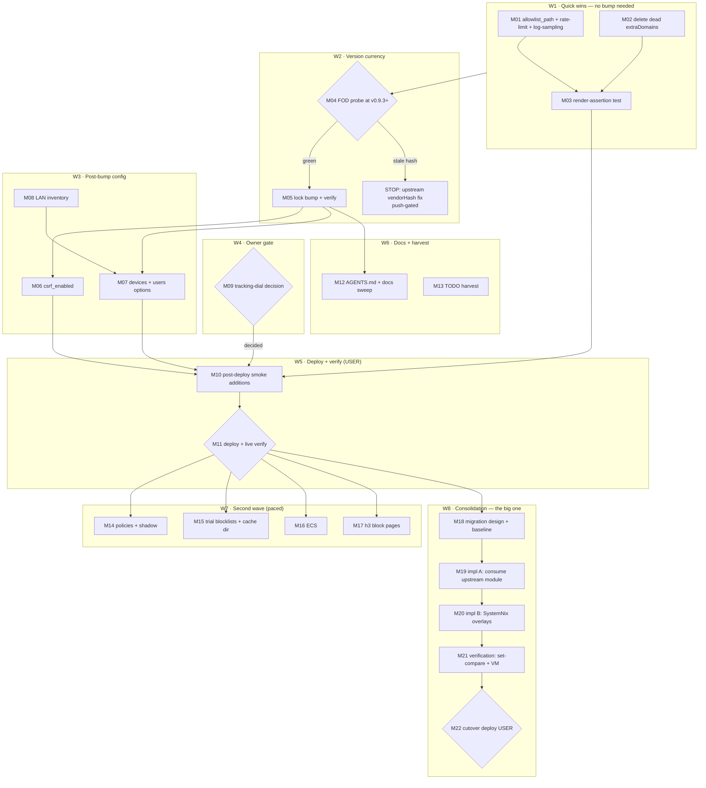

# DNSBLOCKD MAX-ADOPTION — Pareto Execution Plan

**Date:** 2026-09-30 12:13 · **Status:** planned, awaiting execution windows
**Source audit:** [`docs/research/2026-09-30_dnsblockd-deep-dive.html`](../research/2026-09-30_dnsblockd-deep-dive.html) (adoption 62/100, committed `21b3804d`)
**Scope:** everything between the audit's 12 opportunities and a fully-leveraged dnsblockd — config gaps, version currency, wrapper debt, and the owner-gated decisions. Excludes already-tracked separate work (hot-db wave, orphaned-DB cleanup) except as references.

## Context (what an executor must know)

- **Deployed state (verified 2026-09-30):** binary `dnsblockd-75b4ce9` (v0.9.2-32) == flake.lock rev `75b4ce9d`. Upstream `origin/master` = `8531c772` (v0.9.3-64); **tag `v0.9.3` exists**. Input is `github:LarsArtmann/dnsblockd?ref=master` → bump verb is `nix flake lock --update-input dnsblockd` (after the FOD probe).
- **Integration point:** `modules/nixos/services/dns-blocker.nix` — a ~900-line wrapper rendering dnsblockd's YAML (upstream's own NixOS module is NOT consumed; migration tracked separately). Every gap is a missing key in the render block at lines 225-326.
- **Hard prerequisites from upstream:** devices registry needs v0.9.3 (T309: a configured device's block-page Allow never unblocked it — fixed there); `csrf_enabled` needs v0.9.3 (T300: token-login 403 with csrf on — fixed + e2e-pinned there).
- **Owner-gated:** the tracking-mode dial (`METADATA_ONLY` → `METADATA_AND_DNS`) is a privacy decision — prepare, never flip unilaterally. Deploys (`nix run .#deploy`) are sudo-gated, never agent-run.
- **Eval reality:** every wrapper edit pays ~30-90s flake eval (420-node lock; guards are O(repo) by design). Pre-commit runs `nix flake check --no-build` on staged `.nix`. The auto-commit daemon sweeps — commit with pathspec (`git commit -m … -- <paths>`), verify daemon commits before amending.
- **Anti-verschlimmbessern guards:** probe the go-modules FOD BEFORE moving the lock; no wholesale wrapper rewrites (migration is its own gated wave); no runtime blocklist fetching without a persistent cache dir (PrivateTmp eats `/tmp` caches); never render `auth_token`/OIDC secrets into store YAML; do not "fix" the forwarders while at v0.9.2 (root recursion is broken in the deployed rev — T299 lands with the bump).

## Pareto Breakdown

### The 1% that delivers 51%

**Persist the permanent allowlist** — one wrapper line (`allowlist_path = "/var/lib/dnsblockd/allowlist"`). Stops active, recurring DATA LOSS: today every dashboard "Always allow", every `POST /api/allowlist`, and the entire Likely-Broken-Sites bulk-allow verdict is wiped by every restart — and every deploy restarts the unit (restartTriggers). Nothing else in the audit loses data; this does, daily.

### The 4% that deliver 64%

1. **allowlist_path** (the 1%, above)
2. **Lock bump → v0.9.3+** — FOD probe, `--update-input`, package verify. Unblocks three downstream wins by itself (T309, T300, T299 posture).
3. **`csrf_enabled = true`** (after the bump) — dashboard action forms get double-submit protection behind Caddy HTTPS.
4. **Delete the dead `extraDomains` option** — declared at dns-blocker.nix:408, never rendered: a phantom-config trap in the exact class this repo's eval guards exist to kill.

### The 20% that deliver 80%

Everything above, PLUS:

5. **devices + users registry** — wrapper option plumbing + LAN inventory (`ip neigh` proposal). Lights up named Top Clients, per-device pause, device-scoped temp-allows, Live DNS Wire names.
6. **Post-deploy smoke for the new state** — allowlist-persistence probe + devices-attribution probe in `scripts/post-deploy-check.sh`.
7. **DNS rate limit 50/s + burst 100 + log-sampling keys** — same wrapper batch as (1), zero extra evals.
8. **Tracking-dial decision memo** — one-pager costing METADATA_AND_DNS (domains/categories, no headers/payloads) so the owner can decide in 5 minutes.

### The other 80% → 100% (sequenced, slower, or already tracked elsewhere)

9. **policies + shadow-mode dry-run** (needs devices proven in prod)
10. **Trial blocklists** (runtime fetch + persistent `blocklist_cache_dir` — a deliberate departure from the hermetic build-time pipeline; needs thought)
11. **ECS /24** (privacy tradeoff, owner-flavored)
12. **h3 block pages** (cosmetic-perf)
13. **Wrapper → upstream NixOS module migration** — the big consolidation, ALREADY QUEUED [ready] `docs/todo/services.md:57`; this plan sequences it LAST (it re-baselines every key added above)
14. **tracking.db hot-db wave** — already tracked (`docs/todo/storage.md`), owner sudo windows; referenced, not duplicated
15. **Orphaned 724 MB tracking DB cleanup** — already tracked [blocked:user]
16. **Cached-/health + dashboard-auth live verifies** — already tracked [blocked:user]
17. **docs sweep** — AGENTS.md recursion comment (stale after bump), tracking-dial doc, runbook pointer

---

## Comprehensive Plan — medium tasks (30-100 min each)

Sorted by importance → impact → effort → operator value. Wave order IS execution order (see graph).

| ID | Task | Wave | Impact (1-5) | Effort | Value | Depends on |
|----|------|------|------|------|------|------------|
| M01 | **Quick-win wrapper batch**: `allowlist_path` + `dns_rate_limit_per_sec/burst` (50/100) + `log_sampling_threshold/rate` in the render block; eval; pathspec commit | W1 | 5 | 60m | stops daily data loss + DoS belt + journal-flood control | — |
| M02 | **Delete dead `extraDomains` option** + sweep for other declared-never-rendered wrapper options | W1 | 2 | 30m | removes phantom-config trap | — |
| M03 | **Render-assertion test**: extend `tests/test-cloud-domain.nix` (or sibling) — deployed YAML carries the new keys, no phantom keys, assertions fire on empty allowedNetworks etc. | W1 | 3 | 45m | keeps W1 gains pinned against wrapper drift | M01, M02 |
| M04 | **FOD probe at upstream**: `nix build github:LarsArtmann/dnsblockd/master#default.goModules`; capture verdict; note tag `v0.9.3` exists (master-follow stays the default per pin policy) | W2 | 4 | 45m | prevents the domino-deploy class | — |
| M05 | **Lock bump**: `nix flake lock --update-input dnsblockd` → package build from OUR lock (`f.inputs.dnsblockd.packages…`) → `nix flake check --no-build` → pathspec commit | W2 | 4 | 75m | carries T299/T309/T300 into the tree | M04 green |
| M06 | **`csrf_enabled = true`** render (csrf_cookie_secure stays default-true) + confirm SSO-cookie flows behind Caddy unaffected (SameSite note in commit) | W3 | 3 | 30m | closes cross-site POST surface on allow/report/bulk | M05 landed |
| M07 | **devices + users wrapper options** (`types.listOf (types.submodule)`), render, assertions (dup-IP, slug ids); eval | W3 | 4 | 90m | named attribution, per-device pause, scoped allows | M05 landed (T309) |
| M08 | **LAN inventory**: `ip neigh` sweep + known-hosts crossref → proposed devices/users values (evo-x2=.150 known; pixel6/TV owner-confirmed at deploy) | W3 | 3 | 30m | the actual data for M07 | — |
| M09 | **Tracking-dial decision memo**: METADATA_AND_DNS vs METADATA_ONLY — what lights up (Top Domains, Query Log, Likely-Broken Sites, day maps), what is NOT stored (headers/payloads), retention bounds; prepared flip patch (NOT applied) | W4 | 4 | 30m | owner decides in 5 min instead of never | — |
| M10 | **Post-deploy smoke additions**: allowlist-persistence probe (restart unit → allow survives), devices-attribution probe, csrf form probe | W5 | 3 | 45m | the new state stays verified forever | M01..M07 in tree |
| M11 | **Deploy + live verification** (USER sudo window): `nix run .#deploy`, run M10 probes, dashboard walk (devices named, Likely-Broken Sites accumulating, csrf form posts) | W5 | 5 | 30m | everything above goes LIVE | M10 + owner |
| M12 | **Docs sweep**: AGENTS.md dnsblockd section (recursion comment stale post-T299, tracking-dial paragraph, allowlist note), runbook pointer, blocklist-count comment (25→23) | W6 | 2 | 30m | future sessions stop inheriting stale claims | M05 (facts known) |
| M13 | **TODO harvest** (THIS session): queue rows + services.md library entries + upstream.md tag-row annotation | W6 | 3 | 30m | living sources stay truthful | done at planning |
| M14 | **policies + shadow mode**: wrapper options (`policies` list w/ schedule strings), render, `GET /api/policies/shadow` probe doc | W7 | 3 | 90m | scheduled per-device blocking, dry-run first | M11 (devices proven) |
| M15 | **Trial blocklists**: `blocklist_trial_urls` option + PERSISTENT `blocklist_cache_dir` (`/var/lib/dnsblockd/blocklist-cache`; PrivateTmp makes `/tmp` default lose it) + ReadWritePaths check | W7 | 2 | 60m | evidence-driven list tier changes | M11 |
| M16 | **ECS enable** (`dns_ecs_enabled` + /24): render + doc note (forwarders see client /24) | W7 | 2 | 30m | better CDN geo on big downloads | M11, owner nod |
| M17 | **h3 block pages** (`tls_h3_enabled`): render + UDP-443 firewall check | W7 | 1 | 30m | QUIC block pages | M11 |
| M18 | **Wrapper→upstream module migration — design**: option-by-option mapping table, list what upstream module CANNOT express (runtime whitelist filter, attach-ip, omd exemption → keep as overlays), surface-preservation baseline plan (pre-migration worktree eval diff) | W8 | 3 | 60m | kills the split-brain class at the root | M11 (stable base) |
| M19 | **Migration impl A**: consume upstream module, map all W1-W7 keys to its options | W8 | 3 | 100m | — | M18 |
| M20 | **Migration impl B**: re-add SystemNix layers as overlays (whitelist pre-filter → blocklistFiles post-processing; harden/oomd on the unit; sops CA) | W8 | 3 | 100m | — | M19 |
| M21 | **Migration verification**: worktree baseline set-compare of rendered YAML + unit text; VM-test the migrated unit | W8 | 4 | 90m | no paperless-/admin-class silent surface loss | M20 |
| M22 | **Migration cutover** (USER window): deploy + smoke + watch DNS through one restart cycle | W8 | 4 | 30m | one wrapper, upstream-maintained | M21 + owner |

**Already tracked elsewhere (NOT duplicated here — see audit appendix):** tracking.db hot-db wave (`storage.md`), orphaned 724 MB DB `[blocked:user]`, cached-/health + dashboard-auth live verifies `[blocked:user]`, h2-ALPN probe row, DMS-widget Pocket-ID machine-creds (parked), tag-pin-vs-master decision (annotated in `upstream.md` this session).

---

## Fine Breakdown — micro-tasks (≤12 min each)

Sorted by wave, then importance. Parent = medium task.

| ID | Micro-task | Parent | Time | Output / verification |
|----|-----------|--------|------|----------------------|
| F01 | `git status` + `nix flake check --no-build` baseline; record green/red | M01 | 5m | baseline verdict in session log |
| F02 | Read render block dns-blocker.nix:225-326; pin exact insertion points | M01 | 8m | line-accurate edit plan |
| F03 | Edit: add `allowlist_path = "/var/lib/dnsblockd/allowlist";` | M01 | 2m | key present in render |
| F04 | Edit: add `dns_rate_limit_per_sec = 50; dns_rate_limit_burst = 100;` | M01 | 3m | keys present |
| F05 | Edit: add `log_sampling_threshold = 500; log_sampling_rate = 100;` | M01 | 3m | keys present |
| F06 | Comment each new key with WHY (data-loss class, DoS belt, storm class) | M01 | 8m | comments match repo style |
| F07 | Eval the wrapper: `nix eval .#nixosConfigurations.evo-x2.config.systemd.services.dnsblockd` (forces render) | M01 | 10m | eval green |
| F08 | Pathspec commit M01 files | M01 | 5m | clean commit, no daemon sweep-ins |
| F09 | Grep wrapper for every `mkOption` name vs render-block usage — find more `extraDomains`-class dead options | M02 | 10m | dead-option list |
| F10 | Delete `extraDomains` option (F09 confirms no other consumer) | M02 | 3m | gone |
| F11 | Eval + pathspec commit M02 | M02 | 10m | green |
| F12 | Read `tests/test-cloud-domain.nix`; pick extension shape | M03 | 8m | test plan |
| F13 | Write render assertions (allowlist/rate-limit/log-sampling present; extraDomains gone) | M03 | 12m | test code |
| F14 | Negative case: mutate a copy → assertions fire | M03 | 10m | red-then-green proof |
| F15 | Build the test via `nix build .#checks.x86_64-linux.<name>` (or flake check) | M03 | 12m | derivation green |
| F16 | Pathspec commit M03 | M03 | 3m | — |
| F17 | Run FOD probe: `nix build github:LarsArtmann/dnsblockd/master#default.goModules` | M04 | 12m | hash verdict / got-hash |
| F18 | If FOD fails: capture `got:` hash → upstream `nix/packages.nix` fix path (upstream repo, push-gated) — STOP, annotate | M04 | 10m | breadcrumb, no blind lock move |
| F19 | Record master vs v0.9.3 delta note (post-tag commits are docs/tests only → master-follow OK) | M04 | 8m | decision note |
| F20 | `nix flake lock --update-input dnsblockd` | M05 | 5m | lock moves to ≥ v0.9.3 |
| F21 | Verify lock node: rev, narHash, no dirtyRev | M05 | 3m | healthy pin |
| F22 | Build package from OUR lock (`--impure --expr` f.inputs.dnsblockd…) | M05 | 12m | store path prints |
| F23 | `nix flake check --no-build` full | M05 | 12m | green |
| F24 | Pathspec commit (flake.lock + any wrapper floor fix if go.mod moved) | M05 | 5m | — |
| F25 | Add `csrf_enabled = true;` render (cookie_secure stays default) | M06 | 3m | key present |
| F26 | Eval + verify SSO-flow reasoning (state-TTL covers login; forms get double-submit) in the commit body | M06 | 10m | commit |
| F27 | Author `devices` option: `types.listOf (types.submodule { id, name, group?, ips })` | M07 | 12m | option |
| F28 | Author `users` option: `types.listOf (types.submodule { name, devices })` | M07 | 8m | option |
| F29 | Render both keys (only when non-empty, `optionalAttrs` pattern) | M07 | 8m | YAML carries them |
| F30 | Assertions: unique ids, unique IPs across devices, slug-format ids, device refs resolve | M07 | 12m | assertions |
| F31 | Eval evo-x2 green | M07 | 10m | — |
| F32 | Pathspec commit M07 | M07 | 3m | — |
| F33 | `ip neigh show` + arp crossref; draft devices list (evo-x2, pixel6, TV, hermes?) | M08 | 10m | proposed inventory |
| F34 | Mark unknown IPs `# owner-confirm` in the draft config | M08 | 3m | honest placeholders |
| F35 | Write decision memo `docs/services/dnsblockd-tracking-dial.md` (or section): what unlocks, what is NOT stored, retention | M09 | 12m | memo |
| F36 | Prepare the one-line flip as a comment in the memo (NOT in config) | M09 | 3m | patch-ready |
| F37 | Smoke: allowlist-persistence probe block (restart → grep persisted file) | M10 | 12m | script |
| F38 | Smoke: devices-attribution probe (`/api/devices` attributionRate > 0) | M10 | 10m | script |
| F39 | Smoke: csrf form double-submit presence probe | M10 | 8m | script |
| F40 | `bash -n` the edited smoke script + pathspec commit | M10 | 5m | lint+commit |
| F41 | USER: `nix run .#deploy`; watch activation + dnsblockd restart | M11 | 10m | generation anchored |
| F42 | USER/agent: run M10 probes; dashboard walk (devices, Likely-Broken Sites, allow form) | M11 | 12m | all green |
| F43 | `readlink` both system pointers match (anchor check) | M11 | 2m | no deploy-skew |
| F44 | AGENTS.md: fix recursion comment (dns-blocker-config.nix:14-17 + AGENTS), deployed-rev claims, tracking-dial note | M12 | 12m | docs truthful |
| F45 | Fix blocklist-count comment 25→23 + runbook pointer | M12 | 5m | — |
| F46 | Pathspec commit M12 | M12 | 3m | — |
| F47 | Harvest: queue rows (5) + services.md library entries (8) + upstream.md tag-row annotation | M13 | 12m | living sources updated |
| F48 | Author `policies` option (name/groups/devices/block/allow/schedule) | M14 | 12m | option |
| F49 | Render + assertions (schedule format, cap counts) | M14 | 12m | — |
| F50 | Doc: shadow-mode probe (`GET /api/policies/shadow`) usage | M14 | 8m | — |
| F51 | Eval + commit M14 | M14 | 10m | — |
| F52 | Author `blocklist_trial_urls` + `blocklist_cache_dir` options; render | M15 | 12m | options |
| F53 | Persistent cache dir plumbing: StateDirectory path + ReadWritePaths audit | M15 | 10m | no PrivateTmp loss |
| F54 | Eval + commit M15 | M15 | 10m | — |
| F55 | Add `dns_ecs_enabled = true` + prefix lens; doc the tradeoff | M16 | 6m | — |
| F56 | Eval + commit M16 | M16 | 10m | — |
| F57 | Add `tls_h3_enabled` option + firewall UDP-443 check | M17 | 10m | — |
| F58 | Eval + commit M17 | M17 | 10m | — |
| F59 | Build the option-mapping table (wrapper option ↔ upstream module option ↔ keep-as-overlay) | M18 | 12m | table |
| F60 | Surface-preservation baseline: worktree eval of rendered YAML + unit; store JSON | M18 | 12m | baseline |
| F61 | Migration module skeleton: import upstream module, set enable + package | M19 | 12m | evals |
| F62 | Map W1 keys (allowlist, rate limit, log sampling) to upstream options | M19 | 10m | — |
| F63 | Map DNS keys (forwarders, zones, records, ACL, DNSSEC, ipv6) | M19 | 12m | — |
| F64 | Map OIDC/proxy/stats/trustedProxies keys | M19 | 12m | — |
| F65 | Re-add whitelist pre-filter as blocklist post-processing overlay | M20 | 12m | filter preserved |
| F66 | Re-add attach-ip unit + ordering (upstream module lacks it) | M20 | 10m | — |
| F67 | Re-add harden{}/oomd-exemption/GOMEMLIMIT/GOTRACEBACK on the unit via mkMerge | M20 | 12m | — |
| F68 | Re-add sops CA wiring + secret-wait ExecStartPre + restartTriggers | M20 | 12m | — |
| F69 | Baseline set-compare: rendered YAML + unit text old-vs-new | M21 | 12m | zero unexplained deltas |
| F70 | VM test: migrated unit boots, DNS serves, block page renders | M21 | 12m | test green |
| F71 | Commit migration + close services.md:57 row | M21 | 5m | — |
| F72 | USER: cutover deploy + smoke + one restart-cycle watch | M22 | 12m | live |

**Total:** 72 micro-tasks · 22 medium tasks. Agent-executable: everything except F41/F42(user-assisted)/F43 checks post-user-deploy and M11/M22 windows.

---

## Execution Graph

**Critical path:** M01 → M04 → M05 → M07 → M10 → M11 (≈ 5h agent work + one user deploy window). Everything else is off-path.

## Guards (do NOT verschlimmbessern)

1. **Never move the lock without the FOD probe** (M04 gates M05) — the domino-deploy class cost 25 min × 4 switches once.
2. **Never flip `tracking_mode` yourself** — M09 produces the decision, the owner flips it (or sanctions F36's patch in a deploy window).
3. **Never deploy** — M11/M22 are sudo windows; agent work ends at "eval green + smoke scripts ready".
4. **Migration (W8) is LAST** — re-baselining the wrapper before W1-W7 land means doing the mapping twice.
5. **Trial blocklists reintroduce runtime fetches** — no `blocklist_trial_urls` without the persistent cache dir (M15's whole point).
6. **Pathspec commits only** — the daemon batches parallel sessions; a bare `git add -A` steals other sessions' work.
7. **Every new render key gets a why-comment** — the wrapper is the only place future sessions can learn intent.

## Harvest (executed with this plan)

Queue rows added (`TODO_LIST.md` → services): allowlist quick-win batch, lock bump, extraDomains removal, csrf (sequenced), devices+users. Library entries added (`docs/todo/services.md`): the five above in full + tracking-dial `[decision]` + deploy/verify wave `[blocked:user]` + second-wave capabilities `[watch]`. Annotated `docs/todo/upstream.md` tag row (v0.9.3 exists → tag decision unblocked).
