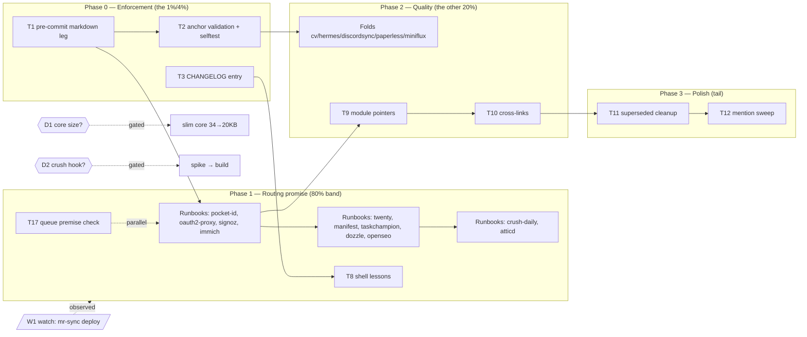

# AGENT-DOCS-DURABILITY-PARETO-PLAN — 2026-10-01 03:00

**Context.** The 2026-10-01 restructure (status report: `docs/status/2026-10-01_02-54_agents-md-restructure-domain-library.md`)
moved the 605KB AGENTS.md into a 34KB need-to-know core + `docs/agents/` domain
library + per-service runbooks, with zero content loss. The structure is only as
valuable as its DURABILITY: nothing today enforces link/anchor integrity, ~11
services still lack the runbooks the routing table promises, and the migrated
prose is verbatim (accurate, not tightened). This plan schedules ALL open work.

**Guardrails (anti-verschlimmbesserung).**
- No churn of parallel-session files (`mr-sync.*`, `test-dns-blocker-render.nix`).
- No new automation (crush hook) without the owner decision D2.
- Prose-tightening passes are VERBATIM-FIRST: any rewrite keeps the line-level
  conservation audit green (0 missing) or records the deliberate deletion.
- Runbooks fold ONLY per-file on touch (D1/D2 defaults below) unless the owner
  orders the churn wave.
- Every task ships with its own verification step; no "done" without a probe.

**Owner decisions defaulted (change on instruction).**
- D1 core size: **keep ~34KB** (Platform Constraints stays in core) — slimming
  to ~20KB is queued as an optional task, not default.
- D2 context automation: **routing table + discipline** (no hook) — spike queued.
- D3 appendix fold: **per-file on touch** — the 5 highest-traffic folds are
  queued as individually dispatchable tasks.

---

## 1. Pareto breakdown

### The 20% that deliver 80%
1. **Enforcement gates** (T1 pre-commit markdown leg + T2 anchor validation) —
   converts the entire new docs structure from "trust the migration" to
   "machine-enforced forever"; every future session inherits integrity.
2. **Runbook backfill** (T4a–T6c, 11 files) — makes the routing table's promise
   true ("docs/services/ is the per-service home"); today 11 enabled services
   have no home.
3. **CHANGELOG entry** (T3) — one-way traceability of the restructure.

### The 4% that deliver 64%
The two gate tasks alone (T1 + T2). After them, doc rot is impossible to
reintroduce silently — the other work improves quality, these preserve
existence.

### The 1% that deliver 51%
**T1 alone**: wiring the EXISTING `scripts/check-doc-links.sh` into the
EXISTING `.githooks/pre-commit` as a markdown leg (~45min, zero new logic).
It already validates relative links across AGENTS.md + docs/agents + docs/services;
unwired, it protects nothing.

### The other 20% (to reach 100%)
Editorial folds (T7a–e), prose tightening / superseded-chain cleanup (T11),
module→runbook pointers (T9), cross-links (T10), repo-wide AGENTS.md mention
sweep (T12), shell-lessons absorption (T8), queue premise spot-check (T17),
mr-sync deploy watch (W1), decisions D1–D3 rides.

---

## 2. Coarse plan — ALL todos, 20–100min each

Sorted by importance → impact → effort → customer (agent-session) value.
`P0` = do first; `watch/decision` = gated.

| ID    | Task                                                                        | Imp | Est    | Verify                                                            |
| ----- | --------------------------------------------------------------------------- | --- | ------ | ----------------------------------------------------------------- |
| T1    | Wire `check-doc-links.sh` into `.githooks/pre-commit` (staged-`.md` keyed leg) | P0  | 45min  | plant a broken link on a throwaway commit → hook FAILs → revert    |
| T2    | Anchor validation: extend checker to resolve `#anchor` vs target headings; `--selftest` fixtures (anchor present/absent, GitHub slug rules) | P0  | 90min  | selftest + planted bad anchor in repo tree fails the checker       |
| T3    | CHANGELOG entry for the restructure (both commits, sizes, audit result)     | P0  | 20min  | entry renders in CHANGELOG.md; check-todo-system still green       |
| T4a   | Runbook: pocket-id (module + sso-dns knowledge → layout/runbook shape)      | P1  | 45min  | check-doc-links green; routing claim row updated                   |
| T4b   | Runbook: oauth2-proxy                                                       | P1  | 40min  | same                                                                |
| T4c   | Runbook: signoz (main service; link coverage/GCP sub-docs)                  | P1  | 60min  | same                                                                |
| T4d   | Runbook: immich                                                             | P1  | 45min  | same                                                                |
| T5a   | Runbook: twenty                                                             | P1  | 35min  | same                                                                |
| T5b   | Runbook: manifest                                                           | P2  | 30min  | same                                                                |
| T5c   | Runbook: taskchampion                                                       | P2  | 30min  | same                                                                |
| T5d   | Runbook: dozzle                                                             | P2  | 25min  | same                                                                |
| T5e   | Runbook: openseo (incl. the GSC exemption pointer)                          | P2  | 30min  | same                                                                |
| T6a   | Runbook: crush-daily                                                        | P2  | 30min  | same                                                                |
| T6b   | Runbook: atticd                                                             | P2  | 35min  | same                                                                |
| T8    | Absorb session shell lessons into `docs/agents/shell-devtools.md` (`grep -F -e`, no `$1`-after-`shift`, content-probe > wc) | P1  | 25min  | file grep shows all three rules; doc-links green                   |
| T17   | Spot-verify the 6 harvested queue rows' premises (grep each claimed fact)   | P1  | 20min  | notes on each queue row or corrections committed                   |
| T7a–e | Editorial fold of appendices → narratives: cv, hermes, discordsync, paperless, miniflux (one task each; dispatch on touch or owner go) | P2  | 45min each | per-file: appendix banner gone, content merged, line-audit still 0-missing |
| T9    | Module→runbook pointer comments (one `# Runbook:` line per service module, ~40 files) | P2  | 60min  | grep: every `modules/nixos/services/*.nix` with a runbook carries the pointer |
| T10   | Cross-link integration-registry step 9 ↔ monitoring.md Gatus patterns       | P2  | 15min  | both directions link; anchors valid (T2)                          |
| T11   | Superseded-chain narrative cleanup in docs/agents files (rewrite corrected/superseded claims into final truth, keep audit) | P3  | 90min  | line-audit exemption list documented per deliberate deletion       |
| T12   | Repo-wide prose `AGENTS.md` mention classification sweep (live pointer vs historical claim) | P3  | 40min  | table in the closure report; stale ones fixed on sight            |
| D1'   | (Optional, only on owner go) Slim core to ~20KB: Platform Constraints detail → storage/stability | decision | 45min | core size + routing rows updated                                  |
| D2'   | (Optional) Crush context-automation spike: hook design sketch, no build    | decision | 30min | design note appended to docs/agents/README.md                     |
| D2''  | (Optional, after D2' go) Build the hook                                     | decision | 100min | one-session E2E: editing a systemd unit auto-loads systemd.md     |
| W1    | Watch: parallel session's mr-sync `wantedBy` fix rides the next deploy      | watch | 5min  | post-deploy: unit active + Gatus green (their scope)              |

**Totals:** P0 ≈ 2.6h · P1 ≈ 4.2h · P2 ≈ 5.5h · P3 ≈ 2.2h · gated ≈ 3h.

---

## 3. Fine plan — ALL todos, ≤12min each

Micro-IDs `M<x>.y` map to coarse IDs. Verify column = the probe that must pass
before the micro-task counts done.

| Micro   | Task (≤12min)                                                              | Parent | Est | Verify                                    |
| ------- | --------------------------------------------------------------------------- | ------ | --- | ----------------------------------------- |
| M1.1    | Read `.githooks/pre-commit` filetype-leg pattern (how .sh/.nix legs gate)   | T1     | 6   | can name the gating variable               |
| M1.2    | Add markdown leg: collect staged `.md`, bail fast if none                   | T1     | 8   | `bash -n` + hook runs clean on no-.md commit |
| M1.3    | Leg invokes `scripts/check-doc-links.sh` (full living-docs scan, cheap)     | T1     | 5   | hook output shows the OK line              |
| M1.4    | Plant a broken link in a scratch .md, stage it, run hook                    | T1     | 6   | hook FAILs with BROKEN line                |
| M1.5    | Revert fixture, re-run hook on real staged set                              | T1     | 4   | hook passes                                |
| M1.6    | Pathspec commit + run `scripts/check-todo-system.sh`                        | T1     | 5   | both green                                 |
| M2.1    | Write anchor-slugging function in checker (lowercase, strip punct, spaces→`-`)| T2   | 10  | unit-test inline: 3 known headings         |
| M2.2    | Extract headings of each link target file, build anchor set                 | T2     | 10  | debug print shows sets                     |
| M2.3    | Compare link anchors vs set; collect failures                               | T2     | 8   | manual fixture fails                        |
| M2.4    | `--selftest` fixtures: good anchor, bad anchor, dot-punctuation case        | T2     | 10  | selftest exit 0                            |
| M2.5    | Fix any REAL anchor failures the new check finds in the tree                | T2     | 10  | full checker green on repo                 |
| M2.6    | Commit + note in shell-devtools that anchors are now gated                  | T2     | 4   | log shows commit                           |
| M3.1    | Draft CHANGELOG entry (before/after sizes, file counts, commits, audit)     | T3     | 8   | entry text complete                        |
| M3.2    | Insert under latest release heading; commit                                 | T3     | 6   | renders, checkers green                    |
| M4a.1–3 | pocket-id runbook: read module + sso-dans/secrets refs → write layout table → wire cross-refs | T4a | 3×12 | doc-links green                            |
| M4b.1–3 | oauth2-proxy runbook: same 3 steps                                          | T4b    | 3×10 | doc-links green                            |
| M4c.1–5 | signoz runbook: module + monitoring.md split → layout → alerts/provisioner pointers → cross-refs | T4c | 5×11 | doc-links green                            |
| M4d.1–3 | immich runbook: same 3 steps                                                | T4d    | 3×12 | doc-links green                            |
| M5a.1–3 | twenty runbook (mkDockerService pattern)                                    | T5a    | 3×10 | doc-links green                            |
| M5b.1–3 | manifest runbook                                                            | T5b    | 3×9  | doc-links green                            |
| M5c.1–3 | taskchampion runbook                                                        | T5c    | 3×9  | doc-links green                            |
| M5d.1–2 | dozzle runbook (attach-flavor note)                                         | T5d    | 2×10 | doc-links green                            |
| M5e.1–3 | openseo runbook (GSC exemption pointer)                                     | T5e    | 3×9  | doc-links green                            |
| M6a.1–3 | crush-daily runbook                                                         | T6a    | 3×9  | doc-links green                            |
| M6b.1–3 | atticd runbook (storage-dir + cache notes)                                  | T6b    | 3×10 | doc-links green                            |
| M8.1    | Draft the 3 shell rules as bullets with session evidence                    | T8     | 9   | text review                                |
| M8.2    | Append to shell-devtools.md; commit                                         | T8     | 5   | doc-links + fence check green              |
| M17.1   | Grep-verify each of the 6 harvested rows' factual premises                  | T17    | 10  | premise notes                              |
| M17.2   | Correct any wrong premise in queue + library (both surfaces)                | T17    | 8   | check-todo-system green                    |
| M7x.1–4 | Per fold (×5): read runbook → restructure appendix into sections → line-audit diff → commit | T7a–e | 4×11 each | banner gone, audit 0-missing           |
| M9.1    | Generate module↔runbook mapping (ls + test)                                 | T9     | 8   | mapping table complete                     |
| M9.2–6  | Add `# Runbook: docs/services/x.md` headers in batches of ~8 modules        | T9     | 5×8 | grep coverage 100%                         |
| M10.1   | Add bidirectional links + commit                                            | T10    | 10  | T2 checker green                           |
| M11.1–7 | Superseded cleanup per docs/agents file (nix-flakes, systemd, storage, stability, secrets, desktop, monitoring): rewrite chain → final truth, record deletions | T11 | 7×12 | audit exemption list updated         |
| M12.1   | Grep all remaining prose AGENTS.md mentions; classify live/historical       | T12    | 10  | table drafted                             |
| M12.2   | Fix live-pointer stale ones (on-sight rule); commit                         | T12    | 10  | doc-links green                           |
| MD1.1   | (gated) Move Platform Constraints paras → storage/stability; add pointers   | D1'    | 12×3| core ~20KB, routing updated                |
| MD2.1   | (gated) Hook design spike note                                              | D2'    | 10  | note appended                              |
| MW1.1   | After next deploy: `systemctl is-active mr-sync-dashboard` + Gatus          | W1     | 5   | active + green (their scope)               |

**Micro-total:** ≈ 6.5h across ~70 steps; every step ends in a verifiable probe.

---

## 4. Execution graph

Order rationale: enforcement before content (protects everything built after),
backfill before folds (homes before renovation), polish last (least value,
most churn).

## 5. Sequencing notes

- T1 lands FIRST and alone — it is the 51% item and touches shared hook infra
  (pre-commit runs for every session; keep the leg fast and no-op without
  staged `.md`).
- T2 changes a shared script — land with selftest before relying on it in CI.
- Runbook waves are independent per file → safe to interleave with the
  parallel session's deploys (docs-only, no eval impact).
- Folds (T7a–e) respect D3 (on-touch default): dispatch one per runbook touch
  or when the owner orders the wave — never batch during active parallel work
  without explicit go (mr-sync/dns-blocker sessions are live right now).
- W1 stays a watch: the mr-sync fix is the parallel session's scope; we only
  verify post-deploy, never touch their module.
