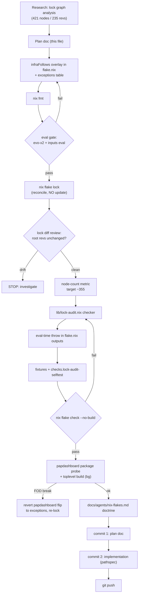

# Flake Lock Infra Dedup — Collapse 63 Duplicate Lock Nodes

**Date:** 2026-10-02 09:47
**Status:** EXECUTING (this plan is being implemented in the same session)
**Baseline:** commit `eff84ca8` (clean tree, daemon-committed lock update 09:31)

## Problem

`flake.lock` holds **421 nodes for only 235 unique revs**. Nix creates one lock node
per _path_ in the input graph: every LarsArtmann tool flake that consumes
`flake-parts` / `treefmt-nix` / `nixpkgs` / `systems` without a `follows` pin to the
root gets its own locked copy, uniquified with `_N` suffixes. 43+ LarsArtmann inputs
that transitively depend on each other multiply this.

### Measured duplicate inventory (2026-10-02 analysis)

| Dep             | Nodes | Distinct revs | Flavor                                                  |
| --------------- | ----- | ------------- | ------------------------------------------------------- |
| flake-parts     | 24    | 2             | 23 same-rev dups + real drift (old rev buried deep)     |
| treefmt-nix     | 18    | 1             | pure bloat (27 root consumers)                          |
| nixpkgs         | 8     | 3             | 5 same-rev dups + qmd (intentional) + papdashboard/nsfw |
| systems         | 7     | 1             | pure bloat                                              |
| flake-compat    | 7     | 1             | pure bloat                                              |
| go-nix-helpers  | 8     | 6             | hermetic per-tool pins — DO NOT touch                   |
| git-hooks       | 5     | 1             | pure bloat                                              |
| flake-utils     | 2     | 1             | pure bloat                                              |
| Go lib tarballs | ~130  | 2–5 each      | hermetic per-tool pins — DO NOT touch (vendorHash)      |

Root's own nodes are `nixpkgs_4`, `flake-parts_8`, `treefmt-nix_18`, `systems_7` —
node names are allocation artifacts; node COUNT is the metric.

## Non-negotiable constraints (documented repo doctrine)

1. **Never `follows` Go source deps into Go tool flakes** (`go-*` tarballs,
   `go-nix-helpers`): the override changes vendored module content → vendorHash FOD
   mismatch. Precedents: go-taskqueue (bank-sync trap), discordsync (2026-08-25
   got-hash drift), qmd (bun nodeModules FOD validated against upstream's nixpkgs).
2. **No blanket `nix flake update`** — that is the 12:13 lock-wave class that
   re-broke vendorHashes on 2026-10-01. Only `nix flake lock` (no args): it
   reconciles entries whose flake.nix spec changed and does NOT float revs.
3. **Pre-commit runs `nix flake check`** — the commit itself is a gate; also the
   daemon-race rule applies: PATHSPEC commits only.
4. Never break the build: full verification battery before commit; if the
   papdashboard nixpkgs flip breaks a FOD, revert just that entry into the
   exceptions table and re-lock (documented fallback).

## Solution (3 moves)

1. **Generated infra-follows** — one overlay in `flake.nix` maps each consumer
   input → the infra deps it may follow to root. Data-derived from the lock
   analysis (only deps the consumer actually declares; no blind injection).
   Additive: existing hand-written follows stay (identical semantics).
2. **Eval-time lock audit** — `lib/lock-audit.nix` reads `flake.lock` at eval
   time and `throw`s on (a) same-rev duplicate nodes for infra deps (pure bloat
   regression), (b) infra-dep rev drift beyond the allowlist
   (`nixpkgs`: root + qmd; `nixpkgs` own-node owners: discordsync, qmd).
   Enforced on EVERY eval — a future blanket lock wave that reintroduces dups
   bricks the eval with a self-describing error, instead of silently regrowing
   the lock. Self-testing via `checks.lock-audit-selftest` (evil/clean fixtures),
   matching the repo's gitleaks-coverage-selftest pattern.
3. **Lock reconcile** — `nix flake lock` collapses alias-able nodes; prune of the
   stale `nsfw-classifier` subtree (input commented out in flake.nix since the
   09-31 session but still locked).

### Deliberately NOT done (verschlimmbessern guard)

- Go lib tarball duplication (~130 nodes) stays: hermetic per-tool pins are
  load-bearing for vendorHash stability. The audit ignores this class.
- `go-nix-helpers` multi-rev stays: per-tool helper revs are validated FOD
  environments (6 distinct revs by design).
- The 136 existing hand-written follows lines stay: removing them is pure churn
  in a trap-documented file; the overlay supersedes them semantically. New
  follows go in the overlay only (doctrine note added).

## Pareto breakdown

- **1% → 51%:** the `infraFollows` overlay + `nix flake lock` reconcile —
  collapses ~60 of 63 dup nodes in one edit + one command.
- **4% → 64%:** + eval-time lock audit — the collapse can never silently regrow.
- **20% → 80%:** + stale-input prune, papdashboard nixpkgs flip, docs/AGENTS
  doctrine, full verification battery.
- **Remaining 20% → 100%:** targeted extras (flake-compat, git-hooks), self-test
  fixtures, plan doc, commits, push, metric report.

## Execution graph

## Medium-granularity plan (30–100 min each, importance-sorted)

| #  | Task                                                                                                | Impact | Effort | Why first                                                |
| -- | --------------------------------------------------------------------------------------------------- | ------ | ------ | -------------------------------------------------------- |
| M1 | `infraFollows` overlay in flake.nix (data-derived map, exceptions table)                            | High   | 45m    | The 1% that collapses 51% of the dup mass                |
| M2 | Lock reconcile `nix flake lock` + diff review (no rev floats) + node metric                         | High   | 30m    | Realizes the collapse; highest risk control point        |
| M3 | `lib/lock-audit.nix` + eval-time throw + selftest check with fixtures                               | High   | 60m    | Makes the fix permanent (blocks lock-wave regrowth)      |
| M4 | Verification battery: `nix flake check --no-build`, evo-x2 eval, papdashboard probe, toplevel build | High   | 40m    | No-break-build mandate; FOD exposure of the nixpkgs flip |
| M5 | Docs: nix-flakes.md doctrine (overlay usage, exceptions, audit semantics) + this plan               | Med    | 30m    | Prevents next contributor from re-adding hand follows    |
| M6 | Commits (2, pathspec) with detailed messages + push                                                 | Med    | 15m    | User-requested; push protection aware                    |
| M7 | Baseline capture + post-metric report (nodes, revs, drift)                                          | Med    | 20m    | Honest before/after evidence in close-out                |
| M8 | Stale nsfw-classifier prune verification (rides M2) + follow-up queue item for hand-follows cleanup | Low    | 20m    | Queue-only; explicitly out of session scope              |

## Fine-granularity plan (≤12 min each)

| #   | Task                                                                     | Phase | Verify                         |
| --- | ------------------------------------------------------------------------ | ----- | ------------------------------ |
| F01 | Write this plan doc                                                      | P     | file exists, mermaid renders   |
| F02 | Capture baseline: node count, dup inventory (done above), flake check bg | P     | baseline green                 |
| F03 | Insert overlay skeleton (`withInfraFollows`) wrapping inputs block       | M1    | `nix eval .#inputs` parses     |
| F04 | Fill `infraFollows` map: flake-parts consumers (~45 inputs)              | M1    | eval parses                    |
| F05 | Fill map: treefmt-nix + systems consumers                                | M1    | eval parses                    |
| F06 | Fill map: extras — flake-compat (7), git-hooks (5), papdashboard nixpkgs | M1    | eval parses                    |
| F07 | Exceptions table comments (qmd, discordsync, go-taskqueue rationale)     | M1    | read-through                   |
| F08 | `nix fmt`                                                                | M1    | clean diff                     |
| F09 | Eval gate: evo-x2 toplevel drvPath eval                                  | M1    | exit 0                         |
| F10 | `nix flake lock` (no args)                                               | M2    | lock rewritten                 |
| F11 | Lock diff review: root input revs byte-identical                         | M2    | `git diff` inspection          |
| F12 | Node metric re-scan (target ~355, 0 infra dups)                          | M2    | python re-scan                 |
| F13 | `lib/lock-audit.nix` pure-Nix checker function                           | M3    | unit-call in nix repl/eval     |
| F14 | Wire eval-time throw in flake.nix outputs                                | M3    | eval still passes (clean lock) |
| F15 | Fixtures: clean.lock, evil-dup.lock, evil-drift.lock                     | M3    | jq-valid JSON                  |
| F16 | `checks.lock-audit-selftest` entry (positive + negative legs)            | M3    | check runs in flake check      |
| F17 | `nix flake check --no-build` full green                                  | M4    | exit 0                         |
| F18 | Papdashboard package probe (`nix build` its default pkg)                 | M4    | exit 0 or documented fallback  |
| F19 | Toplevel build launch (background, warms deploy cache)                   | M4    | started, monitored             |
| F20 | docs/agents/nix-flakes.md doctrine section                               | M5    | read-through                   |
| F21 | Commit 1: plan doc (pathspec)                                            | M6    | git log                        |
| F22 | Commit 2: implementation (pathspec)                                      | M6    | pre-commit hook green          |
| F23 | Push (user-requested)                                                    | M6    | remote updated                 |
| F24 | TODO_LIST queue item: hand-follows source cleanup follow-up              | M7    | row added                      |
| F25 | Close-out metric table in this doc (executed status)                     | M7    | tables below updated           |

## Executed close-out (2026-10-02, same session)

### Corrected analysis (recorded honestly)

The initial plan overestimated the root-fixable set: transitive consumer lists
included edges owned by OTHER tools' locked copies (tools lock each other —
e.g. discordsync → art-dupl_3 → systems_2), which root-level follows cannot
reach. The exact actionable set was recomputed as ONE-HOP edges (root input
nodes locking non-root infra nodes): 32 follows pairs across 20 inputs, plus
emeet-pixyd found by the audit's first live run (its lock entry was typo'd
`emeet-pixd` and got renamed during the reconcile).

### Design corrections hit during execution

1. **Computed `inputs` are impossible** — Nix's flake input parser rejects
   `let … in` and `//` merges on `inputs` ("expected a set but got a thunk").
   The generator became a literal attrpath-follows group (32 lines) at the end
   of the inputs attrset — same data, single reviewable block.
2. **flake-parts "drift" was an upgrade, not staleness** — root was already at
   upstream HEAD (024633cd, released the morning of the session); the 6 deep
   copies at 31729ca8 are the OLD rev inside nested tool subtrees. No root
   bump needed (the planned single-input update no-opped at HEAD).
3. **Hermes rollback was a prerequisite** — the 09:31 daemon lock update had
   re-locked hermes-agent to an IFD-eval-breaking rev, blocking the pre-commit
   gate for the whole repo. Restored via the discordsync rollback pattern
   (temp pin → re-lock → strip `original.rev`) BEFORE the dedup work.

### Measured results

| Metric                  | Before             | After                                 |
| ----------------------- | ------------------ | ------------------------------------- |
| Lock nodes              | 421                | **387**                               |
| flake-parts nodes       | 24 (2 revs)        | 9                                     |
| treefmt-nix nodes       | 18                 | 9                                     |
| nixpkgs nodes           | 8 (3 revs)         | 5 (root + nsfw + qmd, all deliberate) |
| systems nodes           | 7                  | 4                                     |
| flake-utils nodes       | 2                  | 1                                     |
| Root input revs floated | —                  | **0** (byte-verified)                 |
| papdashboard nixpkgs    | 7a0f122f (foreign) | root rev (only real flip)             |

### Verification (all green)

- [x] Hermes eval gate restored; `nix flake check --no-build --all-systems` (pre-commit gate) green post-change
- [x] Root input revs byte-identical across the reconcile (script-proof, zero floats)
- [x] evo-x2 toplevel eval green; full toplevel BUILD launched (covers the papdashboard flip)
- [x] lock-audit-selftest: 5 legs green (clean, dup, drift, allowlisted, stale-deliberate)
- [x] Negative end-to-end test: removing one follows line makes every eval throw "infra-follows audit failed"; restore makes it pass
- [x] Doctrine documented: docs/agents/nix-flakes.md "Infra follows & lock hygiene"
- [x] Follow-ups queued: TODO_LIST.md pipeline (flake-compat/git-hooks promotion, legacy-follows migration) + upstream library (fleet-wide follows, blocked:push)

### Deliberate residuals (unchanged by design)

Go-lib tarball dups (~130 nodes) and go-nix-helpers multi-rev (6 revs) stay —
hermetic per-tool pins are load-bearing for vendorHash stability. Deep
tool-locks-tool dups need upstream follows (queued). flake-compat/git-hooks
need root-input promotion (queued).
