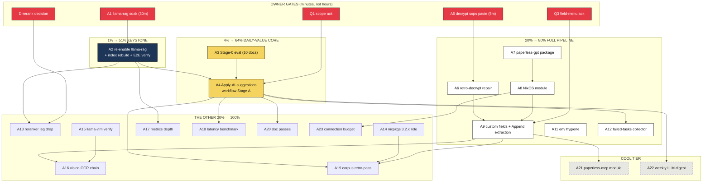

# PAPERLESS-AI-MAX — Pareto Execution Plan

**Date:** 2026-10-02 13:32 CEST · **Scope:** everything needed to take Paperless-ngx AI "to the max" on evo-x2
**Inputs:** [AI deep dive](../research/2026-10-02_paperless-ngx-ai-deep-dive.html) (adoption 42/100) · [Internet sweep](../research/2026-10-02_paperless-ngx-ai-internet-sweep.md) · [Status report §f](../status/2026-10-02_12-50_paperless-ai-deep-dive-status.md) · live TODO surfaces
**Decided context:** journald/SigNoz TRUSTED (privacy non-gating). Open owner gates: **Q1 scope ack** (plan assumes Stage A: all non-empty, blanks-only), **Q3 field menu ack** (plan assumes the community-proven field list below).
**Non-goal:** no Verschlimmbesserung — every task must leave the repo verifiably no worse (no speculative rewrites, no touching foreign sessions' files, eval-green before commit).

---

## 1. Pareto Breakdown

### The 1% that delivers 51% — THE KEYSTONE

**Execute the llama-rag soak → re-enable → rebuild the AI index.** ~50 minutes of mostly-waiting work (one owner-run script, one config flip, one CLI command, one verification pass). It unblocks the ENTIRE semantic layer at once: RAG chat with source links, semantic search, the sqlite-vec index, similarity-grounded suggestions. It is also the longest-standing blocker on the box (dark since 2026-09-18). Until this fires, "AI" on this box is a manual suggestion button nobody clicks (zero observed flm traffic).

### The 4% that delivers 64% — THE DAILY-VALUE CORE

The 1% **plus**:

1. **Stage-0 eval** — click Suggest on 10 representative docs, record per-field quality (30 min). Calibrates everything after; answers "is qwen3.6-moe good enough" with data, and catches reasoning-token burn (the internet's #1 native-AI failure mode).
2. **Apply-AI-suggestions workflow, Stage A** — all non-empty docs, create-missing OFF, overwrite OFF (= blanks-only; structurally bounded pollution), provisioned declaratively via the dashboard-provision DRF pattern (~90 min).

Result: every consumed document gets AI metadata automatically, and the archive is queryable in natural language. That is the moment "AI to the max" becomes true in daily life.

### The 20% that delivers 80% — THE FULL PIPELINE

The 4% **plus**:
3. **Decrypt go-live** (owner pastes the bank PDF password into sops, 5 min) + retro-decrypt repair (~60 min runbook run) — statements stop arriving as empty-content husks; this gates BOTH classifier vocabulary and every extraction field.
4. **paperless-gpt module** (flake input → buildGoModule → NixOS module → custom fields → VM test, ~4–5 h) — structured extraction (the capability native paperless will never have) + the vision-OCR on-ramp.
5. **AI env hygiene batch** (30 min) — OUTPUT_LANGUAGE, app_config precedence probe, index-cron stagger.
6. **Failed-tasks collector + Gatus** (60 min) — the AI workflow's failures become visible instead of UI-only.

### The other 20% (to reach 100%)

Version ride (3.2.x: empty-skip + async WF + better LLM errors), vision-OCR chain (llama-vlm soak → captioner eval → tag-gated OCR), reranker-leg drop, monitoring depth (index freshness, inbox count, latency benchmark), corpus retro-pass, docs (llama-rag.md stale bullet, FEATURES/CHANGELOG), the cool tier (paperless-mcp module, weekly LLM digest via mail-relay), connection-budget doc, quarterly re-audit cadence.

---

## 2. PASS A — Comprehensive plan (30–100 min tasks, ALL todos, sorted)

Sort key: importance (keystone-first) → impact → effort → customer-value. `Owner` = who must act (agent vs owner). `Maps to` = existing TODO surface (no re-filing; this plan is the execution view).

| #   | Task                                                                                                                                                                                       | Tier |     Impact      | Effort | Value axis                 | Depends              | Owner                    | Maps to                                  |
| --- | ------------------------------------------------------------------------------------------------------------------------------------------------------------------------------------------ | :--: | :-------------: | :----: | -------------------------- | -------------------- | ------------------------ | ---------------------------------------- |
| A1  | **llama-rag soak execution** (quiet-IO window + harness run + PASS verdict)                                                                                                                |  1%  |    Critical     |  30m   | search/chat gate           | —                    | **owner** (root)         | ai-stack.md `[blocked:user]`             |
| A2  | **Re-enable llama-rag → deploy → `document_llmindex rebuild` → E2E verify** (health, 1024-dim, chat cites sources, traffic-source assertion) + fix llama-rag.md:19 bullet                  |  1%  |    Critical     |  60m   | search+chat live           | A1                   | agent                    | ai-stack.md soak row + services.md watch |
| A3  | **Stage-0 eval**: 10 representative docs (DE/EN/PL/statement/receipt/manual) → manual Suggest → per-field quality record → doc-type exclusion decision                                     |  4%  |    Critical     |  30m   | quality calibration        | —                    | owner+agent              | plan-internal (feeds A4)                 |
| A4  | **Apply-AI-suggestions workflow Stage A** (declarative DRF oneshot: consumption-finished, all non-empty, title+tags+correspondent, create-missing ❌, overwrite ❌; idempotent; VM-tested) |  4%  |    Critical     |  90m   | automatic metadata         | A2, A3, Q1           | agent                    | services.md `[ready]` workflow row       |
| A5  | **Decrypt go-live**: sops paste + deploy + InboxClean decrypt verify + encrypted-tag self-heal check                                                                                       | 20%  |    Critical     |  30m   | extraction+classifier gate | —                    | **owner** (sudo)         | services.md `[blocked:user]`             |
| A6  | **Retro-decrypt repair** (`--backfill --decrypt-repair` dry→live) + duplicate prune (`--backfill --prune`)                                                                                 | 20%  |      High       |  60m   | archive quality            | A5                   | owner-runbook            | services.md item part 2-3                |
| A7  | **paperless-gpt package**: flake input + `pkgs/paperless-gpt.nix` buildGoModule + build-green + binary smoke                                                                               | 20%  |      High       |  90m   | extraction core            | —                    | agent                    | services.md `[ready]` module row         |
| A8  | **paperless-gpt NixOS module**: options, loopback bind, port in `lib/ports.nix`, harden, runtime-minted sops token (bank-sync pattern), deploy verify                                      | 20%  |      High       |  90m   | extraction core            | A7                   | agent                    | same row                                 |
| A9  | **Custom fields + extraction**: declarative field creation (DRF), `custom_field_prompt.tmpl` v1, Append mode, auto-tag; verify on 5 statements                                             | 20%  |      High       |  60m   | structured data            | A8, A5, Q3           | agent                    | same row                                 |
| A10 | **paperless-gpt VM test + monitoring**: VM assertions, post-deploy smoke section, onFailure + ioTier                                                                                       | 20%  |     Medium      |  60m   | ops safety                 | A8                   | agent                    | plan-internal                            |
| A11 | **AI env hygiene**: `PAPERLESS_AI_LLM_OUTPUT_LANGUAGE`, app_config precedence probe, index-cron stagger                                                                                    | 20%  |     Medium      |  30m   | suggestion quality         | —                    | agent (+1 host probe)    | services.md `[ready]`                    |
| A12 | **Failed-tasks collector + Gatus check** (incl. AI-workflow failure class)                                                                                                                 | 20%  |     Medium      |  60m   | ops visibility             | —                    | agent                    | services.md `[ready]`                    |
| A13 | **Reranker decision execution**: record owner call → drop :8849 leg → prune Gatus/smoke rows → eval green                                                                                  | 100% |     Medium      |  30m   | no phantom paths           | A2 (re-enable shape) | owner-decide, agent-exec | ai-stack.md `[decision]`                 |
| A14 | **nixpkgs 3.2.x ride**: version check → bump → re-verify AI env + views → AI-env VM assertions                                                                                             | 100% |     Medium      |  60m   | empty-skip + async WF      | nixpkgs carries it   | agent                    | services.md `[watch]`                    |
| A15 | **llama-vlm live verification + soak** (real inference both sockets + cold-load timing)                                                                                                    | 100% |     Medium      |  30m   | vision-OCR gate            | —                    | agent                    | ai-stack.md `[watch]`                    |
| A16 | **Vision OCR chain**: captioner-vs-stock eval on 3 bad scans → (opt.) stock Qwen3-VL instance → `VISION_LLM_*` + `paperless-gpt-ocr-auto` tag → e2e rescue verify                          | 100% |     Medium      |  60m   | bad-scan rescue            | A8, A15              | agent                    | services.md `[watch]`                    |
| A17 | **Metrics depth**: index-freshness + inbox-count textfile metrics                                                                                                                          | 100% |       Low       |  30m   | ops                        | A2                   | agent                    | sweep adopt-queue #4                     |
| A18 | **Latency benchmark**: cold vs warm suggestion timing → 480s headroom note in runbook                                                                                                      | 100% |       Low       |  30m   | ops sizing                 | A4                   | agent                    | plan-internal                            |
| A19 | **Corpus retro-pass Stage G** (scoped filters, off-hours, queue watch, spot-check + rollback)                                                                                              | 100% | High (one-time) |  90m   | whole-archive value        | A4+A14 soak 1wk, A5  | agent                    | sweep/deep-dive #14                      |
| A20 | **Doc passes**: paperless.md extraction-note cross-link + FEATURES.md row + CHANGELOG entry                                                                                                | 100% |       Low       |  30m   | docs                       | A2/A4/A9             | agent                    | harvest obligations                      |
| A21 | **paperless-mcp NixOS module** (loopback, sops token, port) + Crush MCP wiring doc + smoke query                                                                                           | cool |     Medium      |  90m   | AI-session archive access  | A9 stable            | agent                    | sweep adopt-queue #2                     |
| A22 | **Weekly LLM digest** oneshot (last-7-days → flm summary → mail-relay) + timer                                                                                                             | cool |       Low       |  60m   | weekly UX                  | A4                   | agent                    | sweep adopt-queue #3                     |
| A23 | **Connection-budget doc** (flm MaxConnections=8 vs celery×2 + paperless-gpt + PMA + papdashboard) + SigNoz consumer labels                                                                 | 100% |       Low       |  30m   | ops correctness            | A8                   | agent                    | plan-internal                            |
| A24 | **Quarterly re-audit note + eval-set quality report** (fold A3 results into a doc)                                                                                                         | 100% |       Low       |  30m   | docs/knowledge             | A3                   | agent                    | plan-internal                            |

**Owner decisions (not time-boxed, gate the plan):**

| ID       | Decision                                                                                                               | Gates    | Default if unanswered      |
| -------- | ---------------------------------------------------------------------------------------------------------------------- | -------- | -------------------------- |
| Q1       | Scope ack: Stage A (all non-empty, blanks-only) + staged rollout B/C/D                                                 | A4       | Stage A as designed        |
| Q3       | Field menu ack: statements `Amount`,`Bill Period`,`Account/IBAN`,`Document Year`; receipts `Total`,`Merchant`,`Expiry` | A9       | This community-proven menu |
| D-rerank | Drop the consumerless :8849 reranker leg at re-enable?                                                                 | A13      | Drop (audit input)         |
| D-flm    | flm v1.0.2 → v1.0.6 staged bump (existing decision row; urgency rises once paperless is a real consumer)               | separate | unchanged                  |

---

## 3. PASS B — Micro breakdown (≤12 min per task, ALL todos, sorted by parent priority)

| #   | Micro-task (≤12 min)                                                            | Parent | Owner                |  Est  |
| --- | ------------------------------------------------------------------------------- | :----: | -------------------- | :---: |
| B1  | Check PSI/quiet-IO window for the soak                                          |   A1   | owner                |  5m   |
| B2  | Run `scripts/llama-rag-soak.sh` (≥10m) + read PASS/FAIL verdict                 |   A1   | owner                |  12m  |
| B3  | Flip `llama-rag.enable = true` (+ eval)                                         |   A2   | agent                |  5m   |
| B4  | Deploy switch + activation watch                                                |   A2   | agent                |  12m  |
| B5  | Probes: `:8848/health` + `/v1/embeddings` 1024-dim (+8849 if kept)              |   A2   | agent                |  8m   |
| B6  | `paperless-manage document_llmindex rebuild` + task-green verify                |   A2   | agent                |  12m  |
| B7  | E2E: AI chat answers with source-doc links; semantic search returns hits        |   A2   | agent                |  12m  |
| B8  | Traffic assertion: flm/llama journal shows paperless-web/celery as source       |   A2   | agent                |  12m  |
| B9  | Fix `llama-rag.md:19` head bullet (DARK since 2026-09-18)                       |   A2   | agent                |  5m   |
| B10 | Pick 10 representative docs (DE/EN/PL; statement/receipt/manual/scan)           |   A3   | owner                |  8m   |
| B11 | Click Suggest on each; record per-field correctness table                       |   A3   | owner+agent          |  12m  |
| B12 | Verdict: field whitelist (drop doc-type?), reasoning-burn check, language check |   A3   | agent                |  8m   |
| B13 | Design workflow JSON (trigger/filters/fields/flags) from A3 verdict             |   A4   | agent                |  12m  |
| B14 | Extend provision oneshot skeleton (new unit or dashboard-provision fold)        |   A4   | agent                |  12m  |
| B15 | DRF create/update + same-name idempotency logic                                 |   A4   | agent                |  12m  |
| B16 | Eval test: oneshot renders + converges (idempotent second run)                  |   A4   | agent                |  12m  |
| B17 | VM test: workflow assertions in `tests/test-paperless.nix`                      |   A4   | agent                |  12m  |
| B18 | Deploy + feed a test doc + verify workflow fired + fields filled                |   A4   | agent                |  12m  |
| B19 | Paste bank PDF password into `inboxclean-decrypt.yaml` (sops editor)            |   A5   | **owner**            |  5m   |
| B20 | Deploy + verify InboxClean decrypt path (journal, no `encrypted` tag)           |   A5   | agent                |  12m  |
| B21 | Confirm ledger records DECRYPTED checksums (dedup across mailboxes)             |   A5   | agent                |  12m  |
| B22 | Retro-decrypt dry-run (`--backfill --decrypt-repair --dry-run`) + read plan     |   A6   | owner-runbook        |  12m  |
| B23 | Retro-decrypt live run + settled-task verification                              |   A6   | owner-runbook        |  12m  |
| B24 | Duplicate prune dry+live (`--backfill --prune`, keeps oldest)                   |   A6   | owner-runbook        |  12m  |
| B25 | Add `paperless-gpt` flake input + `nix flake lock`                              |   A7   | agent                |  12m  |
| B26 | Write `pkgs/paperless-gpt.nix` (buildGoModule, vendorHash loop ready)           |   A7   | agent                |  12m  |
| B27 | `nix build` + vendorHash fix iterations                                         |   A7   | agent                |  12m  |
| B28 | Binary smoke via built package (version/help)                                   |   A7   | agent                |  8m   |
| B29 | Module skeleton + options (`enable`, URLs from `lib/ports.nix`, tokenFile)      |   A8   | agent                |  12m  |
| B30 | Register port in `lib/ports.nix` (+ port-registry-audit pass)                   |   A8   | agent                |  5m   |
| B31 | systemd unit: harden block + loopback bind + ioTier                             |   A8   | agent                |  12m  |
| B32 | Runtime-minted token oneshot (bank-sync-paperless-token pattern)                |   A8   | agent                |  12m  |
| B33 | Enable on evo-x2 + deploy + journal verify (connects, processes nothing yet)    |   A8   | agent                |  12m  |
| B34 | Registry entry + gatus-coverage compliance + no-vHost note                      |   A8   | agent                |  12m  |
| B35 | Declarative custom-field creation via DRF (fields from Q3 menu)                 |   A9   | agent                |  12m  |
| B36 | `custom_field_prompt.tmpl` v1 (JSON-string, ≤120 chars, never "null")           |   A9   | agent                |  12m  |
| B37 | Append mode + `paperless-gpt-auto` tag + retry caps in settings                 |   A9   | agent                |  12m  |
| B38 | Run on 5 statements/receipts → verify extracted field values                    |   A9   | agent                |  12m  |
| B39 | VM test: module + mocked token + unit active                                    |  A10   | agent                |  12m  |
| B40 | post-deploy-check smoke section (unit + a no-op probe)                          |  A10   | agent                |  12m  |
| B41 | onFailure Discord routing + MemoryMax/ioTier assignment                         |  A10   | agent                |  12m  |
| B42 | Set `PAPERLESS_AI_LLM_OUTPUT_LANGUAGE` + eval                                   |  A11   | agent                |  5m   |
| B43 | Host probe: `app_config` rows for AI overrides (needs sudo)                     |  A11   | agent+owner          |  12m  |
| B44 | Stagger `PAPERLESS_LLM_INDEX_TASK_CRON` + eval                                  |  A11   | agent                |  10m  |
| B45 | Failed-tasks textfile collector script + timer                                  |  A12   | agent                |  12m  |
| B46 | Gatus check + Discord alert wiring                                              |  A12   | agent                |  12m  |
| B47 | Deploy + verify green on a forced-fail test task                                |  A12   | agent                |  12m  |
| B48 | Record reranker decision; flip the leg off in llama-rag config                  |  A13   | owner-decide + agent |  12m  |
| B49 | Prune Gatus/smoke rows for :8849 + eval green + deploy verify                   |  A13   | agent                |  12m  |
| B50 | Check nixpkgs paperless version (3.2.x landed?)                                 |  A14   | agent                |  5m   |
| B51 | Ride the nixpkgs bump + `nix flake check`                                       |  A14   | agent                |  12m  |
| B52 | Re-verify AI env wiring + dashboard views post-bump                             |  A14   | agent                |  12m  |
| B53 | Add AI-env VM assertions (`PAPERLESS_AI_*` in unit Environment)                 |  A14   | agent                |  12m  |
| B54 | Real inference through :8127 and :8128 (vision sanity)                          |  A15   | agent                |  12m  |
| B55 | Cold-load timing + 10-min soak verdict per socket                               |  A15   | agent                |  12m  |
| B56 | Captioner-vs-stock OCR eval on 3 genuinely bad scans                            |  A16   | agent                |  12m  |
| B57 | (only if B56 says stock) Add stock Qwen3-VL `llama-vlm` instance                |  A16   | agent                |  12m  |
| B58 | Wire `VISION_LLM_*` → llama-vlm + `paperless-gpt-ocr-auto` + retries            |  A16   | agent                |  12m  |
| B59 | E2E: a tesseract-failing scan rescued with searchable text                      |  A16   | agent                |  12m  |
| B60 | Index-freshness metric (last successful llmindex task age)                      |  A17   | agent                |  12m  |
| B61 | `paperless_inbox_count` metric                                                  |  A17   | agent                |  12m  |
| B62 | Measure cold vs warm suggestion latency (workflow-timed)                        |  A18   | agent                |  12m  |
| B63 | Write 480s-headroom note into paperless.md                                      |  A18   | agent                |  8m   |
| B64 | Design retro-pass scope filters (per class, batch size)                         |  A19   | agent                |  12m  |
| B65 | Execute off-hours batches + watch task queue depth                              |  A19   | agent                | 12m×n |
| B66 | Spot-check sample + rollback procedure validation                               |  A19   | agent                |  12m  |
| B67 | paperless.md cross-link: extraction note + trusted-echo note                    |  A20   | agent                |  8m   |
| B68 | FEATURES.md AI row update                                                       |  A20   | agent                |  12m  |
| B69 | CHANGELOG entry for the AI wave                                                 |  A20   | agent                |  12m  |
| B70 | `paperless-mcp` package/module skeleton (loopback + token)                      |  A21   | agent                |  12m  |
| B71 | Crush MCP wiring doc (config snippet + security note)                           |  A21   | agent                |  12m  |
| B72 | Smoke: an AI session queries the archive via MCP                                |  A21   | agent                |  12m  |
| B73 | Weekly digest oneshot script (DRF query → flm summary)                          |  A22   | agent                |  12m  |
| B74 | Timer + mail-relay delivery verify                                              |  A22   | agent                |  12m  |
| B75 | Connection-budget section in fastflowlm.md                                      |  A23   | agent                |  12m  |
| B76 | SigNoz consumer labels for flm traffic                                          |  A23   | agent                |  12m  |
| B77 | Fold A3 quality table into a docs/ eval report                                  |  A24   | agent                |  12m  |
| B78 | Quarterly re-audit calendar note (runbook)                                      |  A24   | agent                |  5m   |

Sort rationale (both passes): keystone gates first (A1/A5 unblock the most), then daily-value (A2-A4), then the extraction pillar (A7-A9), then ops/quality (A11-A13), then the 100%-tier hardening, cool tier last — highest importance × impact ÷ effort, customer-value weighted toward "automatic metadata + queryable archive + structured data".

---

## 4. Execution Graph (mermaid)

**Critical path:** A1 → A2 → A4 → (1 week soak) → A19. **Longest pole:** A7→A8→A9 (extraction pillar, independent of the critical path — parallelizable from day one). **All owner gates combined: under 45 minutes.**

---

## 5. Sequencing rules (do not reorder)

1. A2 before A4 (warm shared endpoints + index grounds suggestions).
2. A3 before A4 go-live (field whitelist + reasoning-burn check with data, not hope).
3. A5 before A9 field verification (empty content extracts nothing) and before A19 (statements would be skipped en masse).
4. A14 (3.2.x) before A19 (server-side empty-skip protects the retro-pass).
5. A13 executes WITH A2's re-enable shape (unit set must be final before probes/Gatus rows are rebuilt).
6. Every agent task: eval-green → pathspec commit → (deploy when batched). No task here requires force-anything, no history rewrites, no touching foreign sessions' files.

## 6. Total effort estimate

Owner: ~45 min (gates) + ~40 min (runbook runs B22-B24). Agent: ~14–16 h across the 24 medium tasks. The 1%+4% core (A1–A4): **~3.5 h wall-clock, single evening.**
