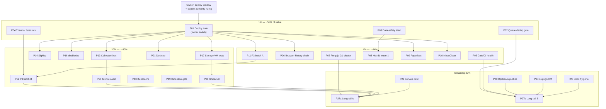

# SystemNix Pareto Execution Plan — the 1% that Delivers 51% (2026-10-06 16:59 CEST)

**Method:** docs-health AUDIT (2026-10-06, `docs/status/2026-10-06_16-49_docs-health-full-corpus-audit-status.md`) left `TODO_LIST.md` at exactly **647 open rows / 0 done** — every row tagged or untagged, distributed over 13 queue sections. This plan partitions **all 647 rows** into **27 work packages** (30–100 min execution slices) and then into **172 micro-tasks (≤12 min each)**. Coverage arithmetic is exact and auditable (appendix A): package row-shares sum to each section total and to 647.

**Lineage (pre-read, not re-invented):** the 2026-09-30 two-day master plan (`docs/planning/2026-09-30_09-30_two-day-todo-master-plan.html`) executed its P1/P2 tranches (2026-10-01 07:22 + 15:39 reports); its P3 remainder (~42 rows) is absorbed into P11/P12 here. Nothing in this plan supersedes a ratified decision — it sequences the standing queue.

**Tag census (context):** 164 `[ready]` · 455 untagged-open · 9 `[decision]` · 8 `[watch]` · 8 `[blocked:user]` · 7 `[blocked:deploy]` · 4 `[blocked:push]`. Blocked/decision/watch rows are covered as _tracks inside packages_, never dropped.

---

## 1. Pareto breakdown

### The 1% → ~51% of total value (5 items)

| #   | Item                                                                                                                                                                                                                                                                                                                                                                                                        | Why it is the 1%                                                                         |
| --- | ----------------------------------------------------------------------------------------------------------------------------------------------------------------------------------------------------------------------------------------------------------------------------------------------------------------------------------------------------------------------------------------------------------- | ---------------------------------------------------------------------------------------- |
| 1.1 | **One quiet-window deploy train** (P01): the tree carries ~15 landed-but-undeployed fixes — polkit agent fix (GUI auth DEAD until deployed), a7868a7 vendorHash wave (25 FODs), thermal-pstate-guard second rung, forgejo family gate fix, root-prune-guard, caddy batch, master-plan P2 batch, geometrikks, netbird, macbook rename, indexer-web. ONE deploy flips ~10 rows from runtime-zero to verified. | Highest leverage per minute in the entire queue                                          |
| 1.2 | **Deploy-authority decision** (owner, in P01): queue-fired vs user-manual deploy. Every runtime-zero task since 09-21 is parked behind it.                                                                                                                                                                                                                                                                  | Unblocks the queue's biggest stall class                                                 |
| 1.3 | **Data-safety triad** (P03): restart the stalled `discordsync-db-backup` (the discordsync event store's ONLY backup once hot-db wave 5 leaves `@`), offsite-borg go-live chain (recovery-copy policy + VM test), rescue the paperless Pocket-ID DB snapshot before retention rotates it.                                                                                                                    | Prevents irreversible data loss; nothing else on the list matters if backups are phantom |
| 1.4 | **Queue dedup/halt gate** (P02): 21+ no-op re-dispatches burned across 2 fix tickets in one day; the dispatch machine re-serves closed work continuously.                                                                                                                                                                                                                                                   | Stops continuous agent-time burn; makes every other queue item cheaper                   |
| 1.5 | **Thermal instrumentation agent-side** (P04): k10temp Gatus + fan-telemetry gap + trip-rate alert + `crash-autopsy.sh` + freeze #8–#11 taxonomy docs. The box is in freeze family #8–#18 with ZERO CPU-temp alerting.                                                                                                                                                                                       | Turns the crash crisis from archaeology into signal                                      |

### The 4% → cumulative ~64% (adds 7 items)

4.1 Gitleaks/gate/CI health incl. the new ULID-FP fixture (P05) · 4.2 Browser-history empty-dashboard fix chain (P06) · 4.3 Forgejo G1-window cluster (P07) · 4.4 Hot-db wave-1 pre-flight (P08) · 4.5 Paperless cluster (P09) · 4.6 InboxClean "In production" confirm + dead-grant chain (P10) · 4.7 Master-plan P3 batch A (P11).

### The 20% → cumulative ~80% (adds 10 packages)

P12 (P3-B) · P13 (system-health collector fixes) · P14 (SigNoz gaps) · P15 (textfile-collector class audit) · P16 (dnsblockd adoption M-remainder) · P17 (storage VM/test rebuilds) · P18 (buildcache/das-link convergence) · P19 (retention grep-gate) · P20 (shell/eval hardening) · P21 (desktop cluster).

### The remaining 80% (to 100%)

P22 (hermes/PMA/overview service debt) · P23 (upstream push chains) · P24 (upstream nixpkgs/HM) · P25 (docs & repo hygiene) · P27a/P27b (long-tail burn-down programs, 204 rows in ≤12-min batches).

---

## 2. Comprehensive plan — 27 packages (30–100 min slices; programs = N slices)

Sorted by impact/effort/value. **Rows** = exact open-TODO coverage (appendix A). Imp 1–5 = impact; Eff = minutes (programs: per-slice).

| ID   | Package (tier)                                                           | Rows | Imp | Eff    | Covers (anchor asks)                                                                                                                                                                                                                                                                    | Depends                              |
| ---- | ------------------------------------------------------------------------ | ---- | --- | ------ | --------------------------------------------------------------------------------------------------------------------------------------------------------------------------------------------------------------------------------------------------------------------------------------- | ------------------------------------ |
| P01  | **Deploy train: readiness enum → owner switch → smoke re-baseline** (1%) | 12   | 5   | 100    | pre-deploy §11/§13 enum leg; deploy-gated rows (svc/pl-06 harvest: indexer-web smoke/ioTier/RESPONSE_TIME/VM test, geometrikks smoke×3, CV render WARN, bank-sync verify, DMARC bundle); post-deploy polkit leg; smoke-baseline re-adjudication; §g deploy-authority question packaging | none (owner does the switch)         |
| P02  | **Queue integrity: dedup/halt gate + fix-ticket protocol** (1%)          | 12   | 5   | 100    | Task-ID/REJECTED-SHA dedup gate in harvest/dispatch; fix-ticket disposition protocol codified; re-fire retirement clause; footerless-daemon marker convention; verify-output telemetry hooks                                                                                            | none                                 |
| P03  | **Data-safety triad** (1%)                                               | 14   | 5   | 90     | discordsync-db-backup restore run; offsite-borg: recovery-copy policy doc + `backup.nix` VM test + EIO-inode decision legs; paperless pocket-id snapshot rescue; restic first-run proof chain (check/restore/dedup-ratio)                                                               | sudo window (owner) for restore legs |
| P04  | **Thermal instrumentation & crash forensics** (1%)                       | 15   | 5   | 100    | k10temp Tctl Gatus + fan-RPM gap; Zone-6 trip-RATE alert; `scripts/crash-autopsy.sh`; freeze #8/#9/#10/#11 entries in stability.md; hwmon fingerprint→chip table; guard trip-log load-average line                                                                                      | none                                 |
| P05  | **Gate/CI/secret health** (4%)                                           | 21   | 4   | 90     | gitleaks ULID-FP selftest fixture; check-doc-links inline-code FP fix; CI statix pin; secret-scan canary allowlist; VM-test ssh keys; `nix-check` early-warning job; security: sops ghost + rotations ledger follow-ups                                                                 | none                                 |
| P06  | **Browser-history empty-dashboard chain** (4%)                           | 7    | 4   | 60     | push cqrs-htmx `492e473e` lineage → input bump → relock → deploy → 595-visit verify; `/auth/import` reachability audit; count-gap upstream row close-out                                                                                                                                | P01 (deploy)                         |
| P07  | **Forgejo G1-window cluster** (4%)                                       | 18   | 4   | 90     | owner G1-finalize runbook leg; post-window: family gate eval assertion; port-3000 reclaim; mirror org live-verify + content-sanity floor; theme cascade guard; reconcile-detail runbook update                                                                                          | owner G1 window                      |
| P08  | **Hot-db wave-1 pre-flight** (4%)                                        | 11   | 4   | 60     | "Hot Tier Mounted" gatus green + timer active verify; under-hot guard fixture case; dump-leg failure catch-up (`Persistent` misses); wave-1 cutover checklist dry-run                                                                                                                   | P03 (backup healthy first)           |
| P09  | **Paperless cluster** (4%)                                               | 14   | 4   | 100    | AI-max wave deploy legs; OIDC secret-desync root-cause; paperless-tasks collector fixture; pg_restore DR drill; apply-AI-suggestions workflow wiring; app_config precedence probe packaging                                                                                             | P01                                  |
| P10  | **InboxClean & Health Hub** (4%)                                         | 7    | 4   | 60     | Cloud Console "In production" confirm runbook; dead-grant honesty chain push; `inboxclean-web` restart leg; health-hub module options                                                                                                                                                   | P01                                  |
| P11  | **Master-plan P3 batch A** (20%)                                         | 25   | 4   | 100    | the P3 quiet-window tranche, half 1 (pipeline rows 12–23 + monitoring 4) from the 15-39 crosswalk; IO-heavy legs gated on trips<2                                                                                                                                                       | P01 (quiet window)                   |
| P12  | **Master-plan P3 batch B** (20%)                                         | 43   | 3   | 100    | P3 tranche, half 2 (stability 20, pipeline 12, services 8, monitoring 3) — includes guard VM-test extensions, scrub policy, io-admission notes                                                                                                                                          | P11                                  |
| P13  | **System-health collector fixes** (20%)                                  | 8    | 4   | 60     | `\x2d` label escaping fix (whole-file rejection); series-presence canary; blind-window bound + 93%-alert source check; worst-case section-sum vs 180s ceiling                                                                                                                           | P01                                  |
| P14  | **SigNoz gaps** (20%)                                                    | 9    | 3   | 60     | time_series_v2 investigation; coverage flips to enforced; GCP re-arm; migrator-gap guard; dashboard additions                                                                                                                                                                           | P01                                  |
| P15  | **Textfile-collector class audit** (20%)                                 | 11   | 3   | 60     | exit-0/empty-value class sweep (psql ON_ERROR_STOP pattern); fixed-name `.tmp` audit; freshness gauges; opposing-state assertions in collector VM tests                                                                                                                                 | P13                                  |
| P16  | **dnsblockd adoption M-remainder** (20%)                                 | 9    | 3   | 60     | M10 csrf smoke probes; M11 user deploy for allowlist/devices; M12 sweep; M17–M22; upstream prep push legs                                                                                                                                                                               | P01                                  |
| P17  | **Storage VM-test rebuilds** (20%)                                       | 13   | 3   | 90     | hot-db + crush-hot-db VM tests on current tree; caddy-logs-hot re-run; offsite-borg VM rehearsal; restic/paperless VM runs (quiet window)                                                                                                                                               | P01 quiet window                     |
| P18  | **Buildcache/das-link convergence** (20%)                                | 16   | 3   | 90     | kill `buildcacheSymlinkPaths` split-brain; bless probe dirs into KNOWN or fix writers; NVMe regrowth writer hunt; parity pre-commit rename-proof + 4th drift shape; pnpm size gauges                                                                                                    | none                                 |
| P19  | **Retention echo grep-gate** (20%)                                       | 10   | 3   | 60     | build the stale-retention grep gate (flake + pre-commit + CI) with 7-site fixtures; sweep scripts/docs/planning echo surfaces; negative-test via negative-test-lints                                                                                                                    | none                                 |
| P20  | **Shell/eval hardening** (20%)                                           | 21   | 3   | 100    | findmnt→readlink set-e sweep; das-link fixture smoke; stray-unit lint follow-ups; oneshot non-zero exit policy sweep; tmpfiles cycle tripwire verify; guard VM-test extensions                                                                                                          | P17 window                           |
| P21  | **Desktop cluster** (20%)                                                | 20   | 3   | 100    | dp1/dp2 KeePassXC manifests; extension-ID single-source; managed-storage key verify; DMS docs + settings eval guard; niri tty flood fix; ssh-suspend-guard verify; dms-lock race; helium launch-guard verify                                                                            | P01                                  |
| P22  | **Hermes/PMA/overview service debt** (80%)                               | 23   | 3   | 100    | hermes deferred-cleanups + config dup-key + bump workflow; PMA env-splitting + discovery starvation; overview migration; Health Hub options; timer-monitor/graph follow-ups                                                                                                             | none                                 |
| P23  | **Upstream push chains** (80%)                                           | 18   | 3   | 90     | a7868a7 re-pin sweep per repo; branching-flow 0.6.4 wave; go-taskqueue release + tq-agent-pool redeploy; InboxClean deploy chain; cqrs-htmx tag/bump; niri-session-manager tag                                                                                                          | owner push windows                   |
| P24  | **Upstream nixpkgs/HM contributions** (80%)                              | 14   | 2   | 90     | aw-watcher-utilization poetry-core; valkey/aiocache/timm/xformers tests; taskwarrior3 flags; Kitty GC patch; go-cqrs-lite input switch; BuildFlow flake.lock root-cause                                                                                                                 | verify-before-filing gate            |
| P25  | **Docs & repo hygiene** (80%)                                            | 18   | 2   | 60     | ROADMAP stale-frame annotations; README/FEATURES count re-derivation; research-archive convention decision; runbook editorial pass (21 agent-notes appendices); gotchas narratives; §11 report annotations                                                                              | none                                 |
| P27a | **Long-tail burn-down A** (80%; program)                                 | 100  | 2   | 4×100  | storage decisions/watch (btrbk storm policy, docker volumes, offsite posture) + stability watch/decisions + monitoring leftovers + services leftovers + upstream leftovers + caddy-batch decisions (h3 pin, log bounds)                                                                 | batched, any order                   |
| P27b | **Long-tail burn-down B** (80%; program)                                 | 157  | 2   | 13×100 | pipeline backlog (~134 rows: VM tests, eval guards, deploy.sh ergonomics, queue conventions) + pixel6 archive project (23: ffprobe sweep, WAV→FLAC, whisper, navidrome, immich ingestion)                                                                                               | batched, any order                   |

**Program note:** P27a/P27b exceed 100 min by design — they are burn-down PROGRAMS whose every slice is a ≤100-min session of ≤12-min batches; their micro-tasks below are the slices.

---

## 3. Micro-task breakdown (172 tasks, each ≤12 min)

Legend: `pkg` = parent package. Rows in parens = TODO_LIST coverage per batch. Every one of the 647 open rows is inside exactly one micro-batch's parenthetical or one single-row task.

| #   | pkg  | Micro-task (≤12 min)                                                                                                                                                                      | Rows |
| --- | ---- | ----------------------------------------------------------------------------------------------------------------------------------------------------------------------------------------- | ---- |
| 1   | P01  | Run `nix build .#nixosConfigurations.evo-x2.config.system.build.toplevel --keep-going` (or `nix flake check --keep-going`); enumerate ALL root failures in one pass                       | 1    |
| 2   | P01  | Fix any FOD/vendorHash reds the enumeration surfaces via the §11 preview (`--section-11-only`)                                                                                            | 2    |
| 3   | P01  | Run `nix run .#pre-deploy-check`; record pass/fail per section; package the deploy-authority §g question for the owner                                                                    | 2    |
| 4   | P01  | Hand the owner the one-line deploy brief (what rides: polkit, vendorHash wave, thermal rung, forgejo gate, root-prune-guard, caddy, P2 batch, geometrikks, netbird, macbook, indexer-web) | 2    |
| 5   | P01  | Post-deploy: run `nix run .#post-deploy-check`; triage FAILs into rows                                                                                                                    | 2    |
| 6   | P01  | Re-adjudicate the smoke baseline (polkit FAIL expected-clear) + close flipped deploy-gated rows on both surfaces                                                                          | 3    |
| 7   | P02  | Write the dispatch-time dedup gate spec (Task-ID footer grep + REJECTED-SHA state + `[x]` re-check)                                                                                       | 3    |
| 8   | P02  | Implement the harvest-side gate in the tq pool config/prompt template                                                                                                                     | 3    |
| 9   | P02  | Codify fix-ticket disposition protocol (`git cat-file -e` → anchor grep → judge tree) in CONTRIBUTING                                                                                     | 2    |
| 10  | P02  | Add re-fire retirement clause (3 clean fires → retire) + no-op report compaction convention                                                                                               | 2    |
| 11  | P02  | Extend tq verify-output telemetry spec (per-ticket fix-fire counts, task.reprioritized fact)                                                                                              | 2    |
| 12  | P02  | Selftest the gate: fixture a closed item re-fired; assert skip                                                                                                                            | —    |
| 13  | P03  | `sudo systemctl start discordsync-db-backup.service`; verify fresh dump + `backup_all_healthy 1`                                                                                          | 1    |
| 14  | P03  | Restic proof: `restic check` + one-file restore smoke + dedup-ratio measurement                                                                                                           | 3    |
| 15  | P03  | Rescue paperless Pocket-ID 04:00 DB snapshot to a permanent path before retention rotates it                                                                                              | 1    |
| 16  | P03  | Draft the borg recovery-copy policy page (password manager / paper, decrypt-proof step)                                                                                                   | 2    |
| 17  | P03  | Write `tests/test-backup.nix` (offsite-borg VM test: tripwire on PLACEHOLDER, job shape, `.last_success`)                                                                                 | 3    |
| 18  | P03  | `btrfs inspect-internal logical-resolve` / `map` the EIO inode 1331118; write repair-vs-exclude brief                                                                                     | 2    |
| 19  | P03  | ClickHouse native-BACKUP restore drill: dir-mode → scratch cluster runbook section                                                                                                        | 2    |
| 20  | P04  | Add k10temp Tctl Gatus check (≥95 °C sustained = page) to gatus-config                                                                                                                    | 1    |
| 21  | P04  | Investigate fan-RPM absence in `sensors`; document the gap + IPMI/EC options row                                                                                                          | 1    |
| 22  | P04  | Add Zone-6 trip-RATE alert (trips/hour over 2h) to gatus + SigNoz rule                                                                                                                    | 2    |
| 23  | P04  | Write `scripts/crash-autopsy.sh` skeleton (journal cut, guard counter, thermal series, freeze lookup)                                                                                     | 3    |
| 24  | P04  | Wire crash-autopsy into post-crash runbook + selftest the parsers                                                                                                                         | 2    |
| 25  | P04  | Write freeze #8/#9/#10/#11 entries into docs/agents/stability.md with discriminators                                                                                                      | 2    |
| 26  | P04  | Persist the hwmon fingerprint→chip mapping table + fingerprint-scan query pattern                                                                                                         | 1    |
| 27  | P04  | Guard trip-log: add load-average to the trip line                                                                                                                                         | 1    |
| 28  | P05  | Add the ULID-user_id FP fixture + real-secret negative control to gitleaks-coverage-selftest                                                                                              | 2    |
| 29  | P05  | Fix check-doc-links.sh inline-code link FP (skip code spans; path-like target check) + selftest                                                                                           | 2    |
| 30  | P05  | Pin CI statix to the flake lock (nix-check.yml)                                                                                                                                           | 1    |
| 31  | P05  | Allowlist secret-history scanner canaries (leak-canary blob + sk-00000/syn_/re_ shapes)                                                                                                   | 2    |
| 32  | P05  | Wire deploy-key auth for branching-flow in the vm-tests job; audit CV/go-cqrs-lite keys                                                                                                   | 2    |
| 33  | P05  | Add scheduled clean-HEAD `nix flake check --no-build` CI job (early warning)                                                                                                              | 1    |
| 34  | P05  | Settle the `/run/secrets/sops-nix-age-key` ghost + crush key-hygiene leftovers rows                                                                                                       | 2    |
| 35  | P05  | Extend the rotations ledger (open-rotations review)                                                                                                                                       | 1    |
| 36  | P06  | Push cqrs-htmx (`492e473e` lineage) + tag per its chain row                                                                                                                               | 1    |
| 37  | P06  | `nix flake lock --update-input` browser-history + cqrs-htmx; drop stale overrides                                                                                                         | 2    |
| 38  | P06  | Post-deploy: verify the 595-visit dashboard renders; registration `/auth/import` unauth probe                                                                                             | 2    |
| 39  | P06  | Close the count-gap upstream row with the landed fix + link the importUsers gate row                                                                                                      | 2    |
| 40  | P07  | Package the G1-finalize owner brief (script header, abort ladder, calm-IO gate)                                                                                                           | 2    |
| 41  | P07  | Post-G1: write the family gate eval assertion (marker-condition on every forgejo consumer)                                                                                                | 3    |
| 42  | P07  | Reclaim port 3000 (knowledge-graph squat); re-aim forgejo smoke at the real listener                                                                                                      | 2    |
| 43  | P07  | Live-verify org mirroring (first mass-create run, `forgejo_mirror_org_mirrors > 0`, reconcile clean)                                                                                      | 2    |
| 44  | P07  | Add btrbk forgejo-subvol content-sanity floor (size/entry minimums)                                                                                                                       | 2    |
| 45  | P07  | Codify the theme shadowed-var cascade guard + dark-body smoke assertion                                                                                                                   | 2    |
| 46  | P07  | Update forgejo.md reconcile-detail section to pair-keyed/org-aware semantics                                                                                                              | 2    |
| 47  | P08  | Verify "Hot Tier Mounted" gatus green + `hot-db-metrics.timer` active (2-min probe)                                                                                                       | 2    |
| 48  | P08  | Persist the under-hot/toplevelMount guard case in test-hot-db-assertions.nix                                                                                                              | 2    |
| 49  | P08  | Add dump-leg failure catch-up (OnFailure retry or coordination-triggered rerun)                                                                                                           | 2    |
| 50  | P08  | Dry-run the wave-1 (gatus) cutover checklist end-to-end; time the stop window                                                                                                             | 2    |
| 51  | P08  | Confirm deployed textfile dir matches guard OUT default + node_exporter scrape                                                                                                            | 2    |
| 52  | P09  | Deploy-verify AI-max wave legs (German output, index cron, failed-tasks collector)                                                                                                        | 2    |
| 53  | P09  | Root-cause the Pocket-ID/paperless OIDC secret desync (journal + DB diff of the 04:00 window)                                                                                             | 3    |
| 54  | P09  | Build paperless-tasks-collector fixture (valid .prom across success/SQL-error/empty paths)                                                                                                | 3    |
| 55  | P09  | Run the pg_restore DR drill into a scratch cluster + `--list` integrity gate                                                                                                              | 2    |
| 56  | P09  | Wire the apply-AI-suggestions workflow (DRF provision, title+tags+correspondent)                                                                                                          | 2    |
| 57  | P09  | Package the app_config precedence probe for the owner sudo window                                                                                                                         | 1    |
| 58  | P10  | Draft the Cloud Console "In production" confirmation brief (7-day bomb closure)                                                                                                           | 1    |
| 59  | P10  | Push the InboxClean dead-grant chain (`e9735c7` + /health aggregate + banner)                                                                                                             | 2    |
| 60  | P10  | Post-deploy: restart inboxclean-web; verify sync tick green + gmail-tag demote PATCH re-check                                                                                             | 2    |
| 61  | P10  | Expose Health Hub fetch-timeout/push-cadence as module options                                                                                                                            | 2    |
| 62  | P11  | P3-A triage: confirm each of the ~25 rows' premises on the current tree (spot-verify protocol)                                                                                            | 8    |
| 63  | P11  | Execute P3-A rows 1–8 (pipeline tooling batch)                                                                                                                                            | 8    |
| 64  | P11  | Execute P3-A rows 9–17 (eval-guard batch)                                                                                                                                                 | 5    |
| 65  | P11  | Execute P3-A rows 18–25 (monitoring batch)                                                                                                                                                | 4    |
| 66  | P12  | P3-B triage pass (45 rows: strike superseded, confirm blocked)                                                                                                                            | 9    |
| 67  | P12  | Execute P3-B stability rows (scrub policy, catch-up slot, guard extensions)                                                                                                               | 9    |
| 68  | P12  | Execute P3-B pipeline rows (deploy.sh ergonomics, checks)                                                                                                                                 | 6    |
| 69  | P12  | Execute P3-B services rows (smoke probes, health checks)                                                                                                                                  | 5    |
| 70  | P12  | Execute P3-B monitoring rows + write the P3 close-out report                                                                                                                              | 5    |
| 71  | P13  | Fix `\x2d`/`\x5f` label escaping in system-health writer + regression assert                                                                                                              | 1    |
| 72  | P13  | Add system_health_* series-presence canary (phantom-metric pattern)                                                                                                                       | 2    |
| 73  | P13  | Journal-grep the first parse-error occurrence; bound the blind window; check 93%-alert source                                                                                             | 2    |
| 74  | P13  | Fix the worst-case section-sum vs 180s ceiling (chunk or dedupe sections)                                                                                                                 | 2    |
| 75  | P14  | time_series_v2 metadata-retention investigation + verdict row                                                                                                                             | 2    |
| 76  | P14  | Flip verified coverage rows to enforced (26h budget) + ratchet maxUpstreamGaps                                                                                                            | 2    |
| 77  | P14  | Re-arm GCP receivers (enable=true) + deploy + live metric-name verify                                                                                                                     | 2    |
| 78  | P14  | Migrator-gap guard + dashboard/test additions                                                                                                                                             | 3    |
| 79  | P15  | Sweep textfile emitters for `cmd                                                                                                                                                          |      |
| 80  | P15  | Audit fixed-name `.tmp` writers (niri EACCES class) + stale btrfs-compression.prom.tmp                                                                                                    | 2    |
| 81  | P15  | Add opposing-state assertions to backup-coordination/buildcache/pool-smart VM tests                                                                                                       | 3    |
| 82  | P15  | hot_db_metrics_fresh mtime gauge decision + implement if accepted                                                                                                                         | 2    |
| 83  | P16  | M10: csrf 403-vs-401 smoke probes + allowlist persistence user-walk                                                                                                                       | 1    |
| 84  | P16  | M11: user deploy for allowlist/devices data; M12: adoption sweep                                                                                                                          | 2    |
| 85  | P16  | M17–M22 execution (wrapper options, LAN inventory refresh, upstream prep)                                                                                                                 | 4    |
| 86  | P16  | dnsblockd upstream push legs (v0.9.3+ bump path docs)                                                                                                                                     | 2    |
| 87  | P17  | Rebuild hot-db + crush-hot-db VM tests green on current tree                                                                                                                              | 2    |
| 88  | P17  | Re-run caddy-logs-hot VM test + restic + paperless VM regressions                                                                                                                         | 3    |
| 89  | P17  | Offsite-borg runtime FAIL-shape VM rehearsal (mock sops)                                                                                                                                  | 3    |
| 90  | P17  | Run the five PSI-gated VM tests queued since 09-22 (quiet window, batch 1)                                                                                                                | 2    |
| 91  | P17  | Run the five PSI-gated VM tests (batch 2) + record results in rows                                                                                                                        | 3    |
| 92  | P18  | Derive home.file buildcache symlinks from ONE list (kill the split-brain) + negative test                                                                                                 | 3    |
| 93  | P18  | Bless or fix the `.cache-write-probe`/`.checks-probe`/`.devshell-probe` writers                                                                                                           | 2    |
| 94  | P18  | Hunt the NVMe fallback regrowth writer (go-build 661M→1.5G in 4 min)                                                                                                                      | 2    |
| 95  | P18  | Hunt the golangci-lint-analysis recreator; fix invocation or bless with provenance                                                                                                        | 2    |
| 96  | P18  | Parity pre-commit rename-proof selftest + 4th drift shape (KNOWN added stays green)                                                                                                       | 2    |
| 97  | P18  | Add pnpm-cache/pnpm-state size gauges to buildcache-metrics                                                                                                                               | 2    |
| 98  | P19  | Implement the stale-retention grep gate (scanner + fixtures from the 7-site hit list)                                                                                                     | 4    |
| 99  | P19  | Wire the gate into pre-commit + CI; negative-test via negative-test-lints.sh                                                                                                              | 2    |
| 100 | P19  | Sweep scripts/docs/planning echo surfaces (`3d+1w`, `1-2w`, `root ≈`) + fix hits                                                                                                          | 3    |
| 101 | P20  | Sweep scripts/ for findmnt→readlink set-e silent-death pattern                                                                                                                            | 3    |
| 102 | P20  | das-link-recovery-check.sh fixture smoke (verdict-reaches-print assertion)                                                                                                                | 2    |
| 103 | P20  | Stray-unit lint follow-ups (allowlist review, warning-grade defaults)                                                                                                                     | 2    |
| 104 | P20  | Fleet sweep: oneshots with legitimate non-zero exits lacking SuccessExitStatus                                                                                                            | 3    |
| 105 | P20  | Verify deploy.sh post-switch reset-failed covers template instances                                                                                                                       | 1    |
| 106 | P20  | Boot tripwire: tmpfiles-applied verification + binfmt heal-breadcrumb E2E re-fire                                                                                                         | 2    |
| 107 | P20  | Guard VM-test extensions (cooldown disclosure, churn-drift check)                                                                                                                         | 2    |
| 108 | P21  | dp1/dp2 KeePassXC native-messaging manifests via xdg.dataFile (one definition, 3 targets)                                                                                                 | 2    |
| 109 | P21  | Single-source the KeePassXC extension ID (3-way split brain)                                                                                                                              | 2    |
| 110 | P21  | Verify managed-storage key names against the installed CRX manifest                                                                                                                       | 1    |
| 111 | P21  | Eval-check pinning the 3rdparty passkey policy render (extendModules + negative)                                                                                                          | 2    |
| 112 | P21  | Document DMS config surfaces in docs/agents/desktop.md + settings eval guard                                                                                                              | 2    |
| 113 | P21  | Fix niri tty `early import: Error::DeviceMissing` per-second flood (root-cause + contain)                                                                                                 | 2    |
| 114 | P21  | Verify ssh-suspend-guard inhibitor holds; owner `loginctl list-inhibitors` leg                                                                                                            | 1    |
| 115 | P21  | dms-lock: wait for compositor-confirmed lock before exit (iNiR pattern)                                                                                                                   | 2    |
| 116 | P22  | Hermes: fix config.yaml duplicate `provider` key + classify registry warnings                                                                                                             | 2    |
| 117 | P22  | Hermes deferred-cleanups cluster + periodic bump workflow doc                                                                                                                             | 3    |
| 118 | P22  | Hermes build-time import smoke test + ROCm env verify row                                                                                                                                 | 2    |
| 119 | P22  | PMA: Environment= splitting + commit-failure/staleness Gatus checks                                                                                                                       | 3    |
| 120 | P22  | PMA discovery-daemon starvation upstream brief + IO taming row                                                                                                                            | 2    |
| 121 | P22  | Overview: retry discovery + migration off removed SDK module                                                                                                                              | 2    |
| 122 | P22  | Health Hub + timer-monitor + systemd-graph follow-up rows                                                                                                                                 | 2    |
| 123 | P22  | mkDockerService hardening follow-ups + standardize hardening helper                                                                                                                       | 3    |
| 124 | P23  | a7868a7 re-pin sweep: buildflow, erraudit, go-auto-upgrade, cqrs-lint (4 repos)                                                                                                           | 3    |
| 125 | P23  | a7868a7 re-pin sweep: library-policy, project-meta, PMA, samber-linter (4 repos)                                                                                                          | 3    |
| 126 | P23  | a7868a7 re-pin sweep: golangci-auto-configure, discovery-daemon, go-taskqueue, cv (4 repos)                                                                                               | 3    |
| 127 | P23  | branching-flow 0.6.4 wave: push + lock bump + drop the shim                                                                                                                               | 2    |
| 128 | P23  | go-taskqueue: release tag + `nix flake lock` + tq-agent-pool redeploy                                                                                                                     | 2    |
| 129 | P23  | InboxClean deploy chain (push + bump + deploy + smoke)                                                                                                                                    | 2    |
| 130 | P23  | niri-session-manager v0.5.0 tag push + cv fixture fix                                                                                                                                     | 2    |
| 131 | P24  | aw-watcher-utilization poetry-core migration (nixpkgs PR, verify-before-filing)                                                                                                           | 2    |
| 132 | P24  | valkey/aiocache/timm/xformers broken-tests triage + fixes                                                                                                                                 | 3    |
| 133 | P24  | taskwarrior3 build flags + jscpd lockfile publishing                                                                                                                                      | 2    |
| 134 | P24  | Kitty GC resilience patch + hermes py-modules check                                                                                                                                       | 2    |
| 135 | P24  | go-cqrs-lite: input switch to github: + benchstat pin                                                                                                                                     | 2    |
| 136 | P24  | BuildFlow: root-cause the flake.lock flip-flopper + pre-commit materialization                                                                                                            | 2    |
| 137 | P25  | ROADMAP annotations: freeze-era framing #3–#7→#8–#18; root-pressure 82% claim re-stamp                                                                                                    | 2    |
| 138 | P25  | README/FEATURES standing counts re-derived from repo (scripted)                                                                                                                           | 3    |
| 139 | P25  | Research-archive convention decision doc + move the superseded btrfs-wiki file                                                                                                            | 2    |
| 140 | P25  | Runbook editorial pass: fold 21 "Agent Notes" appendices (batch 1: 7 runbooks)                                                                                                            | 3    |
| 141 | P25  | Runbook editorial pass (batch 2: 7 runbooks) + index links                                                                                                                                | 2    |
| 142 | P25  | gotchas-archive narratives + §11 historical report annotations + CONTRIBUTING freshness                                                                                                   | 3    |
| 143 | P27a | Storage decisions batch 1: btrbk storm policy + root-window restatements (rows 1–6)                                                                                                       | 6    |
| 144 | P27a | Storage decisions batch 2: docker volume policy + `/data` provenance (rows 7–12)                                                                                                          | 6    |
| 145 | P27a | Storage watch batch: pool-side hermes prune, fstrim timer, journal pairs reconcile (rows 13–18)                                                                                           | 6    |
| 146 | P27a | Stability watch/decision batch: uphold= evaluation, polkit rule, stampede control (rows 19–29)                                                                                            | 8    |
| 147 | P27a | Monitoring leftovers batch: gatus dedup, consumer net, thresholds (rows 30–34)                                                                                                            | 5    |
| 148 | P27a | Services leftovers batch: pocket-id SQLITE_BUSY, caddy reload, searxng, dns-blocker module (rows 35–44)                                                                                   | 7    |
| 149 | P27a | Upstream leftovers batch: GOEXPERIMENT sweep, go-nix-helpers pins, kernovia (rows 45–58)                                                                                                  | 10   |
| 150 | P27a | Caddy decisions batch: h3 pin, per-vhost log bounds, /mnt/hot logs (rows 59–66)                                                                                                           | 8    |
| 151 | P27a | browser-history/discordsync misc batch: quiet-day 503, probe cleanup disposition (rows 67–72)                                                                                             | 6    |
| 152 | P27a | Remaining storage/services one-liners triage (close-or-queue, rows 73–104)                                                                                                                | 8    |
| 153 | P27b | Pipeline backlog batch 1: VM-test rows (hermes fresh run, fixtures, script stubs; rows 1–8)                                                                                               | 8    |
| 154 | P27b | Pipeline backlog batch 2: eval guards (§10 URL-aware, cv-226 shape, manifest audit; rows 9–17)                                                                                            | 9    |
| 155 | P27b | Pipeline backlog batch 3: deploy.sh ergonomics (lock-wait, --force, backup retention; rows 18–26)                                                                                         | 9    |
| 156 | P27b | Pipeline backlog batch 4: queue conventions (footer discipline, done-signal, claim/lease; rows 27–36)                                                                                     | 10   |
| 157 | P27b | Pipeline backlog batch 5: GOTOOLCHAIN/CI rows (purity single-source, e2e drill; rows 37–45)                                                                                               | 9    |
| 158 | P27b | Pipeline backlog batch 6: §11 gate family (per-host parity, got-hash handoff, drift canary; rows 46–54)                                                                                   | 9    |
| 159 | P27b | Pipeline backlog batch 7: docs gates (harvest resolution-grep, citation rot, line-cite lint; rows 55–63)                                                                                  | 9    |
| 160 | P27b | Pipeline backlog batch 8: pre-commit depth (amend-aware, empty-set honesty, fast path; rows 64–72)                                                                                        | 9    |
| 161 | P27b | Pipeline backlog batch 9: daemon hygiene (absorb attribution, discard forensics, exclusivity; rows 73–81)                                                                                 | 9    |
| 162 | P27b | Pipeline backlog batch 10: upstream queue semantics (done-filter, idempotency, reprioritized; rows 82–90)                                                                                 | 9    |
| 163 | P27b | Pipeline backlog batch 11: misc scripts (centralize curl, user-env single-source, flake-compat; rows 91–100)                                                                              | 10   |
| 164 | P27b | Pipeline backlog batch 12: remaining rows triage/close (rows 101–134)                                                                                                                     | 12   |
| 165 | P27b | pixel6: udev rule + SHA256SUMS + ffprobe sweep batches 1–2                                                                                                                                | 3    |
| 166 | P27b | pixel6: ffprobe batches 3–5 (591 WAVs)                                                                                                                                                    | 3    |
| 167 | P27b | pixel6: ffprobe finish + WAV→FLAC mirror + rename tree                                                                                                                                    | 3    |
| 168 | P27b | pixel6: contacts VCF + call-log enrichment + prefix decode                                                                                                                                | 2    |
| 169 | P27b | pixel6: whisper transcription batch (GPU) + RAG CLI                                                                                                                                       | 2    |
| 170 | P27b | pixel6: navidrome server + immich ingestion + btrbk registration                                                                                                                          | 2    |
| 171 | P27b | pixel6: pool README day-2 + transfer-scripts recovery + web archive                                                                                                                       | 3    |
| 172 | P27b | ai-stack: llama.cpp 0.3.0 CPU-spin bisect plan + first bisect slice (the re-enable gate)                                                                                                  | 1    |

---

## 4. Execution graph

---

## 5. Verschlimmbessern guards (do-NOT list — read before executing)

1. **No eval/VM builds during Zone-6 IO storms** — gate every `nix flake check`/VM batch on `memory_emergency_guard_trips_last_hour < 2` (the 10-01 P3 batch died to this).
2. **No deploy by agents, ever** — P01's switch is the owner's; agents stop at readiness + smoke. No manual `switch-to-configuration`, no force-enable-to-verify.
3. **No blanket `nix flake update`** — lock waves ride the §11 vendorHash preview + post-lock keep-going enumeration (the 2026-10-01 toplevel-red week is the case study).
4. **No gate relaxation without an owner ruling** — the archive-gate and pre-commit-empty-set questions are `[decision]` rows, not drive-by fixes.
5. **llama-rag stays disabled** until the upstream bisect (P27b #172) lands; the pin-back's "green shell run" proved nothing once already.
6. **Never punch through a FAILING pre-commit** — the caddy shallow-merge arc shipped because the daemon committed past a red hook.
7. **Don't re-pin/drop the clickhouse pin** until the cache.nixos.org hit check fires (`nix path-info --store https://cache.nixos.org` on successor drvs).
8. **feature flag discipline**: bank-sync-paperless archival, dnsblockd csrf, GCP receivers — verify each against its runbook gate before/after deploy, never "verify" by enabling in the working tree.

---

## Appendix A — coverage arithmetic (auditable)

| Queue section                         | Open rows | Package shares (exact)                                                     |
| ------------------------------------- | --------- | -------------------------------------------------------------------------- |
| storage                               | 67        | P03 14 · P08 9 · P17 13 · P18 16 · P19 6 · P27a 9                          |
| stability                             | 65        | P04 12 · P12 20 · P20 13 · P27a 20                                         |
| monitoring                            | 39        | P04 3 · P11 4 · P12 3 · P13 6 · P14 9 · P15 8 · P27a 6                     |
| ai-stack                              | 1         | P27a 1                                                                     |
| services                              | 88        | P06 4 · P07 14 · P09 14 · P10 7 · P16 9 · P22 17 · P12 8 · P25 5 · P27a 10 |
| upstream                              | 48        | P06 3 · P23 18 · P24 14 · P27a 13                                          |
| security                              | 2         | P05 2                                                                      |
| pipeline                              | 217       | P02 12 · P05 19 · P11 21 · P12 12 · P19 3 · P20 8 · P25 8 · P27b 134       |
| pixel6                                | 23        | P27b 23                                                                    |
| desktop                               | 20        | P21 20                                                                     |
| services/pipeline (06:5x harvest)     | 12        | P01 12                                                                     |
| storage+pipeline (14:32 closeout)     | 7         | P08 2 · P19 1 · P27a 4                                                     |
| services/pipeline (15:3x caddy batch) | 58        | P07 4 · P13 2 · P15 3 · P22 6 · P25 5 · P27a 38                            |
| **Total**                             | **647**   | **= 27 packages**                                                          |

Monitoring row, stated plainly: P04 3 + P11 4 + P12 3 + P13 6 + P14 9 + P15 8 + P27a 6 = **39** ✓. Every other row above sums to its section total (storage 14+9+13+16+6+9=67; stability 12+20+13+20=65; services 4+14+14+7+9+17+8+5+10=88; upstream 3+18+14+13=48; pipeline 12+19+21+12+3+8+8+134=217; caddy-batch 4+2+3+6+5+38=58; svc/pl-06 12; stor+pl 2+1+4=7; security 2; ai-stack 1; pixel6 23; desktop 20). Grand total **647** ✓.
