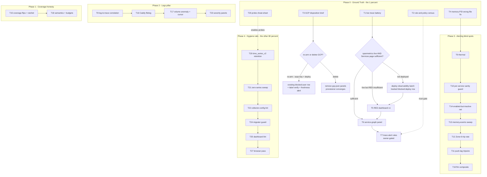

# SigNoz Three-Pillars Full-Power — Pareto Execution Plan

**Authored:** 2026-10-10 02:44 local (`date` CLI)
**Author:** Crush (agent), commissioned by owner directive (pareto breakdown → 27 medium tasks 30–100min → micro tasks ≤12min → tables → graph → commit+push)
**Scope:** SigNoz utilization — everything surfaced by the 2026-10-09 advisory session (`docs/status/2026-10-09_23-29_signoz-utilization-gap-analysis-self-review.md` §f, 50 items), the 2026-10-10 exemplar deep-dive, deduplicated against the tracked backlog `docs/todo/monitoring.md` (read in full, 102 lines).
**Status:** PLAN — awaiting owner approval before execution (skill: "Full Execution Mode" is post-approval). Nothing in this plan has been executed except the ground-truth probes already run this session (listed below).

---

## 1. Ground truth this plan is built on

### Live-verified THIS session (2026-10-09/10, by direct probe)

| # | Fact | Probe |
|---|------|-------|
| G1 | `signoz_metrics` has **zero exemplar columns**; `distributed_samples_v4` = `env, temporality, metric_name, fingerprint, unix_milli, value, flags, inserted_at_unix_milli` — no trace id anywhere | `system.columns` + `DESCRIBE` |
| G2 | **4 of 12,163,088** log lines (7d) carry `trace_id` in `signoz_logs.distributed_logs_v2` — the log→trace pivot bridge exists and is empirically dead | `countIf(trace_id != '')` |
| G3 | All 7 dashboards (`overview/caddy/dns/gcp/gpu/pool-storage/telemetry-coverage`) are metrics-only panels; the only trace/log consumers are ingestion-count + coverage-liveness panels | panel-name extraction |
| G4 | ~35 alert rules in `_signoz-alerts.nix`; spanmetrics + servicegraph connectors configured in `signoz.nix:1303/:1389` | file read |

### Doc-sourced (NOT yet live-verified — Phase 0 exists to close exactly this gap)

| # | Claim | Source | Risk if stale |
|---|-------|--------|---------------|
| D1 | spanmetrics/servicegraph deploy was `[blocked:deploy]` (IO storm, 2026-09-30) | monitoring.md:71 | The whole RED-dashboard track may need a deploy first |
| D2 | RED/service-map dashboard **deliberately deferred** pending "Services page sufficient?" check | monitoring.md:75 | Building it unconditionally would violate the recorded decision |
| D3 | GCP receiver containment-disabled → `gcp.json`'s 10 panels are dead | signoz.md:29 + monitoring.md:65 | None (SA/IAM/key done; re-arm is `[blocked:user]`) |
| D4 | Exemplars parsed by receiver, dropped at ClickHouse writer | monitoring.md:57 + G1 | None — G1 confirms the storage half live |
| D5 | Memory-PSI rule likely reads the wrong PSI file | monitoring.md todo | An actively-WONG rule fires on IO storms (2026-10-08) |

**The lesson encoded in this plan's shape:** the previous session's self-review found the #1 failure was asserting capability from docs without probes. Therefore **T1 (ground-truth battery) gates every build task**, and no dashboard/rule work starts before its verdict.

---

## 2. The Pareto answer

### The 1% that delivers 51%

**T1 — the ground-truth battery** (~45 min of live ClickHouse/API probes). It is 1/27 of the tasks and zero build effort, yet it decides: whether the observability batch still needs deploying (D1), whether the RED dashboard is a go (D2), and whether the coverage ratchet can fire. Every other task inherits its verdict. Cheapest possible de-risking of the entire roadmap — the exact anti-pattern the 2026-10-09 session got burned by.

*Riding the same session (30 min):* **T4 — fix the memory-PSI rule that reads the wrong file.** An actively-wrong alert is worse than a missing one; it cried wolf during the 2026-10-08 IO storm.

### The 4% that delivers 64%

T1 + T4 + **T5 (RED dashboard)** + **T8 (log→trace correlation)**. These two builds convert the two dead pillars into the primary debugging surface:
- T5 turns traces from a liveness heartbeat into queryable per-service latency/error reality (the Services page already computes this — we render it).
- T8 activates the bridge that SigNoz gives us **for free today** (G2: 4/12M lines) — no upstream dependency, unlike exemplars.

### The 20% that delivers 80%

The above **plus** the alerting blind-spot class where real incidents already paid tuition: T9 (thermal — 3 freezes, zero CPU-temp alerting), T10 (per-service sanity — the DiscordSync 121%-CPU hotloop), T14 (enabled-but-inactive — the 3h-dark pool dropout), T15 (coverage flips + gap ratchet), T6 (service-graph panel), T2 (rule/policy parity census), T26 (probe cheat-sheet — makes every future session cheaper), T7 (trace alert rules, owner-gated).

### The other 80% to reach 100%

Depth and rails: logs pipeline hardening (T16 Caddy filelog, T17 cursor persistence + volume anomaly, T23 severity panels), remaining blind spots (T11 push-lag, T12 Zone-6 trip-rate, T13 memory.events, T19 flm composite), the GCP disposition (T3), hygiene (T20 time_series_v2 retention, T21 zero-series sweep, T22 collector-config-lint, T24 migrator guard, T25 dashboard lint, T27 browser pass). None of it blocks the 80% — but without it the system rots back to phantom-greens (the repo's own history: 6 phantom rules, 251 zombie dashboards, 52 GiB unbounded log tables — all hygiene-class failures).

---

## 3. Execution constraints (the trap library, binding for every task)

1. **Dashboards:** EXACTLY one query per panel (v2 API 400s otherwise); no grid overlap (`signoz-query-lint`); panel+layout removed together; deterministic uuid5 IDs; **pre-verify every PromQL against the live query API** (`http://localhost:8080/api/v1/query`, no auth) BEFORE committing JSON; provisioner CONVERGES (never delete+recreate — fake RESOLVED/FIRING pairs).
2. **Alert rules:** `mkRule` target validation (`target=0` traps); `{{$value}}`/`{{$threshold}}` with ZERO spaces inside braces; `up{job=...}` NEVER matches (use `node_systemd_unit_state{name="<unit>.service",state="active"}` or `count(up{service_name=...}) or vector(0)`); routing is EXCLUSIVELY route policies (`name == ruleId`, wiped by restarts, re-provisioned each deploy).
3. **ClickHouse schema traps:** traces `timestamp` = DateTime64 → `toUnixTimestamp64Milli`; logs `timestamp` = UInt64 ns → `intDiv(max(ts),1e6)`; `samples_v4` join via `time_series_v4` fingerprint (`samples_v2` EMPTY; `time_series_v2` EMPTY — known open issue T20).
4. **Collector:** configs read at STARTUP only — every config change needs restartTriggers (or it deploys silently inert); journald receiver NEVER `start_at=beginning`; live-fire validate config changes (v0.144 removed `wait`/`max_connection_age` — eval can't see that).
5. **Probes:** `journalctl --grep` needs BOTH `--since` AND `timeout`; gatus reads via sqlite not API; `pat()` crosses Nix→YAML→glob escape layers; description fields must never contain `"` or `\`.
6. **Deploy discipline:** `--keep-going` FIRST on blocked builds; never force-enable disabled services (use throwaway `extendModules`); pre-deploy §10 phantom-metric gate; post-deploy smoke.
7. **Verschlimmbessern guard:** every task lands as converge-only changes, one logical change per deploy, verify-then-close. No rewrites of working provisioners, no alert-threshold tuning without an incident-derived justification, no speculative schema changes to ClickHouse (append-only doctrine — owner decision 2026-09-29).

---

## 4. Table A — Comprehensive plan (27 tasks, 30–100 min each, sorted by importance/impact/effort/customer-value)

Rank 1 = do first. Impact: value delivered. Effort: estimated minutes. "Cust" = customer (owner) value: uptime, debug speed, honesty of the monitoring surface.

| # | ID | Task | Phase | Impact | Effort | Cust | Why this rank |
|---|----|------|-------|--------|--------|------|---------------|
| 1 | T1 | Live ground-truth battery: spans/h per service, `signoz_calls_total`/`signoz_latency` existence, service-graph edges, deployed-config parity, Services-page sufficiency verdict | P0 gate | H | 45 | H | Gates every build task; kills the doc-parroting failure class |
| 2 | T4 | Fix "Memory Pressure CRITICAL" rule reading wrong PSI file + verify against live series | P3 | H | 30 | H | Actively-wrong rule, cheapest fix on the list |
| 3 | T5 | RED dashboard v1: calls/p50-p99/error-ratio per service (conditional on T1 verdict per monitoring.md:75) | P1 | H | 100 | H | The 51% move — traces become the debugging surface |
| 4 | T9 | Thermal alerting: sustained Tctl ceiling + GPU edge (fingerprint or thermal-pstate-guard series) | P3 | H | 75 | H | 3 freezes rode zero CPU-temp alerting |
| 5 | T8 | Log→trace correlation for span-emitting Go fleet (OTLP logs / slog bridge) | P2 | H | 100 | H | Free bridge, dead at 4/12M (G2) |
| 6 | T10 | Per-service journal-rate + sustained-CPU sanity smoke guard | P3 | H | 75 | H | DiscordSync hotloop class — hours of burn, no gate noticed |
| 7 | T14 | Enabled-but-inactive detection net (+ `\x2d` escaping prerequisite check) | P3 | H | 60 | H | Pool-dropout ran 3h dark with every layer green |
| 8 | T15 | Coverage flips (dnsblockd/overview) + `maxUpstreamGaps` ratchet | P1 | M | 60 | M | Closes instrumentation debt, sharpens the tripwire |
| 9 | T6 | Service-graph dependency panel from `traces_service_graph_*` | P1 | M | 45 | M | Data flows (if T1 confirms); zero consumers |
| 10 | T2 | Rule/policy parity census: live rules vs file, route-policy exactly-one, dashboard zombie sweep | P0 | M | 30 | M-H | Trust check on the whole alerting surface |
| 11 | T26 | Live-probe cheat-sheet in signoz.md + hwmon fingerprint table + exemplar upstream-watch note | P4 | M | 30 | M | Makes every future session cheaper; 30 min |
| 12 | T7 | Trace latency + error-rate alert rules (OWNER-GATED: page vs observational, §g Q3) | P1 | M | 60 | M | Depends on T5; needs owner noise-budget call |
| 13 | T13 | memory.events `high` sweep (post-deploy leg + optional metric/rule) | P3 | M | 60 | M | llama-chat 46k events, zero alerts |
| 14 | T12 | Zone-6 guard trip-RATE alert (trips/h sustained 2h) | P3 | M | 45 | M | Freeze #12: 90+ trips, no trend signal |
| 15 | T11 | Push-lag tripwire (ahead-by >N or push-age >M) | P3 | M | 45 | M | 38 commits sat unpushed 15h unnoticed |
| 16 | T3 | GCP disposition: confirm dead panels, owner decision brief (re-arm vs delete `gcp.json`) | P0 | M | 30 | M | 10 dead panels shipped to the UI = dishonest surface |
| 17 | T16 | Caddy access.log filelog receiver + OTTL parse | P2 | M | 75 | M | Richest untapped log source |
| 18 | T17 | Log-ingestion-volume anomaly alert + journald cursor persistence (`file_storage`) | P2 | M | 60 | M | Silence = pipeline dead; restarts currently drop logs |
| 19 | T18 | Coverage semantics split (never-seen vs went-dark) + 6h dense-emitter budgets | P1 | M | 60 | M | Event-driven services muddy outage detection |
| 20 | T19 | flm crash-trigger composite (PMA 30s-band × flm coredumps) | P3 | M | 45 | M | Manual journal correlation today |
| 21 | T20 | `time_series_v2` empty — metadata retention root-cause + fix | P4 | M-H | 75 | M | Every label-keyed forensic join is broken |
| 22 | T21 | Zero-series sweep automation (rules/dashboards vs ClickHouse series) | P4 | M | 75 | M | Phantom-green rules survive deploys today |
| 23 | T22 | `signoz-collector-config-lint` live-fire flake check + runbook | P4 | M | 75 | M | v0.144 config-field removal class — eval-blind |
| 24 | T27 | Browser-test pass: render all 7 dashboards, dead-panel census | P4 | M | 45 | M | API-verified only, never rendered (tracked blocked:user) |
| 25 | T23 | Log severity-distribution panels + saved error-pattern views | P2 | L-M | 45 | L-M | Polish on the logs pillar |
| 26 | T24 | SigNoz migrator-gap guard (applied IDs ⊆ known list) | P4 | L-M | 45 | L-M | The 1010 squash-gap class |
| 27 | T25 | Commit dashboard generator + eval-time dashboard JSON lint | P4 | L-M | 60 | L-M | `/tmp/gen_dashboards.py` was ephemeral |

**Totals:** ~24.5 h medium-granularity effort. P0 = 2.25h, the 20% tier ≈ 11h.

---

## 5. Table B — Fine-grained breakdown (117 micro tasks, each ≤12 min, sorted by parent rank)

| # | ID | Micro-task | Min | Gate/verify |
|---|----|-----------|-----|-------------|
| 1 | 1.1 | ClickHouse: spans/h per service, last 24h (`distributed_signoz_index_v3`) | 5 | non-empty result |
| 2 | 1.2 | ClickHouse: `signoz_calls_total` + `signoz_latency` exist in `samples_v4` | 10 | series count > 0 |
| 3 | 1.3 | ClickHouse: `traces_service_graph_*` edges flowing | 5 | edges > 0 |
| 4 | 1.4 | Deployed collector config == repo source (unit ExecStart gen + journal decode errors) | 12 | no drift, no decode errors |
| 5 | 1.5 | Services-page sufficiency verdict (RED latency/error readable per service?) → dashboard go/no-go | 12 | written verdict |
| 6 | 1.6 | Record verdict: annotate monitoring.md:75 row + this plan | 5 | row updated |
| 7 | 4.1 | Read current memory-PSI rule query + live node_exporter PSI metric names | 10 | mismatch identified |
| 8 | 4.2 | Re-point rule at memory PSI series; pre-verify via query API | 10 | query returns series |
| 9 | 4.3 | Converge (PUT direct or ride deploy); verify rule evaluates on correct series | 10 | rule state healthy |
| 10 | 5.1 | Enumerate services by span volume; pick top 6 | 8 | list written |
| 11 | 5.2 | PromQL: calls rate per service (`signoz_calls_total`) | 10 | API-verified |
| 12 | 5.3 | PromQL: `histogram_quantile` p50/p95/p99 from `signoz_latency_bucket` | 12 | API-verified |
| 13 | 5.4 | PromQL: error ratio per service | 10 | API-verified |
| 14 | 5.5 | Pre-verify ALL queries against live API; record results | 12 | all non-empty |
| 15 | 5.6 | Dashboard JSON: one query/panel, uuid5 IDs, no overlap | 12 | signoz-query-lint green |
| 16 | 5.7 | Run `nix flake check --no-build` + negative-test-lints | 8 | green |
| 17 | 5.8 | Deploy provisioner; verify "OK 8 dashboards" + no FAILED lines; eyeball | 12 | provisioner green |
| 18 | 5.9 | CHANGELOG + close monitoring.md:75 row | 6 | rows edited |
| 19 | 9.1 | Live thermal series check (k10temp Tctl/Tdie, acpitz, GPU edge) post-label-loss | 12 | series identified |
| 20 | 9.2 | Sustained-ceiling rule design (≥95°C N-min, hourly-max trajectory) | 12 | rule written |
| 21 | 9.3 | GPU edge rule (92.9°C precedent, or-coverage both sources) | 10 | rule written |
| 22 | 9.4 | Gatus-vs-SigNoz wiring decision + implement | 12 | check exists |
| 23 | 9.5 | Deploy + verify + no-flap observation window | 12 | green ≥1 cycle |
| 24 | 9.6 | Close thermal row (monitoring.md) | 5 | row edited |
| 25 | 8.1 | Census: Go services emitting spans but logging via journald | 10 | list written |
| 26 | 8.2 | Pick pattern per service (OTLP logs vs slog bridge + trace-id) | 12 | decision recorded |
| 27 | 8.3 | Prototype on ONE service (discordsync or dnsblockd) | 12 | spans+logs correlated |
| 28 | 8.4 | Verify: `countIf(trace_id != '')` > 0 for that service | 8 | live probe |
| 29 | 8.5 | Verify SigNoz UI pivots log→trace on a real line | 10 | pivot works |
| 30 | 8.6 | Roll out to remaining services (batch, one deploy) | 12 | fleet ratio climbs |
| 31 | 8.7 | Coverage module comment + runbook note | 6 | docs updated |
| 32 | 10.1 | Design per-service budgets (CPU% window, journal line-rate) | 12 | budgets table |
| 33 | 10.2 | Script leg in smoke suite | 12 | runs clean |
| 34 | 10.3 | Fixture test replaying DiscordSync hotloop numbers | 12 | test fires |
| 35 | 10.4 | Wire into post-deploy flow + docs | 12 | smoke includes it |
| 36 | 14.1 | Enabled-but-inactive metric emission (system + user managers) | 12 | metric lands |
| 37 | 14.2 | Gatus check on the metric | 10 | check green |
| 38 | 14.3 | One-off stranded-inactive sweep since last boot | 12 | findings triaged |
| 39 | 14.4 | `\x2d` label-escaping prerequisite check (whole-file rejection risk) | 12 | parse confirmed OK |
| 40 | 15.1 | dnsblockd push-state check → flip `wiring="config"` if landed | 12 | registry updated |
| 41 | 15.2 | Verify `signoz_traces_reporting{service="overview"}` = 1 → ratchet `maxUpstreamGaps` | 10 | budget lowered |
| 42 | 15.3 | Update Services-page onboarding checklist comment | 8 | comment updated |
| 43 | 15.4 | Verify gap-budget tripwire at new value | 10 | healthy 0 |
| 44 | 6.1 | Verify `traces_service_graph_*` edges live (client/server pairs) | 8 | edges exist |
| 45 | 6.2 | PromQL: top edges by calls + errors | 10 | API-verified |
| 46 | 6.3 | Panel JSON + lint | 12 | lint green |
| 47 | 6.4 | Provision + verify render | 10 | panel renders |
| 48 | 6.5 | Docs note (where the service map lives) | 5 | doc updated |
| 49 | 2.1 | Live rules vs `_signoz-alerts.nix` name-set diff | 12 | zero diff or triaged |
| 50 | 2.2 | Route-policy census (exactly-one-per-rule, no orphans post-restart) | 10 | clean |
| 51 | 2.3 | Dashboard live set vs files (7 expected, zero zombies) | 8 | clean |
| 52 | 26.1 | Live-probe cheat-sheet into signoz.md (CH queries + query API) | 12 | section exists |
| 53 | 26.2 | hwmon fingerprint→chip table into monitoring.md | 10 | table exists |
| 54 | 26.3 | Exemplar upstream-watch note (recheck on version bumps) | 5 | note exists |
| 55 | 7.1 | Owner decision: traces page or stay observational (§g Q3) | 3 | answer recorded |
| 56 | 7.2 | p95 latency breach rule via mkRule (target validation) | 12 | eval green |
| 57 | 7.3 | Error-ratio rule | 12 | eval green |
| 58 | 7.4 | Route policy + Discord template check (`{{$value}}` zero spaces) | 10 | template renders |
| 59 | 7.5 | Provision + synthetic test-fire | 12 | Discord received |
| 60 | 7.6 | Test-fire "Telemetry Export Failures" alert (tracked backlog row) | 11 | Discord received |
| 61 | 13.1 | post-deploy-check leg: cgroup `memory.events` sweep | 12 | leg exists |
| 62 | 13.2 | Optional textfile metric for continuous coverage | 12 | metric lands |
| 63 | 13.3 | Optional SigNoz rule on the metric | 10 | rule green |
| 64 | 13.4 | Owner decision: hard gate vs advisory (tracked decision row) | 3 | answer recorded |
| 65 | 13.5 | Test the sweep against a known-throttled unit (llama-chat journal) | 10 | fires correctly |
| 66 | 12.1 | Guard counter source check (trip counter metric) | 8 | series found |
| 67 | 12.2 | Rate-window rule (trips/h sustained 2h) | 12 | rule written |
| 68 | 12.3 | Implement + verify against freeze-#12 numbers | 12 | would-have-fired |
| 69 | 12.4 | Close Zone-6 rate row | 5 | row edited |
| 70 | 11.1 | Collector leg: ahead-by + last-push-age (origin readable) | 12 | metric lands |
| 71 | 11.2 | Gatus check + pat conditions | 10 | check green |
| 72 | 11.3 | Test-fire (temporarily low threshold) | 8 | alert fires |
| 73 | 11.4 | Close push-lag row | 5 | row edited |
| 74 | 3.1 | Confirm receiver disabled in rendered config + panels dead | 10 | confirmed |
| 75 | 3.2 | Owner decision brief: re-arm (sops key path) vs delete `gcp.json` | 12 | brief written |
| 76 | 3.3 | Ask owner | 3 | asked |
| 77 | 3.4 | Bookkeeping for chosen branch (row updates) | 5 | rows updated |
| 78 | 16.1 | filelog receiver config + restartTriggers | 12 | eval green |
| 79 | 16.2 | OTTL parse of Caddy access format | 12 | parse verified |
| 80 | 16.3 | Live-fire config lint (rebased ports) | 12 | lint green |
| 81 | 16.4 | Deploy + verify `service.name=caddy` in logs_v2 | 12 | lines land |
| 82 | 16.5 | Volume sanity (no CPU-burn recurrence, journal rate bounded) | 10 | calm |
| 83 | 17.1 | Ingestion-silence anomaly rule (>10min) | 12 | rule green |
| 84 | 17.2 | `file_storage` extension wiring for journald cursor | 12 | eval green |
| 85 | 17.3 | Restart-drop test (stop collector briefly in maintenance window) | 12 | no gap |
| 86 | 17.4 | Close both tracked rows | 5 | rows edited |
| 87 | 18.1 | `reason` label split: never-seen vs went-dark | 12 | metric extended |
| 88 | 18.2 | Gatus pattern update for new semantics | 10 | check green |
| 89 | 18.3 | Dense-emitter 6h budget config | 10 | eval green |
| 90 | 18.4 | Verify `missing=0` after semantics change | 10 | healthy |
| 91 | 19.1 | PMA journal signature probe (30s-band fallbacks) | 10 | pattern greppable |
| 92 | 19.2 | Composite rule/check design (co-occurrence window) | 12 | design written |
| 93 | 19.3 | Implement + verify against 2026-10-07 incident window | 12 | would-have-fired |
| 94 | 20.1 | TTL/retention audit for metadata tables (`time_series_v2`) | 12 | cause found |
| 95 | 20.2 | Root-cause: QLC-era ingestion failure vs TTL drop | 12 | cause confirmed |
| 96 | 20.3 | Fix + verify repopulation | 12 | rows appear |
| 97 | 20.4 | Label-join spot check (fingerprint → labels) | 10 | join works |
| 98 | 21.1 | Script: metric names in rules+dashboards vs time-series table | 12 | script runs |
| 99 | 21.2 | Blocklist handling (documented exemptions) | 10 | exemptions filed |
| 100 | 21.3 | Wire as flake check | 12 | check green |
| 101 | 21.4 | Run + triage output (expect: find current zero-series rules) | 12 | findings triaged |
| 102 | 22.1 | Flake check: render config, rebase ports, boot collector, assert bind-conflict-only failure | 12 | check works |
| 103 | 22.2 | Wire into `flake.nix` checks | 10 | check runs |
| 104 | 22.3 | Runbook section (live-fire procedure) in signoz.md | 10 | section exists |
| 105 | 22.4 | Negative test (mutated config must fail the check) | 12 | negative-test green |
| 106 | 27.1 | Render all 7 dashboards in browser + screenshot | 12 | screenshots |
| 107 | 27.2 | Dead/empty panel census | 12 | list written |
| 108 | 27.3 | Fix or file findings | 12 | triaged |
| 109 | 23.1 | Severity distribution PromQL (error/warn rate per service) | 10 | API-verified |
| 110 | 23.2 | Panel JSON + lint | 12 | lint green |
| 111 | 23.3 | Provision + verify render | 10 | panel renders |
| 112 | 24.1 | Applied-migrations query + known-list assertion | 12 | assertion written |
| 113 | 24.2 | Wire as check or collector leg | 12 | wired |
| 114 | 24.3 | Verify (1010-class gap would be caught) | 8 | verified |
| 115 | 25.1 | Promote/recreate dashboard generator script | 12 | script committed |
| 116 | 25.2 | Schema lint (v1-shape regression + one-query enforcement at eval) | 12 | lint green |
| 117 | 25.3 | Wire into flake check + negative test | 12 | negative-test green |

**Totals:** 117 micro tasks, ≈19.5 h (the delta vs Table A is owner-decision and close-out overhead already inside medium estimates).

---

## 6. Execution graph

**Reading order:** P0 first (rank 1), then ranks 2–11 in Table A order; the graph shows hard dependencies only — everything else is parallelizable across sessions.

---

## 7. Verification gates (definition of done per tier)

- **P0 done when:** every D-row above has a live-verified replacement fact, and the T1 verdict is recorded in monitoring.md:75's row.
- **Traces tier done when:** a latency spike is answerable in ≤3 clicks (dashboard → service → trace list) without touching a shell; `signoz_traces_upstream_gaps` ratcheted down with each flip verified by ClickHouse probe.
- **Logs tier done when:** log→trace ratio for instrumented services >90%, Caddy access events queryable by status code, and a collector restart loses zero journal lines.
- **Alerting tier done when:** every rule has fired a test (or a documented would-have-fired against a historical window) and the memory-PSI rule provably reads the memory series.
- **Hygiene tier done when:** the zero-series sweep runs green in CI, `time_series_v2` repopulates, and a browser pass shows zero dead panels.

## 8. Deliberately excluded (anti-verschlimmbessern)

- **No exemplar work** — blocked upstream (G1); watch-note only (26.3).
- **No alert-threshold tuning** without incident-derived justification.
- **No ClickHouse deletions** — append-only doctrine (owner, 2026-09-29); read-only zombie tables stay a human decision.
- **No re-scoping of the deferred-dashboard row** (monitoring.md:75) until T1's verdict exists — the recorded decision outranks a fresh design (2026-10-05 doctrine).
- **Non-SigNoz monitoring backlog** (btrfs/boot-duration/backup freshness etc.) stays in its tracked rows — out of this plan's scope by design.

## 9. Harvest record (this plan → TODO system)

Per the pareto-planning skill ("if this plan surfaced NEW tasks, add them to TODO_LIST.md"), three genuinely-new rows were added (everything else already tracked):

1. `[ready]` Log→trace correlation for the span-emitting Go fleet — `docs/todo/monitoring.md` + queue row.
2. `[decision]` GCP dashboard disposition (re-arm vs delete `gcp.json`) — `docs/todo/monitoring.md` + queue row.
3. `[ready]` Live-probe cheat-sheet + hwmon fingerprint table + exemplar watch — `docs/todo/monitoring.md` + queue row.

The RED dashboard deliberately got NO new row — monitoring.md:75 already owns it with its deferral condition; T1 resolves that condition.
