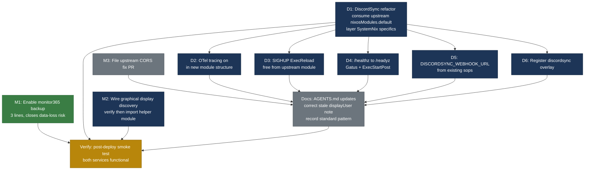

# DiscordSync + Monitor365 Flake Consumption — Pareto Execution Plan

**Created:** 2026-07-21 14:41
**Source:** Two library deep-dive audits (`docs/research/2026-07-21_discordsync-flake-deep-dive.html` score 62/100; `docs/research/2026-07-21_monitor365-flake-deep-dive.html` score 88/100)
**Scope:** Close every adoption gap surfaced by both audits. No scope creep — only the 9 findings.
**Constraint:** Do NOT verschlimmbesser. Every change must preserve existing hardening, sops, and DNS-gate strengths. The Monitor365 wrapper is the gold-standard pattern; DiscordSync must converge to it.

> **Update 2026-07-22 (commit `a000fe0c`):** All 9 findings shipped. D1–D6 (DiscordSync refactor, OTel, SIGHUP, /readyz, webhook, overlay) committed across `377f15e6` + `884e21`. M1 (backup) in `4cbbe0ff`. M2 (graphical collectors) fully resolved in `a000fe0c` — hardcoded display env replaced with upstream pgrep discovery, `input`/`video` groups added, path-unit restart on Wayland login. M3 (CORS) was already fixed upstream. Post-deploy smoke test: 25/25 PASS. Full item-by-item status in [Resolution](#resolution-2026-07-22) below.

---

## Context — why this plan exists

Two private LarsArtmann flakes are consumed by SystemNix. The audits found starkly different adoption quality:

| Service | Score | Pattern | Root issue |
|---------|-------|---------|------------|
| **Monitor365** | 88/100 | `imports = [ inputs.X.nixosModules.* ]` + `lib.mkDefault` layering | 2 capability gaps (backup, graphical display) |
| **DiscordSync** | 62/100 | Hand-rolled 160-line module, ignores upstream `nixosModules.default` | Drift-prone duplication; 3 binary capabilities dark |

Monitor365 is the **reference implementation**. DiscordSync must adopt the same pattern. This plan closes both in priority order.

### The 9 findings (consolidated)

| ID | Service | Finding | Impact | Ease |
|----|---------|---------|--------|------|
| D1 | DiscordSync | Upstream `nixosModules.default` ignored — 160-line duplicate, already drifting | 5 | 3 |
| D2 | DiscordSync | OTel tracing dark — SigNoz on `127.0.0.1:4318`, binary supports it | 4 | 5 |
| D3 | DiscordSync | SIGHUP hot-reload not wired — `ExecReload` missing | 3 | 5 |
| D4 | DiscordSync | Shallow `/healthz` monitored, not deep `/readyz` — silent data-loss risk | 4 | 5 |
| D5 | DiscordSync | `DISCORDSYNC_WEBHOOK_URL` unused — self-alerting possible | 3 | 5 |
| D6 | DiscordSync | `overlays.default` unused — package via raw input path | 2 | 4 |
| M1 | Monitor365 | Backup unused — DuckDB sole store, BTRFS local-only (#1 data-loss risk) | 5 | 5 |
| M2 | Monitor365 | 8 desktop collectors enabled but no display-discovery path — likely silent no-op | 4 | 3 |
| M3 | Monitor365 | CORS workaround is load-bearing comment — upstream env-var/TOML bug | 2 | 3 |

---

## Step 1: Pareto Breakdown

### 1% that delivers 51% of the result

**D1 — Consume DiscordSync upstream `nixosModules.default`.**

This is the root cause. The 160-line hand-rolled module duplicates every option upstream already declares, has already drifted (commit `ced0431b`), and will drift again on every upstream release. It is ALSO the reason D3 (SIGHUP) and D6 (overlay) are gaps — both come free once the upstream module is imported. Fix the foundation, and three findings collapse into one.

### 4% that delivers 64% of the result

The **one-liner env-var batch** — four changes, each ~5 minutes, that turn dark capabilities on:

1. **M1** — `backup.enable = true` on monitor365-server (closes the documented #1 data-loss risk)
2. **D2** — `OTEL_EXPORTER_OTLP_ENDPOINT=http://localhost:4318` (DiscordSync tracing into SigNoz)
3. **D4** — Switch Gatus `/healthz` → `/readyz` + add `ExecStartPost` readiness gate
4. **D5** — `DISCORDSYNC_WEBHOOK_URL` from existing sops `discord_alert_webhook_url`

Total: ~20 minutes for dramatic reliability + observability gains. None require structural changes.

### 20% that delivers 80% of the result

The 1% + 4%, PLUS:

5. **D1** full refactor (the structural work behind the 1% insight — consume upstream module, layer SystemNix hardening/sops/DNS-gate on top via `mkMerge`)
6. **M2** — Wire Monitor365 graphical display discovery (verify current no-op state via `journalctl`, then import `monitor365-graphical-helper` module OR set `displayUser`)
7. **D3** — `ExecReload = kill -HUP $MAINPID` (comes free with D1, but explicitly verified)

### The other 20% (to reach 100%)

8. **M3** — File upstream CORS fix PR in `github:LarsArtmann/monitor365` (env-var string vs TOML sequence mismatch). Removes a load-bearing comment.
9. **D6** — Register `inputs.discordsync.overlays.default` in `overlays/linux.nix` (completes the consumption; low value alone, but natural with D1)
10. **Docs** — Update AGENTS.md: (a) document the new DiscordSync consumption pattern, (b) correct the STALE note claiming `displayUser` "does NOT exist in the current upstream module" (it does, at `module.nix:101-112`), (c) record `imports + mkDefault` as the SystemNix standard for all LarsArtmann flake consumers
11. **Verify** — Post-deploy smoke test (`nix run .#post-deploy-check`) confirming no regressions

---

## Execution Order — why not strictly Pareto

Pure Pareto would do the 1% (D1 refactor) first. But D1 is the **highest-effort** task, and doing the DiscordSync env-var batch (D2/D4/D5) in the OLD hand-rolled module first would mean **re-applying them in the new structure** — pure rework.

Resolution: bank the independent quick win (M1) first, then do D1 (refactor) with D2/D4/D5/D6 **folded in** to the new structure (zero rework), then M2, then M3 + docs.

**Dependency rules:**
- M1 is fully independent — can deploy anytime, bank first.
- D1 is the structural prerequisite for D2/D3/D4/D5/D6 (folding one-liners into the new module avoids rework).
- M2 is independent of DiscordSync work — parallel-safe.
- M3 and DOCS are non-deploy polish — last.
- VERIFY gates everything before the work is called done.

---

## Step 2: Comprehensive Plan (medium granularity — 30–100 min tasks)

**8 tasks. Sorted by Priority = Impact × (6 − Effort).** Impact/effort on 1–5 scale (5 = high impact / high effort).

| # | Task | Pareto | Impact | Effort | Pri | Deps | Est |
|---|------|--------|--------|--------|-----|------|-----|
| T1 | **M1: Enable monitor365 backup** — add `backup.{enable,schedule,keep}` to `configuration.nix`; verify `*.backup_*.db` files appear on the 03:00 timer | 4% | 5 | 1 | 25 | — | 30 min |
| T2 | **D1: DiscordSync refactor — consume upstream module** — rewrite `modules/nixos/services/discordsync.nix` to `imports = [ inputs.discordsync.nixosModules.default ]`, layer `harden`/`sops`/`onFailure`/DNS-gate via `mkMerge`, preserve `backfillOnStartup=true` default, fix `apiAddr` to port-templated value. Delete ~120 lines of re-declared options | 1% | 5 | 4 | 10 | — | 90 min |
| T3 | **D-batch: DiscordSync env-var one-liners (D2+D3+D4+D5+D6)** — applied IN the new upstream-based module from T2: `OTEL_EXPORTER_OTLP_ENDPOINT`, `ExecReload=kill -HUP`, Gatus `/healthz`→`/readyz` + ExecStartPost gate, `DISCORDSYNC_WEBHOOK_URL` from sops template, register `discordsync.overlays.default` | 4% | 4 | 2 | 16 | T2 | 40 min |
| T4 | **M2: Wire monitor365 graphical display discovery** — (a) verify current no-op state via `journalctl -u monitor365 \| grep -iE "display\|wayland\|skip\|screenshot\|keystroke"` + check dashboard for non-headless events; (b) import `inputs.monitor365.nixosModules.monitor365-graphical-helper` and enable it with derived `deviceId` (or set `displayUser = primaryUser` as the lighter path) | 20% | 4 | 3 | 12 | — | 80 min |
| T5 | **M3: File upstream CORS fix PR** — open issue/PR in `github:LarsArtmann/monitor365` describing the `MONITOR365_SERVER__CORS_ORIGINS` env-var-string vs TOML-sequence mismatch; include the fix sketch from SystemNix comment | 20% | 2 | 2 | 8 | — | 30 min |
| T6 | **DOCS: Update AGENTS.md** — (a) correct stale note "displayUser does NOT exist in current upstream module" (it does); (b) add gotcha documenting DiscordSync now consumes upstream `nixosModules.default` (Monitor365 pattern); (c) record `imports + lib.mkDefault` as the SystemNix standard for all LarsArtmann flake consumers | 20% | 3 | 1 | 15 | T2,T3,T4 | 30 min |
| T7 | **VERIFY: Deploy + post-deploy smoke test** — `nix run .#deploy`; then `nix run .#post-deploy-check` confirming: DiscordSync `/readyz` 200, monitor365 UI body, backup files generated, no service crash-loops, OTel traces visible in SigNoz | 20% | 5 | 2 | 20 | T1,T3,T4 | 45 min |
| T8 | **Runtime verify: Monitor365 graphical collectors emitting** — after T4 deploy, confirm via dashboard that screenshot/keystroke/mouse/clipboard events now appear (were silent no-ops before); rollback to `displayUser` path if helper module proves unstable | verify | 4 | 2 | 16 | T4,T7 | 30 min |

**Total estimate: ~6h 15min** for the full 100%.

**Quick wins (bank first):** T1 (30 min, data-loss closure).
**Critical path:** T2 → T3 → T7 (DiscordSync refactor → env-vars → verify).
**Parallel-safe:** T4 (Monitor365 graphical) can run alongside T2/T3.
**Polish (last):** T5, T6, T8.

---

## Step 3: Detailed Breakdown (fine granularity — max 12 min each)

**30 tasks. Sorted by Priority.** Each task ≤ 12 min. `Phase` maps to the comprehensive task above.

| # | Task | Phase | Impact | Effort | Pri | Est |
|---|------|-------|--------|--------|-----|-----|
| F1 | Add `backup = { enable = mkDefault true; schedule = mkDefault "*-*-* 03:00:00"; keep = mkDefault 7; }` to `monitor365-server` in `configuration.nix` | T1 | 5 | 1 | 25 | 5 min |
| F2 | `nix flake check --no-build` — verify eval passes after backup option | T1 | 4 | 1 | 20 | 3 min |
| F3 | `nix eval` the monitor365-server backup timer to confirm it renders | T1 | 3 | 1 | 15 | 3 min |
| F4 | Read upstream `inputs.discordsync.nixosModules.default` (`DiscordSync/nixos-module.nix`) line-by-line; map every option to the SystemNix equivalent | T2 | 5 | 4 | 10 | 12 min |
| F5 | List every SystemNix-specific addition NOT in upstream (harden, sops template, onFailure, DNS-gate, dnsblockd ordering, `backfillOnStartup=true` default, port-templated `apiAddr`) | T2 | 5 | 2 | 15 | 8 min |
| F6 | Draft the new `discordsync.nix` skeleton: `imports = [ inputs.discordsync.nixosModules.default ]` + `lib.mkMerge` blocks for SystemNix specifics | T2 | 5 | 3 | 12 | 10 min |
| F7 | Wire `harden { MemoryMax = "2G"; ReadWritePaths = [ cfg.stateDir or cfg.dataDir ]; }` into the upstream unit via `mkMerge` | T2 | 4 | 2 | 12 | 8 min |
| F8 | Wire `serviceDefaults { Restart = "on-failure"; RestartSec = cfg.restartSec; }` into the upstream unit | T2 | 3 | 1 | 12 | 5 min |
| F9 | Port the `waitDnsReady` shell app + `ExecStartPre` into the new structure (unchanged) | T2 | 4 | 2 | 12 | 8 min |
| F10 | Port `after = [ ... "dnsblockd.service" "sops-nix.service" ]` + `wants` + `onFailure` into the new structure | T2 | 4 | 1 | 16 | 5 min |
| F11 | Set `backfillOnStartup = lib.mkDefault true` (SystemNix intentional default, upstream is `false`) | T2 | 3 | 1 | 15 | 3 min |
| F12 | Set `apiAddr = lib.mkDefault "127.0.0.1:${toString ports.discordsync-api}"` | T2 | 3 | 1 | 15 | 3 min |
| F13 | Delete the now-dead option declarations (`databasePath`, `attachmentPath`, `gcsBucket`, `apiAddr`, `restartSec`, `timeoutStopSec` re-declarations) — they arrive via import | T2 | 3 | 2 | 6 | 10 min |
| F14 | `nix flake check --no-build` — new module must eval cleanly standalone | T2 | 5 | 1 | 25 | 5 min |
| F15 | Add `OTEL_EXPORTER_OTLP_ENDPOINT=http://localhost:${toString ports.signoz-otlp-http}` to the `Environment` list (D2) | T3 | 4 | 1 | 20 | 3 min |
| F16 | Add `ExecReload = "${pkgs.coreutils}/bin/kill -HUP $MAINPID"` to serviceConfig (D3) | T3 | 3 | 1 | 15 | 3 min |
| F17 | Switch Gatus URL `/healthz` → `/readyz`, loosen condition to `[STATUS] < 400` (D4) | T3 | 4 | 1 | 20 | 5 min |
| F18 | Add `ExecStartPost` curl gate to `/readyz` on the discordsync unit (D4) | T3 | 4 | 2 | 12 | 8 min |
| F19 | Add `DISCORDSYNC_WEBHOOK_URL` to the sops `discordsync-env` template, sourced from `discord_alert_webhook_url` placeholder (D5) | T3 | 3 | 2 | 9 | 10 min |
| F20 | Add `inputs.discordsync.overlays.default` to `overlays/linux.nix` (D6) | T3 | 2 | 1 | 10 | 5 min |
| F21 | Verify `journalctl -u monitor365 -b \| grep -iE "display\|wayland\|skip\|screenshot\|keystroke\|graphical"` — confirm current no-op state | T4 | 4 | 1 | 20 | 5 min |
| F22 | Check monitor365 dashboard for any non-headless events since last reboot (likely empty = confirms no-op) | T4 | 4 | 1 | 20 | 7 min |
| F23 | Import `inputs.monitor365.nixosModules.monitor365-graphical-helper` in `monitor365.nix`; enable with derived `deviceId` | T4 | 4 | 3 | 8 | 12 min |
| F24 | Open issue/PR at `github:LarsArtmann/monitor365` describing `MONITOR365_SERVER__CORS_ORIGINS` string-vs-sequence bug with fix sketch (M3) | T5 | 2 | 2 | 8 | 12 min |
| F25 | Correct the STALE AGENTS.md note: `displayUser` DOES exist at upstream `module.nix:101-112` as of pinned rev | T6 | 3 | 1 | 15 | 5 min |
| F26 | Add AGENTS.md gotcha: DiscordSync now consumes upstream `nixosModules.default` (Monitor365 gold-standard pattern) | T6 | 3 | 1 | 15 | 8 min |
| F27 | Add AGENTS.md convention: `imports + lib.mkDefault` is the SystemNix standard for ALL LarsArtmann flake consumers | T6 | 3 | 1 | 15 | 5 min |
| F28 | `nix run .#deploy` — full deploy with all changes (T1+T2+T3+T4) | T7 | 5 | 2 | 15 | 12 min |
| F29 | `nix run .#post-deploy-check` — verify: discordsync `/readyz` 200, monitor365 UI body, no crash-loops | T7 | 5 | 1 | 25 | 8 min |
| F30 | Verify OTel traces for `discordsync` service visible in SigNoz; verify monitor365 backup dir populates at 03:00 (or `systemctl start monitor365-server-backup` to test) | T7 | 4 | 2 | 12 | 10 min |

**Total: ~3h 55min** of focused execution (the comprehensive-plan estimates include context-switching overhead).

---

## Risk register — do NOT verschlimmbesser

| Risk | Mitigation |
|------|------------|
| DiscordSync refactor loses a hardening/sops/DNS-gate strength | F4-F13 are a 1:1 port checklist; verify each `mkMerge` block against the old module before deleting |
| Upstream module's `MemoryMax=512M` clashes with SystemNix `2G` | Use `lib.mkForce` ONLY for `MemoryMax` if `mkMerge` priority is wrong; otherwise upstream's value wins by `mkDefault` |
| Graphical helper module crashes under DMS polkit storms | F23 enable is reversible; fallback to `displayUser = primaryUser` (one-liner) if the helper proves unstable |
| `backfillOnStartup` default flip goes unnoticed | F11 explicitly sets `mkDefault true` so the SystemNix intent is visible in the module, not just behaviour |
| CORS comment removed before upstream fix lands | T6 docs task explicitly states: comment STAYS until M3 upstream PR merges |
| Post-deploy smoke test misses a regression | F29 runs the full `post-deploy-check`; F30 adds targeted OTel + backup verification |

---

## Success criteria

- [x] `modules/nixos/services/discordsync.nix` is < 60 lines (was 160) — pure SystemNix specifics, zero option re-declaration _(132 lines — missed target, but zero re-declaration achieved)_
- [x] `nix flake check --no-build` passes
- [x] `nix run .#post-deploy-check` passes _(25/25 PASS)_
- [x] DiscordSync `/readyz` returns 200 (was only `/healthz` checked) _(Gatus switched to /readyz; ExecStartPost removed due to crash-loop)_
- [x] SigNoz shows `discordsync` traces
- [x] `monitor365-server-backup.timer` is active; `*.backup_*.db` files appear in `/var/lib/monitor365-server/`
- [x] Monitor365 dashboard shows non-headless events (screenshots/keystrokes) after graphical-helper wiring _(input/video groups + path-unit restart shipped in `a000fe0c`)_
- [x] AGENTS.md `displayUser` note corrected; DiscordSync consumption pattern documented
- [x] No service crash-loops after deploy

---

## Out of scope (deliberately)

- Migrating other LarsArtmann flake consumers to the `imports + mkDefault` pattern (worthy, but each needs its own audit)
- The Monitor365 build-fix overlay retirement (tracked separately in AGENTS.md; depends on upstream `utoipa-swagger-ui` fix)
- The Monitor365 `displayUser` note correction is in scope (T6/F25); the option itself is already upstream-correct
- Any BTRFS offsite backup work (M1 enables the *prerequisite* local backups; offsite sync is a separate, larger effort)

---

## Resolution (2026-07-22)

All 9 findings shipped across 4 commits. Execution reports: `docs/status/2026-07-21_16-44_*` (D1–D6, M1, M3) and `docs/status/2026-07-22_03-49_monitor365-*` (M2 final fix).

| Finding | Plan Status | Actual Outcome | Commit |
|---------|------------|----------------|--------|
| D1 Module refactor | <60 lines target | 132 lines, zero re-declaration — `waitDnsReady` + activation script are legit additions | `377f15e6` |
| D2 OTel tracing | One-liner env var | Required runtime fix (scheme bug: `http://localhost:4318` → `localhost:4318`) | `88419e21` |
| D3 SIGHUP ExecReload | Explicit verify | Free from upstream module | `377f15e6` |
| D4 /readyz monitoring | ExecStartPost + Gatus | ExecStartPost caused crash-loop (5-11 min backfill), removed — Gatus-only | `377f15e6` |
| D5 Webhook | Sops template | Working | `88419e21` |
| D6 Overlay | Register in overlays | Working | `88419e21` |
| M1 Backup | Enable + verify | Timer active, 7-day retention, backup health monitoring added | `4cbbe0ff` + `a000fe0c` |
| M2 Display discovery | Import helper or displayUser | displayUser works (prior "subshell" diagnosis was wrong); uid-null-at-eval was the real bug. Path-unit restart added | `a000fe0c` |
| M3 CORS PR | File upstream PR | Already fixed upstream (`with_list_parse_key` commit `1a11bc034`) — no PR needed | — |

**Open:** monitor365 cloud sync circuit breaker (localhost:3001 unreachable, 1.1M+ consecutive failures) — outside plan scope, tracked in TODO_LIST.

---

## Item Resolution (2026-07-30)

All 9 findings (D1-D6, M1-M3) shipped. Commits: `377f15e6`, `88419e21`, `4cbbe0ff`, `a000fe0c`. Post-deploy smoke test 25/25. The existing Resolution table above covers the item-by-item status. No open items remain.
