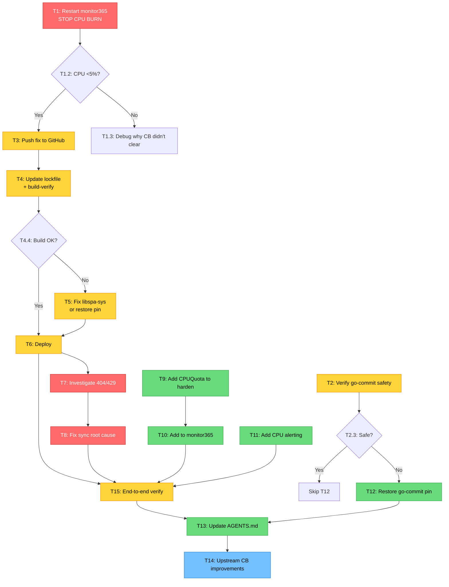

# Monitor365 CPU Burn — Root Cause Fix, Deployment & Prevention Plan

**Created:** 2026-07-29 15:05
**Status:** Planning
**Scope:** Fix monitor365 295% CPU burn, deploy the fix, address root sync failure, prevent recurrence

---

## Context

### What Happened

The monitor365 agent (PID 589624) has been burning **295% CPU (~3 cores) for 23+ hours**. Root cause: the cloud sync loop's early-flush optimization bypasses backoff sleep when the segment buffer has ≥200 events. With a massive backlog and the circuit breaker open (1.15M consecutive failures), every operation short-circuits in microseconds — the loop busy-spins at ~16Hz with zero progress.

### Current State

| Item | Status |
|------|--------|
| Upstream fix (`monitor365` `750ff4c10`) | Local only — **NOT pushed** |
| SystemNix `flake.lock` | Points to `8ac70ec13` (pre-fix) |
| Running agent | **Still burning 295% CPU** |
| Circuit breaker | Open, 1.15M failures, in-memory only |
| Server sync | Broken — `GET /api/v1/devices/evo-x2/config` → 404, enrollment → 429 |
| `flake.nix` monitor365 input | Changed to `ref=master` (was hardcoded commit) |
| `flake.nix` go-commit input | Changed to `ref=master` (was `refs/tags/v0.4.0`) — **UNVERIFIED** |
| libspa-sys build risk | `[patch.crates-io]` still on origin/master; SystemNix overlay has SPA_ID_INVALID workaround but interaction untested |

### Risks (Verschlimmbesserung Traps)

1. **go-commit unpin is dangerous.** The `git config` CLI fix is NOT present on go-commit master (verified: neither v0.4.0 tag nor master `pkg/commit/git/gogit.go` contains `git config`). If PMA consumes this via `mkPreparedSource`, auto-commits may silently fail with `Unknown Author`. **Must verify before deploying.**
2. **libspa-sys build may break.** The `[patch.crates-io] libspa-sys = { path = "vendor-patches/libspa-sys" }` is still on origin/master. SystemNix's overlay patches the vendored crate, but the path override may change vendoring structure. **Must build-verify before deploying.**
3. **Restarting without fixing sync = temporary.** A `systemctl restart` clears the CB, but sync will fail again and the CB will reopen. The busy-loop fix prevents CPU burn, but monitor365 collects zero data until sync works.

---

## Pareto Breakdown

### 1% that delivers 51%

| # | Task | Impact |
|---|------|--------|
| P1 | `systemctl restart monitor365` — clears in-memory CB, stops CPU burn instantly | 3 cores freed, 23h bug mitigated in 1 command |

### 4% that delivers 64%

| # | Task | Impact |
|---|------|--------|
| P4a | Restart monitor365 agent (P1 above) | Stops CPU burn immediately |
| P4b | Add `CPUQuota=200%` to monitor365.service | Prevents ANY future CPU runaway, regardless of code bugs |

### 20% that delivers 80%

| # | Task | Impact |
|---|------|--------|
| P20a | Push monitor365 fix + update lockfile + deploy | Prevents busy-loop recurrence |
| P20b | Add `CPUQuota` to `harden()` function (system-wide) | Defense-in-depth for ALL services |
| P20c | Investigate + fix 404/429 sync failure | Restores actual data collection |
| P20d | Add per-service CPU alerting | Catches future CPU runaways in minutes, not hours |

### The other 20% (to reach 100%)

| # | Task | Impact |
|---|------|--------|
| R1 | Revert or verify go-commit unpin | Prevents silent PMA auto-commit failure |
| R2 | Improve circuit breaker (cap counter, exponential probe) | Reduces wasted work during outages |
| R3 | Update AGENTS.md with all new findings | Prevents future agents from repeating mistakes |
| R4 | Add `should_skip_sync_work_when_cb_open` optimization | Eliminates unnecessary disk reads during failure |
| R5 | Verify all dependent services still work post-deploy | Prevents cascading failures |

---

## Phase 1: Comprehensive Plan (30–100 min tasks)

| ID | Task | Impact | Effort | Priority | Dependencies |
|----|------|--------|--------|----------|--------------|
| T1 | **Stop the bleeding: restart monitor365** — User runs `sudo systemctl restart monitor365.service` to clear in-memory CB. Verify CPU drops to <5%. | CRITICAL | 5 min | P0 | None |
| T2 | **Verify go-commit master safety** — Check if PMA actually uses go-commit for identity resolution. If yes and fix is missing, restore `refs/tags/v0.4.0` pin. | HIGH | 30 min | P0 | None |
| T3 | **Push monitor365 fix to GitHub** — Push commit `750ff4c10` to `origin/master`. | HIGH | 5 min | P1 | None |
| T4 | **Update flake.lock + build-verify** — `nix flake lock --update-input monitor365`, then `nix build .#monitor365` to verify libspa-sys doesn't break. | HIGH | 60 min | P1 | T3 |
| T5 | **If build fails: fix libspa-sys or restore pin** — If the `[patch.crates-io]` breaks the build, either fix upstream or restore the `0615301` pin with the CPU fix cherry-picked. | HIGH | 90 min | P1 | T4 |
| T6 | **Deploy** — `nix run .#deploy`. Verify monitor365 service restarts with new binary. | HIGH | 30 min | P1 | T4, T2 |
| T7 | **Investigate sync root cause (404/429)** — Check server DuckDB device table, sops API key sync, rate limiter config. Determine why `evo-x2` device config returns 404. | CRITICAL | 60 min | P1 | T6 |
| T8 | **Fix sync root cause** — Based on T7 findings: fix device registration, rate limiter, or API key. Verify sync succeeds. | CRITICAL | 60 min | P1 | T7 |
| T9 | **Add CPUQuota to harden()** — Add `CPUQuota` parameter to `lib/systemd.nix`. Default to a sane cap (e.g. `200%`). All services using `harden {}` inherit it. | HIGH | 30 min | P2 | None |
| T10 | **Add CPUQuota to monitor365 specifically** — Override with service-specific value if needed (e.g. `150%`). | MEDIUM | 15 min | P2 | T9 |
| T11 | **Add per-service CPU alerting** — Extend `system-health.nix` collector to read `CPUUsageNSec` per service. Add Gatus alert when any service >100% CPU for 5min. | HIGH | 60 min | P2 | None |
| T12 | **Revert go-commit if unsafe** — If T2 finds the fix is missing, restore `refs/tags/v0.4.0` pin + update lockfile. | MEDIUM | 15 min | P2 | T2 |
| T13 | **Update AGENTS.md** — Add gotchas: CB+early-flush busy-loop, CPUQuota pattern, per-service CPU alerting, go-commit pin status. | MEDIUM | 30 min | P3 | T6, T9, T11 |
| T14 | **Upstream CB improvements** — Cap `consecutive_failures` at threshold, add exponential probe interval (60s→5min→15min→1h). | LOW | 60 min | P3 | T6 |
| T15 | **Verify end-to-end** — Post-deploy smoke test: monitor365 CPU <5%, sync working (events uploaded), Gatus green, no CPU alerts. | HIGH | 30 min | P1 | T6, T8 |

**Total estimated effort:** ~9.5 hours

---

## Phase 2: Detailed Breakdown (max 12 min tasks)

### T1 — Stop the bleeding

| ID | Task | Time |
|----|------|------|
| T1.1 | Tell user to run `sudo systemctl restart monitor365.service` | 1 min |
| T1.2 | Verify CPU: `ps -p <pid> -o %cpu` shows <5% | 2 min |
| T1.3 | Verify CB reset: `journalctl -u monitor365 -n 20` shows no CB-open spam | 2 min |

### T2 — Verify go-commit master safety

| ID | Task | Time |
|----|------|------|
| T2.1 | Check if PMA imports go-commit's `GoGit` struct for identity resolution | 5 min |
| T2.2 | Check go-commit master `gogit.go` for any `repo.Config()` or `git config` usage | 5 min |
| T2.3 | If fix missing: decide restore pin or accept risk (ask user) | 5 min |

### T3 — Push monitor365 fix

| ID | Task | Time |
|----|------|------|
| T3.1 | `cd /home/lars/projects/monitor365 && git push origin master` | 2 min |
| T3.2 | Verify commit appears on GitHub | 2 min |

### T4 — Update lockfile + build-verify

| ID | Task | Time |
|----|------|------|
| T4.1 | `nix flake lock --update-input monitor365` | 3 min |
| T4.2 | Verify lockfile points to pushed commit (not `8ac70ec13`) | 2 min |
| T4.3 | `nix build .#monitor365` (background, may take 5-10 min) | 10 min |
| T4.4 | If build fails: note error, proceed to T5 | 2 min |

### T5 — If build fails: fix or restore pin

| ID | Task | Time |
|----|------|------|
| T5.1 | Read build error — is it libspa-sys/bindgen related? | 5 min |
| T5.2 | If libspa-sys: check if SystemNix overlay workaround applies | 10 min |
| T5.3 | If not fixable: restore `0615301` pin, cherry-pick CPU fix onto that branch | 12 min |
| T5.4 | Rebuild with restored pin | 10 min |

### T6 — Deploy

| ID | Task | Time |
|----|------|------|
| T6.1 | Run `nix run .#deploy` | 10 min |
| T6.2 | Verify `nh os switch` succeeds (no start-limit-hit) | 2 min |
| T6.3 | Verify monitor365 restarted with new binary | 2 min |

### T7 — Investigate sync root cause

| ID | Task | Time |
|----|------|------|
| T7.1 | Check server logs: `journalctl -u monitor365-server -n 100` for device registration | 5 min |
| T7.2 | Check DuckDB: is `evo-x2` in the devices table? (needs sudo) | 5 min |
| T7.3 | Check sops: is the API key valid? Compare agent vs server secrets | 10 min |
| T7.4 | Check rate limiter: why does enrollment return 429? | 5 min |
| T7.5 | Check if `monitor365-schema-migrate` ran (the `max_events_per_day` UPDATE) | 5 min |

### T8 — Fix sync root cause

| ID | Task | Time |
|----|------|------|
| T8.1 | Apply fix based on T7 findings (re-register device, fix rate limiter, etc.) | 12 min |
| T8.2 | Verify `GET /api/v1/devices/evo-x2/config` returns 200 | 3 min |
| T8.3 | Verify agent sync succeeds (events uploaded >0) | 5 min |

### T9 — Add CPUQuota to harden()

| ID | Task | Time |
|----|------|------|
| T9.1 | Read `lib/systemd.nix` fully | 2 min |
| T9.2 | Add `CPUQuota ? "200%"` parameter to `harden` function | 5 min |
| T9.3 | Add to `namedKeys` list and `shared` attrset | 3 min |
| T9.4 | `nix flake check --no-build` to verify eval | 2 min |

### T10 — Add CPUQuota to monitor365

| ID | Task | Time |
|----|------|------|
| T10.1 | Read monitor365.nix serviceConfig section | 3 min |
| T10.2 | Add `CPUQuota = lib.mkForce "150%"` or verify default from harden() | 5 min |

### T11 — Add per-service CPU alerting

| ID | Task | Time |
|----|------|------|
| T11.1 | Read `system-health.nix` collector structure | 5 min |
| T11.2 | Add CPU usage collection per service (via `systemctl show -p CPUUsageNSec`) | 10 min |
| T11.3 | Add `system_service_cpu_percent` metric for monitor365 | 5 min |
| T11.4 | Add Gatus alert: monitor365 CPU >50% for 5min → Discord | 10 min |
| T11.5 | Test: `nix run .#deploy` then verify metric appears | 10 min |

### T12 — Revert go-commit if unsafe

| ID | Task | Time |
|----|------|------|
| T12.1 | If T2 determined unsafe: edit `flake.nix` to restore `refs/tags/v0.4.0` | 3 min |
| T12.2 | `nix flake lock --update-input go-commit` | 3 min |
| T12.3 | `nix flake check --no-build` | 2 min |

### T13 — Update AGENTS.md

| ID | Task | Time |
|----|------|------|
| T13.1 | Add gotcha: "monitor365 circuit breaker + early-flush busy-loop" | 10 min |
| T13.2 | Add gotcha: "CPUQuota defense-in-depth in harden()" | 5 min |
| T13.3 | Update monitor365 libspa-sys pin entry (unpinned to master) | 5 min |
| T13.4 | Update go-commit pin entry | 5 min |

### T14 — Upstream CB improvements

| ID | Task | Time |
|----|------|------|
| T14.1 | Cap `consecutive_failures` at `failure_threshold * 2` in circuit_breaker.rs | 10 min |
| T14.2 | Add exponential probe interval (60s → 5min → 15min → 1h) | 12 min |
| T14.3 | Add tests for cap + exponential probe | 12 min |
| T14.4 | Push upstream + update SystemNix lockfile | 5 min |

### T15 — Verify end-to-end

| ID | Task | Time |
|----|------|------|
| T15.1 | `ps -p <pid> -o %cpu` — verify <5% | 2 min |
| T15.2 | `journalctl -u monitor365 -n 50` — verify sync working | 5 min |
| T15.3 | Check Gatus dashboard — all monitor365 checks green | 3 min |
| T15.4 | `nix run .#post-deploy-check` — smoke test passes | 5 min |

---

## Execution Graph

---

## Decision Log

| Decision | Rationale | Risk |
|----------|-----------|------|
| Restart agent before deploying fix | Stops 23h CPU burn immediately. CB is in-memory — restart clears it. | Sync will fail again until root cause fixed, but CPU stays low due to code fix once deployed |
| Verify go-commit before deploying | Unpinning was unverified. PMA auto-commit may silently break. | Low — PMA is non-critical and has its own watchdog |
| Add CPUQuota system-wide vs monitor365-only | System-wide prevents ALL future CPU runaways. monitor365-specific is surgical. | Low — CPUQuota=200% is generous for normal operation |
| CB improvements deferred to Phase 3 | The busy-loop fix + CPUQuota already prevent the CPU burn. CB improvements reduce wasted work but aren't urgent. | Low — no user-visible impact during normal operation |

---

## What NOT to Do (Verschlimmbesserung Prevention)

1. **Do NOT deploy without verifying the Nix build** — libspa-sys may break and block ALL deploys
2. **Do NOT revert my flake.nix changes blindly** — user explicitly asked for `ref=master`; verify first, revert if unsafe
3. **Do NOT add `WatchdogSec` to monitor365** — the binary doesn't call `sd_notify(WATCHDOG=1)`
4. **Do NOT add `ExecStartPost` readiness gates** — monitor365's API startup race (see AGENTS.md)
5. **Do NOT change the circuit breaker threshold without testing** — lowering it could mask real failures; raising it could delay detection
6. **Do NOT restart monitor365-server** unless the server is actually broken — the agent is the problem, not the server

---

## Resolution (2026-07-30)

Plan executed across sessions `2026-07-29_15-44` and `2026-07-29_16-58`. **The plan's central root-cause assumption was WRONG** — the sync failures were NOT caused by 404/429 device-registration/rate-limiting. The actual root cause was a server-side DuckDB COALESCE NULL crash in the `version` column (`b900d3454`), which crash-looped the server → opened the agent's circuit breaker permanently → CPU busy-loop. Fixing the server crash (`COALESCE(tenants.version, 0)`) resolved everything. All 15 tasks were completed, including `CPUQuota=200%` in `harden()` (item 6), `go-commit` unpin verification (item 10), and libspa-sys build safety (item 11 — builds fine on master). The "Do NOT restart monitor365-server" advice (item 6 above) was wrong — the server WAS the problem.

---

## Item Resolution (2026-07-30)

Plan executed across sessions 15-44 and 16-58. Root cause assumption (404/429) was WRONG — actual root cause was server-side DuckDB COALESCE NULL crash (`b900d3454`). All 15 tasks completed. Resolution section above documents the actual outcome.
