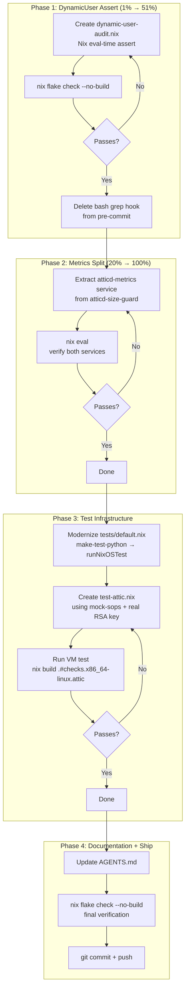

# DynamicUser Assert + Metrics Split + Attic VM Test

> **ARCHIVED (executed or superseded — 2026-08-31 docs-health audit):** frozen snapshot; the live state lives in `TODO_LIST.md` / `FEATURES.md` / `AGENTS.md`.

**Date:** 2026-08-02
**Status:** Planning → Execution

---

## Problem Statement

Three improvements identified during the Attic binary cache review:

1. **Bash-grep DynamicUser check** is fragile — hardcoded service list, string matching, only runs when `sops.nix` is staged
2. **Prometheus metrics coupled to GC trigger** — different failure modes, frequencies, and criticality jammed into one oneshot service
3. **No VM tests** — `nix eval` validates types but not runtime behavior (service startup, health endpoints, DynamicUser storage permissions, CLI subcommands)

## Pareto Breakdown

### The 1% that delivers 51%

**DynamicUser Nix eval-time assert.** One small module (~40 lines) eliminates an entire bug class permanently. Every DynamicUser service — present and future — auto-checked at every eval. The bash grep hook becomes obsolete.

### The 4% that delivers 64%

**DynamicUser assert + Attic VM test.** The VM test directly de-risks the pending deploy by verifying the 5 runtime risks `nix eval` cannot: DynamicUser storage writes, health endpoint, CLI subcommands, Prometheus heredoc indentation, cache creation.

### The 20% that delivers 80%

**All three changes together.** The metrics split is good engineering (decouples failure modes, follows existing textfile collector pattern) but lower urgency — the coupling hasn't caused a failure yet.

### The other 20% to 100%

- Modernize `tests/default.nix` from deprecated `make-test-python.nix` to `pkgs.testers.runNixOSTest`
- Wire `exec-start-paths.nix` awareness into the plan (already built, underused)
- Delete the obsolete bash grep hook
- Document new test infrastructure in AGENTS.md

## Mermaid Execution Graph

## Detailed Task Breakdown

### Phase 1: DynamicUser Eval-Time Assert (30 min)

| #   | Task                                                                                                                                                                                                       | Impact   | Effort | Files                    |
| --- | ---------------------------------------------------------------------------------------------------------------------------------------------------------------------------------------------------------- | -------- | ------ | ------------------------ |
| 1.1 | Create `modules/nixos/services/dynamic-user-audit.nix` — auto-discovered module that cross-references `config.systemd.services` (DynamicUser=true) with `config.sops.secrets` (owner != root) at eval time | Critical | 15 min | `dynamic-user-audit.nix` |
| 1.2 | Verify with `nix flake check --no-build`                                                                                                                                                                   | High     | 2 min  | —                        |
| 1.3 | Delete bash grep DynamicUser check (lines 91-113) from `.githooks/pre-commit`                                                                                                                              | Medium   | 3 min  | `.githooks/pre-commit`   |
| 1.4 | Verify pre-commit still passes without the bash section                                                                                                                                                    | Medium   | 2 min  | —                        |

### Phase 2: Split Prometheus Metrics (20 min)

| #   | Task                                                                                                 | Impact | Effort | Files       |
| --- | ---------------------------------------------------------------------------------------------------- | ------ | ------ | ----------- |
| 2.1 | Extract metrics emission into `atticd-metrics` service (5min timer, 128M, only `du` + write `.prom`) | High   | 10 min | `attic.nix` |
| 2.2 | Slim `atticd-size-guard` to just GC trigger (remove metrics heredoc, remove textfile WritePaths)     | High   | 5 min  | `attic.nix` |
| 2.3 | Verify with `nix eval` — both services exist with correct config                                     | Medium | 3 min  | —           |

### Phase 3: Modernize Test Infrastructure (45 min)

| #   | Task                                                                                                                                                   | Impact   | Effort | Files                  |
| --- | ------------------------------------------------------------------------------------------------------------------------------------------------------ | -------- | ------ | ---------------------- |
| 3.1 | Migrate `tests/default.nix` from `make-test-python.nix` to `pkgs.testers.runNixOSTest`                                                                 | Medium   | 5 min  | `tests/default.nix`    |
| 3.2 | Create `tests/test-attic.nix` — VM test that imports the Attic module + mock-sops, generates a real RSA key, verifies startup + health + metrics + CLI | Critical | 25 min | `tests/test-attic.nix` |
| 3.3 | Run the VM test and iterate until green                                                                                                                | High     | 15 min | —                      |

### Phase 4: Documentation + Ship (15 min)

| #   | Task                                                                          | Impact   | Effort | Files       |
| --- | ----------------------------------------------------------------------------- | -------- | ------ | ----------- |
| 4.1 | Update AGENTS.md — new test infrastructure, DynamicUser assert, metrics split | Medium   | 5 min  | `AGENTS.md` |
| 4.2 | Final `nix flake check --no-build`                                            | High     | 2 min  | —           |
| 4.3 | git commit + push                                                             | Required | 5 min  | —           |

## Risk Assessment (Verschlimmbessern Prevention)

| Risk                                                                                                 | Mitigation                                                                            |
| ---------------------------------------------------------------------------------------------------- | ------------------------------------------------------------------------------------- |
| Assert module breaks standalone nixosModule eval (references `config.sops.secrets` without sops-nix) | Use `builtins.tryEval` to safely handle missing sops option                           |
| Metrics split accidentally breaks GC trigger                                                         | Keep GC logic verbatim, only extract metrics code; verify with `nix eval`             |
| VM test fails due to missing config context (Caddy, domain, etc.)                                    | Provide minimal config: `networking.domain`, mock-sops, activation script for RSA key |
| VM test takes too long (atticd compilation)                                                          | Attic should be cached on cache.nixos.org; use RSA 2048 for test key generation       |
| `runNixOSTest` API differs from `make-test-python.nix`                                               | Same `{ nodes, testScript, name }` shape, just different entry point                  |
