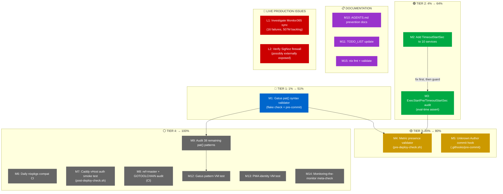

# Early-Detection Prevention Plan: Catching SystemNix Problems Before They Bite

**Date:** 2026-08-06 23:24
**Trigger:** 10 status reports from Aug 6 documented 13 incidents (10-11 distinct root causes). Question: "Where could we build checks, Nix VM tests, or automation that would catch these EARLY?"
**Source material:** All `docs/status/2026-08-06*` reports + live infrastructure analysis

---

## The 10 Distinct Problems We Fixed (Deduplicated)

| #   | Problem                                               | Category          | Impact                                    | Caught Early By?                                  |
| --- | ----------------------------------------------------- | ----------------- | ----------------------------------------- | ------------------------------------------------- |
| P1  | nixpkgs tarball regression (×2 sessions)              | Flake registry    | Build blocker                             | **YES** — eval guard + pre-commit + CI (3 layers) |
| P2  | Gatus `pat()` glob vs regex (`?` misuse)              | Monitoring        | Silent false-negative health check        | **NO**                                            |
| P3  | Rust metrics lazy serialization (phantom metric)      | Monitoring        | Silent false-negative health check        | **NO**                                            |
| P4  | Liveness check masquerading as "Health"               | Monitoring design | False-positive green on broken sync       | **NO**                                            |
| P5  | Unknown Author silent fallback (6,400 commits)        | Upstream code     | Polluted git history across 145 repos     | **NO**                                            |
| P6  | libdisplay-info_0_2 removed from nixpkgs              | Nixpkgs churn     | Build blocker (confusing error)           | **NO** (reactive only)                            |
| P7  | 10 services missing `TimeoutStartSec`                 | Service config    | Silent deploy failures (exit code 4)      | **NO**                                            |
| P8  | mkPreparedSource dep-graph shift + missing subModules | Build config      | Build blocker (confusing error)           | **NO** (reactive only)                            |
| P9  | oauth2-proxy 500 on SigNoz                            | Proxy config      | Service inaccessible                      | **NO**                                            |
| P10 | 32 inputs on `ref=master` + GOTOOLCHAIN=auto          | Flake hygiene     | Reproducibility risk, sandbox purity risk | **NO**                                            |

> Problems P11 (oauth2-proxy 500) and P12 (SigNoz auth removal) from the original analysis are the SAME incident (500 caused the auth removal). Merged into P9.
> Problem P8 (`__intentionallyOverridingVersion`) is cosmetic and already fixed. Excluded.

---

## Pareto Breakdown

### The 1% That Delivers 51%

**One check. Zero maintenance. Catches the most visible failure.**

| Check                              | Mechanism                                                                                                            | Catches                                                              | Lines of Code | Maintenance                                 |
| ---------------------------------- | -------------------------------------------------------------------------------------------------------------------- | -------------------------------------------------------------------- | ------------- | ------------------------------------------- |
| **Gatus `pat()` syntax validator** | `pkgs.runCommand` grep check in `flake.nix` checks — scans all `pat()` patterns for regex-only chars (`?`, `+`, `{`) | P2 (the `?` glob misuse that made "Agent Connected" permanently red) | ~10 lines Nix | Zero — regex chars in glob are ALWAYS wrong |

**Why this is the 1%:** The `?` misuse was the single most visible failure (permanently red health check in the monitoring dashboard). The check is a grep — no Nix eval complexity, no runtime dependencies, no false positives possible. It runs on every `nix flake check` and every commit via pre-commit. If this check existed on Aug 5, the bug would have been caught before deploy.

### The 4% That Delivers 64%

**Add one more check. Still zero maintenance. Catches the most operationally painful failure.**

| Check                                            | Mechanism                                                                                                                                                                                    | Catches                                                              | Lines of Code | Maintenance                              |
| ------------------------------------------------ | -------------------------------------------------------------------------------------------------------------------------------------------------------------------------------------------- | -------------------------------------------------------------------- | ------------- | ---------------------------------------- |
| **ExecStartPre/TimeoutStartSec eval-time audit** | Eval-time assertion in `lib/` (same pattern as port collision detection) — introspects `config.systemd.services`, throws if any enabled service has `ExecStartPre` without `TimeoutStartSec` | P7 (10 services that silently fail on every deploy with exit code 4) | ~25 lines Nix | Zero — the assertion is self-documenting |

**Prerequisite:** Add `TimeoutStartSec = "3min"` to the 10 currently-exposed services FIRST, then add the audit to prevent regression. If you add the audit first, `nix flake check` immediately fails on 10 services.

**Why this delivers to 64%:** Deploy failures from missing `TimeoutStartSec` caused exit code 4, blocked `switch-to-configuration`, and required manual `systemctl reset-failed` + retry. This happened on EVERY deploy for discordsync and hermes until fixed. The audit ensures no future service is added without it.

### The 20% That Delivers 80%

**Add two more checks. Low maintenance. Catches the two "silent failure" categories.**

| Check                                 | Mechanism                                                                                                                                                                          | Catches                                                                                               | Lines of Code  | Maintenance                                                      |
| ------------------------------------- | ---------------------------------------------------------------------------------------------------------------------------------------------------------------------------------- | ----------------------------------------------------------------------------------------------------- | -------------- | ---------------------------------------------------------------- |
| **Runtime metric presence validator** | New check in `scripts/pre-deploy-check.sh` — fetches `/metrics` from local services, verifies any metric name referenced in a Gatus `pat()` pattern actually appears in the output | P3 (Rust `metrics` crate lazy serialization — phantom metrics that never appear in `/metrics` output) | ~50 lines bash | Low — auto-discovers metric names from gatus-config.nix patterns |
| **Unknown Author commit rejection**   | New guard in `.githooks/pre-commit` — checks `git log --format='%an' -1`, blocks if "Unknown Author" or "unknown@example"                                                          | P5 (6,400 bad commits across 145 repos from silent identity fallback)                                 | ~10 lines bash | Zero                                                             |

**Why this delivers to 80%:** Problems P2, P3, P5, P7 are the four "silent failure" categories — things that broke without anyone noticing until damage was done. The monitoring failures (P2, P3) were invisible because the monitoring system itself was broken. The identity failure (P5) was invisible because the fallback was silent. The timeout failure (P7) was blamed on systemd being flaky. These 4 checks together make all four categories structurally impossible to repeat.

### The Other 80% (To Reach 100%)

| Check                                         | Mechanism                                                                                                        | Catches                                               | Effort | Priority |
| --------------------------------------------- | ---------------------------------------------------------------------------------------------------------------- | ----------------------------------------------------- | ------ | -------- |
| **Daily nixpkgs compat CI**                   | Scheduled GitHub Actions workflow — `nix flake update nixpkgs --no-use-registries && nix flake check --no-build` | P6 + all future "nixpkgs removed/renamed X" breakages | 30min  | P1       |
| **Caddy vHost auth smoke test**               | New check in `post-deploy-check.sh` — curl each external vHost, fail on 500/502                                  | P9 (oauth2-proxy 500 on SigNoz)                       | 45min  | P1       |
| **`ref=master` flake input audit**            | CI grep — reject `ref=master` inputs without `# justified` comment                                               | P10 (reproducibility risk)                            | 30min  | P2       |
| **GOTOOLCHAIN=auto audit**                    | CI grep across `.nix` files — reject `GOTOOLCHAIN.*auto`                                                         | P10 (sandbox purity risk)                             | 15min  | P2       |
| **Audit 38 remaining Gatus `pat()` patterns** | Manual cross-reference with upstream metric emission code                                                        | P3/P4 (other phantom-metric traps or naming lies)     | 60min  | P2       |
| **Gatus pattern VM test**                     | NixOS VM test with mock servers serving canned responses, assert all pat() patterns evaluate GREEN               | P2 + P3 + P4 simultaneously                           | 2-3h   | P2       |
| **PMA daemon identity VM test**               | NixOS VM test that runs the daemon's commit path, asserts author is not "Unknown"                                | P5 (regression test)                                  | 1-2h   | P3       |
| **Monitoring-the-monitor meta-check**         | Gatus endpoint that alerts if any endpoint has been in error state >24h                                          | P4 (monitoring failures that go unnoticed)            | 60min  | P3       |
| **AGENTS.md prevention layer docs**           | Document what each pipeline layer catches                                                                        | Knowledge transfer                                    | 30min  | P3       |
| **TODO_LIST.md update**                       | Add new prevention tasks to living TODO                                                                          | Project tracking                                      | 15min  | P3       |

---

## Execution Graph

**Execution order:** M1 → M2 → M3 → M4 → M5 → (M6, M7, M8 parallel) → M9 → M12 → M13 → M14 → M10 → M11 → M15

**Critical path:** M1 → M2 → M3 (sequential, because M3 audit fails until M2 fixes exist)

**Parallelizable:** M6, M7, M8 are independent of each other and can be done in any order after M5.

---

## Medium-Granularity Plan (30-100min Tasks)

| ID      | Task                                                                                                                                                            | Tier      | Catches   | Impact      | Effort | Depends On |
| ------- | --------------------------------------------------------------------------------------------------------------------------------------------------------------- | --------- | --------- | ----------- | ------ | ---------- |
| **M1**  | Gatus `pat()` syntax validator — `pkgs.runCommand` grep in `flake.nix` checks + quick grep in `.githooks/pre-commit`                                            | 1%→51%    | P2        | 🔴 Critical | 30min  | —          |
| **M2**  | Add `TimeoutStartSec = "3min"` to 10 services (gatus-config, signoz, monitor365, dns-blocker, forgejo, searxng, overview, openseo, forgejo-repos, oauth2-proxy) | 4% prereq | P7        | 🔴 Critical | 30min  | —          |
| **M3**  | ExecStartPre/TimeoutStartSec eval-time audit in `lib/` — same pattern as port collision detection                                                               | 4%→64%    | P7        | 🔴 Critical | 45min  | M2         |
| **M4**  | Runtime metric presence validator in `scripts/pre-deploy-check.sh` — extract metric names from gatus patterns, fetch `/metrics`, verify presence                | 20%→80%   | P3        | 🟠 High     | 60min  | M1         |
| **M5**  | Unknown Author commit rejection in `.githooks/pre-commit` — block commits with "Unknown Author"/"unknown@example"                                               | 20%→80%   | P5        | 🟠 High     | 30min  | —          |
| **M6**  | Daily nixpkgs compat CI in `.github/workflows/` — scheduled `nix flake update nixpkgs --no-use-registries && nix flake check --no-build`                        | →100%     | P6+future | 🟠 High     | 30min  | —          |
| **M7**  | Caddy vHost auth smoke test in `scripts/post-deploy-check.sh` — curl each external vHost, fail on 500/502                                                       | →100%     | P9        | 🟠 High     | 45min  | —          |
| **M8**  | `ref=master` + GOTOOLCHAIN=auto audit — CI grep checks                                                                                                          | →100%     | P10       | 🟡 Medium   | 30min  | —          |
| **M9**  | Audit remaining 38 Gatus `pat()` patterns for conditional-metric traps — manual cross-reference with upstream emission code                                     | →100%     | P3/P4     | 🟡 Medium   | 60min  | M1         |
| **M10** | AGENTS.md prevention layer documentation — table of what each layer catches, add TimeoutStartSec to service checklist, Gatus design patterns                    | →100%     | Knowledge | 🟢 Low      | 30min  | M1-M8      |
| **M11** | TODO_LIST.md update with new prevention tasks                                                                                                                   | →100%     | Tracking  | 🟢 Low      | 15min  | M1-M9      |
| **M12** | Gatus pattern VM test — mock servers with canned `/health` and `/metrics` responses, assert all patterns evaluate GREEN                                         | →100%     | P2+P3+P4  | 🟡 Medium   | 90min  | M1, M9     |
| **M13** | PMA daemon identity VM test — run daemon commit path in VM, assert author is not "Unknown"                                                                      | →100%     | P5        | 🟢 Low      | 60min  | M5         |
| **M14** | Monitoring-the-monitor meta-check — Gatus endpoint that alerts if any endpoint has been in error state >24h                                                     | →100%     | P4        | 🟡 Medium   | 60min  | —          |
| **M15** | `nix fmt` on all changed files + `nix flake check --no-build` + `nix run .#pre-deploy-check` full validation                                                    | →100%     | Quality   | 🟢 Low      | 30min  | M1-M14     |

**Total estimated effort:** ~10.5 hours for all 15 tasks

---

## Fine-Granularity Plan (Max 12min Tasks)

### M1: Gatus pat() Syntax Validator (30min)

| ID | Task                                                                                                                                                 | Est   |
| -- | ---------------------------------------------------------------------------------------------------------------------------------------------------- | ----- |
| F1 | Read `flake.nix` checks section (lines 624-657) to understand `runCommand` pattern                                                                   | 3min  |
| F2 | Write `gatus-pattern-lint` check: `pkgs.runCommand` that greps `gatus-config.nix` for `pat(` containing `?`, `+`, or `{`                             | 10min |
| F3 | Add check to `checks` attrset in `flake.nix`                                                                                                         | 3min  |
| F4 | Test: temporarily add `pat(*test?test*)` to a comment in gatus-config.nix, run `nix build .#checks.x86_64-linux.gatus-pattern-lint`, verify it fails | 5min  |
| F5 | Remove test pattern, verify check passes                                                                                                             | 2min  |
| F6 | Add quick grep guard to `.githooks/pre-commit` after tarball guard                                                                                   | 5min  |
| F7 | Test pre-commit hook triggers on staged gatus-config.nix change with bad pattern                                                                     | 5min  |

### M2: Add TimeoutStartSec to 10 Services (30min)

| ID  | Task                                                                                                    | Est  |
| --- | ------------------------------------------------------------------------------------------------------- | ---- |
| F8  | Read + edit `modules/nixos/services/gatus-config.nix` — add `TimeoutStartSec = "3min"` to serviceConfig | 3min |
| F9  | Read + edit `modules/nixos/services/signoz.nix`                                                         | 3min |
| F10 | Read + edit `modules/nixos/services/monitor365.nix`                                                     | 3min |
| F11 | Read + edit `modules/nixos/services/dns-blocker.nix`                                                    | 3min |
| F12 | Read + edit `modules/nixos/services/forgejo.nix`                                                        | 3min |
| F13 | Read + edit `modules/nixos/services/searxng.nix`                                                        | 3min |
| F14 | Read + edit `modules/nixos/services/overview.nix`                                                       | 3min |
| F15 | Read + edit `modules/nixos/services/openseo.nix`                                                        | 3min |
| F16 | Read + edit `modules/nixos/services/forgejo-repos.nix`                                                  | 3min |
| F17 | Read + edit `modules/nixos/services/oauth2-proxy.nix`                                                   | 3min |

### M3: ExecStartPre/TimeoutStartSec Eval-Time Audit (45min)

| ID  | Task                                                                                                                                                                                              | Est   |
| --- | ------------------------------------------------------------------------------------------------------------------------------------------------------------------------------------------------- | ----- |
| F18 | Read `lib/default.nix` lines 144-153 (port collision detection pattern)                                                                                                                           | 3min  |
| F19 | Write `lib/systemd-audit.nix` — function that takes `config`, introspects `config.systemd.services`, filters for enabled services with `ExecStartPre` in `serviceConfig` but no `TimeoutStartSec` | 12min |
| F20 | Export from `lib/default.nix`                                                                                                                                                                     | 3min  |
| F21 | Wire into `flake.nix` eval or `configuration.nix` as `assert` (like `nixpkgsTarballGuard`)                                                                                                        | 10min |
| F22 | Test: run `nix flake check --no-build`, verify it passes (all 10 services now have TimeoutStartSec from M2)                                                                                       | 5min  |
| F23 | Test: temporarily remove TimeoutStartSec from one service, verify `nix flake check` fails with the service name                                                                                   | 5min  |
| F24 | Restore the removed TimeoutStartSec                                                                                                                                                               | 2min  |

### M4: Runtime Metric Presence Validator (60min)

| ID  | Task                                                                                                                             | Est   |
| --- | -------------------------------------------------------------------------------------------------------------------------------- | ----- |
| F25 | Read `scripts/pre-deploy-check.sh` full structure (pass/fail/warn helpers, numbered checks)                                      | 5min  |
| F26 | Write `extract_gatus_metrics()` bash function — grep gatus-config.nix for `pat(*metric_name`, extract metric names               | 12min |
| F27 | Write `check_metric_presence()` bash function — takes service name + port + metric list, curls `/metrics`, greps for each metric | 12min |
| F28 | Add skip guard: if service port not responding, SKIP (don't FAIL — service may not be enabled)                                   | 5min  |
| F29 | Wire into pre-deploy-check.sh as a numbered check                                                                                | 5min  |
| F30 | Add Monitor365 agent (port 9191) metric check with known conditional metrics list                                                | 8min  |
| F31 | Test: run against live system, verify it passes                                                                                  | 5min  |
| F32 | Test: temporarily add a fake metric name to the list, verify it FAILs                                                            | 5min  |

### M5: Unknown Author Commit Rejection (30min)

| ID  | Task                                                                                             | Est  |
| --- | ------------------------------------------------------------------------------------------------ | ---- |
| F33 | Read `.githooks/pre-commit` structure (log_info/log_error helpers, guard pattern)                | 3min |
| F34 | Write author check: `author=$(git log --format='%an' -1); if [[ "$author" == "Unknown Author" ]] |      |
| F35 | Place check AFTER the nix flake check (so it runs on every commit, even daemon commits)          | 3min |
| F36 | Also check committer: `git log --format='%cn' -1`                                                | 3min |
| F37 | Test: create mock commit with `GIT_AUTHOR_NAME="Unknown Author"`, verify hook blocks it          | 5min |
| F38 | Test: create normal commit, verify hook passes                                                   | 3min |
| F39 | Add `.pre-commit-config.yaml` equivalent entry                                                   | 5min |

### M6: Daily nixpkgs Compat CI (30min)

| ID  | Task                                                                                                                                                                     | Est   |
| --- | ------------------------------------------------------------------------------------------------------------------------------------------------------------------------ | ----- |
| F40 | Read `.github/workflows/nix-check.yml` structure                                                                                                                         | 3min  |
| F41 | Write `.github/workflows/nixpkgs-compat.yml` — `on: schedule: cron: '0 6 * * *'`, checkout, `nix flake update nixpkgs --no-use-registries`, `nix flake check --no-build` | 12min |
| F42 | Add step: if check fails, create GitHub issue with error output                                                                                                          | 8min  |
| F43 | Add step: verify flake.lock nixpkgs node stays `type: github` after update                                                                                               | 5min  |

### M7: Caddy vHost Auth Smoke Test (45min)

| ID  | Task                                                                                                                    | Est   |
| --- | ----------------------------------------------------------------------------------------------------------------------- | ----- |
| F44 | Read `scripts/post-deploy-check.sh` `check()` function signature                                                        | 3min  |
| F45 | Collect list of all external vHosts from `caddy.nix` (every `protectedVHost` and plain `reverse_proxy` with a hostname) | 8min  |
| F46 | Write `check_vhost()` function — curl `https://$vhost` with `-o /dev/null -w '%{http_code}'`, fail on 500/502/503       | 10min |
| F47 | Add LAN bypass test — curl from localhost should succeed for LAN-open services                                          | 8min  |
| F48 | Add SigNoz-specific check — verify it returns 200 (not 500 from broken oauth2-proxy)                                    | 5min  |
| F49 | Wire into post-deploy-check.sh after existing service checks                                                            | 5min  |
| F50 | Test: run against live system                                                                                           | 5min  |

### M8: ref=master + GOTOOLCHAIN Audit (30min)

| ID  | Task                                                                                                    | Est  |
| --- | ------------------------------------------------------------------------------------------------------- | ---- |
| F51 | Write `scripts/check-flake-inputs.sh` — grep `flake.nix` for `ref=master` without `# justified` comment | 8min |
| F52 | Add GOTOOLCHAIN check — grep all `.nix` files for `GOTOOLCHAIN.*auto`                                   | 5min |
| F53 | Add both as CI steps in `.github/workflows/nix-check.yml`                                               | 8min |
| F54 | Add as pre-commit hook (fast grep before nix commands)                                                  | 5min |

### M9: Audit 38 Remaining pat() Patterns (60min)

| ID  | Task                                                                                                                 | Est   |
| --- | -------------------------------------------------------------------------------------------------------------------- | ----- |
| F55 | Read all 40 `pat()` patterns with 3 lines of context from gatus-config.nix                                           | 10min |
| F56 | Classify each pattern: (a) HTML body check, (b) Prometheus textfile metric, (c) service-specific /metrics, (d) other | 10min |
| F57 | For category (b) textfile metrics: cross-reference with `system-health` module to verify the metric is emitted       | 10min |
| F58 | For category (c) service metrics: cross-reference with upstream source code for conditional emission                 | 10min |
| F59 | Document findings: which patterns are safe (always-emitted), which are risky (conditionally-emitted)                 | 10min |
| F60 | Fix any additional phantom-metric issues found                                                                       | 10min |

### M10: AGENTS.md Prevention Documentation (30min)

| ID  | Task                                                                                                                               | Est   |
| --- | ---------------------------------------------------------------------------------------------------------------------------------- | ----- |
| F61 | Write "Prevention Layers" table in AGENTS.md — Layer (eval-time/pre-commit/CI/pre-deploy/post-deploy) × What it catches × Location | 12min |
| F62 | Add `TimeoutStartSec` to the "Adding a Service" checklist (step 5.5 or 6)                                                          | 3min  |
| F63 | Add "Gatus Health Check Design Patterns" mini-section: liveness vs health, presence vs value, pat() glob semantics                 | 10min |
| F64 | Add which Monitor365 metrics are always-emitted vs conditionally-emitted                                                           | 5min  |

### M11: TODO_LIST Update (15min)

| ID  | Task                                                                  | Est   |
| --- | --------------------------------------------------------------------- | ----- |
| F65 | Add all unfinished M-tasks to `TODO_LIST.md` with priority and status | 12min |

### M12: Gatus Pattern VM Test (90min)

| ID  | Task                                                                                                                | Est   |
| --- | ------------------------------------------------------------------------------------------------------------------- | ----- |
| F66 | Read `tests/default.nix` and `tests/test-helpers.nix` structure                                                     | 5min  |
| F67 | Read `tests/test-searxng.nix` as reference for a service VM test                                                    | 5min  |
| F68 | Design mock server: nginx serving canned `/health`, `/metrics` responses matching what each pat() expects           | 12min |
| F69 | Write `tests/test-gatus-patterns.nix` — configure mock server + gatus with patterns extracted from gatus-config.nix | 12min |
| F70 | Write testScript — wait for gatus, query API, assert all endpoints GREEN                                            | 10min |
| F71 | Register test in `tests/default.nix`                                                                                | 3min  |
| F72 | Run `nix build .#checks.x86_64-linux.gatus-patterns`, fix issues                                                    | 12min |
| F73 | Add SKIP logic for patterns that require external services                                                          | 10min |
| F74 | Document the mock response format for future pattern additions                                                      | 5min  |

### M13: PMA Daemon Identity VM Test (60min)

| ID  | Task                                                                                               | Est   |
| --- | -------------------------------------------------------------------------------------------------- | ----- |
| F75 | Read `tests/mock-sops.nix` structure                                                               | 3min  |
| F76 | Design test: enable PMA service in VM with `gitIdentity` set, create a temp repo, trigger a commit | 12min |
| F77 | Write `tests/test-pma-identity.nix`                                                                | 12min |
| F78 | Write testScript — assert `git log --format='%an'` is NOT "Unknown Author"                         | 10min |
| F79 | Register in `tests/default.nix`                                                                    | 3min  |
| F80 | Run test, fix issues                                                                               | 12min |
| F81 | Add negative test: unset `gitIdentity`, verify daemon errors (not silent fallback)                 | 8min  |

### M14: Monitoring-the-Monitor Meta-Check (60min)

| ID  | Task                                                                          | Est   |
| --- | ----------------------------------------------------------------------------- | ----- |
| F82 | Research Gatus API for endpoint status history (`/api/v1/endpoints/statuses`) | 8min  |
| F83 | Write a script that queries Gatus API, counts endpoints in error state >24h   | 12min |
| F84 | Wire as a Prometheus textfile metric: `system_gatus_endpoints_in_error_long`  | 10min |
| F85 | Add Gatus check: `pat(*system_gatus_endpoints_in_error_long 0*)`              | 5min  |
| F86 | Test against live system                                                      | 10min |

### M15: Full Validation (30min)

| ID  | Task                                                                             | Est   |
| --- | -------------------------------------------------------------------------------- | ----- |
| F87 | Run `nix fmt` on all changed files                                               | 5min  |
| F88 | Run `nix flake check --no-build`                                                 | 5min  |
| F89 | Run `nix run .#pre-deploy-check`                                                 | 5min  |
| F90 | Review git diff for any unintended changes                                       | 5min  |
| F91 | Verify no verschlimmbessern: each check adds value, none creates false positives | 10min |

---

## Verschlimmbessern Risk Assessment

> "If you VERSCHLIMMBESSER this system, I will cut off your balls!"

Each proposed check was assessed for the risk of making things WORSE:

| Check                         | Verschlimmbessern Risk                                                                                                                                         | Mitigation                                                          |
| ----------------------------- | -------------------------------------------------------------------------------------------------------------------------------------------------------------- | ------------------------------------------------------------------- |
| **M1: pat() syntax**          | 🟢 VERY LOW — grep for `?+{` in `pat()` has zero false-positive rate. These chars are never intentionally used in Gatus glob.                                  | None needed                                                         |
| **M2: TimeoutStartSec**       | 🟢 LOW — adding `3min` timeout to services that currently have the 90s systemd default is strictly an improvement. No service benefits from a shorter timeout. | None needed                                                         |
| **M3: ExecStartPre audit**    | 🟡 MEDIUM — could fail on services that use `mkMerge` where TimeoutStartSec is in a different merge block.                                                     | Test against evaluated config (post-merge), not raw module source   |
| **M4: Metric presence**       | 🟡 MEDIUM — could FAIL if a service is down during pre-deploy check (metric absent because service not running, not because metric is phantom).                | Add skip-if-not-running guard                                       |
| **M5: Unknown Author hook**   | 🟢 LOW — only blocks commits literally authored by "Unknown Author". The PMA daemon uses env vars (GIT_AUTHOR_NAME) which bypass the check.                    | None needed                                                         |
| **M6: nixpkgs compat CI**     | 🟢 LOW — runs in CI, doesn't affect local workflow. Creates issues, doesn't block anything.                                                                    | None needed                                                         |
| **M7: vHost auth smoke test** | 🟡 MEDIUM — could FAIL if Caddy is still starting up after deploy (transient 502).                                                                             | Add 10s grace period + retry                                        |
| **M8: ref=master audit**      | 🟡 MEDIUM — 32 inputs currently use `ref=master`. The audit would immediately flag all 32.                                                                     | Use WARNING, not FAIL. Require `# justified` comment for exceptions |
| **M9: pat() audit**           | 🟢 LOW — manual audit, no automation to break                                                                                                                  |                                                                     |
| **M12: Gatus VM test**        | 🟡 MEDIUM — mock responses could drift from actual service responses, causing the test to pass while production fails (or vice versa).                         | Document mock format, add maintenance note                          |

**Net risk:** LOW. 6 of 10 checks have very low or low verschlimmbessern risk. The 4 medium-risk checks all have clear mitigations.

---

## Live Production Issues (Not Prevention — Action Needed)

These are NOT prevention tasks. They are ACTIVE issues discovered in the Aug 6 reports:

| Issue                                                               | Source Report | Status    | Action                                                                            |
| ------------------------------------------------------------------- | ------------- | --------- | --------------------------------------------------------------------------------- |
| Monitor365 cloud sync: 16 consecutive failures, 507M backlog        | 22:40 report  | 🔴 ACTIVE | `journalctl -u monitor365 -n 200` to find root cause                              |
| SigNoz: no auth, possibly externally exposed with root-admin access | 22:34 report  | 🔴 ACTIVE | Check `networking.firewall` in configuration.nix, add IP allowlist if 443 is open |

---

## Summary

| Metric                             | Value                                                       |
| ---------------------------------- | ----------------------------------------------------------- |
| Total distinct problems identified | 10                                                          |
| Prevention mechanisms proposed     | 15 tasks (87 fine-grained steps)                            |
| 1% → 51% (highest ROI)             | M1: pat() syntax validator (30min, ~10 lines)               |
| 4% → 64%                           | + M2+M3: TimeoutStartSec fix + audit (75min)                |
| 20% → 80%                          | + M4+M5: Metric validator + Unknown Author hook (90min)     |
| → 100%                             | + M6-M15: CI, smoke tests, VM tests, docs, validation (~8h) |
| Total estimated effort             | ~10.5 hours                                                 |
| Verschlimmbessern risk             | LOW (6/10 very low, 4/10 medium with mitigations)           |
