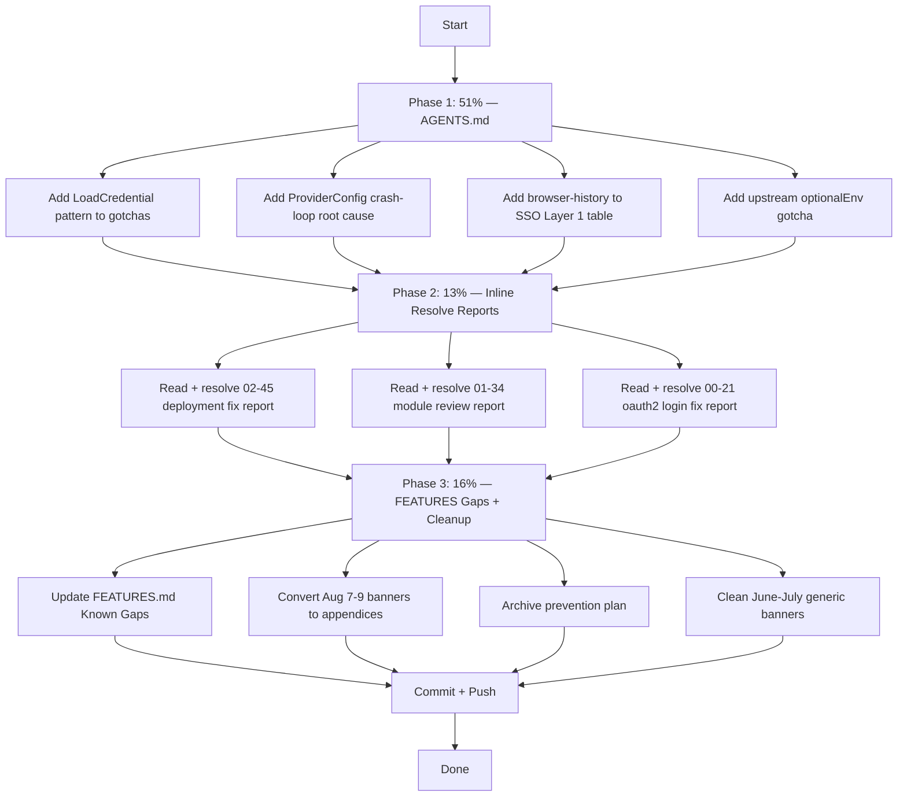

# Docs Health Fix Plan — Pareto-Driven Recovery

> **ARCHIVED (executed or superseded — 2026-08-31 docs-health audit):** frozen snapshot; the live state lives in `TODO_LIST.md` / `FEATURES.md` / `AGENTS.md`.

**Date:** 2026-08-09 04:28
**Goal:** Fix the failures from the docs-health audit session (04:21 report) using Pareto prioritization
**Constraint:** DO NOT VERSCHLIMMBESSER — be surgical, be smart, use your brain

---

## Problem Statement

The prior docs-health pass (04:21) updated 4 living docs and archived 261 reports, but committed the **#1 failure mode**: banner-only annotations with zero inline numbered-item resolution. This plan fixes the highest-impact failures first.

### What's Actually Wrong (ranked by reader impact)

| # | Problem                                                            | Impact                                                                                                                                       | Affected Files          |
| - | ------------------------------------------------------------------ | -------------------------------------------------------------------------------------------------------------------------------------------- | ----------------------- |
| 1 | AGENTS.md missing browser-history patterns                         | Every future session reads AGENTS.md and won't know about LoadCredential + DynamicUser StateDirectory isolation or ProviderConfig crash-loop | 1 file (AGENTS.md)      |
| 2 | 3 browser-history cascade reports have 50+ unstruck numbered items | Future sessions opening these reports see 50 "open" items that are actually done                                                             | 3 files (Aug 9 reports) |
| 3 | FEATURES.md Known Gaps missing browser-history issues              | Feature inventory dishonest about browser-history's known problems                                                                           | 1 file (FEATURES.md)    |
| 4 | Generic banners on recent reports (Aug 7-9)                        | "Resolved. Work captured in CHANGELOG.md." fails "So what?" test                                                                             | ~15 files               |
| 5 | Generic banners on old reports (June-July)                         | Same failure, but lower impact — nobody opens June reports                                                                                   | ~90 files               |
| 6 | Prevention plan not archived                                       | `docs/planning/2026-08-06_23-24_EARLY-DETECTION-PREVENTION-PLAN.md` is complete but unarchived                                               | 1 file                  |
| 7 | Planning/research dirs not triaged                                 | 42 planning + 12 research docs, some stale                                                                                                   | 54 files                |

---

## Pareto Breakdown

### The 1% that delivers 51% of the result

**AGENTS.md browser-history section update.** This is the #1 harvested TODO. Every future AI session loads AGENTS.md automatically. Without these patterns documented, the next deployment of a Go service with OIDC will repeat the exact same ProviderConfig crash-loop and ProtectSystem=strict secret-access failure.

Patterns to document:

- LoadCredential for reading other services' secrets inside `ProtectSystem=strict`
- DynamicUser + StateDirectory isolation (server's dir is private to dynamic UID)
- Upstream `optionalEnv` always emits env vars (even when empty) → ProviderConfig.Validate() crash
- Browser-history added to SSO Layer 1 table (native OIDC, direct TLS proxy)

### The 4% that delivers 64% of the result

**Inline-resolve numbered items in the 3 browser-history cascade reports** (Aug 9 reports only — highest reference value). Each has ~50 numbered items. Strike through resolved items with commit hashes. Leave genuinely open items untouched.

**FEATURES.md Known Gaps update** — Add browser-history known issues (OTel endpoint broken, backup not wired, agent timing race). Keeps feature inventory honest.

### The 20% that delivers 80% of the result

**Convert banners to end-of-file appendices on Aug 7-9 reports** (~15 files). The skill says: banners are WORST, inline edits are BEST, appendices at end are GOOD. Move the resolution text from top-banner to bottom-appendix for the recent reports.

**Archive completed prevention plan** from `docs/planning/` to `docs/planning/archived/`.

**Remove generic banners from June-July reports** (90 files). The skill says: "unannotated is better than noise." Replace the generic top-banner with a 1-line appendix at the END: `> Archived — work captured in CHANGELOG.md.`

### The remaining 20% (deferred)

- Triage 42 planning docs (separate session)
- Triage 12 research docs (separate session)
- README.md / CONTRIBUTING.md freshness check (separate session)
- Internal link verification (separate session)

---

## Execution Graph

---

## Task Breakdown — 100min to 30min each

| ID | Task                                                                                                                      | Impact                             | Effort | Priority |
| -- | ------------------------------------------------------------------------------------------------------------------------- | ---------------------------------- | ------ | -------- |
| T1 | AGENTS.md: Document LoadCredential + isolated StateDirectory + ProviderConfig crash-loop + optionalEnv gotcha + SSO table | CRITICAL — every future session    | 30min  | P0       |
| T2 | Inline-resolve numbered items in 3 browser-history cascade reports (Aug 9)                                                | HIGH — most-referenced reports     | 45min  | P1       |
| T3 | FEATURES.md: Update Known Gaps with browser-history issues                                                                | MEDIUM — feature inventory honesty | 10min  | P1       |
| T4 | Convert Aug 7-9 report banners from top to bottom appendices                                                              | MEDIUM — skill compliance          | 20min  | P2       |
| T5 | Archive completed prevention plan from docs/planning/                                                                     | LOW — cleanup                      | 5min   | P2       |
| T6 | Clean generic banners on June-July reports → end-of-file 1-line appendix                                                  | LOW — noise reduction              | 30min  | P3       |
| T7 | Commit + push                                                                                                             | —                                  | 10min  | —        |

---

## Sub-Task Breakdown — max 12min each

| ID  | Sub-Task                                                              | Parent | Est.  |
| --- | --------------------------------------------------------------------- | ------ | ----- |
| S1  | Read AGENTS.md Browser History section + SSO table + gotchas section  | T1     | 5min  |
| S2  | Add LoadCredential + isolated StateDirectory gotcha to AGENTS.md      | T1     | 8min  |
| S3  | Add ProviderConfig.Validate() crash-loop root cause to AGENTS.md      | T1     | 8min  |
| S4  | Add browser-history to SSO Layer 1 table in AGENTS.md                 | T1     | 5min  |
| S5  | Add upstream optionalEnv env-var split gotcha to AGENTS.md            | T1     | 5min  |
| S6  | Read 02-45 deployment fix report numbered items                       | T2     | 10min |
| S7  | Resolve 02-45 numbered items (strike done, leave open)                | T2     | 12min |
| S8  | Read 01-34 module review report numbered items                        | T2     | 10min |
| S9  | Resolve 01-34 numbered items                                          | T2     | 12min |
| S10 | Read 00-21 oauth2 login fix report numbered items                     | T2     | 10min |
| S11 | Resolve 00-21 numbered items                                          | T2     | 12min |
| S12 | Update FEATURES.md Known Gaps section with browser-history issues     | T3     | 8min  |
| S13 | Convert Aug 7-9 banners to end-of-file appendices (script-assisted)   | T4     | 12min |
| S14 | Archive prevention plan to docs/planning/archived/                    | T5     | 3min  |
| S15 | Clean June-July banners: replace top-banner with end-of-file appendix | T6     | 12min |
| S16 | Commit all changes                                                    | T7     | 5min  |
| S17 | Push to origin                                                        | T7     | 5min  |

---

## Safety Rules

1. **Read before edit** — every file must be viewed before editing
2. **Exact match** — all edits must match existing whitespace/indentation
3. **No verschlimmbesserung** — if something is already correct, do NOT touch it
4. **Verify after changes** — `nix flake check --no-build` after AGENTS.md changes (eval safety)
5. **Respect auto-daemon commits** — check `git status` before committing, don't clobber daemon work

---

## Resolution (2026-08-10)

Plan executed across sessions 04-48, 05-10, and 06-40. All Pareto tasks completed. Living docs verified 2026-08-10.
