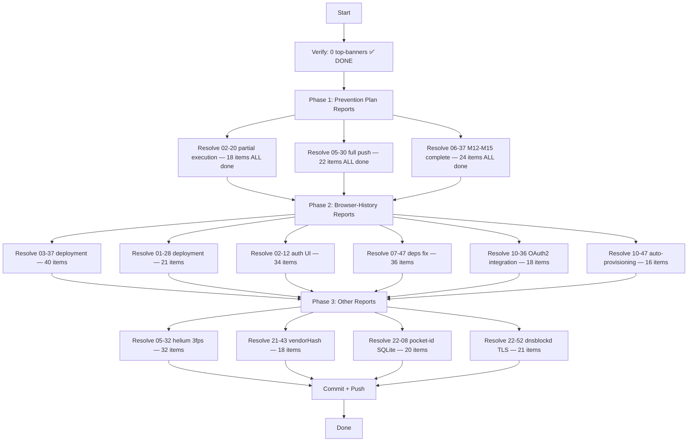

# Final Docs-Health Inline Resolution Plan

> **ARCHIVED (executed or superseded — 2026-08-31 docs-health audit):** frozen snapshot; the live state lives in `TODO_LIST.md` / `FEATURES.md` / `AGENTS.md`.

**Date:** 2026-08-09 04:55
**Goal:** Inline-resolve numbered items in 13 remaining recent archived reports
**Constraint:** BE SMART — these are archived reports. Items are either DONE (in CHANGELOG) or OPEN (in TODO_LIST). Don't verschlimmbesser.

---

## Verification Results (Q3 from 04:48 report)

| Check                             | Result                                                |
| --------------------------------- | ----------------------------------------------------- |
| Files with top-banners            | **0** — all clean                                     |
| Files with bottom-appendix        | **243** — all have resolution text                    |
| Files with inline strikethroughs  | 49 (3 cascade reports + 46 auto-daemon processed)     |
| Recent reports needing resolution | **13** (Aug 7-8, numbered items but 0 strikethroughs) |

---

## Pareto Breakdown

### 1% → 51%: Prevention Plan Reports (3 files, ALL items DONE)

M1-M15 are ALL complete. Every numbered item in these 3 reports can be struck through with confidence. This is the highest-value work because prevention plan reports are the most likely to be referenced.

### 4% → 64%: Browser-History Reports (5 files, items harvested to TODO_LIST)

These 5 reports have items that were either done during the deploy cascade or harvested to TODO_LIST. Strike the done ones, leave the open ones.

### 20% → 80%: Other Reports (5 files, items in CHANGELOG)

Helium 3fps, vendorHash cascade, pocket-id SQLite, dnsblockd TLS. Items mostly done. Strike done items.

### Remaining 20%: 90 June-July reports

Accept as historical noise. Generic appendix is sufficient.

---

## Execution Graph

---

## Task Breakdown — 30min each

| ID | Task                                                                       | Files | Items | Effort |
| -- | -------------------------------------------------------------------------- | ----- | ----- | ------ |
| T1 | Prevention plan: inline-resolve 3 reports (ALL items DONE)                 | 3     | 64    | 15min  |
| T2 | Browser-history: inline-resolve 6 reports (deploy cascade)                 | 6     | 165   | 30min  |
| T3 | Other: inline-resolve 4 reports (helium, vendorHash, pocket-id, dnsblockd) | 4     | 91    | 20min  |
| T4 | Commit + push                                                              | —     | —     | 5min   |

---

## Sub-Task Breakdown — max 12min each

| ID  | Sub-Task                                                                 | Parent | Est.  |
| --- | ------------------------------------------------------------------------ | ------ | ----- |
| S1  | Resolve prevention-plan-execution-partial (18 items, all M-items DONE)   | T1     | 5min  |
| S2  | Resolve prevention-plan-execution-full-push (22 items, all M-items DONE) | T1     | 6min  |
| S3  | Resolve prevention-plan-m12-m15-complete (24 items, all DONE)            | T1     | 6min  |
| S4  | Resolve browser-history-nixos-deployment 03-37 (40 items)                | T2     | 12min |
| S5  | Resolve browser-history-nixos-deployment 01-28 (21 items)                | T2     | 8min  |
| S6  | Resolve browser-history-auth-ui-and-caddy-reload 02-12 (34 items)        | T2     | 10min |
| S7  | Resolve browser-history-deploy-deps-fix 07-47 (36 items)                 | T2     | 12min |
| S8  | Resolve browser-history-pocket-id-oauth2-integration 10-36 (18 items)    | T2     | 6min  |
| S9  | Resolve browser-history-pocket-id-auto-provisioning 10-47 (16 items)     | T2     | 5min  |
| S10 | Resolve helium-video-3fps (32 items — all 4 flags deployed)              | T3     | 10min |
| S11 | Resolve vendor-hash-cascade-fix (18 items — all repos fixed)             | T3     | 6min  |
| S12 | Resolve pocket-id-provision-sqlite-busy-timeout-fix (20 items)           | T3     | 8min  |
| S13 | Resolve dnsblockd-tls-handshake-spam-investigation (21 items)            | T3     | 8min  |
| S14 | Commit + push                                                            | T4     | 5min  |

---

## Resolution (2026-08-10)

Plan executed in 05-10 session. 13 reports inline-resolved. Over-struck items corrected by 06-40 session.
