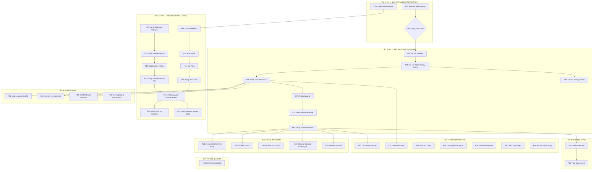

# SystemNix Pareto Execution Plan — 2026-08-10

**Date:** 2026-08-10 13:53
**Trigger:** User requested Pareto breakdown (1%/4%/20%) with comprehensive task plan
**Input:** `TODO_LIST.md` (92 open items across 8 priorities) + self-review findings

---

## Pareto Breakdown

### The 1% that delivers 51% of the result

**PUSH TO REMOTE.** One command: `git push origin master`.

The system has **zero off-site backup**. There are 9+ local-only commits on `master`. If the NVMe fails (58 unsafe shutdowns, QLC NAND, daily BTRFS CoW churn), **all work since the last push is gone**. This has been flagged as the #1 data loss risk since 2026-06-25. The Aug 3 corruption event (13 files lost) proved the NVMe is not theoretical risk.

### The 4% that delivers 64% of the result

**Push + Deploy + Reboot.**

- **Push** — prevents data loss (above)
- **Deploy** (`nix run .#deploy`) — activates ALL accumulated work: BFQ I/O priority tiers (prevents WDT crashes), PMA cgroup limits (prevents death-loop), 60 script bug fixes, ioTier mkMerge fix, Chromium 151, GOMEMLIMIT on 6 services, post-deploy check hardening. Nothing is real until deployed.
- **Reboot** — activates the nixpkgs system registry override that prevents the recurring tarball lock regression. Without reboot, `nix flake update` will re-introduce the tarball lock on the next run.

### The 20% that delivers 80% of the result

**Push + Deploy + Reboot + PMA upstream fix + browser-history upstream fix.**

Adds two upstream code fixes that stop active crash-loops at their root cause:

- **PMA** — `isNothingToCommit()` TOCTOU fix prevents unnecessary cooldown cycles
- **browser-history** — `ClientSecret != ""` guard prevents OAuth2 crash-loop (exit 69)

Both are sitting in working trees uncommitted. Commit → push → tag → bump flake → redeploy.

### The remaining 20% (to get to 100%)

Everything else: off-site backup, BTRFS scrub, ZFS pool decision, monitoring fixes (SigNoz dashboards, phantom metrics, memory.events), code quality (CI fixes, ruff, dead code), documentation freshness, upstream contributions.

---

## Medium Granularity Plan (27 tasks, 10-100 min each)

> Sorted by impact (customer value + risk prevention) then effort.

| ID  | Task                                                                                                                                | Impact                                                        | Effort  | Dependencies |
| --- | ----------------------------------------------------------------------------------------------------------------------------------- | ------------------------------------------------------------- | ------- | ------------ |
| T01 | **Push unpushed commits** — `git push origin master` + push PMA upstream                                                            | CRITICAL — prevents catastrophic data loss                    | 5 min   | None         |
| T02 | **Deploy pending changes** — `nix run .#deploy` then `nix run .#post-deploy-check`                                                  | CRITICAL — activates all accumulated work from 7+ sessions    | 30 min  | T01          |
| T03 | **Reboot evo-x2** — activates registry override, purges Hyprland                                                                    | HIGH — prevents recurring tarball regression                  | 30 min  | T02          |
| T04 | **Commit/push PMA upstream fix + bump flake** — `isNothingToCommit()` in PMA repo → SystemNix flake bump                            | HIGH — fixes death-loop root cause                            | 30 min  | None         |
| T05 | **Commit/push browser-history OAuth2 fix + bump flake** — `ClientSecret != ""` guard → tag → flake bump                             | HIGH — fixes OAuth2 crash-loop                                | 45 min  | None         |
| T06 | **Off-site backup setup** — Hetzner StorageBox + BorgBackup or restic                                                               | CRITICAL — #1 data loss risk                                  | 100 min | T01          |
| T07 | **BTRFS scrub on `/`** — `sudo btrfs scrub start -B /` (foreground)                                                                 | HIGH — root FS never scrubbed, same NVMe as corrupted `/data` | 100 min | T03          |
| T08 | **Add CHANGELOG entry for ioTier fix** — `### Changed`: 4 services `//` → `mkMerge`                                                 | LOW — release hygiene                                         | 10 min  | None         |
| T09 | **Twenty CRM PG role fix** — `CREATE ROLE twenty` + grant permissions                                                               | MEDIUM — app down since deploy                                | 45 min  | T02          |
| T10 | **Native ZFS on kernel 7.1 test** — `boot.supportedFilesystems = [ "zfs" ]` + eval                                                  | MEDIUM — could eliminate entire VM strategy                   | 30 min  | T03          |
| T11 | **ZFS pool data assessment + fate decision** — `zfs list -r datapool`, decide keep/reformat/dismiss                                 | MEDIUM — 14.5TB pool sitting idle                             | 30 min  | T10          |
| T12 | **Fix CI port check false-positives** — tighten or remove regex in nix-check.yml                                                    | MEDIUM — 25 false positives cause alert fatigue               | 30 min  | None         |
| T13 | **Fix port-uniqueness VM test quoting** — `''${}` escaping in testScript                                                            | MEDIUM — test may not run correctly                           | 30 min  | None         |
| T14 | **node_exporter textfile phantom metrics** — root-cause 14 missing metrics                                                          | MEDIUM — 14 Gatus checks permanently RED                      | 60 min  | T02          |
| T15 | **Convert raw I/O literals to ioTier.\*** — boot.nix (5), security-hardening.nix (1)                                                | LOW — consistency, not functional                             | 30 min  | None         |
| T16 | **Add GOMEMLIMIT to remaining Go services** — attic, file-and-image-renamer, crush-daily                                            | LOW — proactive OOM prevention                                | 30 min  | None         |
| T17 | **Verify crush-daily-backfill.py SQL** — check INSERT against actual CREATE TABLE                                                   | MEDIUM — data loss risk if schema wrong                       | 30 min  | None         |
| T18 | **memory.events metric + Gatus alert** — scrape `/sys/fs/cgroup/.../memory.events`                                                  | MEDIUM — early death-loop detection                           | 60 min  | T02          |
| T19 | **ClickHouse backup** — `BACKUP DATABASE signoz TO Disk(...)`                                                                       | MEDIUM — before next SigNoz upgrade                           | 15 min  | T02          |
| T20 | **Browser-history VM test** — `tests/browser-history.nix`                                                                           | LOW — test coverage                                           | 60 min  | T13          |
| T21 | **Thread flake inputs through tests/default.nix** — enables upstream module VM tests                                                | LOW — test infrastructure                                     | 30 min  | None         |
| T22 | **Code cleanup batch** — delete nvme-metrics.sh, decide niri-health.sh, add ruff pre-commit, deploy.sh retention, dms runtimeInputs | LOW — debt reduction                                          | 60 min  | None         |
| T23 | **GOMEMLIMIT runtime validation** — verify 6 values effective after deploy                                                          | LOW — validation                                              | 30 min  | T02          |
| T24 | **Caddy reload root-cause fix** — `PrivateTmp=lib.mkForce false` or restartTriggers                                                 | MEDIUM — affects every deploy                                 | 60 min  | None         |
| T25 | **README.md + CONTRIBUTING.md freshness** — check stale references                                                                  | LOW — doc hygiene                                             | 30 min  | None         |
| T26 | **Attic cache + CI token** — `attic cache create` + `atticadm make-token`                                                           | LOW — build acceleration                                      | 30 min  | T02          |
| T27 | **Smart monitoring for external drives** — `smartctl -a /dev/sda /dev/sdb` + Gatus alert                                            | LOW — hardware monitoring                                     | 30 min  | T11          |

**Total estimated time:** ~20 hours (3 full days)

---

## Fine Granularity Plan (max 12 min each)

> Each task is independently actionable. Sorted by impact within each tier.

### Tier 1: The 1% (51% of result)

| ID  | Task                                                                                    | Effort |
| --- | --------------------------------------------------------------------------------------- | ------ |
| F01 | `git push origin master` — push all local commits to GitHub                             | 2 min  |
| F02 | Verify push succeeded — `git log origin/master..master` should be empty                 | 1 min  |
| F03 | Push PMA upstream — `cd /home/lars/projects/projects-management-automation && git push` | 3 min  |

### Tier 2: The 4% (64% of result)

| ID  | Task                                                                                         | Effort           |
| --- | -------------------------------------------------------------------------------------------- | ---------------- |
| F04 | Run deploy — `nix run .#deploy`                                                              | 10 min           |
| F05 | Run post-deploy check — `nix run .#post-deploy-check`                                        | 5 min            |
| F06 | Verify critical services running — `systemctl is-active caddy forgejo pocket-id dnsblockd`   | 2 min            |
| F07 | Verify I/O pressure check in post-deploy output                                              | 1 min            |
| F08 | Verify ioTier assignments — `nix run .#verify-io-tiers`                                      | 5 min            |
| F09 | Reboot — `sudo systemctl reboot`                                                             | 2 min + downtime |
| F10 | Post-reboot: verify registry override — `nix registry list \| grep nixpkgs`                  | 2 min            |
| F11 | Post-reboot: verify no tarball entries — `nix registry list \| grep tarball` should be empty | 2 min            |
| F12 | Post-reboot: verify all services came back — `systemctl --failed` should be empty            | 2 min            |

### Tier 3: The 20% (80% of result)

| ID  | Task                                                                                                                                                                  | Effort |
| --- | --------------------------------------------------------------------------------------------------------------------------------------------------------------------- | ------ |
| F13 | Commit PMA fix — `cd /home/lars/projects/projects-management-automation && git add -A && git commit -m "fix: treat TOCTOU clean working tree as skipped, not failed"` | 5 min  |
| F14 | Push PMA — `git push origin main`                                                                                                                                     | 2 min  |
| F15 | Tag PMA — `git tag v0.X.Y && git push --tags`                                                                                                                         | 3 min  |
| F16 | Bump PMA flake input — `GIT_CONFIG_GLOBAL=/dev/null nix flake lock --update-input projects-management-automation`                                                     | 5 min  |
| F17 | Commit browser-history fix — `cd /home/lars/projects/browser-history && git add -A && git commit -m "fix: guard OAuth2 provider creation against empty ClientSecret"` | 5 min  |
| F18 | Push browser-history — `git push origin main`                                                                                                                         | 2 min  |
| F19 | Tag browser-history — `git tag v0.X.Y && git push --tags`                                                                                                             | 3 min  |
| F20 | Bump browser-history flake input — `nix flake lock --update-input browser-history`                                                                                    | 5 min  |
| F21 | Redeploy with bumped flakes — `nix run .#deploy`                                                                                                                      | 10 min |
| F22 | Verify PMA not in cooldown loop — `journalctl -u projects-management-automation --since -5min \| grep cooldown`                                                       | 2 min  |
| F23 | Verify browser-history not crash-looping — `systemctl status browser-history` NRestarts should be 0                                                                   | 2 min  |

### Tier 4: Data Integrity (remaining 20%)

| ID  | Task                                                                                         | Effort              |
| --- | -------------------------------------------------------------------------------------------- | ------------------- |
| F24 | Add CHANGELOG entry for ioTier fix                                                           | 5 min               |
| F25 | BTRFS scrub — `sudo btrfs scrub start -B /`                                                  | 5 min + 90 min wait |
| F26 | BTRFS scrub `/data` — `sudo btrfs scrub start -B /data`                                      | 5 min + 90 min wait |
| F27 | Clean orphaned dnsblockd tracking DB — `sudo trash /var/lib/dnsblockd/dnsblockd_tracking.db` | 2 min               |
| F28 | Reduce `/data` fill — `docker system prune -a --volumes` (review first)                      | 10 min              |
| F29 | Smart monitoring — `sudo smartctl -a /dev/sda` and `/dev/sdb`                                | 5 min               |

### Tier 5: Infrastructure Fixes

| ID  | Task                                                                                                                         | Effort |
| --- | ---------------------------------------------------------------------------------------------------------------------------- | ------ |
| F30 | ClickHouse backup — `clickhouse-client -q "BACKUP DATABASE signoz TO Disk('backups', 'pre-signoz-main-upgrade.zip')"`        | 10 min |
| F31 | Twenty CRM PG role — `sudo -u postgres createuser twenty && sudo -u postgres psql -c "GRANT ALL ON SCHEMA public TO twenty"` | 10 min |
| F32 | Verify Twenty after PG fix — `docker logs twenty-server` should show no FATAL                                                | 3 min  |
| F33 | Pocket ID provision: add `--retry 3 --retry-delay 2` to `api_get` curl calls                                                 | 10 min |
| F34 | Caddy reload: add `PrivateTmp = lib.mkForce false` to Caddy serviceConfig                                                    | 10 min |
| F35 | Verify Caddy reload works — `sudo systemctl reload caddy` should succeed                                                     | 2 min  |
| F36 | Thread flake inputs: add `inputs` parameter to `tests/default.nix`                                                           | 10 min |
| F37 | Fix CI port check: tighten regex to `ports\.` prefix or remove                                                               | 10 min |
| F38 | Fix port-uniqueness VM test: rewrite testScript string escaping                                                              | 12 min |
| F39 | Run port-uniqueness VM test — `nix build .#checks.x86_64-linux.port-uniqueness`                                              | 10 min |
| F40 | Attic cache create — `attic cache create monitor365`                                                                         | 5 min  |
| F41 | Attic CI token — `atticadm make-token --sub ci --validity 1y --push monitor365 --pull monitor365`                            | 5 min  |
| F42 | Configure Forgejo runner to use Attic cache                                                                                  | 10 min |

### Tier 6: Monitoring

| ID  | Task                                                                                                                         | Effort |
| --- | ---------------------------------------------------------------------------------------------------------------------------- | ------ |
| F43 | Investigate node_exporter textfile: check collector flags — `systemctl cat node_exporter \| grep collector.textfile`         | 10 min |
| F44 | Check textfile directory permissions — `ls -la /var/cache/prometheus-node-exporter/`                                         | 5 min  |
| F45 | Check if metrics in `.prom` file are valid format — `cat /var/cache/prometheus-node-exporter/system_health.prom \| head -20` | 5 min  |
| F46 | Add memory.events textfile metric to system-health collector                                                                 | 12 min |
| F47 | Add Gatus alert for memory.events max counter                                                                                | 10 min |
| F48 | GOMEMLIMIT runtime validation: check Go GC stats for 6 services                                                              | 12 min |
| F49 | SigNoz dashboard v2: read Perses v2 schema docs                                                                              | 12 min |
| F50 | SigNoz dashboard v2: rewrite `signoz-overview.json`                                                                          | 12 min |
| F51 | SigNoz dashboard v2: rewrite `gpu.json`                                                                                      | 12 min |
| F52 | SigNoz dashboard v2: rewrite `dns.json`                                                                                      | 10 min |
| F53 | SigNoz dashboard v2: rewrite `docker.json`                                                                                   | 10 min |
| F54 | SigNoz dashboard v2: rewrite `caddy.json`                                                                                    | 10 min |
| F55 | Verify dashboard provisioning POSTs return 200 — `journalctl -u signoz-provision`                                            | 5 min  |

### Tier 7: Code Quality

| ID  | Task                                                                                | Effort |
| --- | ----------------------------------------------------------------------------------- | ------ |
| F56 | Delete dead `scripts/nvme-metrics.sh`                                               | 2 min  |
| F57 | Decide on `niri-health.sh` — delete or wire to systemd timer                        | 10 min |
| F58 | Add `ruff check scripts/*.py` to `.githooks/pre-commit`                             | 5 min  |
| F59 | Fix `test-home-manager.sh` TESTS_TOTAL inflation — audit 20+ increment sites        | 12 min |
| F60 | Verify crush-daily-backfill.py SQL — read actual CREATE TABLE in crush-daily source | 12 min |
| F61 | Add GOMEMLIMIT to attic service config                                              | 5 min  |
| F62 | Add GOMEMLIMIT to file-and-image-renamer service config                             | 5 min  |
| F63 | Add GOMEMLIMIT to crush-daily service config                                        | 5 min  |
| F64 | Convert boot.nix sshd to `ioTier.interactive`                                       | 5 min  |
| F65 | Convert boot.nix niri/dms/pipewire to `ioTier.desktop`                              | 5 min  |
| F66 | Convert boot.nix fstrim to `ioTier.maintenance`                                     | 3 min  |
| F67 | Convert security-hardening.nix clamav to `ioTier.maintenance`                       | 3 min  |
| F68 | Deploy.sh backup retention — add cleanup of `.bak` files older than 3 deploys       | 10 min |
| F69 | Add `dms` to `dms-wallpaper-init` runtimeInputs                                     | 5 min  |
| F70 | Add `GOTOOLCHAIN=local` to all Go devShells                                         | 10 min |

### Tier 8: Test Coverage

| ID  | Task                                                                            | Effort |
| --- | ------------------------------------------------------------------------------- | ------ |
| F71 | Create `tests/browser-history.nix` — service starts, `/health` returns 200      | 12 min |
| F72 | Register browser-history test in `tests/default.nix`                            | 3 min  |
| F73 | Run browser-history VM test — `nix build .#checks.x86_64-linux.browser-history` | 10 min |
| F74 | Add CI workflow for VM tests — add to `nix-check.yml`                           | 10 min |
| F75 | Add CI: run `shellcheck --severity=error scripts/*.sh`                          | 5 min  |

### Tier 9: Documentation

| ID  | Task                                                        | Effort |
| --- | ----------------------------------------------------------- | ------ |
| F76 | Check README.md for stale references to removed services    | 10 min |
| F77 | Check docs/CONTRIBUTING.md freshness                        | 10 min |
| F78 | Verify docs/DOMAIN_LANGUAGE.md exists                       | 2 min  |
| F79 | Wire `scripts/doc-freshness-check.sh` into pre-commit or CI | 10 min |
| F80 | Document prevention layers in CONTRIBUTING.md               | 12 min |

### Tier 10: Long-Term / Deferred

| ID  | Task                                                                                   | Effort |
| --- | -------------------------------------------------------------------------------------- | ------ |
| F81 | Native ZFS test — add `boot.supportedFilesystems = [ "zfs" ]`, eval + build            | 12 min |
| F82 | ZFS pool data assessment — `zfs list -r datapool` + `zfs list -r datapool -t snapshot` | 10 min |
| F83 | ZFS pool decision — keep / reformat / dismiss based on F82                             | 5 min  |
| F84 | PMA `GenerateMessage` handler leak — audit upstream `defer Close()` pattern            | 12 min |
| F85 | file-and-image-renamer: pin 3 inputs from `ref=master` to tags                         | 10 min |
| F86 | Monitor365 DuckDB pool deadlock: add connection pool size metric                       | 12 min |
| F87 | Create dep-audit script for LarsArtmann Go repos                                       | 12 min |
| F88 | dnsblockd CA cert deployment automation (macOS script)                                 | 12 min |

---

## Execution Graph

---

## Risk Assessment

| Risk                                | Probability | Impact                            | Mitigation                                                              |
| ----------------------------------- | ----------- | --------------------------------- | ----------------------------------------------------------------------- |
| NVMe failure before push            | LOW (daily) | CATASTROPHIC (all work lost)      | **T01/F01 FIRST**                                                       |
| Deploy activates broken config      | MEDIUM      | HIGH (service downtime)           | `nix flake check --no-build` passes; post-deploy check catches failures |
| Reboot reveals boot issue           | LOW         | HIGH (system down)                | BTRFS snapshot rollback via GRUB                                        |
| PMA flake bump breaks build         | LOW         | MEDIUM (PMA stays on old version) | Test eval before deploy                                                 |
| ZFS native test panics kernel       | LOW         | MEDIUM (requires reboot)          | Test in VM first, or accept reboot risk                                 |
| Twenty PG fix corrupts data         | LOW         | HIGH (CRM data loss)              | `pg_dump` before role changes                                           |
| SigNoz upgrade ClickHouse migration | MEDIUM      | HIGH (observability loss)         | F30 backup before any upgrade                                           |

---

## Verschlimmbesserung Prevention Checklist

Before each task, verify:

- [ ] Does this change work WITHOUT the deploy? (If yes, safe to do before T02)
- [ ] Does this change require sudo? (If yes, user must approve)
- [ ] Does this change modify data? (If yes, backup first)
- [ ] Does this change affect a running service? (If yes, test on eval first)
- [ ] Can this be reverted? (If no, STOP and ask user)
