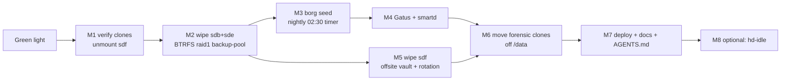

# Three-Drive Repurposing — Safety-Net Storage for evo-x2

> **ARCHIVED (executed or superseded — 2026-08-31 docs-health audit):** frozen snapshot; the live state lives in `TODO_LIST.md` / `FEATURES.md` / `AGENTS.md`.

**Created:** 2026-08-16 20:22 CEST
**Trigger:** User abandoned the private-cloud media hunt (2026-08-16 ~20:14, "I give up") and asked: _"how can we actually use these 3 drives effectively?"_
**Supersedes:** `docs/planning/2026-08-16_20-06_PRIVATE-CLOUD-MEDIA-HUNT-ENDGAME.md` (abandoned, annotated)
**Prior art read before this doc:** `docs/hardware/wooacme-w3a894-assessment.md` (full Aug-10 assessment of sdf), `docs/status/2026-08-14_13-15_ssd-repurposing-options.md` (the two SanDisk 240 GB SSDs), `docs/status/2026-08-14_12-30_ssd-recovery-benchmarking-session.md`.

---

## 1. What the three drives ARE (measured tonight, read-only)

| Drive   | Model                                                           | Capacity    | Health (SMART, 2026-08-16)                                                                                                         | Attachment                              | Worth                                       |
| ------- | --------------------------------------------------------------- | ----------- | ---------------------------------------------------------------------------------------------------------------------------------- | --------------------------------------- | ------------------------------------------- |
| **sdb** | Toshiba **MG08ACA16TE** (enterprise, 7200 rpm, CMR, 512e/4Kn)   | **16.0 TB** | **PASSED — 912 power-on hours (~5 weeks!), 0 reallocated, 0 pending, 0 uncorrectable, 38 °C**                                      | USB DAS, port 8-1 (shared link, see §3) | ~$350 new; effectively a new drive          |
| **sde** | Toshiba **MG08ACA16TE**                                         | **16.0 TB** | **PASSED — identical: 912 POH, zero defects, 38 °C**                                                                               | same DAS, same USB link                 | same                                        |
| **sdf** | WOOACME W3A894-512GB (budget SATA SSD behind RTL9210B USB-SATA) | 476.9 GiB   | PASSED, 5,623 POH, **4 % endurance used → ~14 TB TBW implied**, 577 GB lifetime writes, 0 bad blocks (full assessment: Aug-10 doc) | own USB controller (c7:00.3)            | Weak: low endurance, USB latency tail 99 ms |

Also in the same DAS (not part of this decision, must not be disrupted): **sdc** = buildcache (ext4, 88 G used), **sdd** = btrfs SanDisk earmarked for Docker storage.

**Key insight: the two 16 TB MG08s are near-new enterprise disks** (2.5 M-h MTBF, 550 TB/yr workload rated — nightly backup duty is trivial for them). They are the most valuable hardware on this desk and they are doing nothing.

## 2. What evo-x2 actually needs (ranked by standing risk)

1. **A second copy of irreplaceable data on a DIFFERENT physical disk.** Flagged since 2025-06-25 as the **#1 data loss risk**: every btrbk snapshot lives on the same QLC NVMe that also shows 92 % (root) / 85 % (/data) usage and a history of WDT-reset crashes. Irreplaceables today: `/var/lib/immich` (17 GB photos), `/home/lars` projects + GPG/SSH keys, sops secrets, docker service volumes, monitor365 data.
2. **An offsite leg (3-2-1).** Repeatedly flagged "still missing — prioritize" in the Aug-10/Aug-14 hardware docs.
3. Bulk media capacity — **NOT a current need** (live immich is 17 GB; SteamLibrary/models are re-downloadable).
4. More scratch / DB offload — already served (buildcache SSD, Docker earmark, BFQ tiers).

## 3. Constraints

- **The DAS is ONE USB link**: sdb+sdc+sdd+sde all sit behind `8-1:1.0` on `0000:c7:00.4`. Shared bandwidth + latency → fine for nightly sequential backups; must time-slice against buildcache GC (Sun 05:00) and monitor365 backups (01:00-03:00 stagger window).
- **No ZFS userspace on the host** (all pool work so far needed the VFIO VM). Reuse should be **BTRFS** (house standard, btrbk/scrub tooling already deployed) — ZFS would need `allowUnfree` + host zfs enablement + losing the VFIO/VM-free workflow simplicity.
- **Wiping destroys the last local forensic frontier**: sdf2 free space + sdf3 swap were never carved; the /data backups of all three drives are **file-level** (`-ssh` 13 G + manifest, `-hdds` ~100 K — pool held no user data), so unallocated-space recovery becomes impossible after the wipe. User accepted this by closing the hunt.
- sdf (WOOACME): ~14 TB TBW and NAND charge loss when shelved → **periodic small-set backups only, must stay in rotation** (refresh at least every ~6 months; monthly is safely inside).
- VM guard until wipe completes: never run the ZFS VM concurrently with sdf work (shared controller).

## 4. Options

### Option A — Safety Net (RECOMMENDED)

| Drive     | Role                                                                    | Detail                                                                                                                                                                                                                                                                                                                                                  |
| --------- | ----------------------------------------------------------------------- | ------------------------------------------------------------------------------------------------------------------------------------------------------------------------------------------------------------------------------------------------------------------------------------------------------------------------------------------------------- |
| sdb + sde | **BTRFS RAID1 mirror**, label `backup-pool`, mounted `/mnt/backup-pool` | `mkfs.btrfs -m raid1 -d raid1` on whole disks (by-id), `noatime,compress=zstd`. Nightly **borg** repo: immich library + DB dumps, `/home/lars` projects/keys, sops secrets, docker volumes, monitor365. Est. 0.3-1 TB seed → years of headroom in 14.6 TiB usable. Weekly btrfs scrub. Becomes the new home for the 13 G forensic clones (frees /data). |
| sdf       | **Offsite rotation vault**                                              | Monthly manual borg of the small irreplaceable core (projects, secrets, keys, immich 17 GB, docs ≈ 30-50 G deduped) → drive physically leaves the house. Returns next month, refreshes (charge-loss safe).                                                                                                                                              |

**Result: full 3-2-1 with hardware already owned** — NVMe + local snapshots (copy 1), HDD mirror on separate disks (copy 2), offsite SSD (copy 3). Closes the #1 standing risk of the whole infrastructure.

### Option B — Bulk Capacity First

sdb+sde as BTRFS raid0 (32 T) or two single-disk filesystems for a media/immmich-originals library. **Rejected as speculative**: no such library exists (17 GB today); raid0 halves reliability of the crown-jewel disks; the backup gap stays open. Revisit only if a 10+ TB media hoard materializes — and by then it can live ON the mirror (14.6 TiB usable).

### Option C — Split Roles (no redundancy)

sdb = backup target, sde = bulk scratch/media, sdf = offsite. **Rejected**: single-disk backup target is half a safety net; both roles fight over the one USB link; the mirror gives strictly more protection for the same power draw.

## 5. Migration plan (executes only after explicit green light)

| #  | Task                      | Detail / estimate                                                                                                                                                                                                                |
| -- | ------------------------- | -------------------------------------------------------------------------------------------------------------------------------------------------------------------------------------------------------------------------------- |
| M1 | Pre-wipe safety           | Verify `-ssh` clone manifest (`sha256sum -c` spot-check), confirm `-hdds` copy complete (done tonight), snapshot the final state of sdf mounts, unmount `/tmp/sdf-mount` + `/tmp/sdf1-mount`, retire the ZFS-VM scripts/workflow |
| M2 | Wipe + create mirror      | `sgdisk --zap-all` sdb+sde → `mkfs.btrfs -L backup-pool -m raid1 -d raid1` → `fileSystems."/mnt/backup-pool"` via `mkFilesystem` helper (by-id, `nofail`, `auto`); ~15 min                                                       |
| M3 | Borg seed + nightly timer | borg repo on the mirror, passphrase in sops; seed run 0.3-1 T (~1-2 h over USB); systemd timer 02:30, `ioTier.maintenance`, `harden`                                                                                             |
| M4 | Monitoring                | Gatus: pool-mounted + borg-last-success-age checks; smartd already watches DAS disks via `-d sat` (confirm both MG08 serials); buildcache-style `.prom` collector for pool usage                                                 |
| M5 | sdf offsite vault         | Wipe → ext4 `offsite-vault` → monthly borg script + calendar reminder; SMART short self-test first (never run, per Aug-10 doc)                                                                                                   |
| M6 | Relocate forensic clones  | Move `/data/backup-2026-08-11-private-cloud-*` (13 G) to `/mnt/backup-pool/archive/private-cloud-forensics/`; keep 6-12 months, then delete                                                                                      |
| M7 | Docs + memory             | AGENTS.md storage section (DAS topology, pool, borg layout), TODO_LIST/FEATURES updates, deploy via `nix run .#deploy`, `post-deploy-check`                                                                                      |
| M8 | Optional polish           | hd-idle spin-down (MG08s ~7 W idle each), btrbk-to-mirror as borg alternative if send/receive preferred                                                                                                                          |

## 6. Guards

- **Nothing is wiped before the user's explicit green light** (this doc is the request).
- /data stays ≥ 50 GB free throughout; monitor365/backup-coordination schedules untouched.
- borg repokey + passphrase in sops BEFORE seed (lost key = lost backups).
- Post-wipe: the media hunt is unrecoverable — repeat this sentence to the user once, at green-light time.
- No VM/sdf concurrency during M1; after M2 the ZFS VM workflow is dead code (remove scripts).

## 7. Decision requested

1. Approve **Option A** (or pick B/C).
2. Approve the **destructive wipe** of sdb, sde, sdf (M2/M5) after M1 verification.

---

## Decision Record (2026-08-16 ~21:00, live user decisions — recorded 2026-08-17)

The executed architecture DEVIATES from Option A above, per live user decisions during execution:

1. **btrfs send/receive, NOT borg** — the backup mechanism is btrbk `send/receive` (btrbk-root/btrbk-data targets on the pool) plus per-application dump jobs (forgejo zip, pocket-id sqlite, twenty/manifest pg_dumps). The M3 borg seed/timer was **dropped**.
2. **Mirror is the SERVICE tier too, not just backups** — immich (`/mnt/pool/services/immich`) and paperless (`/mnt/pool/services/paperless`) serve live data from the pool; own-tools (monitor365/discordsync/browser-history) subvols reserved.
3. **sdf (WOOACME) and both SanDisks are FROZEN** ("do not touch them; yet") — the M5 offsite-vault role was **dropped**; sdf stays intact (not wiped).
4. **Offsite leg** — user states important photos/docs already live in Google Photos/Drive; whether 3-2-1 is satisfied or an offsite leg returns is an open decision (TODO_LIST P0).
5. Pool label is `pool` (not `backup-pool`), mount `/mnt/pool`. Paperless behind SSO subdomain (`paperless.home.lan`, protectedVHost).

**Execution:** completed 2026-08-16 20:00 → 2026-08-17 01:00 (interrupted + resumed). Full record: `docs/status/2026-08-16_21-24_three-drive-repurposing-execution-status.md` (archived) and `docs/status/2026-08-17_00-59_pool-backups-completion-status.md`. M1 forensics relocated to `archive/private-cloud-forensics`; M4 monitoring live (btrfs-verify-pool-backups, backup-coordination); M8 hd-idle undecided.

**Plan CLOSED 2026-08-17** (amended + archived by the docs-health pass). Archiving now.
