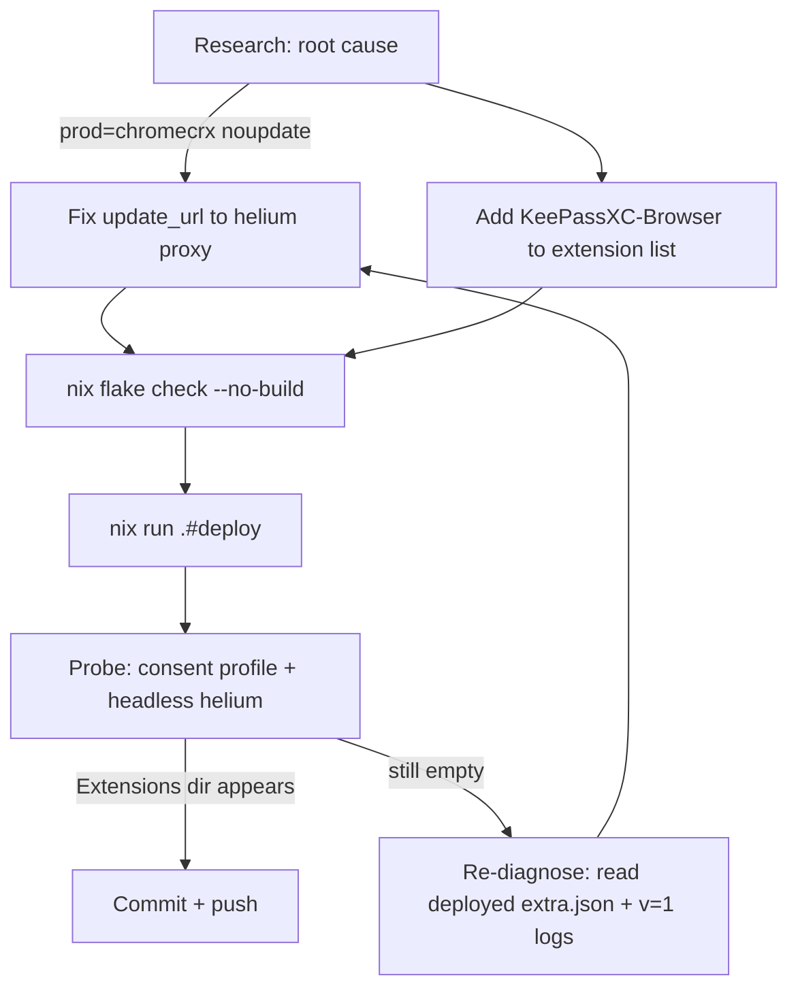

# Helium Browser Extension Pipeline Fix + KeePassXC-Browser

> **[docs-health 2026-09-21] RESOLVED + ARCHIVED** — all 6 coarse + 15 fine tasks executed and verified (evidence in the struck rows + `docs/status/archived/2026-09-14_20-02_helium-extension-pipeline-fix-status.md`); residual out-of-plan items (2 possibly-dead extension IDs, user GUI pairing, macOS parity) are recorded in that status report, not open plan tasks.

**Date:** 2026-09-14 18:59
~~**Status:** IN PROGRESS~~ **Status:** EXECUTED + DEPLOYED 2026-09-14 (system-778; 18 extensions incl. KeePassXC installed in 75 s; commit `6ddc763f`) — archived 2026-09-21 [docs-health]
**Scope:** `modules/nixos/desktop/browser-policies.nix`, `platforms/nixos/system/configuration.nix`

---

## Problem Statement (root-caused, not guessed)

**All 20 policy-managed browser extensions have never installed in Helium.** Zero.
The profile (`~/.config/net.imput.helium`, created 2025-12-31) has no `Extensions/`
directory at all. The KeePassXC native-messaging manifest
(`platforms/common/programs/keepassxc.nix`) is deployed and live, but the
extension side of the integration does not exist in the browser.

### Root cause chain (each step verified empirically today)

1. `browser-policies.nix` writes `ExtensionSettings` with
   `update_url = "https://clients2.google.com/service/update2/crx"` into
   `/etc/chromium/policies/managed/extra.json`.
2. Helium **does** read that policy file — verified via `--enable-logging --v=1`:
   `config_dir_policy_loader.cc: Found mandatory policy file: /etc/chromium/policies/managed/extra.json`.
3. Helium **does** attempt pending policy installs — probe profile shows the
   update-check request firing with all 20 IDs (`installedby=policy`).
4. **BUT** Helium's `spoof-extension-downloader-platform.patch` makes the
   downloader send `prod=chromecrx` (a deliberate `CRX_DUMMY` query-param set).
   Verified live: the same request with `prod=chromecrx` gets
   `<updatecheck status="noupdate"/>` from clients2.google.com; with
   `prod=chrome` it gets a codebase URL. **CWS deliberately does not serve
   CRXs to `prod=chromecrx`.**
5. Helium's design routes extension installs through its own privacy proxy
   (`proxy-extension-downloads.patch`): pending installs whose update URL host
   matches the patched placeholder get rewritten to
   `https://services.helium.imput.net/ext`. Our policy URL
   (`clients2.google.com`) does NOT match the placeholder host, so installs
   fall through to the raw fetch — which is the `noupdate` dead end from step 4.
6. **The Helium proxy implements the Omaha update protocol correctly** —
   verified today: `GET https://services.helium.imput.net/ext?...&x=id%3D...`
   returns `status="ok"` + sha256 + proxied codebase URL for
   KeePassXC-Browser (v1.10.3).

### Why the 2026-07-29 "fix" didn't stick

`docs/status/archived/2026-07-29_*` removed `--disable-background-networking`
and declared extensions fixed. That removed ONE blocker (the downloader never
ran) but not THIS one (the downloader runs and gets `noupdate`). The
2026-07-09 audit even listed "test if ungoogled-chromium fetches from
clients2.google.com" as an open question — it was never answered. Answer:
it fetches, and gets told "noupdate" forever.

---

## The Fix (two one-line-class changes)

1. **`browser-policies.nix`**: change the `update_url` for every entry to
   `https://services.helium.imput.net/ext` — routes ALL force-installed
   extensions through Helium's privacy proxy (which works — verified above).
   Side benefit: kills the direct-to-Google connection the old URL caused.
2. **`configuration.nix`**: add KeePassXC-Browser
   (`oboonakemofpalcgghocfoadofidjkkk`) to `chromiumExtensions` — completes
   the KeePassXC integration whose native-messaging half already exists
   (manifest deployed since 2026-09-13).

---

## Pareto Breakdown

### The 1% that delivers 51% of the result

- **Change `update_url` to the Helium proxy in `browser-policies.nix`** —
  one line, unblocks the entire extension pipeline (all 20+ existing
  extensions AND everything we add later).

### The 4% that delivers 64%

- The update_url change (above), plus
- **Add KeePassXC-Browser ID to the extension list** — completes the secrets
  manager integration that motivated this session.

### The 20% that delivers 80%

- The two changes above, plus
- **Probe-profile verification** (headless Helium with consented-services
  prefs, assert `Extensions/` dir appears) — proves the mechanism before the
  user ever restarts their browser.

### The remaining 20% to 100%

- Deploy via `nix run .#deploy`.
- Post-deploy verification (probe + policy file content check).
- Fix the stale module comment (`browser-policies.nix` claims the current
  setup works; it doesn't) + document the `prod=chromecrx` root cause so no
  session ever "re-fixes" the wrong layer again.
- Commit + push with the full diagnosis in the message.

---

## Execution Plan (tasks sorted by impact/effort)

### Coarse tasks (30–100 min each)

| # | Task                                                                        | Impact   | Effort        | Value                     |
| - | --------------------------------------------------------------------------- | -------- | ------------- | ------------------------- |
| ~~1~~ | ~~Research + root-cause (Helium patches, proxy, policy dir, empirical probes)~~ done — (60 min) — root cause verified live, see Problem Statement | ~~Critical~~ | ~~DONE (60 min)~~ | ~~Entire fix depends on it~~ |
| ~~2~~ | ~~Fix `update_url` in `browser-policies.nix` (+ stale comment)~~ done — update_url rewritten in browser-policies.nix:117 + header comment | ~~Critical~~ | ~~30 min~~ | ~~Unblocks all extensions~~ |
| ~~3~~ | ~~Add KeePassXC-Browser to `configuration.nix` extension list~~ done — KeePassXC-Browser in configuration.nix:462 | ~~High~~ | ~~30 min~~ | ~~The actual user ask~~ |
| ~~4~~ | ~~Eval + flake check verification~~ done — eval + flake check green | ~~High~~ | ~~30 min~~ | ~~Prevents broken deploy~~ |
| ~~5~~ | ~~Deploy + probe-profile verification~~ done — deployed system-778; probe installed 18 extensions incl. KeePassXC in 75 s | ~~High~~ | ~~60 min~~ | ~~Proves extensions install~~ |
| ~~6~~ | ~~Commit + push with full diagnosis~~ done — commit 6ddc763f on master | ~~Medium~~ | ~~30 min~~ | ~~Durable record~~ |

### Fine tasks (max 12 min each)

| #   | Task                                                      | Parent |
| --- | --------------------------------------------------------- | ------ |
| ~~1.1~~ | ~~Grep helium binary for policy/store paths~~ done | ~~1~~ |
| ~~1.2~~ | ~~Read `proxy-extension-downloads.patch` fully~~ done | ~~1~~ |
| ~~1.3~~ | ~~Verify policy file is read (v=1 logging probe)~~ done | ~~1~~ |
| ~~1.4~~ | ~~Verify `prod=chromecrx` → noupdate vs `prod=chrome` → CRX~~ done | ~~1~~ |
| ~~1.5~~ | ~~Verify Helium proxy serves Omaha protocol~~ done | ~~1~~ |
| ~~2.1~~ | ~~Edit `update_url` in `browser-policies.nix`~~ done | ~~2~~ |
| ~~2.2~~ | ~~Rewrite stale header comment with root cause~~ done | ~~2~~ |
| ~~3.1~~ | ~~Add KeePassXC-Browser entry to configuration.nix~~ done | ~~3~~ |
| ~~4.1~~ | ~~`nix flake check --no-build`~~ done | ~~4~~ |
| ~~4.2~~ | ~~Eval rendered extra.json content~~ done | ~~4~~ |
| ~~5.1~~ | ~~`nix run .#deploy`~~ done — (system-778) | ~~5~~ |
| ~~5.2~~ | ~~Headless consent-probe: assert `Extensions/<id>` appears~~ done — 18/18 Extensions dirs created | ~~5~~ |
| ~~5.3~~ | ~~Verify KeePassXC ID present in deployed policy~~ done | ~~5~~ |
| ~~6.1~~ | ~~Pathspec commit with detailed message~~ done — (6ddc763f) | ~~6~~ |
| ~~6.2~~ | ~~Push~~ done | ~~6~~ |

---

## Execution Graph

---

## Risks / Verschlimmbesser-Guard

- **Risk: the proxy URL breaks stock Chromium** (same policy file).
  Mitigation: proxy is a public Omaha endpoint serving standard responses;
  also, no stock Chromium is installed on this system (Helium only).
- **Risk: proxy outage breaks extension updates.** Acceptable — Helium's own
  extension store UX depends on the same proxy; failure mode is "no updates",
  not data loss.
- **Risk: force_installed KeePassXC-Browser can't be disabled.** Matches the
  existing 20-extension pattern; a secrets manager SHOULD be force-installed.
- **Do NOT touch**: the darwin chrome.nix list (real Chrome, prod=chrome,
  works), the keepassxc.nix manifest (already correct), any running helium
  process (the policy applies on next browser start).
- **Rollback**: revert the two-line diff; policy regenerates on next deploy.
