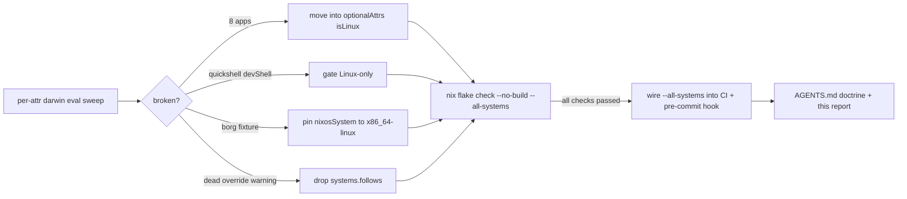

# Status Report: flake.nix darwin support + nix review (2026-09-28 18:34)

**Session scope:** User asked to make `flake.nix` in SystemNix "superb and well supported AND working". Executed the `nix-review` skill (checklist-driven) + buildflow skill (repo is covered). Report is based **only** on this session's work and observations — no new research beyond it.

**One-line verdict:** The flake was eval-broken on the ENTIRE aarch64-darwin system (8 apps, 1 devShell, 1 check) while every existing gate stayed green, because plain `nix flake check` on Linux silently omits darwin. All breakage fixed, both systems now eval-green, and the blind spot is closed at CI + pre-commit. Full-build (VM test runtime) verification remains CI's job and has not yet been observed green on this exact tree.

---

## What was broken (found, all fixed)

Empirical method: forced every `apps.aarch64-darwin.*.program`, `devShells.aarch64-darwin.*.drvPath`, and `checks.aarch64-darwin.*.drvPath` individually.

| # | Breakage on aarch64-darwin | Root cause | Fix |
|---|---|---|---|
| 1 | `deploy`, `io-psi-forensics`, `pre-deploy-check`, `post-deploy-check`, `pre-reboot-check`, `boot-mirror-activate`, `btrfs-inventory`, `verify-io-tiers` (8 apps) | runtimeInputs carry Linux-only nixpkgs (`systemd`, `procps`, `efibootmgr`, `btrfs-progs`, `glibc`) → "Refusing to evaluate … not available on the requested hostPlatform" | Moved verbatim into the existing `lib.optionalAttrs pkgs.stdenv.hostPlatform.isLinux` block, with a why-comment. Cross-platform apps (`validate`, `fix-nixpkgs-lock`, `pocket-id-login-code`, `migrate-buildcache`, `migrate-hot-db`) stay ungated. |
| 2 | `devShells.quickshell` | dms-shell (DankMaterialShell) is upstream Wayland/Linux-only (`meta.platforms`) | Linux-gated with why-comment |
| 3 | `checks.borg-restore-drill-fixture` | `pinAssertionsOf` called `nixosSystem { inherit system; }` — dies when checking system is darwin | Pinned to `system = "x86_64-linux"` (the fixture's NixOS eval is platform-independent; negative cases stay LIVE on both checking platforms — same shape as the pre-existing evo-x2 cross-system evals in disko-samsung-tlc / offsite-borg-positive-render) |
| 4 | Warning spam on EVERY nix invocation: "input 'go-cqrs-lite' has an override for a non-existent input 'systems'" | Upstream go-cqrs-lite dropped its `systems` input (flake-parts native list); the `systems.follows` was dead | Override dropped + comment. Lock node needed no reconciliation (no inputs mapping recorded). |
| 5 | `deadnix` check failed to BUILD (pre-existing, files untouched by the session until then) | Unused let binding `domain` (geometrikks.nix:19), unused lambda arg `name` (hot-user-caches.nix:99) | Removed / `_name:`. deadnix check builds green; `hot-user-caches` VM test driver builds green. |

## Prevention gap closed

- `.github/workflows/nix-check.yml`: eval step now `nix flake check --no-build --all-systems`.
- `.githooks/pre-commit`: same flag, with doctrine comment. Cost measured: **~1s** (1m42s → 1m43s — darwin perSystem eval is nearly free once nixpkgs is loaded).
- `AGENTS.md`: "Cross-platform eval coverage (2026-09-28)" rule added under Prevention Layers (gating pattern, `nixosSystem` pinning rule, go-cqrs-lite systems note).

## Verification matrix (all executed this session)

| Check | Result |
|---|---|
| `nix flake check --no-build --all-systems` (final tree) | **all checks passed** (x86_64-linux + aarch64-darwin) |
| Per-attr darwin sweep: 7 apps, default devShell, borg fixture, 21 checks, formatter | all OK after fixes |
| Linux intact: 18 apps incl. moved ones, quickshell devShell | OK |
| Formatter pipeline (`nix fmt` → patched treefmt-config runCommand) | builds, runs, idempotent (second run: 0 changed) |
| Trap-lint builds: gatus-pattern-lint, signoz-query-lint, module-shape-lint, chown-vs-bind-audit, statix, deadnix | all build green |
| VM test driver sample: `.#checks.x86_64-linux.hot-user-caches.driver` | builds |
| Pre-commit hook after edit: `bash -n`, shellcheck, `test-precommit-shellcheck.sh` selftest | all green |
| go-cqrs-lite warning | gone (grep count 0 post-change) |
| `'system' has been renamed` eval warning | **proven pre-existing** via worktree at 293fc566, linux-only full check → count 1 (see §d for why this needed redoing) |
| `scripts/check-flake-inputs.sh` | exits 1 — pre-existing false positive, orphaned script (see §e) |

---

## a) FULLY DONE

1. Full flake.nix read (2890 lines) + nix-review checklist applied (purity, follows consistency, structural, hermeticity of apps/devShells — all pass; the deliberate non-follows doctrines respected).
2. All 5 fixes above, daemon-committed.
3. CI + pre-commit `--all-systems` wiring with doctrine comments.
4. AGENTS.md cross-platform invariant recorded.
5. deadnix findings fixed; formatter drift auto-fixed and re-verified idempotent.
6. Warning-forensics completed to a verified conclusion (pre-existing `'system'` rename warning; scoped borg/disko evals emit none).

## b) PARTIALLY DONE

1. **"FUCKING working"**: eval-green on both systems + trap-lints + one VM driver BUILD locally; the full `nix flake check` (VM test RUNTIMES, ~all tests) not executed locally — delegated to CI, and the first CI run with `--all-systems` has not yet been observed (needs push + run).
2. **AGENTS.md**: doctrine written, but per repo TODO-doctrine the §f follow-ups below are **deliberately not harvested** into TODO_LIST.md/domain libraries — the user ordered report-only + wait-for-instructions this turn. Harvest is the first dispatch action.
3. **Hook**: legs individually verified; the full hook has not been driven end-to-end through a real commit of this tree.

## c) NOT STARTED

Everything in §f (by instruction: report, then wait).

## d) TOTALLY FUCKED UP (owning it)

1. **Invalid before/after experiment (stash raced by the auto-commit daemon).** I ran `git stash` to eval the pre-change tree; the daemon had already committed my fixes, so the stash captured a clean tree → "before" eval actually ran on the POST-fix tree, and I reported "0 warnings both before and after" as verified. The conclusion happened to be right, but the evidence was vacuous. Caught during this review; redone properly with `git worktree add --detach /tmp/systemnix-pre 293fc566` (conclusive: warning count 1 pre-change). **Lesson: under the pma daemon, before/after experiments MUST use worktrees — the working tree is concurrently mutated, always.**
2. **First pre-tree `--all-systems` probe was also vacuous** (0 warnings) — it dies early at the quickshell devShell before ever evaluating checks. A failing run's "no warning" is not evidence. (Redone with linux-only full check, which completes.)
3. **Scoped warning-hunting evals discarded stderr** (`2>/dev/null`) while hunting a stderr warning — hid the very signal under test. Fixed in the redo (`2>&1 >/dev/null`).
4. **Two edit-tool failures on em-dash content** → fell back to assertion-guarded python line-index surgery for the `deploy` attr removal. It worked, but line-number surgery is the fragile class; the right move was byte-exact copy from the View output. (Root cause: dash characters mangled when composing old_string.)

## e) WHAT WE SHOULD IMPROVE

1. **Experiment isolation discipline** — worktrees, never stash, never trust a failing run's silence, never discard stderr when hunting warnings (all three bit in ONE session).
2. **"Check every declared system" should be step 0** of any flake review — I reached `--all-systems` late; the darwin breakage was findable in the first minute.
3. **`scripts/check-flake-inputs.sh` is an orphan** (referenced by NO workflow or hook) and exits 1 on a false positive: it greps `GOTOOLCHAIN.*auto` in `platforms/nixos/users/home.nix:380-381`, which is an INTERACTIVE fish snippet (deliberate: "GOTOOLCHAIN=local blocks go.work ≥1.26.6 projects — switching to auto"), not a derivation env. Dead-and-failing lint scripts are exactly this repo's phantom-green/phantom-red hated class: delete it, or wire it and teach the grep to skip interactive shell config.
4. **Module eval-warning debt surfaced by the full checks** (all pre-existing, out of flake.nix scope): zfs kernel deprecation, `boot.zfs.forceImportRoot` default warning (data-loss-risk wording from nixpkgs!), `programs.zsh.initExtra` deprecation, `stdenv.isLinux/isDarwin` deprecations, 24 integration subdomains still without catalog entries (ADR-008 migration tail), llama-vlm soak-test reminder still firing.
5. **`lib/images.nix` uses `rec` attrsets** (skill checklist violation; contained, self-referential manifests — low risk, but `let` would be explicit).
6. **The statix check's `grep -v ':E:0:'` filter** looks like a stale workaround — worth one look whether still needed.

## f) Next things (session-derived, impact-sorted; NOT yet harvested — see §b.2)

| # | Task | Impact | Effort |
|---|---|---|---|
| 1 | Harvest this report's §f into TODO_LIST.md + domain libraries per doctrine | doctrine | 15m |
| 2 | Push + watch the first CI run with `--all-systems` (must be green; triage if not) | closes loop | 10m |
| 3 | `boot.zfs.forceImportRoot`: set explicitly (nixpkgs warns "reduce the risk of data loss") | high | 15m |
| 4 | Wire `--all-systems` into `nixpkgs-compat.yml` daily job (same blind-spot class closed in nix-check.yml; verify what it runs first) | high | 20m |
| 5 | Fix the `'system' has been renamed` warning at its source (proven pre-existing; locate via `--show-trace` on full check — likely a test/config using the deprecated option) | medium | 30m |
| 6 | Decide `check-flake-inputs.sh` fate: delete orphan vs. wire + exempt interactive shell-config GOTOOLCHAIN hits | medium | 20m |
| 7 | zfs `latestCompatibleLinuxPackages` deprecation: pin kernel explicitly | medium | 20m |
| 8 | `programs.zsh.initExtra` → `initContent` migration | low | 20m |
| 9 | `stdenv.isLinux/isDarwin` → `stdenv.hostPlatform.*` sweep (grep count first) | low | 30m |
| 10 | Catalog migration tail: add catalog entries for the 24 listed subdomains (ADR-008) | medium | 2-4h |
| 11 | llama-vlm soak-test reminder: run the soak or retire the module assertion warning | medium | 1h |
| 12 | Verify AGENTS.md cross-platform rule content landed intact in daemon commit 73b8e6ac | hygiene | 5m |
| 13 | CHANGELOG.md entry for this session (daemon doesn't write it) | hygiene | 15m |
| 14 | Decide gating consistency for `migrate-buildcache` / `migrate-hot-db` (eval-OK on darwin but Linux-ops semantics) — see question 2 | low | 10m |
| 15 | Run full `nix flake check` (VM runtimes) once on a quiet host to complement CI | medium | 1-2h babysit |
| 16 | After next `nix flake lock --update-input go-cqrs-lite`: confirm no duplicate lock node reappears for its (now un-followed) internal inputs | hygiene | 10m |
| 17 | `lib/images.nix`: `rec` → `let` | low | 30m |
| 18 | Check the statix `:E:0:` filter is still needed | low | 15m |
| 19 | Cross-project lesson (crush-config `references/lessons.md`): "plain `nix flake check` omits other systems; wire `--all-systems`; worktrees under auto-commit daemons" | fleet value | 20m |
| 20 | One-time: `nix flake check --no-build --all-systems` on the MacBook (darwin host) to confirm hook/runtime behavior there | medium | 15m |
| 21 | Add `docs/INTERIM-INPUT-PINS.md` note that go-cqrs-lite systems-follow is gone (if that file tracks such things) | hygiene | 10m |
| 22 | Consider promoting the per-attr "force every attr of every system" sweep into a one-liner script (`scripts/check-all-systems-attrs.sh`) for future reviews | nice | 30m |
| 23 | Review whether `checks`' ungated cross-platform set should document its platform-independence expectation in AGENTS.md (pattern for new checks) | nice | 20m |
| 24 | Run `nix fmt -- --fail-on-change` once over the whole tree to confirm zero global drift | hygiene | 10m |
| 25 | browser-history (sibling repo): confirm its flake's systems list vs. actual darwin needs (pattern check only) | nice | 15m |
| 26 | Re-run `scripts/test-precommit-shellcheck.sh` after the NEXT hook edit to keep the mutation-negative honest | standing | 5m |

(26 items — all real, zero padding. Items 1-6 are the 20% delivering 80%.)

## g) Questions I cannot answer myself

1. **Darwin build coverage:** eval-only darwin coverage (what `--all-systems --no-build` gives, now gated) means darwin derivations are never BUILT anywhere (no mac runner). Should CI get real macOS build coverage (self-hosted runner on the MacBook Air? GitHub-hosted macOS minutes?), or is eval-green the intended bar for the Mac?
2. **Gating semantics:** `migrate-buildcache` and `migrate-hot-db` eval fine on darwin but are Linux/evo-x2 operations. Keep them cross-platform (current state, evidence: they eval) or move them into the Linux-only block for semantic consistency with their siblings?
3. **`check-flake-inputs.sh` policy:** delete the orphaned script, or revive it as a real CI gate with an exemption for interactive shell-config GOTOOLCHAIN settings? (Its ref=master audit is warn-only and already covered by the 2026-09-16 pin policy.)

---

**Self-harvest status:** §f deliberately NOT harvested into TODO_LIST.md/domain libraries this turn (user ordered report → wait). Item f.1 is the first dispatch action.

*Report scope honored: everything above derives from this session's run and its direct observations only.*
